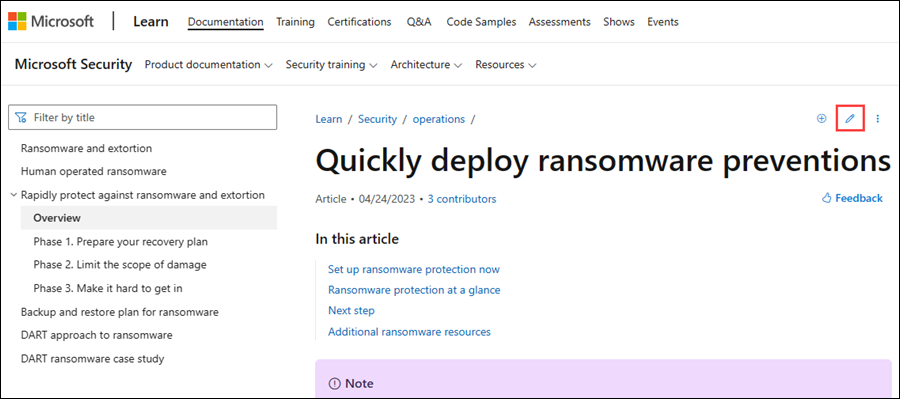
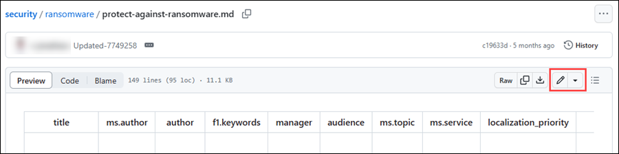
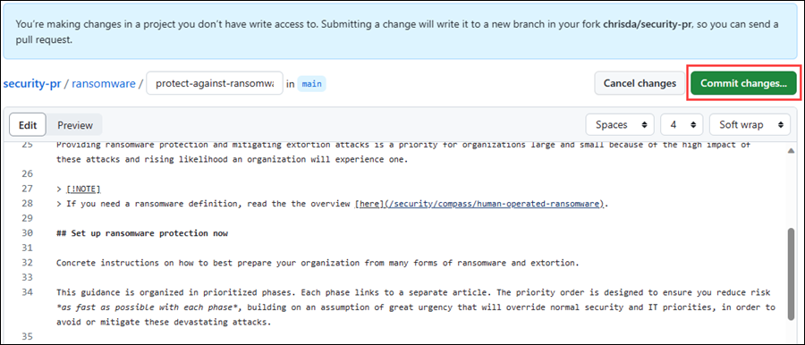
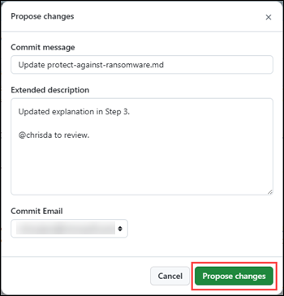
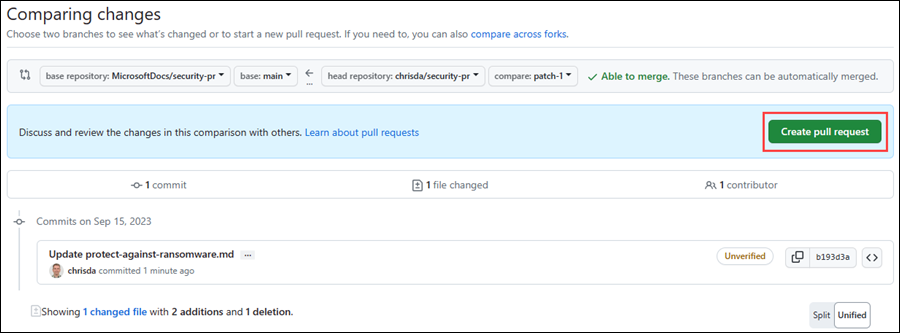
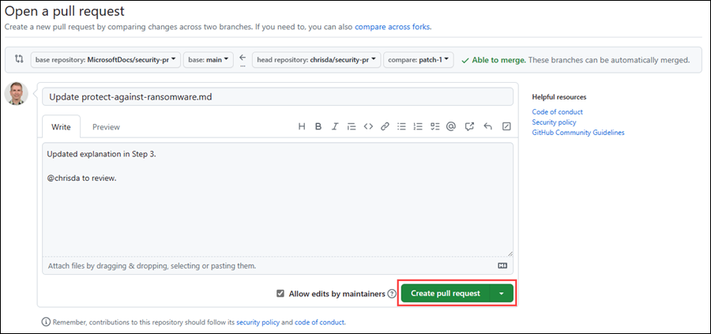

# Overview

## Learn how to contribute

Anyone who is interested can contribute to the articles. When you contribute, your work goes into the content set after it's been reviewed and merged. It's then published to [Microsoft Learn](https://learn.microsoft.com/), and you're listed as a contributor at: <https://github.com/MicrosoftDocs/microsoft-365-docs/graphs/contributors>.

### Quickly update an article using GitHub.com

Contributors who make infrequent or small updates can edit the file directly on GitHub.com without installing any software. This article shows you how. [This two-minute video](https://www.microsoft.com/videoplayer/embed/RE1XQTG) also covers how to contribute.

> [!TIP]
> To edit an article, you need to get to it on the GitHub.com backend. If you're already on the GitHub.com page of the article, you're starting at step 4.
>
> Your permissions in the repo determine what you see in step 5 and later. People with no special privileges see the steps as described. People with permissions to approve their own pull requests see a similar experience with different button and page titles (for example, **Commit changes** instead of **Propose changes**), extra options for creating a new branch, and fewer confirmation pages. The point is: click any green buttons that are presented to you until there are no more.

1. Verify that you're signed in to GitHub.com with your GitHub account.
2. On learn.microsoft.com, find the article that you want to update.
3. Above the title of the article, select  **Edit this document**.

   

4. The corresponding article file opens on GitHub. Select  **Edit this file**.

   

5. The article file opens in a line-numbered editor page where you can make updates.

   Articles on learn.microsoft.com are formatted using the Markdown language. For help on using Markdown, see [Mastering Markdown](https://guides.github.com/features/mastering-markdown/).

   Select **Preview** to view your changes as you go. Select **Edit** to go back to making updates.

   When you're finished making changes, select the green **Commit changes** button.

   

6. In the **Propose changes** dialog that opens, review and/or enter the following values:
   - **Commit message**: This value is required. You can accept the default value ("Update \<filename\>") or you can change it.
   - **Extended description**: This value is optional. For example:
     - An explanation of the changes.
     - @ include the GitHub alias of someone to review and merge your changes.

   When you're finished on the **Propose changes** dialog, select the green **Propose changes** button.

   

7. On the **Comparing changes** page that opens, select the green **Create pull request** button.

   

8. On the **Open a pull request** page that opens, review the title and comments, and then select the green **Create pull request** button.

   

9. That's it. There's nothing more for you to do.

   The article owner (identified in metadata) is notified about the changes to the article. Eventually, the article owner or another party will review, possibly edit, and approve your changes. After your pull request is merged, the article is updated on learn.microsoft.com.

## Microsoft Open Source Code of Conduct

This project has adopted the [Microsoft Open Source Code of Conduct](https://opensource.microsoft.com/codeofconduct/).

For more information, see the [Code of Conduct FAQ](https://opensource.microsoft.com/codeofconduct/faq/) or contact [opencode@microsoft.com](mailto:opencode@microsoft.com) with any questions or comments.

### Contributing

This project welcomes contributions and suggestions.  Most contributions require you to agree to a Contributor License Agreement (CLA) declaring that you have the right to, and actually do, grant us the rights to use your contribution. For details, visit <https://cla.microsoft.com>.

When you submit a pull request, a CLA-bot automatically determines whether you need to provide a CLA and decorate the PR appropriately (for example, label, comment). Follow the instructions provided by the bot. You only need to do this step once across all repos using our CLA.

### Legal Notices

Microsoft and any contributors grant you a license to the Microsoft documentation and other content in this repository under the [Creative Commons Attribution 4.0 International Public License](https://creativecommons.org/licenses/by/4.0/legalcode), see the [LICENSE](LICENSE) file, and grant you a license to any code in the repository under the [MIT License](https://opensource.org/licenses/MIT), see the [LICENSE-CODE](LICENSE-CODE) file.

Microsoft, Windows, Microsoft Azure and/or other Microsoft products and services referenced in the documentation may be either trademarks or registered trademarks of Microsoft in the United States and/or other countries/regions.

The licenses for this project don't grant you rights to use any Microsoft names, logos, or trademarks. Microsoft's general trademark guidelines can be found at <https://go.microsoft.com/fwlink/?LinkID=254653>.

Privacy information can be found at <https://privacy.microsoft.com/>

Microsoft and any contributors reserve all others rights, whether under their respective copyrights, patents, or trademarks, whether by implication, estoppel or otherwise.
