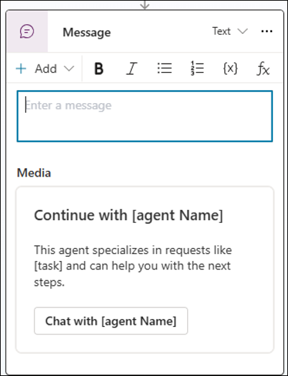

# Customize the Employee Self-Service agent

The Employee Self-Service agent is customizable in Microsoft Copilot Studio, where Makers can use various tools, topics, authoritative knowledge sources, and Microsoft-built connectors to external systems, like Workday, SAP, and ServiceNow:

- Start by learning more about roles and responsibilities.
- Then, review the basic building blocks that make up the Employee Self-Service agent.
- Next, see your options for customizing the look and certain content end-users see.
- Then, learn about adding knowledge sources.
- Finally, review topics that are included in the ESS package by default and decide how to customize details for the need of your organization.

|Role |Activities to perform |Configuration area |
|-----|----------------------|-------------------|
|Environment Maker  Owner of the Employee Self-Service agent |- Set up user context  - Customize the Employee Self-Service agent |Microsoft Copilot Studio |
|External system solution Administrators  Service owners of specific applications |Provide configuration inputs such as URLs, OAUTH tokens, and more |External system solution configuration |
|HR  IT  Legal  Privacy |-Identify knowledge sources  -Provide frequent queries </Identify sensitive queries> | N/A |

## Understanding components

To craft seamless employee experiences with an Employee Self-Service agent, begin by developing an understanding of its architecture. Together, these components enable agents to deliver natural conversations, extend functionality, and provide accurate, contextual information. The Employee Self-Service agent is built on five key elements:

### Topics

You can use Topics in various ways, from crafting a verbatim response for sensitive topics, to managing when to display an adaptive card, or how a fallback path is defined. The Employee Self-Service agent template comes with a set of predefined and fully configurable topics to help get you started. You can then create your own, using the full capability of Copilot Studio and our grown list of sample topics for ESS. [Learn more](/microsoft-copilot-studio/guidance/topics-overview) about Topics.

### Actions

Also called tools, actions expand the functionality of your agent, allowing it to perform various actions in response to user requests or autonomous triggers. Actions extend the agent's capabilities by enabling responses through generative orchestration or by calling specific actions within a topic. [Learn more](/microsoft-copilot-studio/advanced-plugin-actions) about actions.

### Knowledge sources

Knowledge sources allow your agents to provide relevant information and insights from authoritative sources like SharePoint or ServiceNow. You can incorporate knowledge for the agent and for the agent as whole or configure more focused knowledge sources for specific intents using a Topic with a Generative Answer Node. [Learn more](/microsoft-copilot-studio/knowledge-copilot-studio) about knowledge sources.

### External system solution accelerator packages

Solution accelerator packages come with a few components, like connectors, topics, and template configurations. They're ready to integrate with external systems like Workday, ServiceNow, and more.

### Instructions

LLM experiences can be shaped using natural language to use system prompt techniques that influence Employee Self-Service agent reasoning and behaviors. Instructions can be applied to the overall agent, to knowledge sources, to topics, and when publishing to Teams and Microsoft 365 Copilot. In addition, you can include dynamic variables (for example, specific user profile attributes) to further direct and ground the agent for more personalized responses.[Learn more](/microsoft-copilot-studio/knowledge-copilot-studio) about knowledge sources.

## Response quality

A great response is accurate, actionable, and engaging to ensure we earn trust, provide useful responses, and help the user take the next step using self-service tools. The Employee Self-Service agent requires a blend of design elements, agent instructions, and conversational design techniques to craft great responses.

- Responses need to be **engaging** by using personal data, balanced formatting, and natural language.
- Responses need to be **accurate** by using instructions for intent matching and using certain UI elements.
- Responses need to be **actionable** by reliably mobilizing users to the best next step or resource.

## Customize the look and content

Optionally, you can brand the Employee Self-Service agent based on your branding guidelines. By default, the product is called Employee Self-Service agent, and includes an icon that looks like an office badge.

End-users see the following customizable branding and content elements:

|Element                           |Customization                |Next steps |
|----------------------------------|-----------------------------|-----------|
|Agent name                        |Copilot Studio overview page |Keep the original name or choose a name that aligns with your organization's brand and audience. |
|Agent logo                        |Copilot Studio overview page |Use the default logo (a company badge) or add a logo that aligns with your brand. |
|Agent short and long descriptions |Copilot Studio channels page |Consider a tagline and one-sentence description to be used to help users understand how Employee Self-Service agent can help them when they add the agent for the first time. |
|Starter prompts                   |Copilot Studio overview page or the Microsoft 365 admin center if you also want to add categories |Help end-users understand how to engage with the Employee Self-Service agent by adding up to 12 starter prompts. |
|Disclaimer message                |Copilot Studio channels page and topic |Add a general disclaimer on the agent's landing page or add a disclaimer that displays after certain responses. |
|Agent (global) instructions       |Copilot Studio overview page |Draft instructions that help shape your agent's personality, behavior for edge cases, and guidance on how to use user context. |

You can customize most of these elements in Copilot Studio by selecting the **Edit** button in the **Overview** section of the agent.

> [!NOTE]
> Providing a custom name to the agent shows the provided name for end-users in the Copilot chat interface. Most other admin-related interfaces, such as analytics dashboards in Copilot Studio, Copilot Analytics under Viva Insights, Microsoft Admin Center, Power Platform Admin Center, and other billing reports for metered consumption, display the agent's name:
> 
> - Employee Self-Service HR
> - Employee Self-Service IT

### Customizing logo

ESS Agent logo customization involves multiple stages, as follows:

- **Maker experience**: Only within Copilot Studio. Makers should be able to upload a custom logo and test the appearance within Copilot Studio.
- **End-user experience**: In the Microsoft 365 Copilot chat channel. [Learn more](/microsoft-copilot-studio/publication-add-bot-to-microsoft-teams#customize-the-appearance-of-an-agent-for-teams-and-microsoft-365-copilot) about customizing the appearance of an agent for Microsoft 365 Copilot.

## Customize agent instructions

Instructions act as a blueprint for tone, structure, and decision-making across workflows, preventing fragmented user experiences. Instructions specify clear role definitions and handoff rules to prevent agents from giving redundant or conflicting answers. Use instructions to:

- Develop voice and tone as appropriate for your organization.
- Map specific steps for user context variables, topics, and other entities.
- Define boundaries, fallback plans, and more.

[Learn more](design-best-practices.md) about how instructions work for the agent, knowledge sources, and topics.

## Customize Topics

The Employee Self-Service agent comes with several out-of-the-box topics to get you started. The maker can customize each of these topics. These topics can be tested before publishing them to the broader set of users. [Learn more](/microsoft-copilot-studio/authoring-system-topics?tabs=webApp) about topics in Copilot Studio.

The following Topics are available in the current package version:

|Topic |Type |Trigger |Enabled (default) |When to use |
|------|-----|--------|------------------|------------|
|[Admin] - User Context - Setup |Topic |On redirect |On |Set user context for retrieval topics from different sources including external system solution extension packs, like Workday, SAP SF, and so on. **Required**. |
|[Example] - Crafted Response |Topic |By agent |Off |Display a verbatim message that includes an **Official Answer** badge for more control over certain situations. |
|[Example] - Sensitive Topics |Topic |By agent |Off |Edit responses for sensitive topics to help users navigate potentially harmful conversations. |
|[System] - Log Telemetry Event |Topic |On redirect |On |Log events and other details for internal debugging and agent management purposes. |
|[System] - On Error |System Topic |On error |On |Edit general error messages for common scenarios to improve engagement and task completion. |
|[System] - Reset Conversation |Topic |Activity received |Off |Times out User context cache to help fetch the latest user context data. |
|[System] - Response Preparation |Topic |On generated response |On |Add an official source badge with a custom disclaimer message for authoritative responses.  Known issue: This badge shows only in Copilot chat and can't be tested in Copilot Studio. |
|[System] - User Context - Init variables |Topic |On redirect |On |Improve performance by updating and caching user context attributes to default values.  *No customizations available*. |
|[System] - User Context - Validate |Topic |Activity received |On |User context attributes refreshed.  *No customizations available*. |
|Agent handoff - [Scenario name] |Topic |By agent |Off |Handing off to another live agent without passing context. |
|Conversation Start |System Topic |On conversation start |On |Initializes the user context attributes with default values. The maker can customize the welcome message. |

### Customize the Topics as an Environment Maker

Refer to these instructions to customize the Topics as an Environment Maker.

Terms to know:

**JTBD** - Jobs to be done.

#### [Admin] User Context - Setup

**Default:** On

**Topic JTBD:** Redirect User Context retrieval topics and attributes from other data sources to improve response relevancy.

**Maker JTBD:** Maker needs to add redirection of the User Context retrieval topics from different Employee Self-Service agent external system solution packages. Or, if Makers configure other Topics to retrieve User Context attributes from other systems, then they should also be added as Topic redirections in this Topic.

**Maker - What to customize:**  
**Requirement to use:** None.

1. After message disclaimer (blank). Add message or delete it if you don't want the disclaimer to appear.
1. Official source badge - no configuration required. Use in its default state.

|Step |Action |Expected result |
|-----|-------|----------------|
|1    |Open the Employee Self-Service agent in Copilot Studio. |Employee Self-Service agent available to customize. |
|2    |Navigate to **Topics** to see the list of Topics. |Shows Custom Topics. |
|3    |Select **[Admin] User Context - Setup**. |Opens custom topic in the design canvas. |
|4    |Add a redirect to another Topic where it sets the user context, such as one from an external system solution. |Maker able to set user context. |
|5    | Save the changes. |Your changes are saved. |

#### [System] Response Preparation

**Solution:** < m-official > and < m-disclaimer > solution in the Topic

**Default:** On

**Topic JTBD:** Maker wants to have messages from the LLM have an official source badge so that the end user knows this response came from an official source and not the web or another nonauthoritative source. The Maker can also add an after-message disclaimer to the responses such as "Check sources for accuracy".

**Maker JTBD:**

1. Configure a single disclaimer that applies for all UST responses across all verticals (**After-message disclaimer**).
1. Configure responses with the **official source** badge in the UX to give users confidence that the response is from legitimate sources.

**Maker - What to customize**  
**Requirement to use:** None.

1. After message disclaimer (blank). Add message or delete it if you don't want the disclaimer to appear.
1. Official source badge - no configuration required. Use in its default state.

|Step |Action |Expected result |
|-----|-------|----------------|
|1    |Open the Employee Self-Service agent in Copilot Studio. |Employee Self-Service agent available to customize. |
|2    |Navigate to **Topics** to see the list of Topics. |Shows Custom Topics. |
|3    |Select **[System] -2: Response Preparation**. |Opens custom Topic in the design canvas. |
|4    |Customize the **Disclaimer** message in the third node. |Maker able to add a custom disclaimer message. |
|5    |Save the changes. |Changes are saved. |
|6    |Test the changed **Disclaimer** message using the Copilot Studio test pane to confirm the desired results. |Disclaimer messages are being shown, but the **Official Source** badge isn't visible in the Test pane. This issue is a known issue, and this badge is visible in Copilot chat. |

In the Maker experience in Copilot Studio, the **Official Source** badge doesn't show above a generated answer. However, you can see the disclaimer message below the answer. Even though you can't see it in the Maker experience, users see the **Official Source** badge above a generated answer in Microsoft 365 Copilot Chat and Copilot Chat in Teams.

#### [Example] Crafted Response

**Default:** Off

**Topic JTBD:** Configure topics with an **Official answer** badge in the UX to give users confidence that the response is coming directly from an official source. Verbatim responses don't have citations and references, so this badge assures the user that the answer is legitimate. You can also add Actions to the response such as "Click here to create an HR ticket."

**Maker JTBD:** Update the **Set Official Answer Response** variable with the message that you want to display as an official answer. When you test this message in the Maker experience, you should see your crafted response.

**Maker - What to customize:** Enable the Topic if you want crafted responses. Update the trigger phrases and sample response.

|Step |Action |Expected result |
|-----|-------|----------------|
|1    |Open the Employee Self-Service agent in Copilot Studio. |Employee Self-Service agent available to customize. |
|2    |Navigate to **Topics** to see the list of Topics. |Shows Custom Topics. |
|3    |Select **[Example] - Crafted Response**. |Opens custom Topic in the design canvas. |
|4    |Select the first node **Triggered by agent**. |Topic node expands to show the description of what the Topic does. |
|5    |Customize the Topic description to include specific keywords that the agent shouldn't respond to and instead redirected elsewhere. |Topic description updates. |
|6    |Select the second node **Set Official Answer Response**. |Topic node expands to show the value that can be customized. |
|7    |Customize the **To value** field with a message. This message displays for your chosen queries instead of generated AI output. |Topic value updates. |
|8    |Save the changes. |Changes are saved. |
|9    |Test the configured trigger word using the test pane within Copilot Studio. |Results generate with the **Official Answer** badge. |

#### [Example] Sensitive Topics

**Default:** Off

**Topic JTBD:** Customizing responses for topics that are sensitive and triggered by the Employee Self-Service agent triggers HR sensitivity. The current generic Copilot Chat response is "I'm really sorry that you're feeling this way, but I'm not able to help. It's important to talk to a mental health professional or someone you trust about what you're going through."

**Maker JTBD:**

The Employee Self-Service agent starter is "Consulting with a professional is the best way to get assistance with this request. Please contact a representative for further support." Action: ends conversation.

The triggers are:

**This topic should only trigger ** when users mention **explicitly sensitive, confidential, or legal concerns ** such as **harassment **, **abuse **, **discrimination **, **unethical behavior **, or **retaliation ** in the work place. It activates in situations involving:

- Requests for **HR consultation ** relating to sensitive matters
- **Privacy concerns **
- **Hostile work environments **
- **Workplace violence **
- **Legal action **
- Reporting of **severe misconduct **

**Important: **

This topic **must not ** trigger for **general HR-related inquiries ** such as:

- Accessing **benefits information ** such as W2 forms and health benefits
- **Routine workplace questions **
- **Performance concerns
- Other **non-sensitive ** matters

**It should only activate ** when explicit terms like **harassment **, **discrimination **, **retaliation **, **workplace violence **, or **legal support ** are mentioned.

**Maker - What to customize**

Enable the Topic if your organization wants to use it. Update the trigger phrases and sample response text.

|Step |Action |Expected result |
|-----|-------|----------------|
|1 |Open the Employee Self-Service agent in Copilot Studio. |Employee Self-Service agent available to customize. |
|2 |Navigate to **Topics** to see the list of Topics. |Shows Custom Topics. |
|3 |Select **[Example] - Sensitive Topics**. |Topic opens in the design canvas. |
|4 |Select the first node **Triggered by agent**. |Topic node expands to show the description of what the Topic does. |
|5 |Customize the Topic description to include specific keywords that the agent shouldn't be respond to and instead redirect elsewhere. |Topic description updates. |
|6 |Select the second node **Message**. |Topic node expands to show the value that can be customized. |
|7 |Customize the **Text** field with a message that displays when the agent returns an official answer rather than AI-generated output. |Topic value updates. |
|8 |**Save** your changes. |Changes are saved. |
|9 |Test the configured trigger word using the test pane in Copilot Studio. |The customized message shows instead of an AI-generated message. |

#### [System] On Error

**Solution:** These three templates are provided in this Topic:

1. LLM capacity
1. Responsible AI (RAI) customization
1. Error out bug

**Default:** On

**Topic JTBD:** Customized error messages instead of the default Copilot Chat error messages to help users better understand why they receive an error.

**Maker JTBD:** Configure each error. You can also add a call to action.

- **OpenAIratelimit reached** triggered when the LLM is at capacity.
- **Employee Self-Service agent starter** We're working on increasing the capacity for usage. Please wait for a couple of minutes before retrying the Employee Self-Service agent. We regret the inconvenience.
- **ContentFiltered** triggered the same as RAI questions. You can set what you want instead of the generic RAI.
  - **Generic message:** I'm really sorry that you're feeling this way, but I'm not able to help. It's important to talk to a mental health professional or someone you trust about what you're going through.
  - **Employee Self-Service agent starter:** Sorry, I can't chat about this. Start a fresh one by selecting **New chat**.
  - **Employee Self-Service agent starter:** Consulting with a professional is the best way to get assistance with this request. Please contact a representative for further support.
- **Topicvarshowdebuginfo:** Gives the conversation ID and time to help an engineer debug.
  - **Employee Self-Service agent starter:** Users see the conversation ID and time.

**Maker- What to customize:**  
**Requirement to use:** None  
Edit the default template for each error message that you want to change to a custom response. Delete the Topic if you don't want any custom messages.

#### [System] Log Telemetry Event

**Default:** On

**Topic JTBD:** View telemetry in Application Insights to help the Maker with debugging tickets for any event. Example: A user gets an error from an external system solution when trying to create a ticket.

**Maker JTBD:** Install App Insights and configure the event and redirect message.

**Maker- What to customize:** 
Customization is optional.
**Requirements to use:**

1. Application Insights installed
1. Don't edit **On redirect**. Keep the default.
1. Edit **EventName**.
1. Edit **Message**.

#### [System] Microsoft Self Help

**Default:** Off

**Topic JTBD:** Enables first-party connector that provides Microsoft 365 IT self help for employees.

> [!NOTE]
> This topic is only available in the IT template.
> 
> This Topic is turned off by default so that your organization can use its own specific knowledge base for employee self help. Even if this Topic is enabled, it triggers only unknown intents. This design means that a query doesn't match the configured knowledge sources and/or other custom Topics in the agent.

**Maker JTBD:** Enable or disable based on organizational needs.

**Maker - what to customize:** None.

#### Agent handoff - [scenario name]

**Default:** Off

**Topic JTBD:** Hand off template for other live agents without passing context.

**Maker JTBD:** Trigger statements redirect to the configured agent.

**Maker - what to customize:**

Requirement to use:

1. Enable the Topic.
1. Update trigger statements.
1. Configure agent name, description, and the URL for the target agent.

**Instructions:**

|Step |Action |Expected result |
|-----|-------|----------------|
|1 |Open the Employee Self-Service agent in Copilot Studio. |Employee Self-Service agent available to customize |
|2 |Navigate to **Topics** to see the list of Topics. |Shows custom Topics |
|3 |Select **Agent handoff - [scenario name]** |Topic opens in the design canvas |
|4 |Select the first node **Trigger**. |Topic node expands to show the description of what the Topic does. |
|5 |Customize the Topic description to include specific keywords that should redirect users to the target agent. |Topic description updates |
|6 |Select the second node **Message**. Choose the adaptive card titled **Media**. |Shows **Edit adaptive card** |
|7 |Edit adaptive card shows designer popup window where you can configure three text blocks. |TextBlock - [continue with agent name] - specify a caption.  TextBlock - [This agent specializes in requests like [task] and can help you with the next steps.] - add a description for the target agent.  Action.OpenURL:  Title = set to any title for the target agent.  URL = provide the target agent URL. |
|8 |**Save** the changes in the designer popup window. |Changes are saved |
|9 |Save the changes with the **Save** button in Topics. |Changes are saved |
|10 |Test the configured trigger word using the test pane in Copilot Studio. |The target agent is invoked. |

## To prevent incorrect responses, customize data retrieval Topics

Data retrieved from data sources can cause the LLM to return incorrect information. You can prevent these inaccurate responses by providing more context to the data retrieval Topics.

### Example scenario

Asking "What's my company code?" Might cause Copilot to incorrectly determine that the current user's company code is the same as their manager's.

You can prevent this outcome by adding more context in each of the data retrieval Topics. The following examples could be added as instructions to the Topic that's responsible for retrieving the company code.

*Example invalid requests*

- What is my manager's company code?
- What is my director's company code?

*Example valid requests*

- What is my company code?

## Configure knowledge sources

Within Copilot Studio, knowledge sources act in concert with generative answers. When you add knowledge sources, agents can use enterprise data from Power Platform, Dynamics 365 data, websites, and external systems. Knowledge sources allow your agents to provide relevant information and insights for your customers.

Published agents that contain knowledge use the configured knowledge sources to ground the published agent. Knowledge can be incorporated at the agent level, in the **Knowledge** page, or at the topic level with a generative answers node in an agent topic.

You can incorporate knowledge sources into agents during initial creation, after the agent is created, or in a generative answers topic node.

[Learn more](/microsoft-copilot-studio/knowledge-copilot-studio) about knowledge sources and supported types in Copilot Studio.

> [!NOTE]
> The Employee Self-Service agent currently only has agent-level knowledge sources and no Topic-level knowledge sources included.

> [!TIP]
> The Employee Self-Service agent applies the official source badge as part of the response preparation topic.

### Configure SharePoint as a knowledge source

[Learn how to add SharePoint as a knowledge source in Copilot Studio](/microsoft-copilot-studio/knowledge-add-sharepoint).

1. Open the **Employee Self-Service** agent in Copilot Studio.
1. Select **Knowledge** in the top navigation bar.
1. Select **+Add knowledge** and choose **SharePoint** from the **Add knowledge** pane.
1. You can choose to add a set of files from SharePoint or add a site. If you add a site, all the files in the site are used as a knowledge source.
1. Provide a meaningful name and description, then choose **Add**.
1. The site or set of files you chose appear in your **Knowledge** page.

#### SharePoint knowledge filtering

For information on SharePoint knowledge filtering, see [SharePoint Advanced Filtering (CPS) How-To](sharepoint-filtering.md).

## Customize Starter prompts

**Starter prompts** help you roll out the Employee Self-Service agent efficiently to your organization. With starter prompts, users already have a few ready-to-go prompts to use. Creating starter prompts helps your organization decrease the time to value.

>[!TIP]
>Identify the most asked questions by your users to form the base of your starter prompts. Identifying the most accurate answers to these questions helps build trust with your users.

1. Open the **Employee Self-Service** agent in Copilot Studio and navigate to the **Overview** page.
1. Select the **Edit** button in **Starter prompts.**
1. Add prompts categorized by **Title**.
1. **Save** your changes.
1. The starter prompts you created display in the **Starter prompts** section.

## Customization checklist

|Role              |Verification steps |Result |
|------------------|-------------------|-------|
|Environment Maker |1. Access the Employee Self-Service agent from Copilot Studio.  2.Test all the customizations using the Copilot Studio test panel. Make sure to refresh the test panel for each change. |Pass/Fail |

You need to repeat the steps to customize the agent if any of the verification steps fail.
