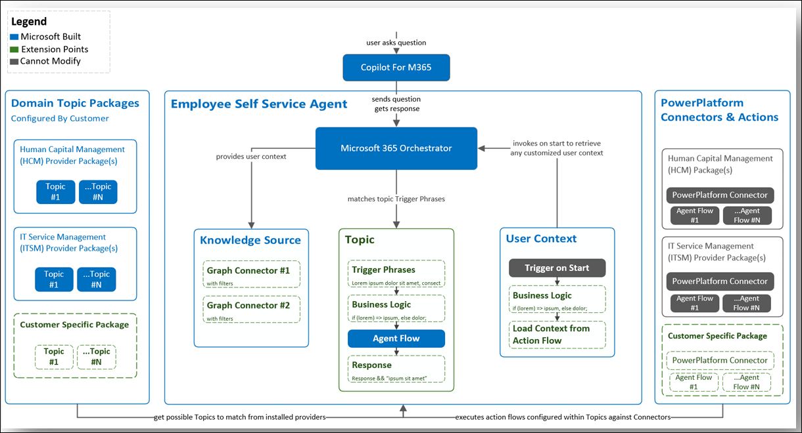

# Employee Self-Service

The Employee Self-Service agent is designed as a unified, customer-facing, AI-powered interface for handling employee requests and automating routine tasks within enterprise environments. The Employee Self-Service agent, built on Copilot Studio, is intended to be customized by you. Once you customize it for your organization's needs, the Employee Self-Service agent streamlines access to HR, IT, and operational systems, reducing manual intervention and improving process efficiency.

## Technical Architecture

The Employee Self-Service agent operates as a custom agent within **Copilot Studio**, using **Microsoft's AI infrastructure** and **Power Platform**. The agent is constructed on a modular architecture. This design enables integration with enterprise data sources using APIs, connectors, and secure authentication mechanisms. The solution supports multitenant deployments and is adaptable to on-premises, hybrid, or fully cloud-based environments, depending on organizational requirements.

## Integration Capabilities

Integration with existing enterprise systems is achieved through a library of prebuilt and custom connectors available in **Copilot Studio** and **Power Platform**. These connectors facilitate data exchange with:

- HRIS
- ITSM
- Identity management
- Knowledge base platforms

Data security and compliance are enforced through:

- Role-based access control
- Encrypted data transmission

## Core features

- **Employee and Manager scenarios**: The Employee Self-Service agent enables users to execute tasks such as querying HR policies, initiating IT support tickets, and updating personal information through conversational interfaces. All interactions are logged for auditability.
  - **Employee Self-Service agent starters are separate to focus on domains - HR and IT**. Employee Self-Service agent starters are beginning points to help you get started with a specific agent path, based on your organization's needs. Each starter offers slightly different functionality to focus on the core jobs to be done of the domain and is extensible.
    - **HR agent starter**: Empowers employees to self-serve HR needs by delivering clear, policy-based answers and guidance. This template delivers capabilities, including easy navigation of benefits, policy lookups, and access to organizational resources. The agent maintains an empathetic, professional tone and enforces boundaries by escalating complex or sensitive requests (such as legal or personnel decisions) to HR specialists.
    - **IT agent starter**: Enables employees to resolve IT issues efficiently through step-by-step troubleshooting and automated support flows. Key features include guided device setup, secure account management, and instant access to IT resources. The agent prioritizes clarity and patience, and ensures safe practices to protect data and systems.
- **Handoff template**: This agent template includes a configurable handoff feature, allowing seamless escalation to specialized first-party agents or human operators within predefined workflows. This feature is implemented using session context management and secure credential delegation.
- **Telemetry and Insights**: Integrated telemetry provides granular analytics on agent interactions, task completion rates, and user satisfaction.

## Customization, scalability, and extensibility

Copilot Studio and Power Platform provide extensive customization options, including low-code and pro-code development environments. Organizations can modify agent behavior, extend dialog flows, and integrate additional data sources. The platform supports scaling across regions and business units, with centralized management and version control for agent configurations.

Each starter comes with default content and accelerators to get you started like:

- Agent name, logo, and description.
- Instructions that help shape agent personality and behaviors.
- Topics that help you manage specific kinds of conversations and requests.
- Connectors to other services like ServiceNow and Workday.

The agent ships with a few solution accelerators to integrate with external systems like Workday, ServiceNow, and SAP SuccessFactors. The solution accelerators serve as key value drivers for the agent and are delivered with the following components to assist agent creators in efficiently integrating external systems:

- Topics
- Connectors
- Flows
- Templates

In addition to the shipped solution accelerators, the agent is extensible within Copilot Studio by adding components to support additional business scenarios.

[Learn more](https://github.com/microsoft/CopilotStudioSamples/tree/main/EmployeeSelfServiceAgent) about Copilot Studio samples and adding more scenarios.

## Implementation considerations

Consider which Employee Self-Service agent starter is right for your organization to start with – HR or IT. Both Employee Self-Service agent starter can be deployed into a single Employee Self-Service agent experience, but you must deploy them one at a time. [Learn more](customize.md) about how to get started customizing the Employee Self-Service agent, common roles and responsibilities, and basic agent building blocks.

- **Deployment**: The Employee Self-Service agent can be provisioned in sandbox or production environments through the Power Platform Admin Center. Deployment pipelines support continuous integration and delivery, with environment isolation for testing and validation.
- **Configuration**: Initial setup involves defining integration endpoints, mapping user roles, and configuring dialog flows. Starters and accelerators are available to expedite common scenarios.
- **Security**: The solution adheres to enterprise-grade security standards, including identity federation, least-privilege access, and encrypted storage. Compliance with regulatory frameworks like GDPR and HIPAA is supported through built-in auditing and data retention policies.

The Employee Self-Service agent and Copilot Studio consolidate employee self-service tasks within a secure, extensible, and scalable architecture. This consolidation delivers operational efficiencies and integration flexibility tailored for enterprise IT environments.

## Structure of the Employee Self-Service agent

The Employee Self-Service agent consists of three main parts: the agent itself, domain topic packages, and Power Platform connectors and actions.

[Learn more about how Copilot architecture works](../microsoft-365-copilot-architecture.md)

## Overview of external systems integration capabilities

The Employee Self-Service agent integrates with a few external systems. These systems can be used as for knowledge retrieval scenarios, read/write workflows, and hand-off to other agents or support channels.

The following matrix provides an overview of the various external systems integration capabilities:

|Scenarios |Agent component |SharePoint |Microsoft Self-Help |ServiceNow |Workday |SAP SuccessFactor |
|----------|----------------|-----------|--------------------|-----------|--------|------------------|
|HR |Knowledge sources |- Enterprise content access  - Advanced filtering  - Seamless integration |Not available |Copilot Connector supports:  - Indexing  - Hierarchical permissions and scripting  - Ticketing content |Not available |Not available |
|HR |Power platform connectors |Not applicable |Not applicable |HR ticketing  - Read  - Create |Employee profile access  - Read  - Write |Employee profile access  - Read  - Write |
|IT |Knowledge sources |- Enterprise content access  - Advanced filtering  - Seamless integration |- Microsoft 365 troubleshooting  - Generative orchestration  - Enterprise-specific customization |Copilot Connector supports:  - Indexing  - Hierarchical permissions and scripting  - Ticketing content | | |
|IT |Power platform connectors |Not applicable |Not applicable |IT ticketing  - Read  - Create |Not applicable |Not applicable |
|IT |Handoff |Not applicable |Not applicable |Handoff to:  - Now Assist  - Live Agent | | |

- [Learn more](sap-employee-read-write-scenarios.md) about SAP SuccessFactors pre-configured employee read and write scenarios.
- [Learn more](sap-manager-read-write-scenarios.md) about SAP SuccessFactors pre-configured manager read and write scenarios.
- [Learn more](workday.md#topics) about Workday pre-configured scenarios.
- [Learn more](servicenow-hrsd-itsm.md#topics) about ServiceNow HR pre-configured scenarios.
- [Learn more](servicenow-hrsd-itsm.md#topics-1) about ServiceNow IT pre-configured scenarios.
