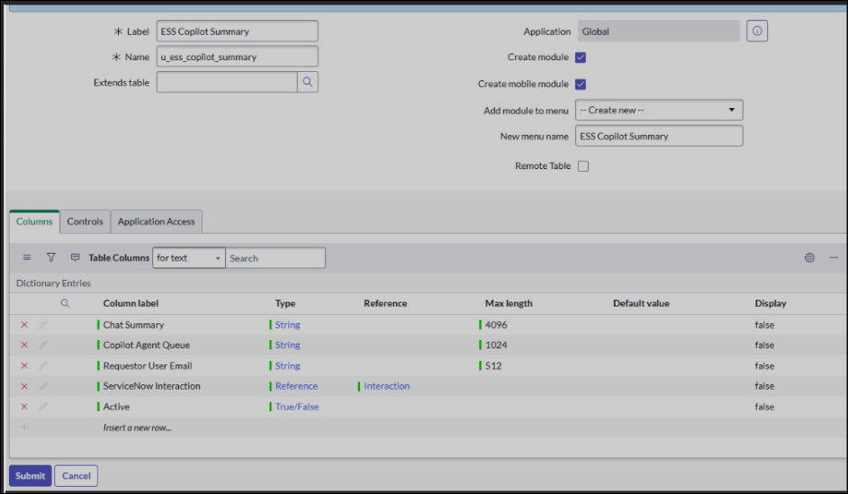
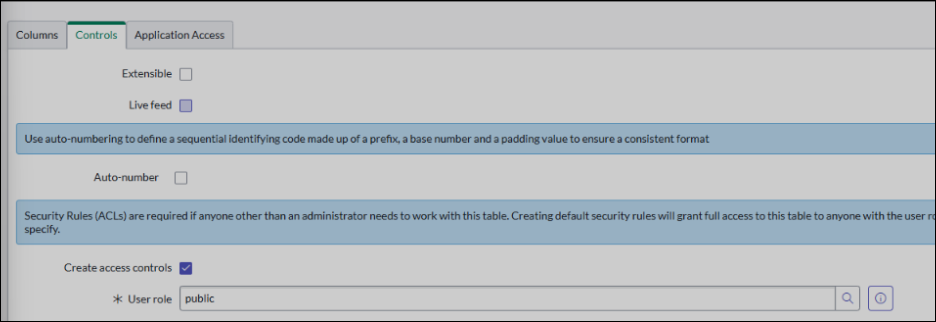
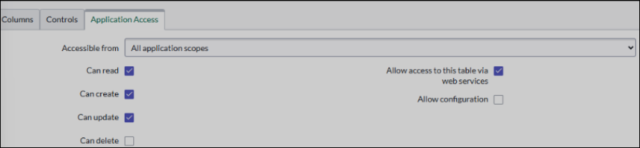
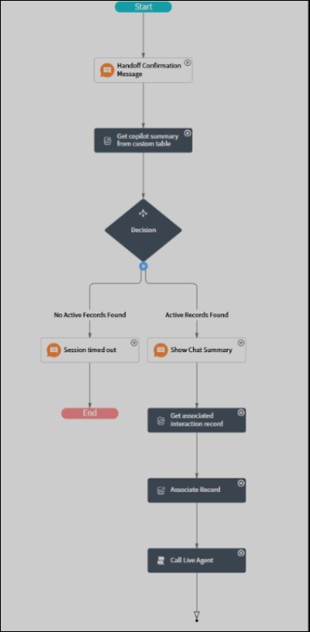
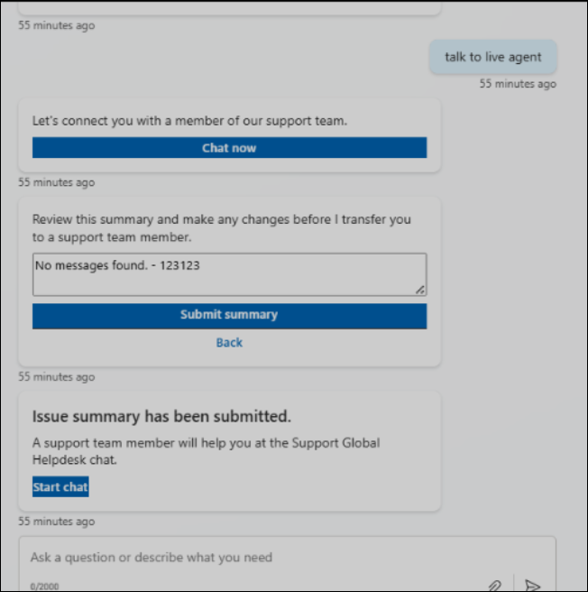

# Integrate ServiceNow Live Agent with your Employee Self-Service deployment

This document elaborates on the process of setting up ServiceNow Live Agent. This process requires major configuration in ServiceNow Instance and also making a few configurations in the Employee Self-Service agent. This document assumes the person doing configuration has a good understanding of the ServiceNow PDI ecosystem.

## Prerequisites

- ServiceNow PDI with the latest patch update.
- Access with administrator privileges.
- Virtual Agent API (Plugin ID: sn_va_as_service).
- Agent Chat (Plugin ID: com.glide.interaction.awa).

> [!TIP]
> Remember to select **Load demo data** for internal development while installing.

> [!IMPORTANT]
> The instructions provided in this article are for ServiceNow and the steps are subject to change based on the updates made by ServiceNow. Work with a ServiceNow administrator who's familiar with the following activities.

## Create a new table

1. Log in to ServiceNow with administrator privileges.
2. Search for **System Definition** in the **All** search box.
3. Select **Tables** from the search results.
4. Select the **New** button on top right of the page to create a new table.
5. For the **New table** form, fill in the following information:
    1. **Label** = ESS Copilot Summary
    2. **Name** = u_ess_copilot_summary [autogenerated]
    3. **New menu name** = ESS Copilot Summary
6. Add the following column definitions to the table:

|Field name             |Type       |Size |Reference table |
|-----------------------|-----------|-----|----------------|
|Chat Summary           |String     |4096 |                |
|Copilot Agent Queue    |String     |1024 |                |
|Requestor User Email   |String     |512  |                |
|ServiceNow Interaction |Reference  |     |Interaction     |
|Active                 |True/False |     |                |

](media/snow-live-1.png#lightbox)

7. Before you select the **Submit** button, the permissions on this table should be set on the based on the organization's security policy. All users using Live Agent should have permission to create records.



8. Select the **Controls** tab and change **User role** to the role that complies with the organization's security policy.
9. Select **Application Access** and put a check in the boxes for **Can create** and **Can update**.



10. Select the **Submit** button to save the changes.

## Create a new virtual topic

1. Search for **Conversation interfaces** in the **All** menu.
1. Select **Virtual Agent** > **Designer**.
1. Select **Create**.
1. Create a flow using drag-and-drop items from the left menu. Add items in the order indicated here after **Start**.
1. Add a text response component:
    1. **Node name:** Handoff confirmation message.
    1. **Response message:** Employee Self-Service handed you off to chat with a live agent.
1. Add a lookup utility node:
    1. **Node name:** *Get Copilot summary from custom table*.
    1. **Table:** *Select using "u_ess_copilot_summary"*.
    1. **Filter using table by using:** Select script and enter the following code:

```javascript
(function execute (table) {
    var userUPN= vaInputs.user.email;
    var gr= new GlideRecord ('u_ess_copilot_summary');
    gr.addQuery('u_requestor_user_email', userUPN); 
    gr.addQuery('active',true);
    gr.orderByDesc('sys_created_on');
    gr.setLimit(1); 
    gr.query();
    if (gr.next()){  
        return gr;
    }
    return null;
}) (table)
```

7. Add a decision node.
8. Add a path to decision node indicating **No Active Records Found**. Update the branch condition to **Get Copilot Summary from Custom Table** **is empty**.
9. Add a path to the decision node indicating **No Active Records Found**. Update the branch condition to be when **Get Copilot Summary from Custom Table** is **Empty**.
10. Add a text response in that path.
    1. **Node name:** *Session timed out*.
    1. **Response message:** *The session you accessed timed out. Return to Employee Self-Service to start a new session*.
  This path ends here.
11. Add a path to the decision node indicating **Active Records Found**.
12. Add a text response to the path you created.
    1. **Node name:** *Show Chat Summary*.
    1. **Response Message:** *A summary from your session with the Employee Self-Service agent*:
13. Use the **Data Pill Picker** to select **Input Variables** > **Get Copilot Summary from Custom Table** > **Chat Summary**.
14. Add a lookup utility:
    1. **Node name:** *Get associated interaction record*.
    1. **Table:** *Interaction*.
    1. **Filter this table by using:** Select **Script** and enter the following code:

```javascript
(function execute(table) {  
  var gr = new GlideRecord("interaction"); 
  gr.addQuery('opened_for',vaInputs.user.getValue()); 
  gr.addQuery('active',true); 
  gr.query();  
  if (gr.next()) {  
    return gr;  
  }  
  return null;  
})(table) 
```

15. Add a Record action utility.
    1. **Node name:** Associate Record.
    1. **Action type:** Update a record.
    1. **Record:** Get Copilot Summary from Custom Table.
    1. **Field:** Select **Add Field**. Then choose **ServiceNow Interaction**. Use Data Pill Picker to select **Input Variables** > **Get Associated Interaction Record**.
16. Add script action utility
    1. **Node name:** Call Live Agent
    1. **Action expression:** input the following code:

```javascript
(function execute() {  
  vaSystem.connectToAgent();  
})() 
```

17. Select the **Save** and **Publish** options. Refer to the screenshot for an example of the flow.



## Configure the ServiceNow Live Agent URL in the Employee Self-Service agent

The URL format is:

`https://base-url/sn_va_web_client_app_embed.do?sysparm_skip_load_history=true&sysparm_topic=<topic-id>&sysparm_vasource=ESS`

- **Base-url**: The base URL of the ServiceNow PDI
- **Topic-id**: Search for the table **sys_cs_topic** to get the Topic ID. Locate the flow that you created. Select and hold on the name to pull up the context menu, and copy **sys_id**.

**Sample URL**: `https://dev312301.service-now.com//sn_va_web_client_app_embed.do?sysparm_skip_load_history=true&sysparm_topic=6441a18993a62210e9117d532bba10fa&sysparm_vasource=ESS`

> [!NOTE]
> The GUID in bold text in the sample URL should be substituted by the sys_id copied from the previous step.

### Employee Self-Service agent configuration for ServiceNow Live Agent

1. Open the Employee Self-Service agent in Copilot Studio.
1. Install the ServiceNow Live Agent solution accelerator package for the Employee Self-Service agent.
1. After the successful installation of the package, go to the **Solutions** page.
1. There should be a warning message show: "1 environment variable needs to be updated". Select the warning message to open it and input the ServiceNow Live agent URL for the variable.
1. Enable the topic ServiceNow Live Agent IT Escalate.

### Test the integration of the Employee Self-Service agent and ServiceNow

1. Open the Employee Self-Service agent as a Maker, assuming that the maker's user account is already created in ServiceNow.
2. Go to the **Test** pane and type **Talk to Live Agent**. Then select **Chat now.**
3. A summary box appears with predefined summary from the conversation.
4. Update the summary if needed and select **Submit Summary**.
5. An **Issue summary submitted** message shows with a **Start chat** link appears.



6. Select **Start chat.** In the new tab that opens, sign in with your ServiceNow credentials.
7. You should see the summary shown in step 3.

If you successfully completed these validation steps, the integration is successful.
