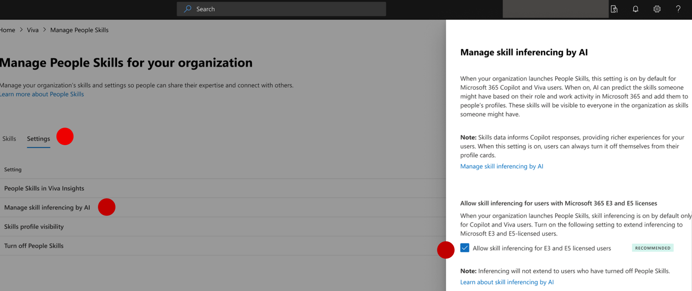

# Manage your skills library in People Skills

After completing the [initial setup](people-skills-setup.md), you can return to the People Skills page in the Microsoft 365 Admin Center to manage the skills library and admin settings.

You can find People Skills setup page by visiting the Copilot page in the [Microsoft 365 admin center](https://admin.microsoft.com/adminportal/home#/featureexplorer) and selecting **People Skills in Microsoft 365 Copilot**. Alternatively, you can find People Skills page under **Settings** > **Viva** > **Data Management**.

If you're looking for how to set up People Skills for the first time, see [Set up People Skills](people-skills-setup.md).

## Options to manage your skills library

You can manage your skills library in the following ways:

- [Manage out-of-the-box library](people-skills-manage-skills-library.md): Add and delete skills from a previously selected list of skills from the out-of-the-box library.

- [Manage custom skills](people-skills-manage-custom-skill.md): Add custom skills if you haven’t previously added them during the initial setup. You can also reimport custom skills, add new ones, or delete custom skills at any point.

- [Manage AI-restricted skills](people-skills-manage-custom-skill.md): Mark certain skills as sensitive to restrict them from being returned by skills AI inferencing.

- [Import or export skills](people-skills-import-export-skills.md): Import user skills from third-party platforms and export your custom skills library or confirmed user skills for each individual user in your tenant.

### Manage out-of-the-box skills library

You can view, add, or delete the skills that you selected from the out-of-the-box library. The more skills you include from the out-of-the-box library, the more specific AI-generated skill profiles are for the users. Our recommendation is to use all 16,000 skills, with a minimum of 500 skills.

To view, add, or delete the skills that you selected from the out-of-the-box library, follow these steps:

1. Navigate to the People Skills setup page and select *Skills** to manage your skills library.
1. Under **Skills**, select **People Skills Library**.
1. Review the list. You can also filter the list by domain or search by skill name.
1. To add skills, select **Add Skills**. You can filter by domain or search by skill name. Select **Add**.
1. To delete skills, select the skills you want to delete. You can filter by domain or search by skill name. Select **Delete skills**. Select **Delete** again to confirm you want to delete the selected skills.

   > [!NOTE]
   > Deleting skills removes the skills and associated skills data from your organization and from your users' experience.
   
1. Select **Done**.
### Expand AI Skill Inferencing to Microsoft 365 E3 and E5 licensed users

Admins can turn on AI-powered skill inferencing for Microsoft 365 Enterprise E3 and E5 licensed users directly in the Microsoft 365 admin center. AI-powered skill inferencing is turned on by default for Copilot and Viva users and turned off by default for Microsoft 365 E3/E5 licensed users. When an Admin turns on AI-powered skill inferencing for Microsoft 365 E3/E5 licensed users, it turns on inferencing for all Microsoft 365 E3/E5 licensed users in the organization.

> [!NOTE]
> This control is only available to tenants with at least one M365 Copilot license
> People Skills must be set up in your tenant before you can turn on this control. [Learn about People skills initial setup](/copilot/microsoft-365/people-skills-setup) 

Once AI-powered inferencing is turned on for Microsoft 365 E3/E5 licensed users, it may take up to 15 days for inferred skills to be added to their profiles. After the initial set of inferred Skills are added to Microsoft 365 E3/E5 licensed user’s profiles, new inferred skills will be refreshed periodically, typically every 180 days.

#### Why would you want to use this control?

AI-powered skill inferencing is turned for Copilot and Viva users by default. Expanding AI-powered skill inferencing to Microsoft 365 E3/E5 licensed users means your organization will have better coverage of Skills data, resulting in richer workforce analytics for leaders, more robust results in People queries in Copilot and Agents, and may allow you to better meet your organization goals.   

#### How to turn-on AI inferencing for Microsoft 365 E3/E5 users

See instructions for how to turn on AI-powered inferencing for Microsoft 365 E3/E5 licensed users:

Go to the Copilot page in the [Microsoft 365 admin center](https://admin.microsoft.com/Adminportal/Home#/copilot/overview) and select **Settings** > **Data access** and then **People Skills in Microsoft 365 Copilot**. Alternatively, you can find People Skills page under **Settings** > **Viva** > **Data Management**.

 

1. On the **Manage People Skills for your organization** page, Select __Settings__

1. Select __Manage skill inferencing by AI__

1. Check the box to enable AI-powered inferencing for E3 and E5 licensed users, or uncheck the box if you’d like to turn disable it

