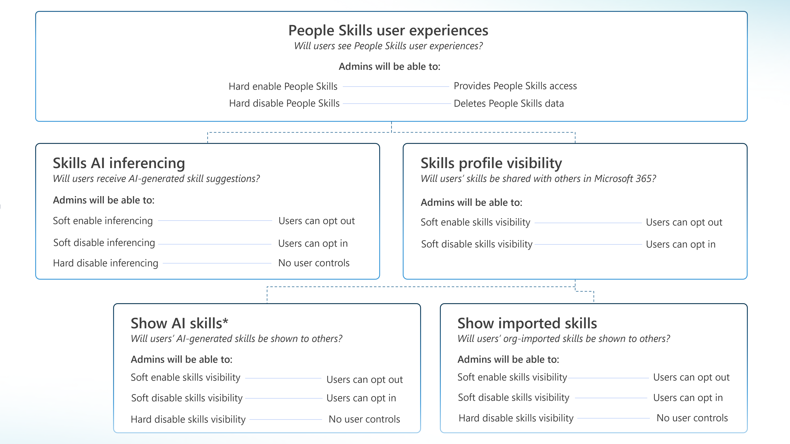
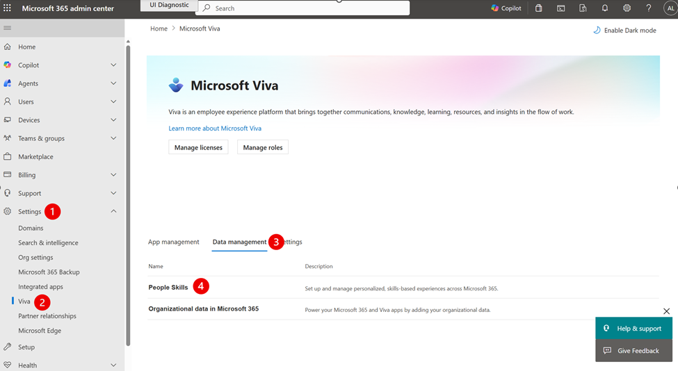
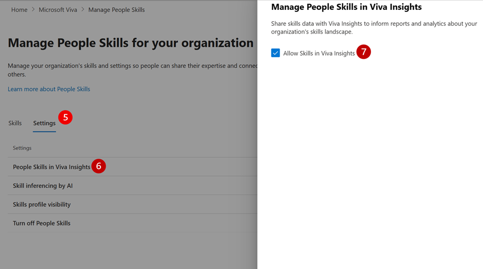
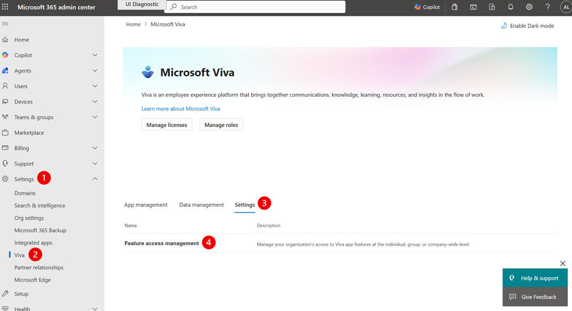
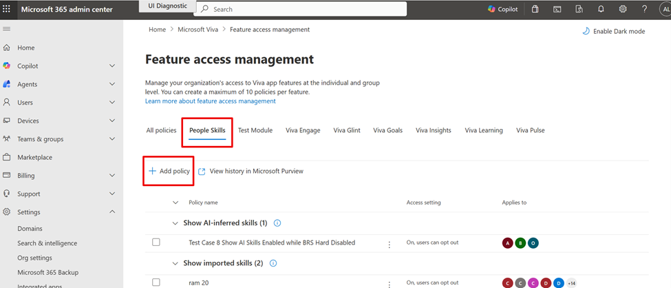
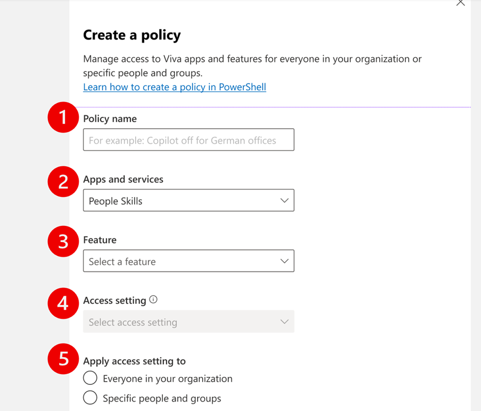

# Privacy, sharing, and access controls in People Skills

People Skills offers controls for Admin users to configure privacy settings, skill visibility, and access management within the Microsoft 365 Admin Center. By using these controls, you can meet your organization's needs and comply with local regulatory or business requirements. These settings can also be used to selectively deploy People Skills to a small group of pilot users, while restricting functionality to the rest of your tenant. People Skills provides access controls using [Feature access management](/viva/feature-access-management). By understanding these controls, you can deploy People Skills in a compliant, flexible manner—whether to your entire tenant, specific groups, or a small set of users.

#### Example use-cases for when these controls may be valuable:

- __Workers Council or Regional Compliance Requirements__

  If your organization has Workers Council requirements and needs to disable People Skills for certain regions (such as users in Germany), you have several admin controls for meeting compliance needs. Configure compliance‑appropriate access controls. For example, you can use the **AI Inferencing control** to disable AI‑generated skill inferences while still allowing users to opt in if they choose. Alternatively, you can use the **People Skills user experiences control**, which fully disables all People Skills experiences for the selected user group; this higher-level control removes all People Skills user experiences for those users and may be used to meet regional compliance needs.
  
- __Piloting People Skills with a Test Group__

  If you want to roll out People Skills gradually, you can enable it only for a small pilot group while keeping it turned off for the rest of your tenant. The __People Skills user experiences control__ lets you turn on the experience for the pilot group and off for everyone else.
  
- __Limiting Skill Visibility for Privacy or Data Boundaries__

  If you need to restrict how widely Skills data is shared within your organization, you can adjust the default sharing behavior using the **Skills** __Profile Visibility Control__ to disable skill sharing. Individual users can still choose to opt in if they prefer.
  
- __Blocking AI from Automatically Adding Skills__

  If you don't want AI to infer or add skills to users’ profiles, you can use the __AI Inferencing Control__ to fully disable AI-generated skills across the selected users.
  
## Overview of People Skills Admin Controls

As an admin, you may manage People Skills through the following controls:


| Feature Control| What it does|Access Settings|Default setting|Relationships to other controls|
| -------- | -------- | -------- | -------- | -------- |
|People Skills user experiences|Turns all People Skills user experiences on or off for selected users. |On (hard enable); or Off (hard disable) |On|This control is a parent to all other admin controls. If this control is turned off, then all other controls are turned off. |
|Skills AI Inferencing|Determines whether AI can infer Skills for users and add them to their M365 profiles on their behalf.  |On, users can opt out (soft enable); or Off, users can opt in (soft disable); or Off (hard disable) |On, users can opt out (soft enabled) |This control is a parent to the **Show AI Inferred Skills** control. This control is a child to the **People Skills user experiences** control. |
|Skills Profile Visibility |Controls whether any of a user's skills (AI-inferred, Confirmed, or Imported) are shown on the user's M365 Profile Card or shared with other M365 applications.|On, users can opt out (soft enable); or Off, users can opt in (soft disable); or Off (hard disable) |On, users can opt out (soft enabled) |This control is a parent to the **Show AI Inferred Skills** control and the **Show Imported Skills** control. This control is a child to the **People Skills user experiences** control. |
|Show AI-Inferred skills|Controls whether AI-Inferred Skills are shown on the user's M365 Profile Card or shared with other M365 applications. |On, users can opt out (soft enable); Off, users can opt in (soft disable); or Off (hard disable) |On, users can opt out (soft enabled) |This control is a child to the **Skills Profile Visibility** control, and the **People Skills user experiences** control. |
|Show Imported Skills|Controls whether imported (also known as organization-added) skills are shown on the user's M365 Profile Card or shared with other M365 applications.|On, users can opt out (soft enable); Off, users can opt in (soft disable); or Off (hard disable) |On, users can opt out (soft enabled) |This control is a child to the **Skills Profile Visibility** control, and the **People Skills user experiences** control.|

All controls can be scoped at either the entire tenant level, to specific user groups, or to individual users. You configure these controls using [Feature access management](/viva/feature-access-management), available in:

- Microsoft Admin Center, or

- PowerShell

Admins can set controls at any time: before, during, or after deployment.  To view your admin settings, you can navigate to the People Skills setup page and select **Settings**.

> [!IMPORTANT]
> Changes in Feature access management take up to 24 hours to complete, and end-to-end changes may take up to 72 hours to fully propagate across all experiences. 

#### Key terminology

When managing Admin Controls, see the table for important definitions of terms referenced throughout this page.  

| Term| What it means|
| -------- | -------- |
|Hard disable| Feature is fully disabled (turned off) and users can't opt in|
| Soft disable|Feature is available but default off, and users may opt in |
|Soft enable|Feature is available and default on, and users may opt out|
|Parent control|A parent control determines the access settings of its child controls. When the parent is turned off, all child controls automatically inherit that setting and are also turned off. For example, the **People Skills user experiences** control is a parent for all other admin controls. If the People Skills user experiences control is turned off, every related control is disabled as well. |
|Child control|Child controls are controls that sit beneath a parent feature and depend on the parent's access state. A child control can only be applied if its parent feature is turned on. When the parent is disabled, all associated child controls automatically become disabled (they inherit their parent's access setting). |

See visual diagram for an illustration of the relationships between the controls. 




## Overview of People Skills user experiences control 

As an Admin, you can use the __People Skills user experiences__ control to turn off People Skills user experiences for your entire organization, user group subsets, or individual users. This control is the highest-level parent control – it disables all People Skills user experiences entirely for selected users and override and replace the access settings of all other controls. 

#### What happens when People Skills user experiences are turned off?

Turning off People Skills permanently deletes all historical user-level data for the affected users, including confirmed skills, AI-inferred skills, and any imported skills.

> [!IMPORTANT]
> The People Skills user experiences control doesn't delete or deprovision the skills library. Only user level data is deleted. 

Once People skills is turned off for a user, all People Skills user experiences are removed for that user, including but not limited to: 

- People Skills in Viva Learning

- People Skills in M365 Profile Card

- Copilot experiences

[Click here for a list of all the applications where People Skills data will be impacted by this Admin Control](/copilot/microsoft-365/people-skills-overview). Additionally, no new skills data is collected, and Admins can't import custom skills for disabled users. Users can be re-enabled later but lost skills data isn't restored.

#### Visibility behavior when some users are disabled

When People Skills user experiences are disabled for some users but enabled for others, those disabled users may still be able to view or retrieve skills data from enabled users in certain experiences, such as Copilot or Microsoft 365 profile cards. This may occur when People Skills user experiences are turned off for a subset of users within your organization, and Skills Profile visibility remains enabled for other users who have People Skills turned on. If the Admin would like to turn off skills visibility for users, [then learn more about how to control People Skills sharing and visibility here.](/copilot/microsoft-365/people-skills-sharing-inferencing-controls)

__Example:__

- Both User A and B are licensed for People Skills

  - _User A_ is part of a small-scale People Skills pilot
  
  - _User B_ isn't part of the pilot
  
- User C isn't licensed for People Skills and has User Profile Application (UPA) Skills instead

If the Admin turns off People Skills user experiences for User B, and keeps People Skills user experiences turned on for A, then User B may still be able to see user A's People Skills in Copilot or on the M365 Profile Card, provided User A has Skills visibility enabled and Skills sharing turned on. User B’s Microsoft 365 Profile Card shows no Skills experience when others view User B’s card. User C sees UPA Skills on their own M365 Profile Card, and for User A and User B. While User A and User B may not see their own UPA Skills on their M365 Profile Cards, they can still view, edit, or delete them in SharePoint – [learn more about UPA Skills and People Skills here](/copilot/microsoft-365/people-skills-overview).


## Overview of the Skills AI inferencing control 

The Skills AI inferencing control determines whether AI can automatically generate skills for users based on their M365 activity and role. [Learn more about our AI Inference Engine here](/copilot/microsoft-365/people-skills-ai-inferencing). These AI-generated skills show on the user’s Microsoft 365 Live Profile Card (and are visible to others in the organization). When shown on the M365 Live Profile Card, AI-generated skills appear as gray, while Skills that a user confirms appear as blue with a checkmark. By default, AI inferencing is turned on for eligible users (Copilot and Viva users).  

The below table summarizes what access settings are available to Admins to set for this control: 

| Access setting| What it means|
| -------- | -------- |
|On, allow users to opt out (default) |When AI inferencing is soft enabled, users automatically receive AI-generated skills relevant to their role on their M365 Profile Card, unless the user opts out. Users may turn off (opt out of) AI inferencing for themselves in the Data and Privacy tab of their M365 Profile Editor page. If AI inferencing is turned on, and visibility controls are turned on (default behavior), then a user's AI-generated skills show to other users in the organization when their profile card is viewed. |
|Off, allow users to opt in |When AI inferencing is soft disabled, no AI-generated skills are created for a user, unless the user decides to opt themselves in. Users may still manually search for, add, and confirm skills from your organization's skill library. Skills that a user confirms appear in a blue box with a checkmark on their M365 profiles. |
|Off|When AI inferencing is hard disabled, then no AI-generated skills can be created. |


## Overview of the Skills profile visibility control 

The **Skills profile visibility** setting controls whether any skills (AI-inferred, confirmed, or imported) are shown and visible to other users via the Microsoft 365 Live Profile Card, and whether skills data is shared with other Microsoft 365 experiences, such as Copilot and leader dashboards and analytics. [Click here for full list of all applications that use Skills data](/copilot/microsoft-365/people-skills-overview#where-does-people-skills-data-appear). This control doesn't impact whether Skills data is shared with Viva Learning – Skills data continues to be shared with Viva Learning if your tenant has a Viva Learning license regardless of this control.

The **Skills profile visibility** control is a **parent control** to the **Show AI Skills** and **Show Imported Skills** controls; these two child controls automatically inherit whatever policy mode is set at the parent level. This means if **Skills profile visibility** is soft disabled, then **Show AI Skills** and **Show Imported Skills** are also soft disabled – when all these controls are soft disabled, it means that a user’s confirmed skills, AI-inferred skills, and imported skills aren't visible to others in the organization unless the user chooses to opt in. Users can always opt in to show their Skills data with others if they want to.

The below table summarizes what access settings are available to Admins to set for this control: 

| Access setting| What it means|
| -------- | -------- |
|On, allow users to opt out (default) |Skills profile visibility is soft enabled (default), and all Skills that a user has (AI-inferred, confirmed, and/or imported) show as visible to their colleagues within their organization on their M365 Profile Cards, and their Skills data are also shared with [other applications](/copilot/microsoft-365/people-skills-overview#where-does-people-skills-data-appear) that use Skills. |
|Off, allow users to opt in |Skills profile visibility is soft disabled, and all Skills that a user has (AI-inferred, confirmed, and/or imported) are hidden on M365 Profile Cards (not shown to other users), and not shared with other applications, unless the user decided to opt themselves in. The **Show AI Skills** and the **Show Imported Skills** controls are also soft disabled. |

> [!Note]
> We don't offer the option to hard disable **Skills Profile Visibility.** A user can always opt in to sharing their skills profile from their personal skills settings in Profile Editor. Admins can hard disable sharing of some skills such as AI-generated or imported skills (also referred to as organization added skills). 


## Overview of the Show AI-inferred Skills control

The **Show AI-inferred Skills** control determines whether AI-generated skills show as visible to others on the M365 Profile Card, and are shared with [other M365 applications that use Skills data](/copilot/microsoft-365/people-skills-overview#where-does-people-skills-data-appear). These skills are only visible if the parent controls (Skills Profile Visibility, People Skills AI inferencing, and People Skills user experiences) are also enabled. All controls are enabled by default.

The below table summarizes what access settings are available to Admins to set for this control: 

| Access setting| What it means|
| -------- | -------- |
|On, allow users to opt out (default) |This means that Show AI-inferred Skills is soft enabled, and AI-generated skills are shown as visible to colleagues on a user's M365 Live Profile Card and shared with other M365 applications. Users have the ability to opt themselves out of showing AI-inferred skills. |
|Off, allow users to opt in |This means that Show AI-inferred Skills is soft disabled, and no AI-generated skills are shown as visible to colleagues on a user's M365 Live Profile Card nor are they shared with other M365 applications. |


> [!NOTE]
> These AI-Inferred skills are only shared if Skills Profile visibility is also enabled or shared. If Skills Profile Visibility is disabled, AI-inferred skills aren't shown to other users or shared with any Microsoft 365 experiences.

## Overview of the Show Imported Skills control

The **Show Imported Skills** control determines whether Admin imported skills (also referred to as organization added skills) may be shown as visible on a user's profile. Imported skills are ones that an Admin chooses to import that may come from other talent systems external to Microsoft People Skills. These imported skills would only be visible if the parent controls (Skills Profile Visibility, and People Skills user experiences) are also enabled (all controls are enabled by default).

The below table summarizes what access settings are available to Admins to set for this control:

|Access setting|What it means|
| -------- | -------- |
|On, allow users to opt out (default)|This means that any imported skills are shown as visible to colleagues on a user's M365 Live Profile Card and shared with other M365 applications. Users have the ability to opt themselves out of showing and sharing imported skills.|
|Off, allow users to opt in|This means that any imported skills aren't visible to colleagues on a user's M365 Live Profile Card nor are they shared with other M365 applications.|


> [!NOTE]
> These imported skills are only shared if Skills Profile visibility is also enabled or shared. If Skills Profile Visibility is disabled, imported skills aren't shown to other users or shared with any Microsoft 365 experiences.

## Manage data sharing with Viva Insights

Admins have the ability to enable or disable People Skills data sharing with Viva Insights. If enabled, People Skills data (including AI-Inferred Skills data that a user hasn't confirmed) is sent to Viva Insights to populate skills dashboards and workplace analytics. Learn more about [People Skills in Viva Insights](/viva/insights/advanced/analyst/templates/skills-landscape).

**Steps to enable or disable sharing with Viva Insights**






1. Navigate to **Settings** in the left rail of the M365 Admin Center

1. Select **Viva** 

1. Select **Data management** and then

1. Select **People Skills**

1. Select **Settings**

1. Select **People Skills in Viva Insights**

1. To enable, check (or uncheck to disable) **Allow skills in Viva Insights**

> [!NOTE]
> Any historical data still remains in Viva Insights even after disabling. 

## Manage People Skills controls in Feature access management

People Skills controls are configurable as features within Feature access management either directly in the Microsoft 365 Admin Center or in PowerShell. You can scope policies to specific users, groups, or your entire tenant. 

Below is some general guidance for creating policies:

**For pilots**

- Use People Skills User Experiences control to disable the entire tenant and enable only for the pilot user group 

- Maintain compliance through explicit opt in defaults.

**For global rollouts**

- Keep SoftEnable defaults where possible

- Use HardDisable where regulations forbid AI processing or skill sharing

- Monitor data flows into Viva Insights

**For regulated regions / Workers Council environments**

- Use People Skills user experiences, inferencing and/or visibility policies to restrict specific groups

- Use SoftDisable or HardDisable strategically per requirement. 

- Validate user-level opt in rights and transparency.

### Configuring Admin controls in M365 Admin Center interface

You can access Feature access management in the M365 Admin Center by following the below instructions:



1. Navigate to **Settings** in the left rail of the M365 Admin Center

1. Select **Viva** 

1. Select **Settings** and then

1. Select **Feature access management**

1. Once you're in Feature access management, select **People Skills**

1. Click on **Add policy**

**Create a policy**

You can create a policy for any of the available feature controls by following the below instructions: 

1. Set a **Policy Name**, for example *Turn off Skills for Workers Councils*

1. Select *People Skills* in **Apps and services**

1. Select the **Feature*** you’d like to configure, for example *People Skills user experiences*

1. Select your **Access setting***, for example *Off*

1. **Apply the access setting to** the desired user scope

> [!NOTE]
> For a detailed explanation of **Features** and **Access settings**, review the section above Overview of Admin Controls section above. 

### Configuring Admin Controls in PowerShell

If you use PowerShell, then see the table below for an explanation of how each of the People Skills admin controls maps to features within Feature access management, and the Policy Modes that are available for each.

#### Feature-to-Policy Mapping

The four features for People Skills described above map to the below, and are all available to be set for the **tenant**, **group**, and **user** scopes.

| ModuleId | FeatureId | Policy Modes | Parent Feature | 
| --- | ---- | ------ | ---- |
| PeopleSkills |  SkillsInferencing | HardDisable, SoftDisable, SoftEnable | None
| PeopleSkills |  SkillsProfileVisibility |  SoftDisable, SoftEnable | None
| PeopleSkills |  ShowAISkills |  HardDisable, SoftDisable, SoftEnable | SkillsProfileVisibility
| PeopleSkills |  ShowOrgAddedSkills |  HardDisable, SoftDisable, SoftEnable | SkillsProfileVisibility


The Policy Modes supported for each feature map to the following PowerShell commands.


| Policy Mode|Meaning|PowerShell Command|
| -------- | -------- | -------- |
|Hard Disable|Feature is fully disabled (turned off); users can't opt in or out|-IsFeatureEnabled $false|
|Soft Disable  |Feature is available but default off; users can opt in|-IsFeatureEnabled $true -IsUserControlEnabled $true -IsUserOptedInByDefault $false|
|Soft Enable|Feature is available and default on; users can opt out|-IsFeatureEnabled $true -IsUserControlEnabled $true -IsUserOptedInByDefault $true|

> [!Important]
> Soft Enable and Soft Disable require **Exchange PowerShell version 3.8.0**, 

#### Policy precedence

When more than one policy applies to a user, the **[most restrictive policy always takes effect](/viva/feature-access-management)**.

**Access level precedence**

Policies are evaluated in this order:

1. Specific people or group policies

1. Tenant-wide (organization-wide) policies

**Example:** This means that if a user is included in both a group-level and an organization-wide policy, the group-level policy takes priority. 

When policy modes conflict, they follow the below order from highest to lowest priority: 

1. Hard disable

1. Soft disable

1. Soft enable

1. Hard enable

**Example:** This means that if one policy for a user group is hard disabled and another is hard enabled, then the hard disabled policy applies because it has higher precedence. 

#### User and group limits

When assigned a policy to specific users or groups, you can include up to 20 users or groups total per policy. If you need to include more than 20, create additional policies (e.g., one for users 1-20, another for users 21-40). 

#### How to use PowerShell Commands

To learn how to use PowerShell syntax, see __[our Feature Access Management documentation](/viva/manage-access-policies)__. For more information on how to create and manage policies, see [control access to features](/viva/feature-access-management) and [Add-VivaModuleFeaturePolicy PowerShell command details](/powershell/module/exchangepowershell/add-vivamodulefeaturepolicy).

Below are some examples of PowerShell commands – these examples aren't intended to be copy and pasted– you may need to update and replace the values to suit your requirements depending on your specific use-case scenario. 

> [!IMPORTANT]
> In the PowerShell command examples below, you shouldn't copy and paste them – you must review them carefully and may need to update them to suit your specific requirements.
> 
> - Ensure the **ModuleId** is *PeopleSkills*
> - Ensure the **featureId** is correct – see feature-to-policy mapping table above.
> - Replace `-Everyone` with your desired scope:
>   - `-Everyone` (entire organization)
>   -  `-GroupIds "group1@contoso.com","group2@contoso.com"` (specific groups)
>   - `-UserIds "user1@contoso.com","user2@contoso.com"` (specific users)
> - The Feature Access Policy name values have to be unique, so make sure you're editing __-Name__ in the PowerShell commands with names that are descriptive and unique to your policy

In the below PowerShell command examples, we may be using different **FeatureId** examples than what may be relevant for your scenario. Ensure that you use the correct **FeatureId** for your scenarios. For more information on PowerShell syntax, see [our Feature Access Management documentation](/viva/manage-access-policies).

#### Command Examples for Skills AI Inferencing Control

**Keep skills inferencing enabled but default off:** Skills inferencing is available in your tenant, but users in this access policy are "opted-out," and don't receive inferencing suggestions. Users have the option to turn it on for themselves in the Microsoft 365 profile editor, on the Data and privacy tab.

To create this policy, run the following PowerShell cmdlet.

```powershell
Add-VivaModuleFeaturePolicy -ModuleId PeopleSkills -FeatureId SkillsInferencing -Name SoftDisable -IsFeatureEnabled $true -IsUserControlEnabled $true -IsUserOptedInByDefault $false -Everyone
```

**Completely disable skills inferencing:** With this policy, skills inferencing is disabled for your tenant and users can't opt in to receiving skill inferencing suggestions.

To create this policy, run the following PowerShell cmdlet:

```powershell
Add-VivaModuleFeaturePolicy -ModuleId PeopleSkills -FeatureId SkillsInferencing -Name HardDisable -IsFeatureEnabled $false -Everyone
```

#### Command examples for the People Skills profile visibility control

**Keep profile visibility default off:** Users in this access policy are opted-out, and their skills aren't shared across Microsoft 365. Users have the option to turn it on for themselves in their skill settings.

To create this policy, run the following PowerShell cmdlet:

```powershell
Add-VivaModuleFeaturePolicy -ModuleId PeopleSkills -FeatureId SkillsProfileVisibility -Name SoftDisable -IsFeatureEnabled $true -IsUserControlEnabled $true -IsUserOptedInByDefault $false -Everyone

```

#### Command examples for Show AI-Inferred Skills control

**Keep the default sharing off for AI-generated skills**: Users in this access policy are "opted-out," and their AI-generated skills aren't shared across Microsoft 365. Users have the option to turn it on for themselves in their skill settings.

To create this policy, run the following PowerShell cmdlet:

```powershell
Add-VivaModuleFeaturePolicy -ModuleId PeopleSkills -FeatureId ShowAISkills -Name SoftDisable -IsFeatureEnabled $true -IsUserControlEnabled $true -IsUserOptedInByDefault $false -Everyone
```

**Completely disable sharing of AI-generated skills**: With this policy, AI-generated skills aren't shared with anyone but themselves and users can't opt in to sharing their AI skill suggestions before confirming them those skills.  

To create this policy, run the following PowerShell cmdlet:

```powershell
Add-VivaModuleFeaturePolicy -ModuleId PeopleSkills -FeatureId ShowAISkills -Name  HardDisable -IsFeatureEnabled $false -Everyone
```

#### Command examples for the Show Imported skills Control

**Keep imported skill sharing default off:** Users in this access policy are "opted-out," and their third-party skills aren't shared across Microsoft 365. Users have the option to turn it on for themselves in their skill settings.

To create this policy, run the following PowerShell cmdlet:

```powershell
Add-VivaModuleFeaturePolicy -ModuleId PeopleSkills -FeatureId ShowOrgAddedSkills -Name SoftDisable -IsFeatureEnabled $true -IsUserControlEnabled $true -IsUserOptedInByDefault $false -Everyone
```

**Completely disable imported skill sharing:** With this policy, third-party skills aren't shared with Microsoft 365 experience in your tenant and users can't opt in to sharing their third-party skills.

To create this policy, run the following PowerShell cmdlet:

  ```powershell
Add-VivaModuleFeaturePolicy -ModuleId PeopleSkills -FeatureId ShowOrgAddedSkills -Name HardDisable -IsFeatureEnabled $false -Everyone
  ```
  
#### Command examples for People Skills user experiences control 

**Disable People Skills user experiences for the entire tenant:**


```powershell
Add-VivaModuleFeaturePolicy -ModuleId PeopleSkills-FeatureId SkillsUserExperienceControl -Name DisableFeatureForAll -IsFeatureEnabled $false -Everyone
```

**Disable People Skills user experiences for the user groups:**


```powershell
Add-VivaModuleFeaturePolicy -ModuleId PeopleSkills -FeatureId SkillsUserExperienceControl -Name MultipleGroups -IsFeatureEnabled $false -GroupIds group1@contoso.com,group2@contoso.com,57680382-61a5-4378-85ad-f72095d4e9c3
```

**Disable People Skills user experiences for an individual user:**


```powershell
Add-VivaModuleFeaturePolicy -ModuleId PeopleSkills -FeatureId SkillsUserExperienceControl -Name MultipleUsers -IsFeatureEnabled $false -UserIds user1@contoso.com,user2@contoso.com
```

**Disable People Skills user experiences for users and groups in a single command:**


```powershell
Add-VivaModuleFeaturePolicy -ModuleId PeopleSkills -FeatureId SkillsUserExperienceControl -Name UsersAndGroups -IsFeatureEnabled $false -GroupIds group1@contoso.com,group2@contoso.com,57680382-61a5-4378-85ad-f72095d4e9c3 -UserIds user1@contoso.com,user2@contoso.com
```

**Update the name of a policy:**


```powershell
Update-VivaModuleFeaturePolicy -ModuleId PeopleSkills -FeatureId SkillsUserExperienceControl -PolicyId 3db38dfa-02a3-4039-b33a-42b0b3da029b1 -Name NewPolicyName -IsFeatureEnabled $false
```

**Update group members:**


```powershell
Update-VivaModuleFeaturePolicy -ModuleId PeopleSkills -FeatureId SkillsUserExperienceControl -PolicyId 3db38dfa-02a3-4039-b33a-42b0b3da029b -GroupIds group1@contoso.com,group2@contoso.com
```

**Update users:**


```powershell
Update-VivaModuleFeaturePolicy -ModuleId PeopleSkills -FeatureId SkillsUserExperienceControl -PolicyId 3db38dfa-02a3-4039-b33a-42b0b3da029b -UserIds user1@contoso.com,user2@contoso.com
```

**Delete policy:**


```powershell
Remove-VivaModuleFeaturePolicy -ModuleId PeopleSkills -FeatureId SkillsUserExperienceControl -PolicyId 3db38dfa-02a3-4039-b33a-42b0b3da029b
```

**Get policy details for People Skills user experiences admin control:**


```powershell
Get-VivaModuleFeaturePolicy -ModuleId PeopleSkills -FeatureId SkillsUserExperienceControl
```

**Get specified policy:**


```powershell
Get-VivaModuleFeaturePolicy -ModuleId PeopleSkills -FeatureId SkillsUserExperienceControl -PolicyId 3db38dfa-02a3-4039-b33a-42b0b3da029b
```

**Get policies for a specified user:** 


```powershell
Get-VivaModuleFeaturePolicy -ModuleId PeopleSkills -FeatureId SkillsUserExperienceControl -MemberIds user1@contoso.com
```

