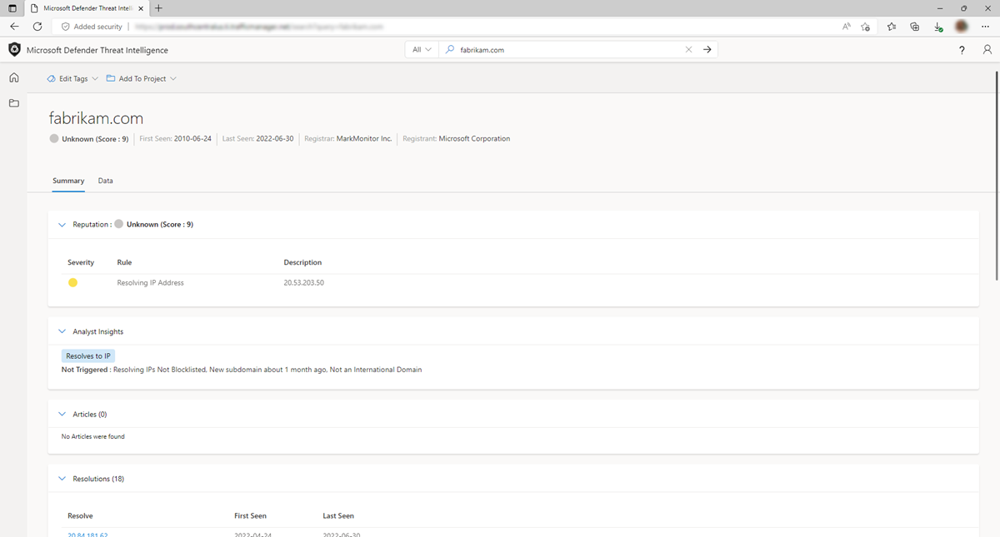

--- 
title: 'Microsoft Defender Threat Intelligence (Defender TI) Analyst Insights'
description: 'In this overview article, learn about the Microsoft Defender Threat Intelligence (Defender TI)’s analyst insights feature.'
author: alexroland24
ms.author: aroland
manager: dolmont
ms.service: threat-intelligence 
ms.topic: overview
ms.date: 08/02/2022
ms.custom: template-overview 
---

# Analyst insights

In Microsoft Defender Threat Intelligence (Defender TI), the Analyst Insights section provides quick insights about the artifact that may help determine the next step in an investigation. This section will list any insights that apply to the artifact, as well as those that do not apply for additional visibility. In the below example, we can quickly determine that the IP Address is routable, hosts a web server, and had an open port within the past five days. Furthermore, the system displays rules that were not triggered, which can be equally helpful when kickstarting an investigation.

## Analyst insight types and questions they can address

| Analyst insight types                      | Questions they can address                                                                                                |
|--------------------------------------------|---------------------------------------------------------------------------------------------------------------------------|
| Blocklisted                                | Is/when was the domain, host, or IP address blocklisted?                                                                  |
|                                            | How many times has Defender TI blocklisted the domain, host, or IP?                                                            |
| Registered & Updated                       | How many days, months, years ago was the domain registered?                                                               |
|                                            | When was the domain WHOIS Record updated?                                                                                 |
| Subdomain IP count                         | How many different IPs are associated with the subdomains of the domain?                                                  |
| New subdomain observations                 | When was the last time Microsoft observed a new subdomain for the domain in question?                                     |
| Registered & Resolving | Does the domain queried exist?                                                                                            |
|                                            | Does the domain resolve to an IP address?                                                                                 |
| Number of Domains sharing the WHOIS record | What other domains share the same WHOIS record?                                                                           |
| Number of domains sharing the Name Server  | What other domains share the same name server record?                                                                     |
| Crawled by RiskIQ                          | When was this host or domain last crawled by Microsoft?                                                                   |
| International Domain                       | Is the domain queried for an international domain name (IDN)?                                                             |
| Blocklisted by Third Party                 | Is this indicator blocklisted by a third-party?                                                                           |
| Tor Exit Node Status                       | Is the IP address in questions associated with The Onion Router Network (Tor)?                                            |
| Open Ports Detected                        | When did Microsoft last port scan this IP address?                                                                        |
| Proxy Status                               | What is the proxy status of this indicator?                                                                               |
| Host Last Observed                         | Is the IP address in question internet accessible?                                                                        |
| Hosts a Web Server                         | Does the IP address have a DNS server that uses its resources to resolve the name into it for the appropriate web server? |

## Next steps

For more information, see:

- [Reputation scoring](reputation-scoring.md)
- [Using tags](using-tags.md)