--- 
title: 'Microsoft Defender Threat Intelligence (Defender TI) Data Sets'
description: 'In this overview article, learn about Microsoft Defender Threat Intelligence (Defender TI)’s data sets feature.'
author: alexroland24
ms.author: aroland
manager: dolmont
ms.service: threat-intelligence
ms.topic: conceptual
ms.date: 08/02/2022
ms.custom: template-concept
---

# Data sets

Microsoft centralizes numerous data sets into a single platform, Microsoft Defender Threat Intelligence (Defender TI), making it easier for Microsoft’s community and customers to conduct infrastructure analysis. Microsoft’s primary focus is to provide as much data as possible about Internet infrastructure to support a variety of security use cases.

Microsoft collects, analyzes, and indexes internet data to assist users in detecting and responding to threats, prioritizing incidents, and proactively identifying adversaries’ infrastructure associated with actor groups targeting their organization. Microsoft collects internet data via its’ PDNS sensor network, global proxy network of virtual users, port scans, and leverages third-party sources for malware and added Domain Name System (DNS) data.

This internet data is categorized into two distinct groups: traditional and advanced. Traditional data sets include Resolutions, Whois, SSL Certificates, Subdomains, DNS, Reverse DNS, and Services. Advanced data sets include Trackers, Components, Host Pairs, and Cookies. Trackers, Components, Host Pairs, and Cookies data sets are collected from observing the Document Object Model (DOM) of web pages crawled. Additionally, Components and Trackers are also observed from detection rules that are triggered based on the banner responses from port scans or SSL Certificate details.

## Resolutions

Passive DNS (PDNS) is a system of record that stores DNS resolution data for a given location, record, and timeframe. This historical resolution data set allows users to view which domains resolved to an IP address and vice versa. This data set allows for time-based correlation based on domain or IP overlap.
PDNS may enable the identification of previously unknown or newly stood-up threat actor infrastructure. Proactive addition of indicators to blocklists can cut off communication paths before campaigns take place. Users will find A record resolution data within the Resolutions data set tab and will find more types of DNS records in the DNS data set tab.

Our PDNS resolution data includes the following:

- **Resolve:** the name of the resolving entity (either an IP Address or Domain)
- **Location:** the location the IP address is hosted in.
- **Network:** the netblock or subnet associated with the IP address.
- **ASN:** the autonomous system number and organization name
- **First Seen:** a timestamp that displays the date that we first observed this resolution.
- **Last Seen:** a timestamp that displays the date that we last observed this resolution.
- **Source:** the source that enabled the detection of the relationship.
- **Tags:** any tags applied to this artifact in the Defender TI system.

## Questions this data set may help answer:

### Domains
- When was the domain first observed resolving to an IP address by Defender TI?

    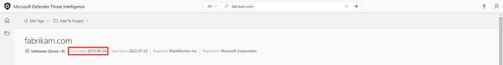

- When was the last time it was seen actively resolving to an IP address by Defender TI?
    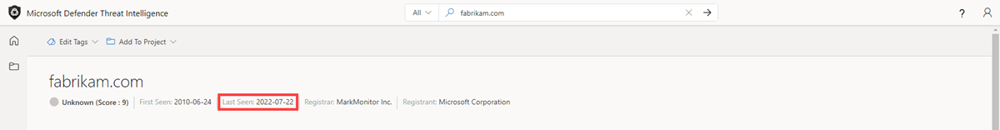

- What IP address(s) does it currently resolve to?
    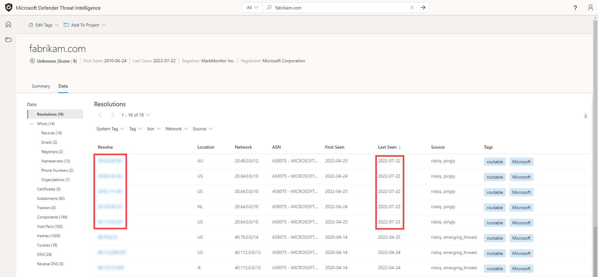
  
### IP Addresses
- Is the IP address routable?

    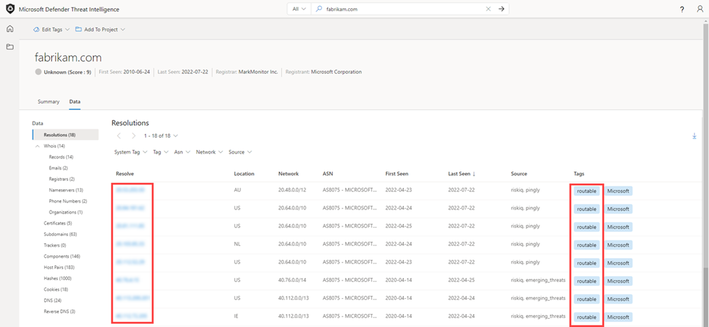

- What subnet is it part of?

    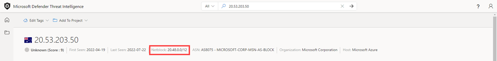

- Is there an owner associated with the subnet?
  
    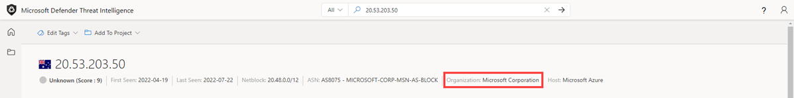

- What AS is it part of?

    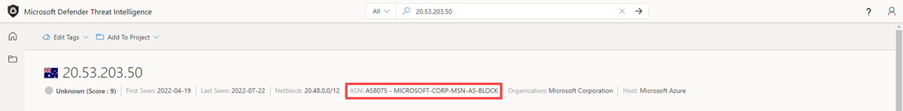

- What geolocation is there?
    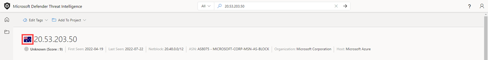

## Whois

Thousands of times a day, domains are bought and/or transferred between individuals and organizations. The process to make all of this happen is easy and only takes a few minutes and roughly $7 depending on the registrar provider. Beyond payment details, you must supply additional information about yourself, some of which gets stored as part of a Whois record once the domain has been set up. This would be considered a public domain registration. However, there are private domain registration services, where you can hide your personal information from your domain’s Whois record. In these situations, the domain owner’s information is safe and replaced by their registrar’s information. More actor groups are performing private domain registrations to make it more difficult for analysts to find other domains that they own. Defender TI provides a variety of data sets to find actors’ shared infrastructure when Whois records don’t provide leads.

Whois is a protocol that lets anyone query information about a domain, IP address, or subnet. One of the most common functions for Whois in threat infrastructure research is to identify or connect disparate entities based on unique data shared within Whois records. If you were reading carefully or ever purchased a domain yourself, you may have noticed that the content requested from the registrars is never verified. In fact, you could have put anything in the record (and a lot of people do) which would then be displayed to the world.

Each Whois record has several different sections, all of which could include different information. Commonly found sections include “registrar”, “registrant”, “administrator”, and “technical” with each potentially corresponding to a different contact for the record. A lot of the time this data is duplicated across sections, but in some cases, there may be slight discrepancies, especially if an actor made a mistake. When viewing Whois information within Defender TI, you will see a condensed record that de-duplicates any data and notates which part of the record it came from. We have found this process greatly speeds up the analyst workflow and avoids any overlooking of data. The Defender TI's Whois information is powered by the WhoisIQ™ database.

Our Whois data includes the following:
- **Record Updated:** a timestamp that indicates the day a Whois record was last updated.
- **Last Scanned:** the date that the Defender TI system last scanned the record.
- **Expiration:** the expiration date of the registration, if available.
- **Created:** the age of the current Whois record.
- **Whois Server:** the server is set-up by an ICANN accredited registrar to acquire up-to-date information about domains that are registered within it. 
- **Registrar:** the registrar service used to register the artifact.
- **Domain Status:** the current status of the domain. An ”active" domain is live on the internet. 
- **Email:** any email addresses found in the Whois record, and the type of contact each one is associated with (e.g. admin, tech).
- **Name:** the name of any contacts within the record, and the type of contact each is associated with.
- **Organization:** the name of any organizations within the record, and the type of contact each is associated with.
- **Street:** any street addresses associated to the record, and the type of contact it is associated with.
- **City:** any city listed in an address associated to the record, and the type of contact it is associated with.
- **State:** any states listed in an address associated to the record, and the type of contact it is associated with.
- **Postal Code:** any postal codes listed in an address associated to the record, and the type of contact it is associated with.
- **Country:** any countries listed in an address associated to the record, and the type of contact it is associated with.
- **Phone:** any phone numbers listed in the record, and the type of contact it is associated with.
- **Name Servers:** any name servers associated to the registered entity.

## Current Whois lookups

Defender TI’s current Whois repository highlights all domains in Microsoft’s Whois collection that are currently registered and associated with the Whois attribute of interest. This data highlights the domain's registration and expiration date, along with the email address used to register the domain. This data is displayed in the Whois Search tab of the platform.

## Historical Whois lookups

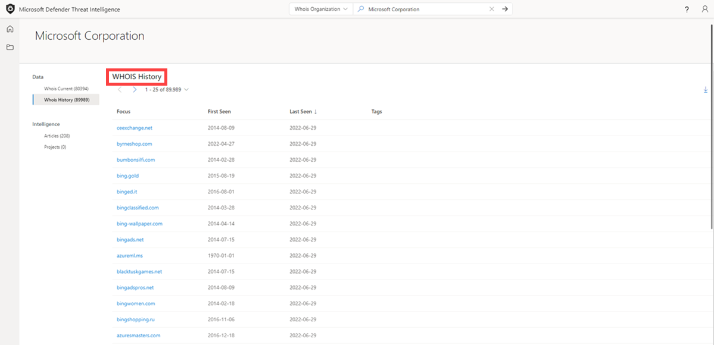

Defender TI’s Whois History repository provides users with access to all known historical domain associations to Whois attributes based on the system’s observations. This data set highlights all domains associated with an attribute that a user pivots from displaying the first time and the last time we observed the association between the domain and attribute queried. This data is displayed in a separate tab next to the current Whois Search tab.

**Questions this data set may help answer:**

- How old is the domain?

    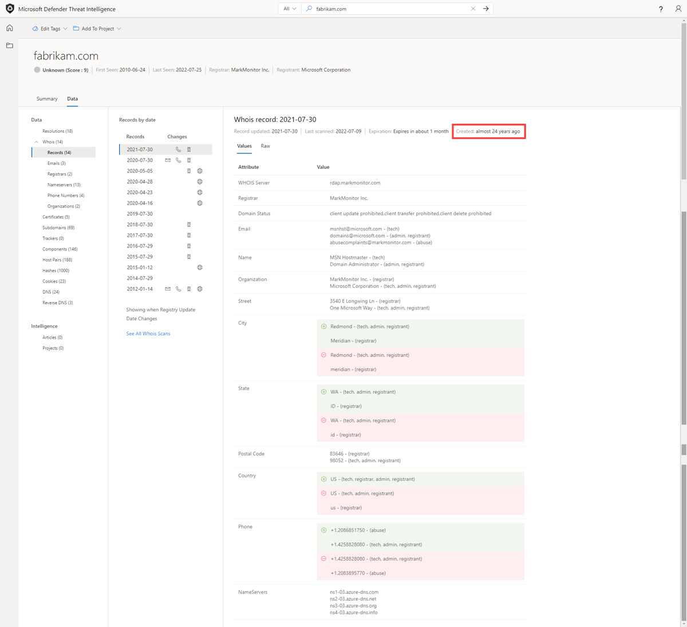

- Does the information appear to be privacy protected?

    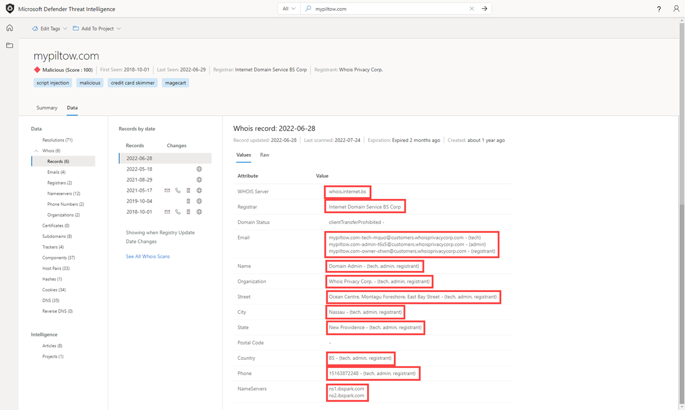

- Does any of the data appear to be unique?

    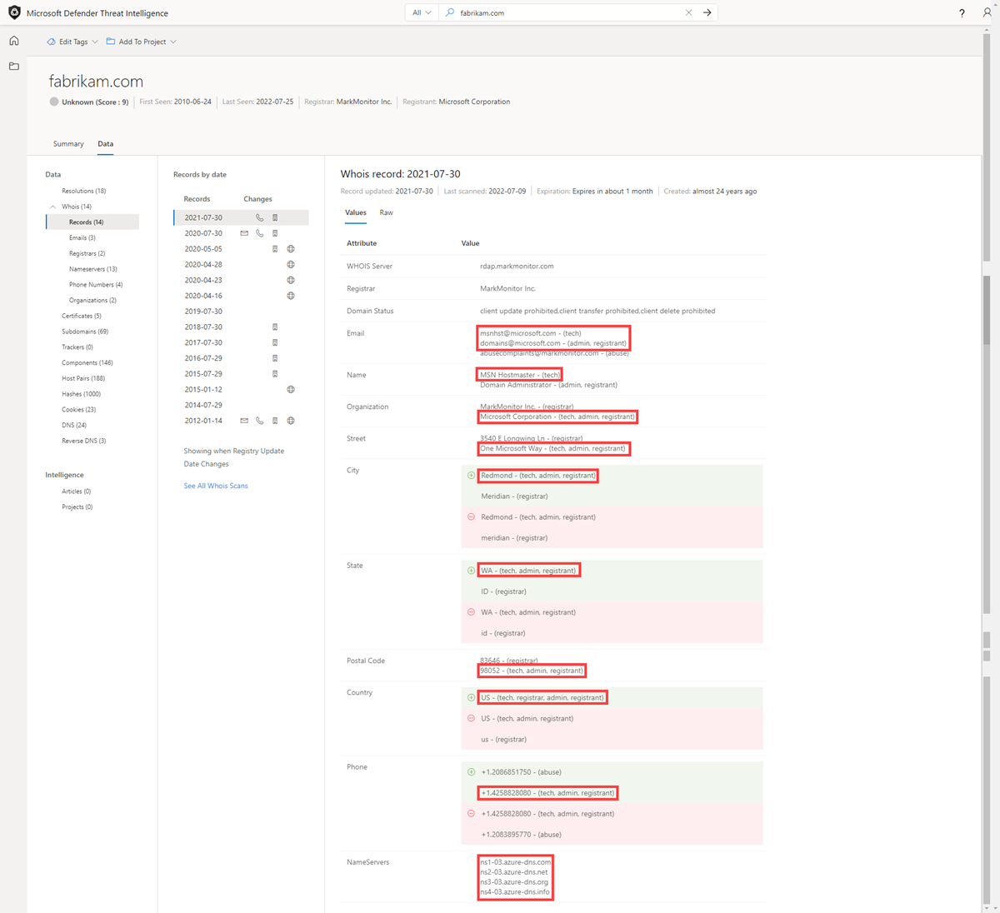

- What name servers are used?

    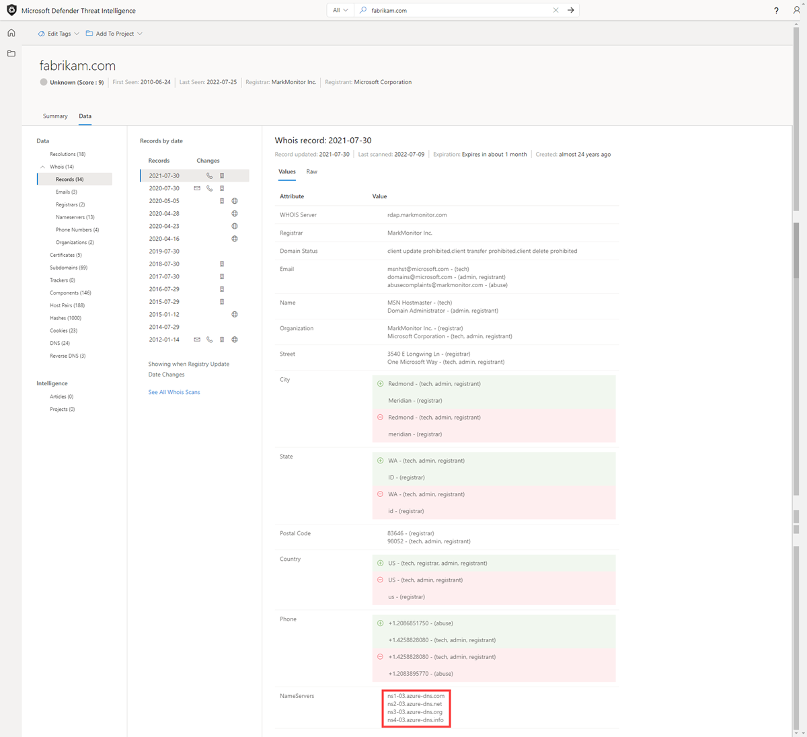

- Is this a sinkhole domain?

    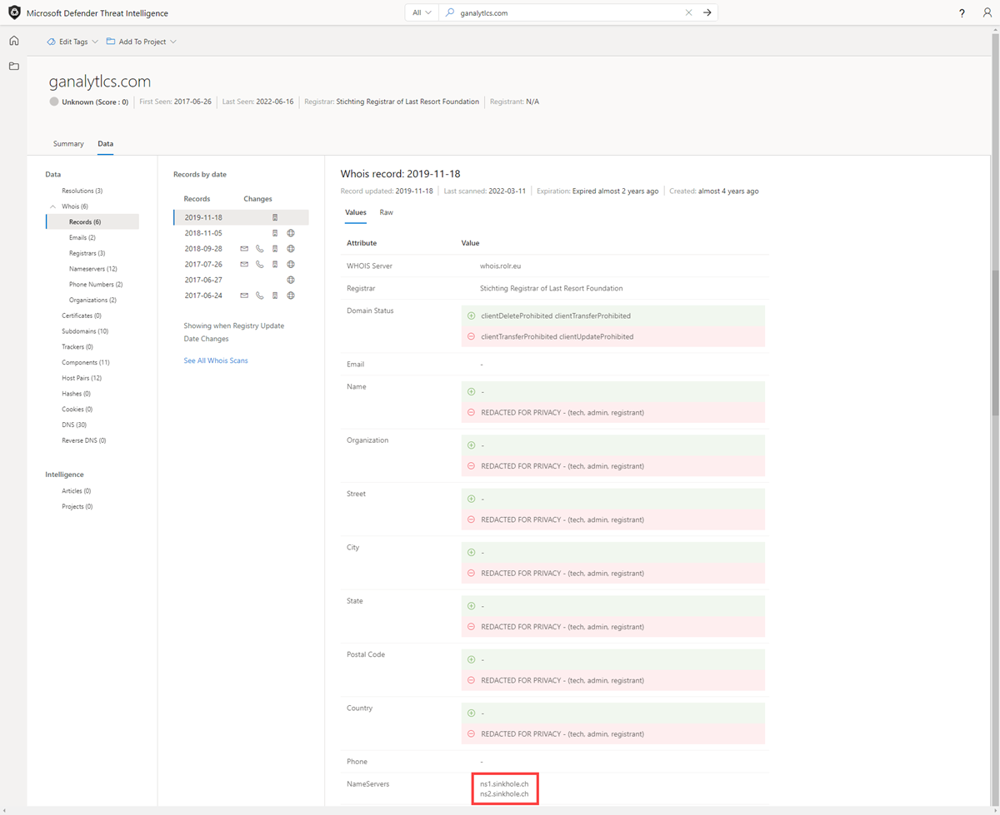

- Is this a parked domain?

    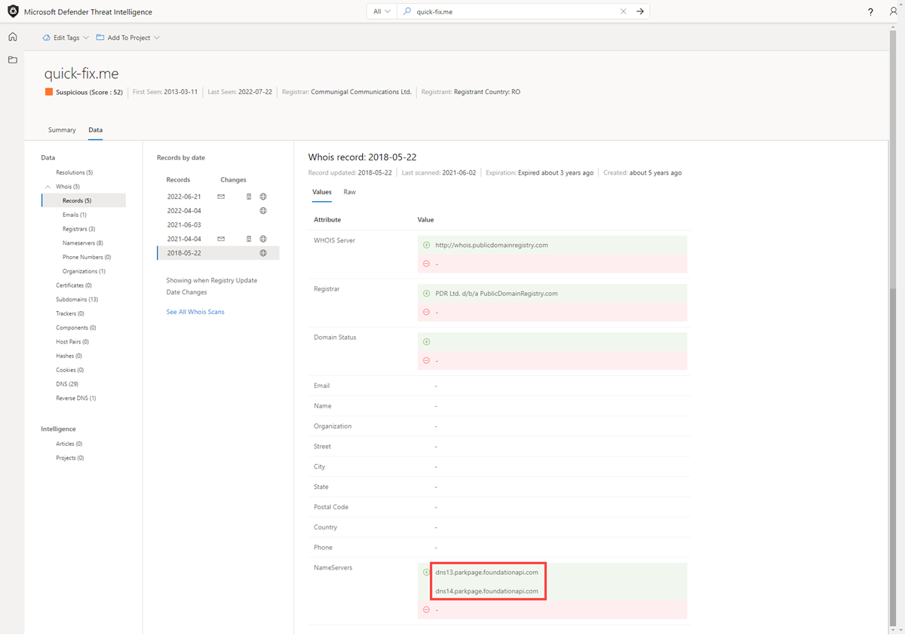

- Is this a honeypot domain?

    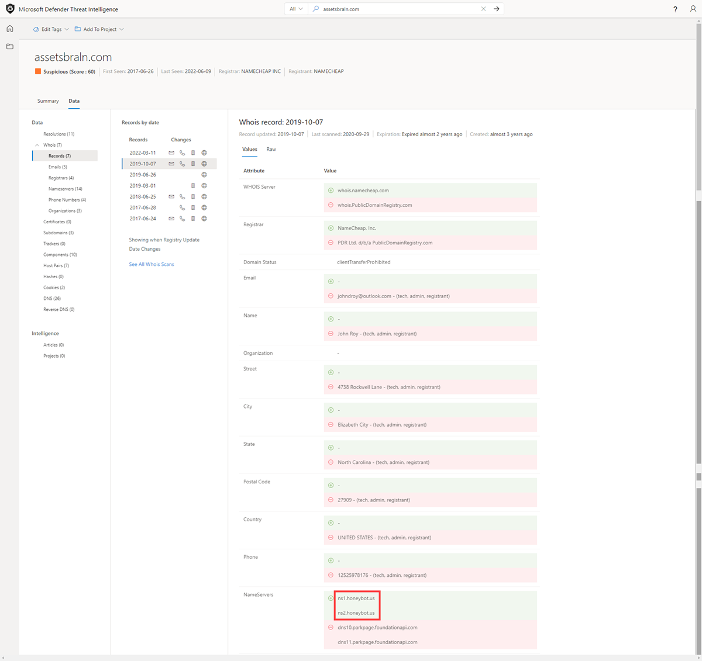

- Is there any history?

    

- Are there any fake privacy protection emails?

    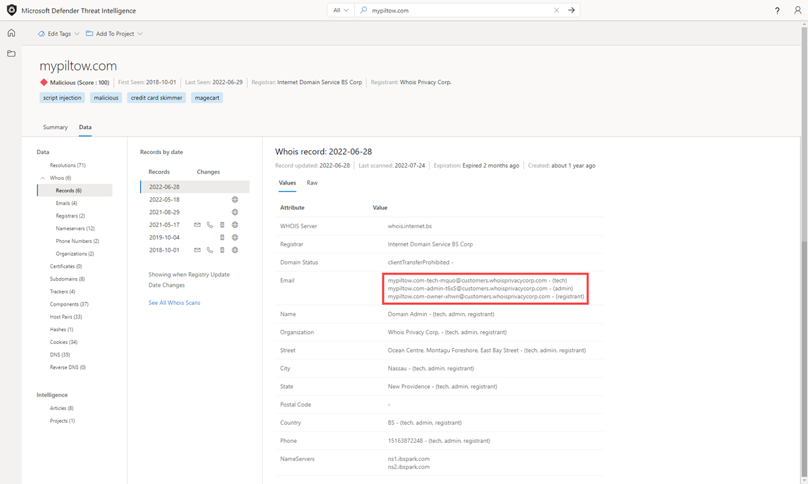

- Are there any fake names in the Whois record?

- Did you identify additional related IOCs from searching against potentially shared Whois values across domains?

    

## Certificates
Beyond securing your data, SSL Certificates are a fantastic way for users to connect disparate network infrastructure. Modern scanning techniques allow us to perform data requests against every node on the Internet in a matter of hours, meaning we can easily associate a certificate to an IP address hosting it on a regular basis.

Much like a Whois record, SSL certificates require information to be supplied by the user to generate the final product. Aside from the domain, the SSL certificate is being created for (unless self-signed), any of the additional information can be made up by the user. Where Microsoft’s users see the most value from SSL certificates is not necessarily the unique data someone may use when generating the certificate, but where it's hosted.

To access an SSL certificate, it needs to be associated with a web server and exposed through a particular port (most often 443). Using mass Internet scans on a weekly basis, it's possible to scan all IP addresses and obtain any certificate being hosted to build a historic repository of certificate data. Having a database of IP addresses to SSL certificate mappings provides users with a way to identify overlaps in infrastructure.

To further illustrate this concept, imagine an actor has set up a server with a self-signed SSL certificate. After several days, defenders become wise to their infrastructure and block the webserver hosting malicious content. Instead of destroying all their hard work, the actor merely copies all the contents (including the SSL certificate) and places them on a new server. As a user, a connection can now be made using the unique SHA-1 value of the certificate to say that both web servers (one blocked, one unknown) are connected in some way.

What makes SSL certificates more valuable is that they are capable of making connections that passive DNS or Whois data may miss. This means more ways of correlating potential malicious infrastructure and identifying potential operational security failures of actors. Defender TI has collected over 30 million certificates from 2013 until the present day and provides users with the tools to make correlations on certificate content and history.

SSL certificates are files that digitally bind a cryptographic key to a set of user-provided details. Using internet-scanning techniques, Defender TI collects SSL certificate associations from IP addresses on various ports. These certificates are stored inside of a local database and allow us to create a timeline for where a given SSL certificate appeared on the Internet.

Our certificate data includes the following:

- **Sha1:** The SHA1 algorithm hash for an SSL Cert asset.
- **First Seen:** a timestamp that displays the date that we first observed this certificate on an artifact.
- **Last Seen:** a timestamp that displays the date that we last observed this certificate on an artifact.
- **Infrastructure:** any related infrastructure associated with the certificate.

When a user expands on a SHA1 hash, the user will be able to see details about the following, which includes:**
- **Serial Number:** The serial number associated with an SSL certificate.
- **Issued:** The date when a certificate was issued.
- **Expires:** The date when a certificate will expire.
- **Subject Common Name:** The Subject Common Name for any associated SSL Certs.
- **Issuer Common Name:** The Issuer Common Name for any associated SSL Certs.
- **Subject Alternative Name(s):** Any alternative common names for the SSL Cert.
- **Issuer Alternative Name(s):** Any additional names of the issuer.
- **Subject Organization Name:** The organization linked to the SSL certificate registration.
- **Issuer Organization Name:** The name of the organization that orchestrated the issue of a certificate.
- **SSL Version:** The version of SSL that the certificate was registered with.
- **Subject Organization Unit:** Optional metadata that indicates the department within an organization that is responsible for the certificate.
- **Issuer Organization Unit:** Additional information about the organization issuing the certificate.
- **Subject Street Address:** The street address where the organization is located.
- **Issuer Street Address:** The street address where the issuer organization is located.
- **Subject Locality:** The city where the organization is located.
- **Issuer Locality:** The city where the issuer organization is located.
- **Subject State/Province:** The state or province where the organization is located.
- **Issuer State/Province:** The state or province where the issuer organization is located.
- **Subject Country:** The country where the organization is located.
- **Issuer Country:** The country where the issuer organization is located.
- **Related Infrastructure:** any related infrastructure associated with the certificate.

**Questions this data set may help answer:**

- What other infrastructure has this certificate been observed associated with?

    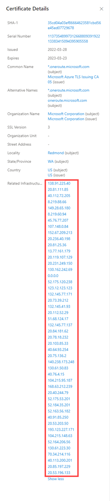

- Are there any unique data points in the certificate that would serve as good pivot points?

    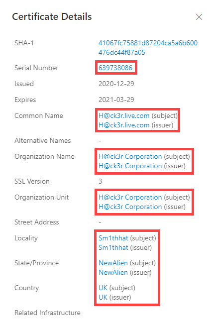

- Is the certificate self-signed?

    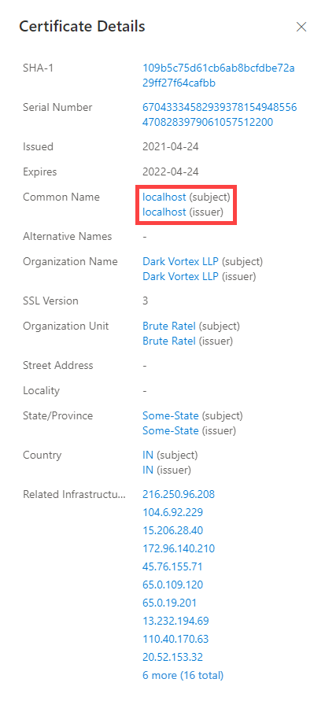

- Is the certificate from a free provider?

    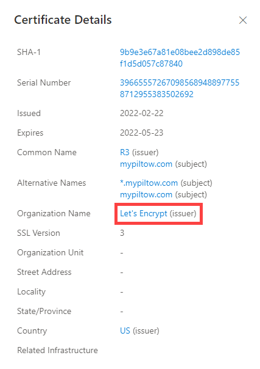

- Over what timeframe has the certificate been observed in use?

    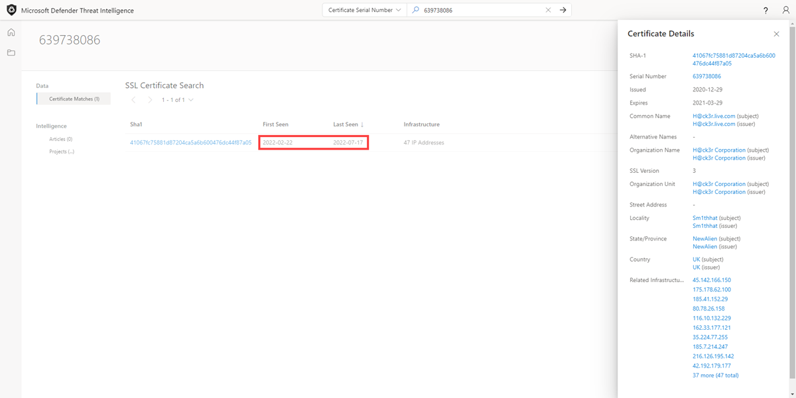

## Subdomains

A subdomain is an internet domain, which is part of a primary domain. Subdomains are also referred to as "hosts". As an example,`learn.microsoft.com` is a subdomain of `microsoft.com`. For every subdomain, there could be a new set of IP addresses to which the domain resolves to and this can be a great data source for finding related infrastructure.

Our subdomain data includes the following:

- **Hostname:** the subdomain associated with the domain that was searched.
- **Tags:** any tags applied to this artifact in the Defender TI system.

**Questions this data set may help answer:**

- Are there more subdomains associated with the higher-level domain?

    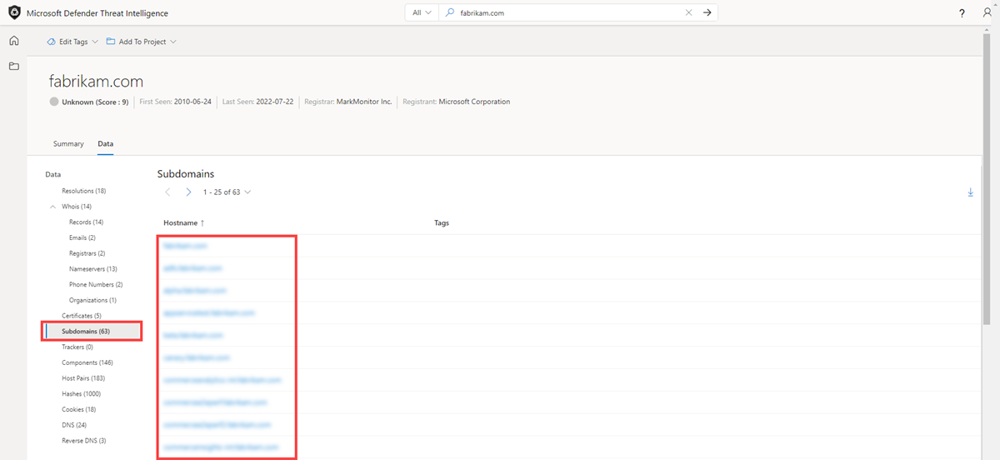

- Are any subdomains associated with malicious activity?

    

- If this is your domain, do any subdomains look unfamiliar?

- Is there any pattern to the subdomains that are listed associated with other malicious domains?

- Does pivoting off each subdomain reveal new IP space not previously associated with the target?

- What other unrelated infrastructure can you find that does not match the root domain?

## Trackers

Trackers are unique codes or values found within web pages and often used to track user interaction. These codes can be used to correlate a disparate group of websites to a central entity. Often, actors will copy the source code of a victim’s website they are looking to impersonate for a phishing campaign. Seldomly will actors take the time to remove these IDs that allow users to identify these fraudulent sites using Microsoft’s Trackers data set. Actors may also deploy tracker IDs to see how successful their cyber-attack campaigns are. This is similar to marketers when they leverage SEO IDs, such as a Google Analytics Tracker ID, to track the success of their marketing campaign.

Microsoft’s Tracker data set includes IDs from providers like Google, Yandex, Mixpanel, New Relic, Clicky, and is continuing to grow on a regular basis.

Our tracker data includes the following:

- **Hostname:** the hostname that hosts the infrastructure where the tracker was detected.
- **First Seen:** a timestamp that displays the date that we first observed this tracker on the artifact.
- **Last Seen:** a timestamp that displays the date that we last observed this tracker on the artifact.
- **Type:** the type of tracker that was detected (e.g. GoogleAnalyticsID, JarmHash).
- **Value:** the identification value for the tracker.
- **Tags:** any tags applied to this artifact in the Defender TI system.

**Questions this data set may help answer:**

- Are there other resources using the same analytics IDs?

    

- Are these resources associated with the organization, or are they attempting to conduct an infringement attack?

- Is there any overlap between trackers–are they shared with other websites?

- What are the types of trackers found within the web page?

    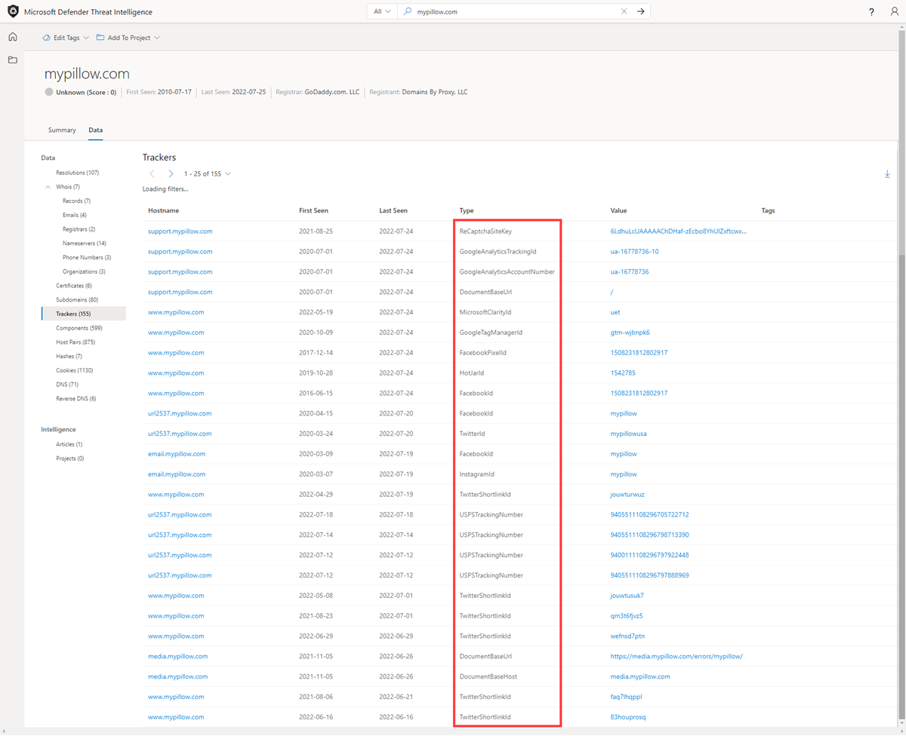

- What is the length of time for trackers?

    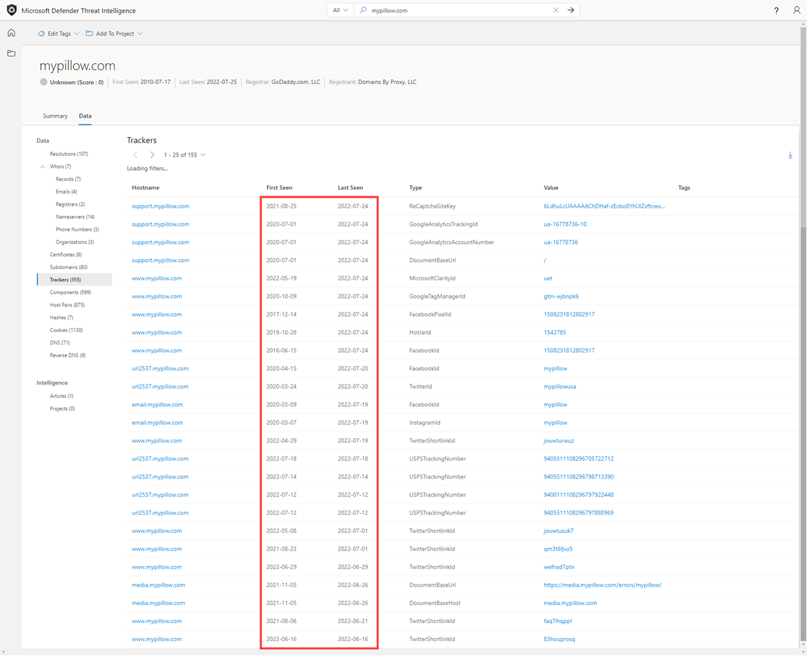

- What is the frequency of change for tracker values– do they come, go, or remain?

- Are there any trackers linking to website cloning software (MarkOfTheWeb or HTTrack)?

    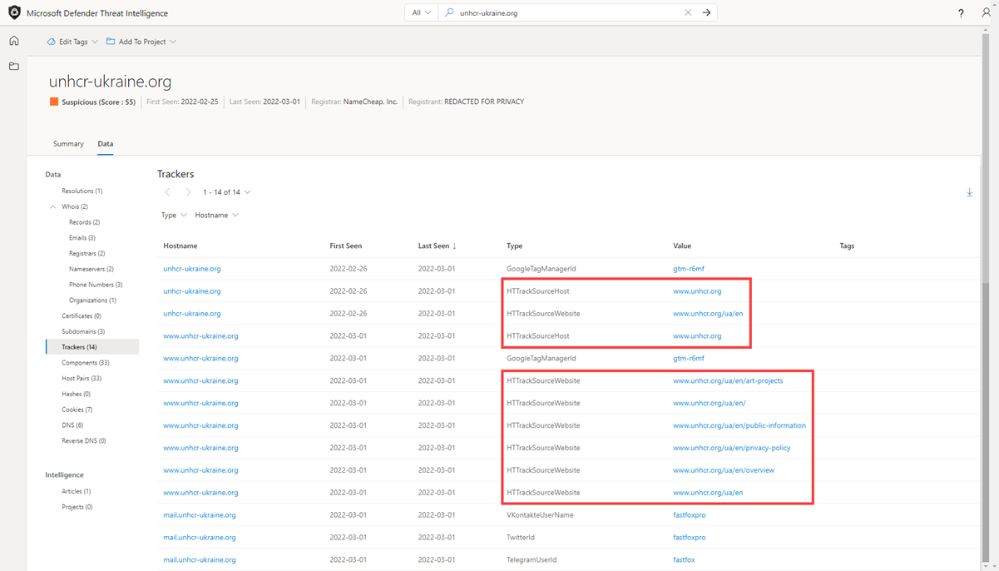

- Are there any trackers linking to malicious C2 server malware (JARM)?

    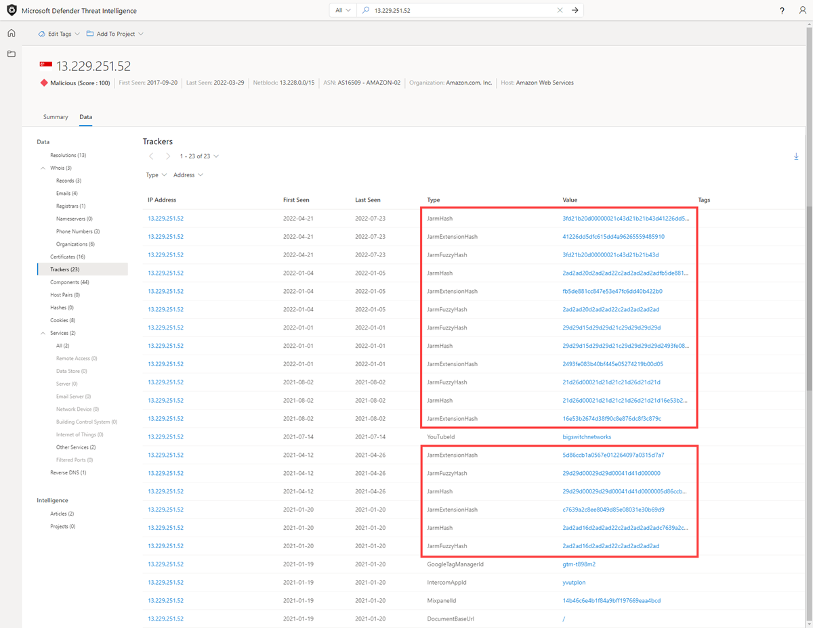

## Components

Web components are details describing a web page or server infrastructure gleaned from Microsoft performing a web crawl or scan. These components allow a user to understand the makeup of a webpage or the technology and services driving a specific piece of infrastructure.
Pivoting on unique components can find actors' infrastructure or other sites that are compromised. Users can also understand if a website might be vulnerable to a specific attack or compromise based on the technologies that it is running.

Our component data includes the following:

- **Hostname:** the hostname that hosts the infrastructure where the component was detected.
- **First Seen:** a timestamp of the date that we first observed this component on the artifact.
- **Last Seen:** a timestamp of the date that we last observed this component on the artifact.
- **Category:** the type of component that was detected (e.g. Operating System, Framework, Remote Access, Server).
- **Name + Version:** the component name and the version running on the artifact (e.g. Microsoft IIS (v8.5).
- **Tags:** any tags applied to this artifact in the Defender TI system.

**Questions this data set may help answer:**

- What vulnerable infrastructure are you using?

    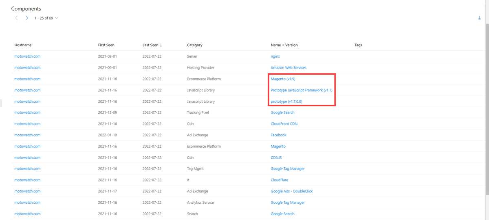

    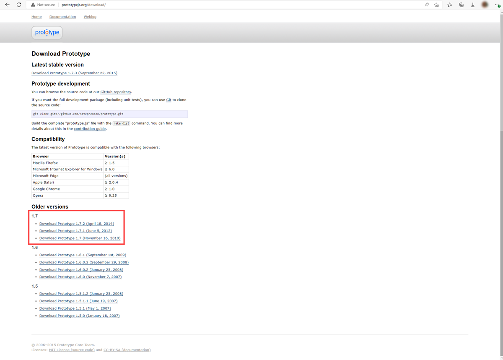

    Magento v1.9 is so dated that Microsoft could not locate reliable documentation for that particular version.

- What unique web components is the threat actor using that can track them to other domains?

- Are any components marked as malicious?

- What is the number of web components identified?

    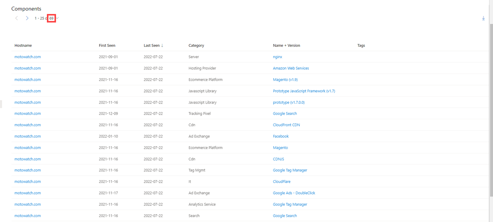

- Are there any unique or strange technologies not often seen?

    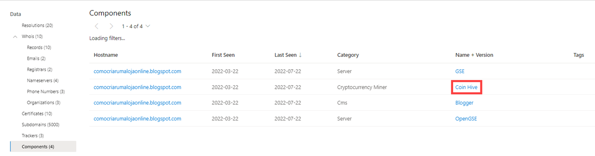

- Are there any fake versions of specific technologies?

- What is the frequency of changes in web components–often or rarely done?

- Are there any suspicious libraries known to be abused?

- Are there any technologies with vulnerabilities associated with them?

## Host pairs

Host pairs are two pieces of infrastructure (a parent and a child) that share a connection observed from a virtual user’s web crawl. The connection could range from a top-level redirect (HTTP 302) to something more complex like an iframe or script source reference.

Our host pair data includes the following:

- **Parent Hostname:** the host that is referencing an asset or “reaching out” to the child host
- **Child Hostname:** the host that is being called on by the parent host
- **First Seen:** a timestamp of the date that we first observed a relationship with the host.
- **Last Seen:** a timestamp of the date that we last observed a relationship with the host.
- **Cause:** the type of connection between the parent and child hostname. Potential causes include script.src, link.href, redirect, img.src, unknown, xmlhttprequest, a.href, finalRedirect, css.import, or parentPage connections.
- **Tags:** any tags applied to this artifact in the Defender TI system.

**Questions this data set may help answer:**

- Have any of the connected artifacts been blocklisted?
- Have any of the connected artifacts been tagged (Phishing, APT, Malicious, Suspicious, Threat Actor Name)?
- Is this host redirecting users to malicious content?

    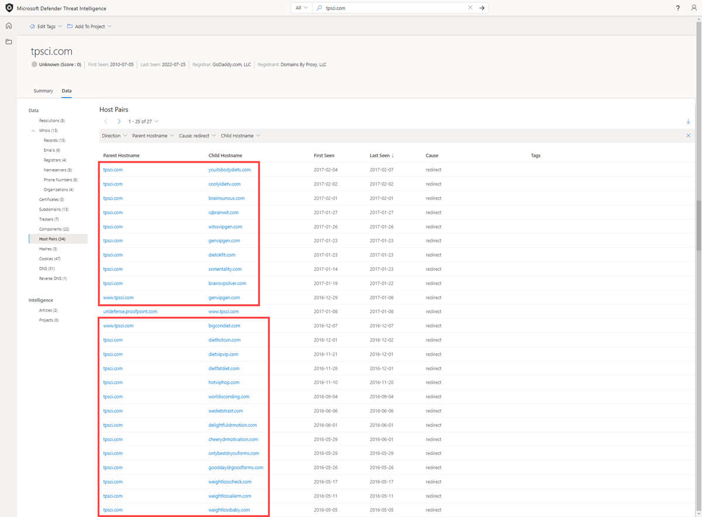

- Are resources pulling in CSS or images to set up infringement attacks?

    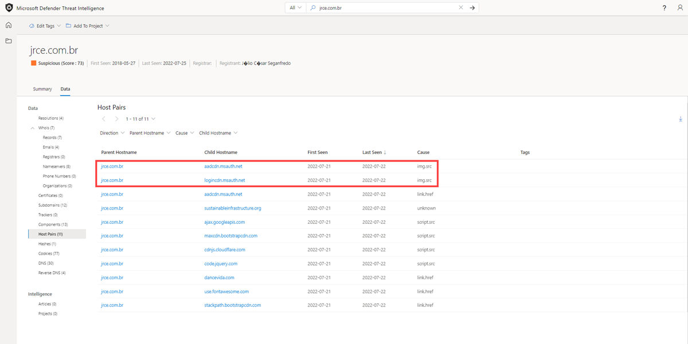

- Are resources pulling in a script or referencing a link.href to set up a Magecart or skimming attack?
    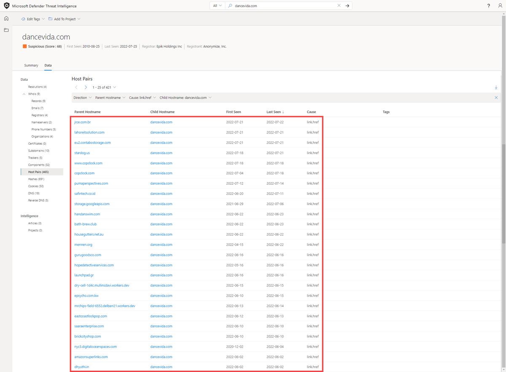

- Where are users being redirected from/to?

- What type of redirection is taking place?

## Cookies

Cookies are small pieces of data sent from a server to a client as the user browses the internet. These values sometimes contain a state for the application or little bits of tracking data. Defender TI highlights and indexes cookie names observed when crawling a website and allows users to dig into everywhere we have observed specific cookie names across its crawling and data collection. Cookies are also used by malicious actors to keep track of infected victims or store data to be used later.

Our cookie data includes the following:

- **Hostname:** the host infrastructure that is associated with the cookie.
- **First Seen:** a timestamp of the date that we first observed this cookie on the artifact.
- **Last Seen:** a timestamp of the date that we last observed this cookie on the artifact.
- **Name:** the name of the cookie (e.g. JSESSIONID, SEARCH_NAMESITE).
- **Domain:** the domain associated with the cookie.
- **Tags:** any tags applied to this artifact in the Defender TI system.

**Questions this data set may help answer:**

- What other websites are issuing the same cookies?

    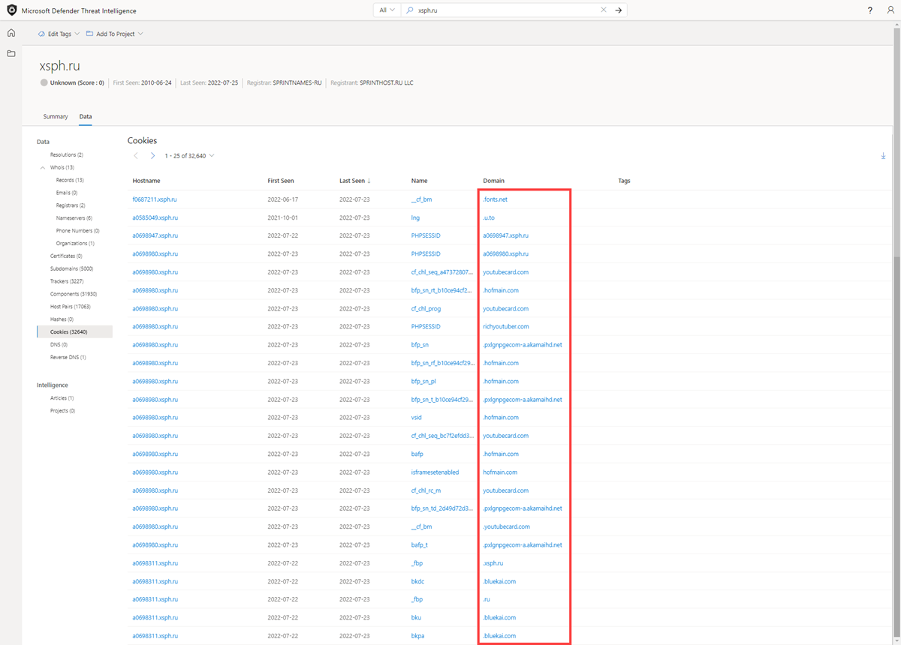

- What other websites are tracking the same cookies?
    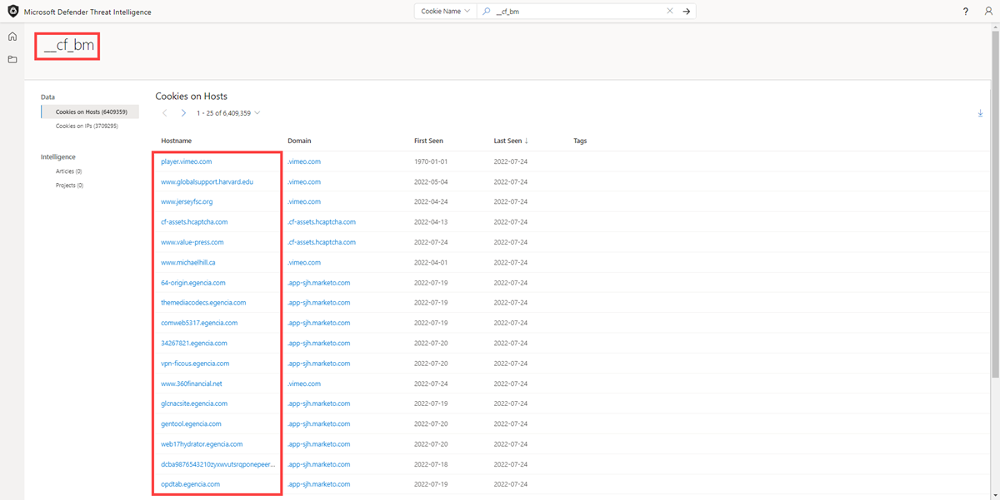

- Does the cookie domain match your query?

- What is the number of cookies associated with the artifact?

    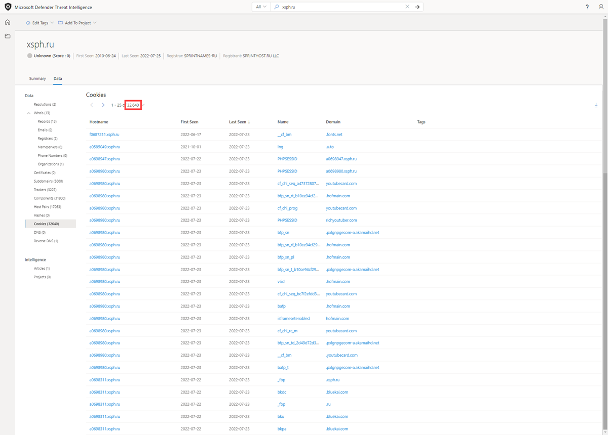

- Are there unique cookie names or domains?

- What are the time periods associated with cookies?

- What is the frequency of newly observed cookies or changes associated with cookies?

## Services

Service names and port numbers are used to distinguish between different services that run over transport protocols such as TCP, UDP, DCCP, and SCTP. Port numbers can suggest what type of application is running on a particular port. But applications or services can be changed to use a different port to obfuscate or hide the service or application on an IP address. Knowing the port and header/banner information can identify the true application/service and the combination of ports being used. Defender TI surfaces 14 days of history within the Services tab, displaying the last banner response associated with a port observed.

Our Services data includes the following:

- Open ports observed
- Port numbers
- Components
- Number of times the service was observed
- When the port was last scanned
- Protocol connection
- Status of the port
  - Open
  - Filtered
  - Closed
- Banner response

**Questions this data set may help answer:**

- What applications are running on a particular port for a given IP address?

    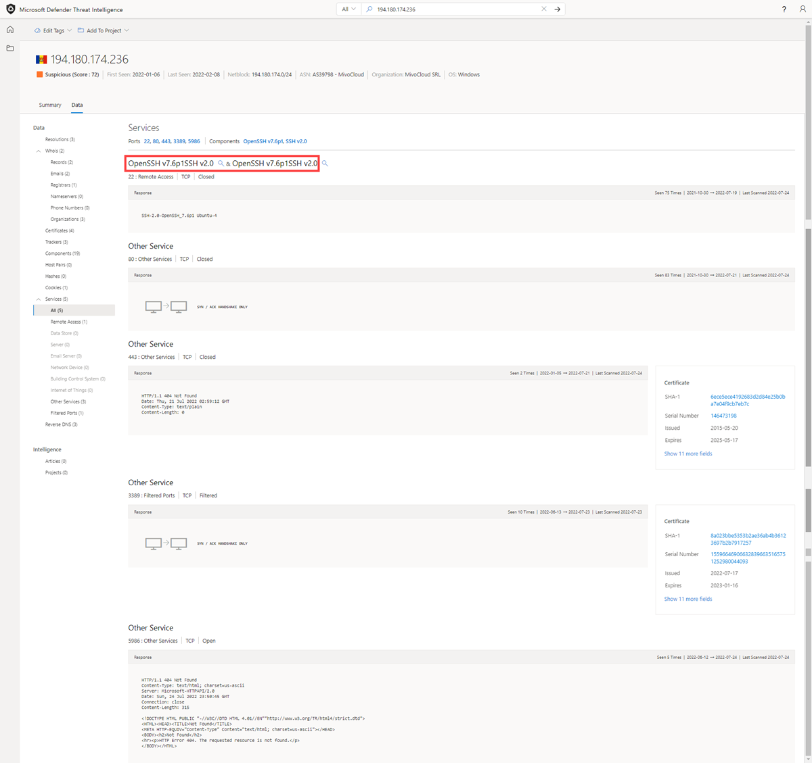

- What version of applications are in use?

    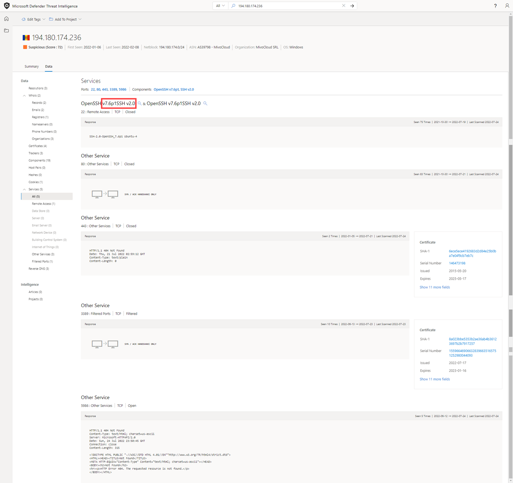

- Have there been recent changes in the open, filtered, or closed status for a given port?

    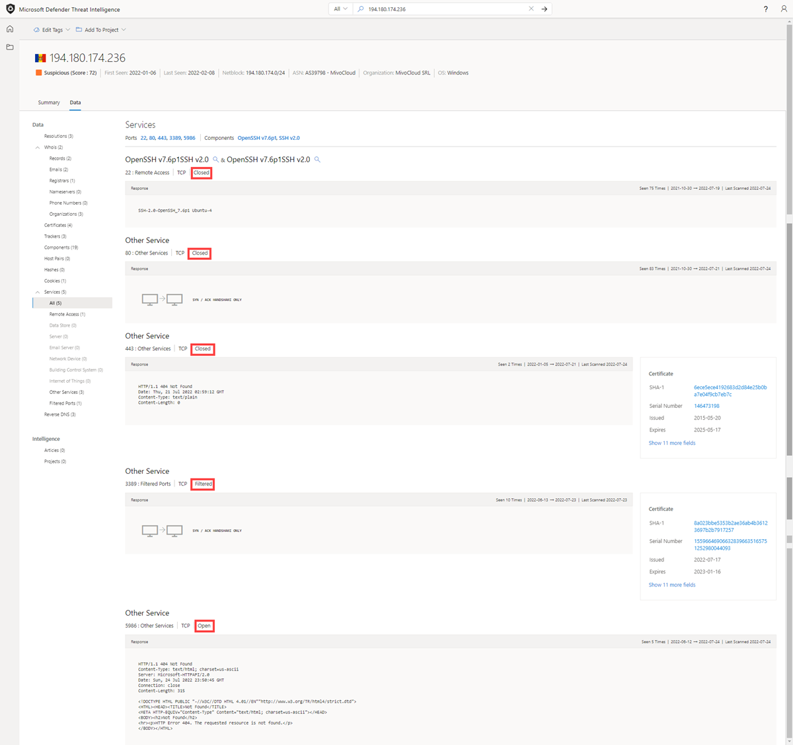

- Was a certificate associated with the connection?

    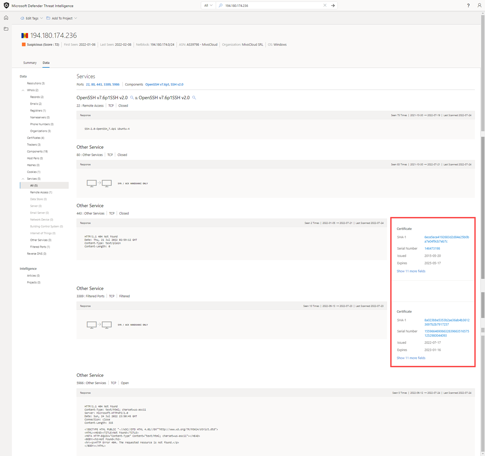

- Are vulnerable or deprecated technologies in use on a given asset?

    

    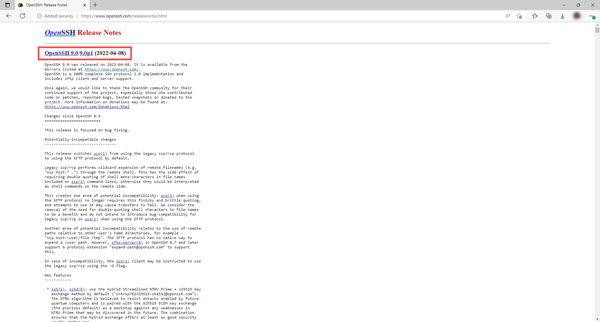

- Is information being exposed by a running service that could be used for nefarious purposes?

- Are security best practices being followed?

## DNS

Microsoft has been collecting DNS records over the years, providing users insight into mail exchange (MX) records, nameserver (NS) records, text (TXT) records, start of authority (SOA) records, canonical name (CNAME) records, and pointer (PTR) records. Reviewing DNS records can be helpful to identify shared infrastructure used by actors across the domains they own. For example, actor groups tend to use the same nameservers to segment their infrastructure or the same mail exchange servers to administer their command and control.

Our DNS data includes the following:

- **Value:** the DNS record associated with the host.
- **First Seen:** a timestamp that displays the date that we first observed this record on the artifact.
- **Last Seen:** a timestamp that displays the date that we last observed this record on the artifact.
- **Type:** the type of infrastructure associated with the record. Potential options include Mail Servers (MX), text files (TXT), name servers (NS), CNAMES, and Start of Authority (SOA) records.
- **Tags:** any tags applied to this artifact in the Defender TI system.

 

**Questions this data set may help answer:**

- What other pieces of infrastructure are directly related to the indicator I am searching?
- How has the infrastructure changed over time?
- Is the domain owner employing the services of a content delivery network or brand protection service?
- What other technologies might the associated organization be employing within their network?

## Reverse DNS

While a forward DNS lookup queries the IP address of a certain hostname, a reverse DNS lookup queries a specific hostname of an IP address. This dataset will show similar results as the DNS dataset. Reviewing DNS records can be helpful to identify shared infrastructure used by actors across the domains they own. For example, actor groups tend to use the same nameservers to segment their infrastructure or the same mail exchange servers to administer their command and control.

Our Reverse DNS data includes the following:

- **Value:** the value of the Reverse DNS record.
- **First Seen:** a timestamp of the date that we first observed this record on the artifact.
- **Last Seen:** a timestamp of the date that we first observed this record on the artifact.
- **Type:** the type of infrastructure associated with the record. Potential options include Mail Servers (MX), text files (TXT), name servers (NS), CNAMES, and Start of Authority (SOA) records.
- **Tags:** any tags applied to this artifact in the Defender TI system.

**Questions This Data Set May Help Answer:**

- What DNS records have observed this host?
- How has the infrastructure that observed this host changed over time?

## Next steps

For more information, see:

- [Searching and pivoting](searching-and-pivoting.md)
- [Sorting, filtering, and downloading data](sorting-filtering-and-downloading-data.md)
- [Infrastructure chaining](infrastructure-chaining.md)
- [Tutorial: Gathering threat intelligence and infrastructure chaining](gathering-threat-intelligence-and-infrastructure-chaining.md)
