--- 
title: 'Tutorial: Gathering Threat Intelligence and Infrastructure Chaining using Microsoft Defender Threat Intelligence (Defender TI)'
description: 'In this tutorial, learn how to gather threat intelligence and infrastructure chain together indicators of compromise in Microsoft Defender Threat Intelligence (Defender TI). This article will cover a historical investigation of the MyPillow Magecart breach.'
author: alexroland24
ms.author: aroland
manager: dolmont
ms.service: threat-intelligence 
ms.topic: tutorial
ms.date: 08/02/2022
ms.custom: template-tutorial
---

# Tutorial: Gathering threat intelligence and infrastructure chaining

In this tutorial, you will learn how to:
- Perform several types of indicator searches and gather threat and adversary intelligence

  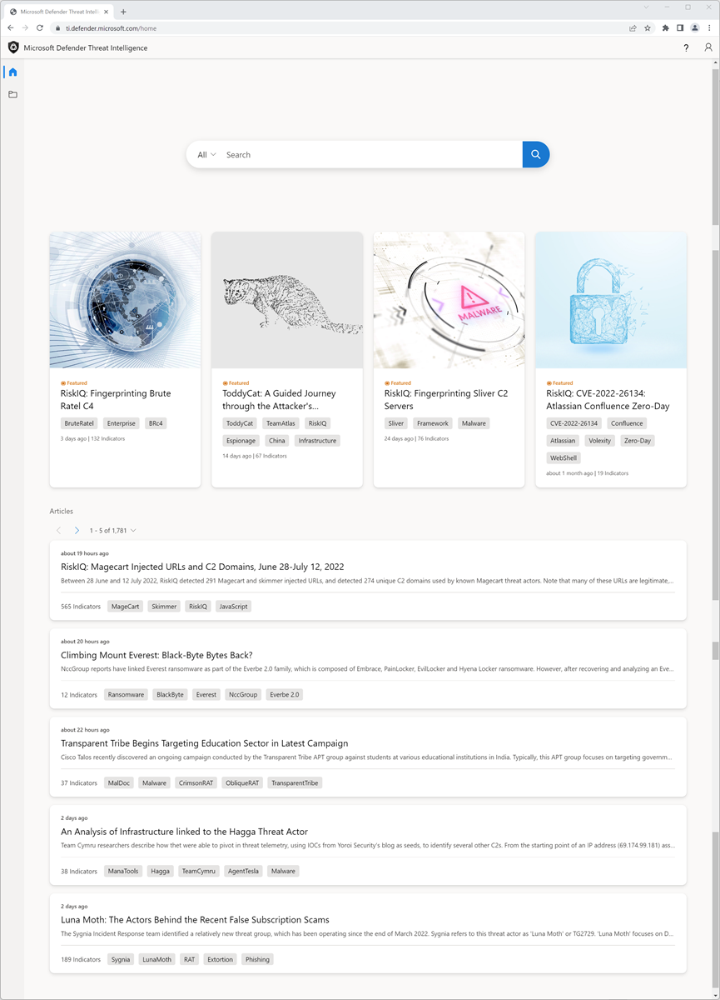

## Prerequisites

- An Azure Active Directory or personal Microsoft account. [Login or create an account](https://signup.microsoft.com/)
- A Microsoft Defender Threat Intelligence (Defender TI) Premium license.

    > [!NOTE]
    > Users without a Defender TI Premium license will still be able to log into the Defender Threat Intelligence Portal and access our free Defender TI offering.

## Disclaimer

Microsoft Defender Threat Intelligence (Defender TI) may include live, real-time observations and threat indicators, including malicious infrastructure and adversary-threat tooling. Any IP and domain searches within our Defender TI platform are safe to search.

Microsoft will share online resources (e.g., IP addresses, domain names) that should be considered real threats posing a clear and present danger.

We ask that users use their best judgment and minimize unnecessary risk while interacting with malicious systems when performing the tutorial below. Please note that Microsoft has worked to minimize risk by defanging malicious IP addresses, hosts, and domains.

## Before You Begin
As the disclaimer states above, suspicious, and malicious indicators have been defanged for your safety. Please remove any brackets from IPs, domains, and hosts when searching in Defender TI. Do not search these indicators directly in your browser.

## Perform several types of indicator searches and gather threat and adversary intelligence

In this tutorial, you will perform a series of steps to [infrastructure chain](infrastructure-chaining.md) together indicators of compromise (IOCs) related to a Magecart breach and gather threat and adversary intelligence along the way. Infrastructure chaining leverages the highly connected nature of the internet to expand one IOC into many based on overlapping details or shared characteristics. Building infrastructure chains enables threat hunters or incident responders to profile an adversary's digital presence, letting them quickly pivot across these data sets to create context around an incident or investigation, allowing for more effective triage of alerting and actioning of incidents within an organization.

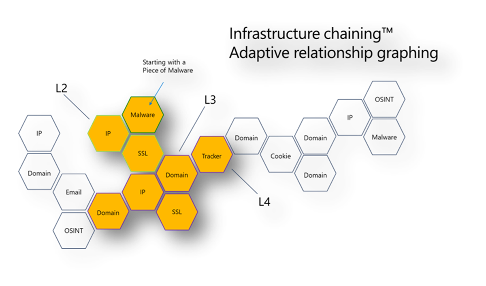

**Relevant Personas:** Threat Intelligence Analyst, Threat Hunter, Incident Responder, Security Operations Analyst

### Magecart Breach

Microsoft has been profiling and following the activities of Magecart, a syndicate of criminal cybergroups behind hundreds of breaches of online retail platforms by placing digital skimmers on compromised e-commerce sites.

They do this by injecting a script designed to steal sensitive data that consumers enter into online payment forms on e-commerce websites directly or through compromised third-party suppliers that websites might depend upon to make their sites function.

Back in October 2018, they infiltrated MyPillow’s online website, mypillow.com, to steal payment information by injecting a script into their web store that was hosted on a typo-squat domain containing the skimmer, mypiltow.com.

The MyPillow breach was a two-stage attack, with the first skimmer only active for a brief time before being identified as illicit and removed, but the attackers still had access to MyPillow’s network and on October 26, 2018, Microsoft observed that they registered a new domain, livechatinc[.]org

Magecart actors will typically register a domain infringement to make it look as similar as possible to the legitimate domain, so that if you’re looking at the JavaScript code, unless you look really carefully, you may not notice they injected their own script that’s capturing the credit card payment information and pushing it to their own infrastructure, as a way to hide essentially.
But because our virtual users capture the DOM and find all the dynamic links and changes made by JavaScript from the crawls on the backend, we were able to detect that activity and pinpoint that fake domain that was hosting the injected script into the MyPillow webstore.

1. Access the [Defender Threat Intelligence portal](https://ti.defender.microsoft.com/).
2. Complete Microsoft authentication to access portal.
3. Search ‘mypillow.com’ in Defender TI’s Threat Intelligence Home Page.
    a. What articles are associated with this domain?
    - Consumers May Lose Sleep Over These Two Magecart Breaches

      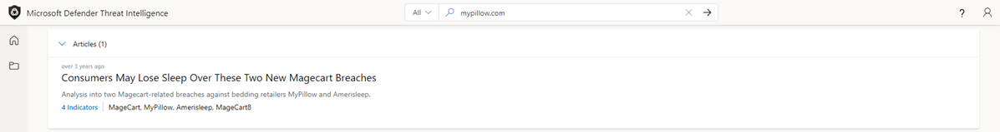

4. Select the ‘Consumers May Lose Sleep Over These Two Magecart Breaches’ Article.
    a. What information is available about this related campaign?
      - This article was published on March 20, 2019, and provides insights as to how MyPillow was breached by the Magecart threat actor group in October of 2018. The article details how the attack was executed.
5. Select the Public Indicators tab.
    a. What IOCs are listed related to this campaign?
      - amerisleep.github[.]io
      - cmytuok[.]top
      - livechatinc[.]org
      - mypiltow[.]com
6. Select All in the drop down of the search bar and query ‘mypillow.com’. Then, navigate to the Data tab.
    a. What data set might be useful in finding evidence of a script injection?
     - Host pairs reveal connections between websites traditional data sources wouldn’t surface (pDNS, Whois) and enables you to see where your resources are being used and vice-versa.
7. Select the Host Pairs Data blade, sort by First Seen, and filter by script.src as the Cause. Page over until you find host pair relationships that took place in October of 2018.
    a. Do you notice any typosquat mypillow domains?
      - Notice that mypillow[.]com is pulling content via a script from the typosquat, mypiltow.com (Oct 3-5) as evidence of the script injection breach

          
8. Pivot on ‘mypiltow[.]com’.
    a. At first glance, what appears different about this domain compared to mypillow.com’s domain?
      - Reputation: Malicious, while mypillow.com’s reputation is unknown

        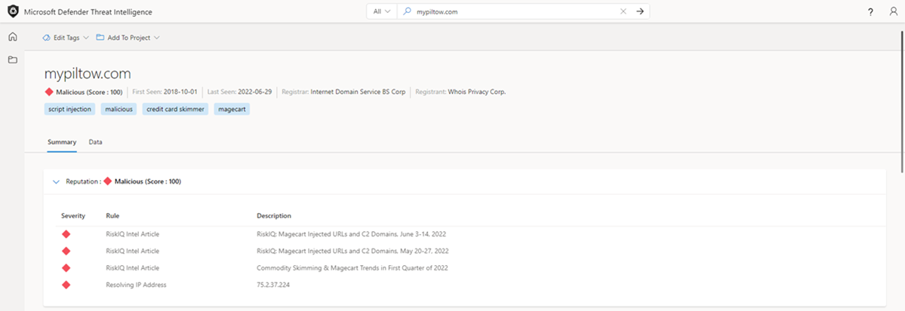

        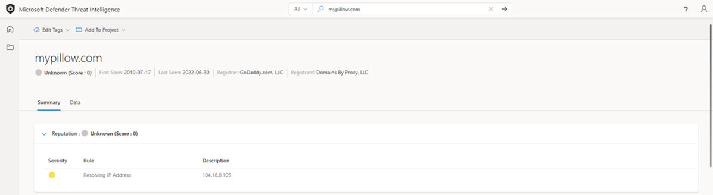
9. Navigate to the Data tab and from the Resolutions results, pivot off the IP address that mypiltow[.]com resolved to during October of 2018. Repeat this step for mypillow.com as well.
    a. What do you notice about the differences in IP addresses between mypillow.com and mypiltow[.]com during October of 2018?
      - IP address, 195.161.41[.]65, mypiltow[.]com had resolved to, is hosted in Russia.
      - Different ASN used.

          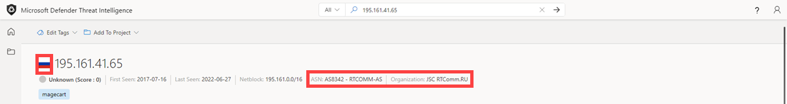

          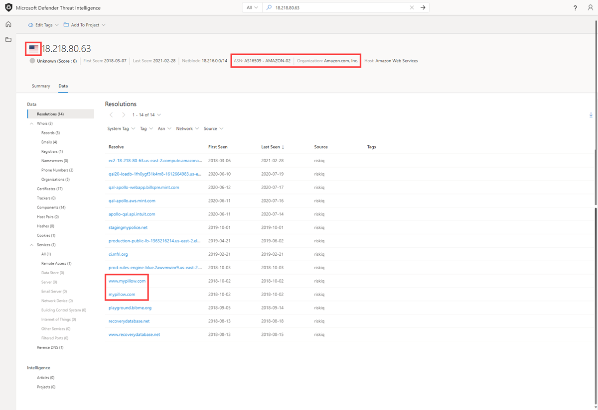
10. Scroll to the Articles section.
    a. What other Articles have been published that relate to mypiltow.com?
    - RiskIQ: Magecart Injected URLs and C2 Domains, June 3-14, 2022
    - RiskIQ: Magecart injected URLs and C2 Domains, May 20-27, 2022
    - Commodity Skimming & Magecart Trends in First Quarter of 2022
    - RiskIQ: Magecart Group 8 Activity in Early 2022
    - Magecart Group 8 Real Estate: Hosting Patterns Associated with the Skimming Group
    - Inter Skimming Kit Used in Homoglyph Attacks
    - Magecart Group 8 Blends into NutriBullet.com Adding To Their Growing List of Victims

     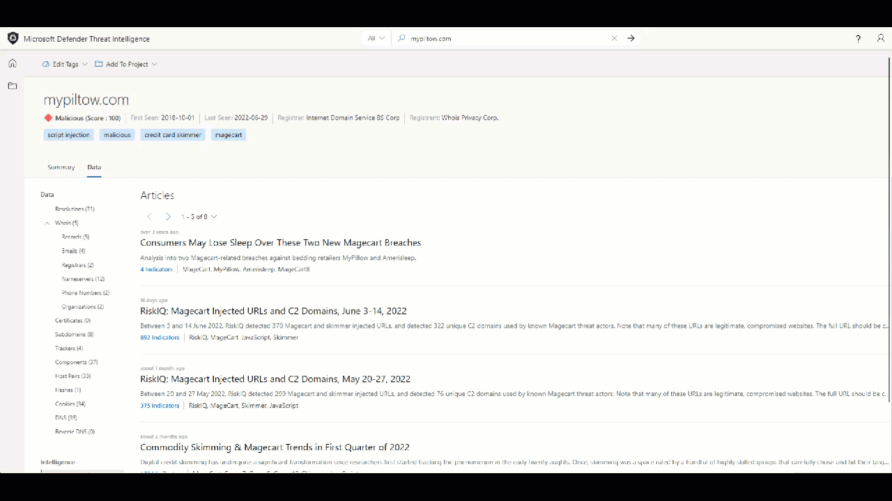
11. Review each of the additional articles from Step 9.
    a. What additional information can you find about the Magecart threat actor group? (targets, TTPs, additional IOCs, etc.)
12. Navigate to the Data tab and select the Whois Data blade and compare the Whois information between ‘mypillow.com’ and ‘mypiltow[.]com’
    a. What Whois values differ?
      - mypillow.com
        1. If you select the Whois record from October of 2011, you will find that the domain is clearly owned by My Pillow Inc.

            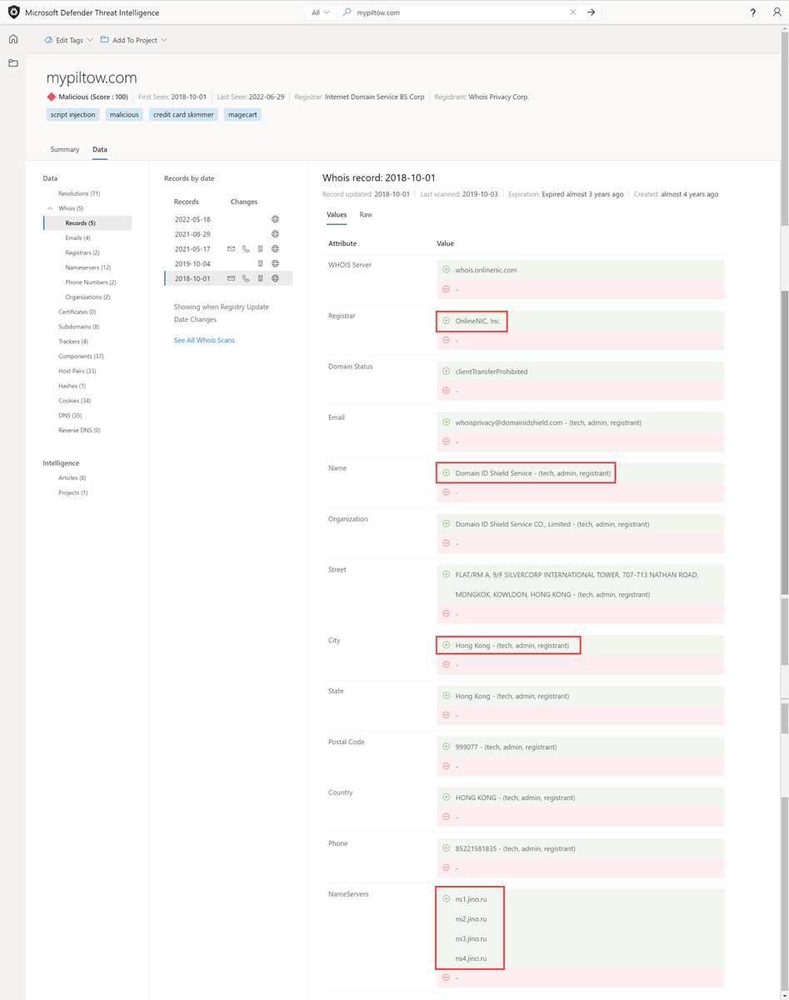
        2. mypiltow[.]com

        3. If you select the Whois record from October of 2018, you will find that mypiltow[.]com was registered in Hong Kong SAR, China and is privacy protected by Domain ID Shield Service CO.

        4. mypiltow[.]com’s registrar is OnlineNIC, Inc.

            

    b. What appears suspicious thus far about mypiltow[.]com given the A records and Whois details we have analyzed?
      - When assessing if mypiltow[.]com may be legitimate company infrastructure, an analyst should find it odd that a Russian IP is primarily guarded by a Chinese privacy service for a US based company.
13. Search ‘livechatinc[.]org’ in Defender TI’s Threat Intelligence Home Page.
    a. What new articles are associated with this domain that we did not see when we searched mypillow.com in Part 1?
      - Magecart Group 8 Blends into NutriBullet.com Adding To Their Growing List of Victims
14. Select the Magecart Group 8 Blends into NutriBullet.com Adding To Their Growing List of Victims article.
    a. What information is available about this related campaign?
      - The ‘Magecart Group 8 Blends into NutriBullet.com Adding To Their Growing List of Victims’ article was published on March 18, 2020. In this article, we find out that Nutribullet, Amerisleep, ABS-CBN were also victims of the Magecart threat actor group.
15. Select the Public Indicators tab.
    a. What IOCs are listed related to this campaign?
      - URLs
        1. hxxps://coffemokko[.]com/tr/, hxxps://freshdepor[.]com/tr/, hxxps://prodealscenter[.]com/tr/, hxxps://scriptoscript[.]com/tr/, hxxps://swappastore[.]com/tr/
        2. Domains
            - 3lift[.]org, abtasty[.]net, adaptivecss[.]org, adorebeauty[.]org, all-about-sneakers[.]org, amerisleep.github[.]io, ar500arnor[.]com, authorizecdn[.]com, bannerbuzz[.]info, battery-force[.]org, batterynart[.]com, blackriverimaging[.]org, braincdn[.]org, btosports[.]net, cdnassels[.]com, cdnmage[.]com, chicksaddlery[.]net, childsplayclothing[.]org, christohperward[.]org, citywlnery[.]org, closetlondon[.]org, cmytuok[.]top, coffemokko[.]com, coffetea[.]org, configsysrc[.]info, dahlie[.]org, davidsfootwear[.]org, dobell[.]su, elegrina[.]com, energycoffe[.]org, energytea[.]org, etradesupply[.]org, exrpesso[.]org, foodandcot[.]com, freshchat[.]info, freshdepor[.]com, greatfurnituretradingco[.]org, info-js[.]link, jewsondirect[.]com, js-cloud[.]com, kandypens[.]net, kikvape[.]org, labbe[.]biz, lamoodbighats[.]net, link js[.]link, livechatinc[.]org, londontea[.]net, mage-checkout[.]org, magejavascripts[.]com, magescripts[.]pw, magesecuritys[.]com, majsurplus[.]com, map-js[.]link, mcloudjs[.]com, mechat[.]info, melbounestorm[.]com, misshaus[.]org, mylrendyphone[.]com, mypiltow[.]com, nililotan[.]org, oakandfort[.]org, ottocap[.]org, parks[.]su, paypaypay[.]org, pmtonline[.]su, prodealscenter[.]com, replacemyremote[.]org, sagecdn[.]org, scriptoscript[.]com, security-payment[.]su, shop-rnib[.]org, slickjs[.]org, slickmin[.]com, smart-js[.]link, swappastore[.]com, teacoffe[.]net, top5value[.]com, track-js[.]link, ukcoffe[.]com, verywellfitnesse[.]com, walletgear[.]org, webanalyzer[.]net, zapaljs[.]com, zoplm[.]com

16. Search mypillow.com in Defender TI’s Threat Intelligence Home Page and select the Data tab. Select the Host Pairs Data blade. Sort by First Seen and locate Host Pair relationships that occurred in October of 2018.

    a. Do you notice a similar script relationship between mypillow.com and secure.livechatinc[.]org that mirrors the same relationship mypillow.com had with mypiltow[.]com?
      - Notice how www.mypillow.com was first observed reaching out to secure.livechatinc[.]org on 10/26/2018, because a script GET request was observed from www.mypillow.com to secure.livechatinc[.]org. That relationship lasted until 11/19/2018.

           
      ii. In addition, secure.livechatinc[.]org reached out to www.mypillow.com to access www.mypillow.com’s server (xmlhttprequest).
17. Review mypillow.com’s Host Pair relationships further.
    a. Does mypillow.com have any host pair relationships with a similar domain name to secure.livechatinc[.]org?
      - Yes. There are multiple types of observed relationships mypillow.com hosts had with the following domains:
        1. cdn.livechatinc[.]com, secure.livechatinc[.]com, api.livechatinc[.]com
     - The relationship causes include:
        1. script.src
		2. iframe.src
		3. unknown
		4. topLevelRedirect
		5. img.src
		6. xmlhttprequest
      - Livechat is a live support chat service that online retailers can add to their websites, so it’s a third-party resource and it’s used by a lot of e-commerce platforms, including MyPillow. This fake domain is a little bit more interesting because their official site is actually livechatinc.com. Therefore, in this case, they used a top-level-domain typosquat to hide the fact they placed a second skimmer on the MyPillow website.
18. Go back and find a host pair relationship with ‘secure.livechatinc[.]org’ and pivot off that hostname.
    a. What IP address did this host resolve to during October of 2018?
      - 212.109.222[.]230

        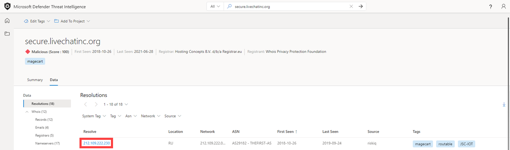
	  - Notice how this IP address is also hosted in Russia and the ASN Organization is JSC IOT.

        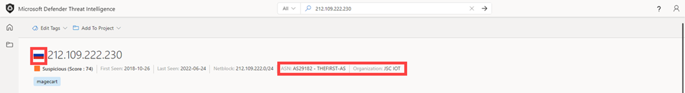
19. Search ‘secure.livechatinc[.]org’ in Defender TI’s Threat Intelligence Home Page, select the Data tab, and click on the Whois blade. Select the record from 12/25/2018.
    a. What Registrar was used for this record?
      - OnlineNIC Inc.
            1. This is the same Registrar that was used to register mypiltow[.]com during the same campaign.
		        2. If you select the record from 12/25/2018, you will notice that the domain was also using the same Chinese privacy guarding service, Domain ID Shield Service, that mypiltow[.]com had also used.
    b. What name servers were used for this record?
      - ns1.jino.ru
      - ns2.jino.ru
      - ns3.jino.ru
      - ns4.jino.ru
        1. These were the same nameservers used in the 10/01/2018 record for mypiltow[.]com. Adversaries will often use the same nameservers to segment their infrastructure.

            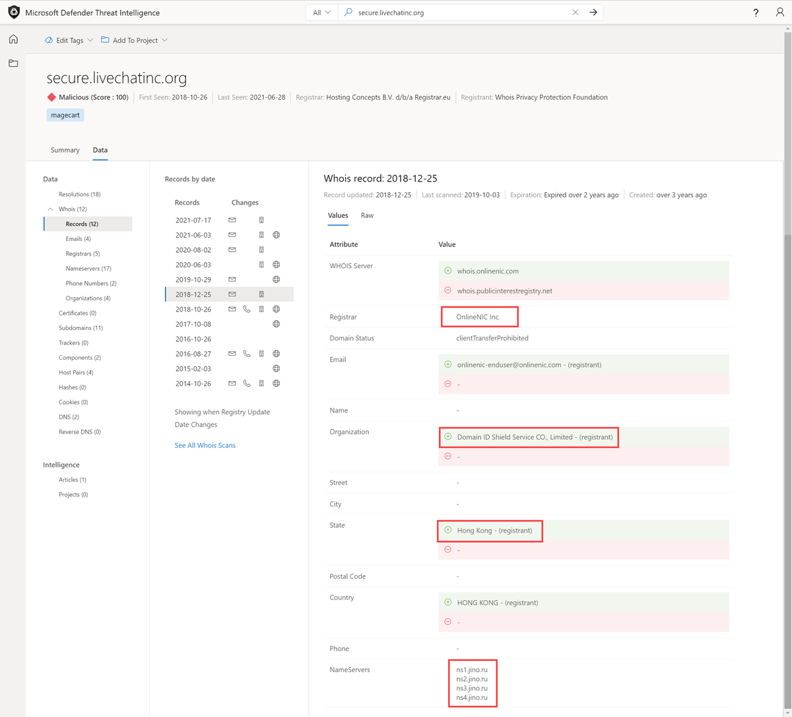

            
20. Select the Host Pairs Data blade.
    a. What host pair relationships do you see from October and November of 2018?
      - secure.livechatinc[.]org redirected users to secure.livechatinc.com on 11/19/2022. This is more than likely an obfuscation technique to evade detection.
      - www.mypillow.com was pulling a script hosted on secure.livechatinc[.]org (the fake LiveChat site) from 10/26/2018 through 11/19/2022. During this timeframe, www.mypillow.com’s user purchases were potentially compromised.
      - secure.livechatinc[.]org was requesting data from the server, www.mypillow.com, hosting the real MyPillow website (xmlhttprequest) between 10/27/2018 through 10/29/2018.

          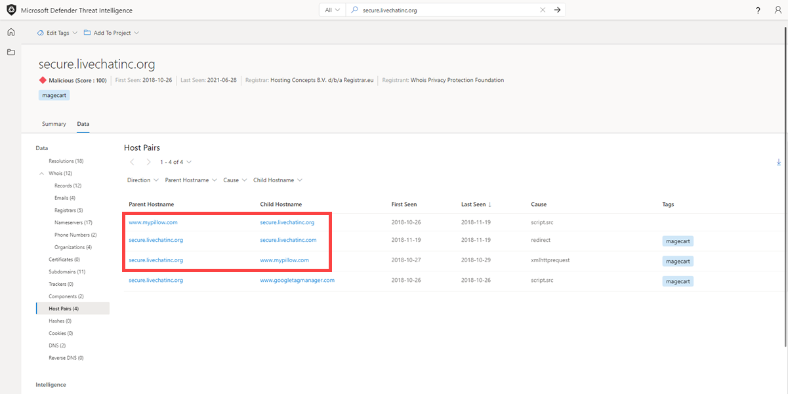
    b. What do you believe these relationships mean?

## Clean up resources
There are no resources to clean up in this section.

## Next Steps
In this tutorial, you learned how to gather threat intelligence and infrastructure chain together indicators of compromise.