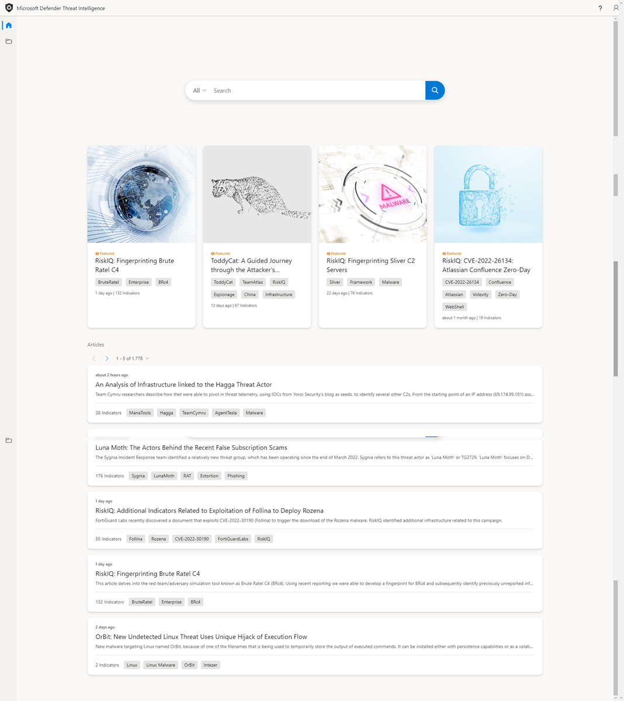
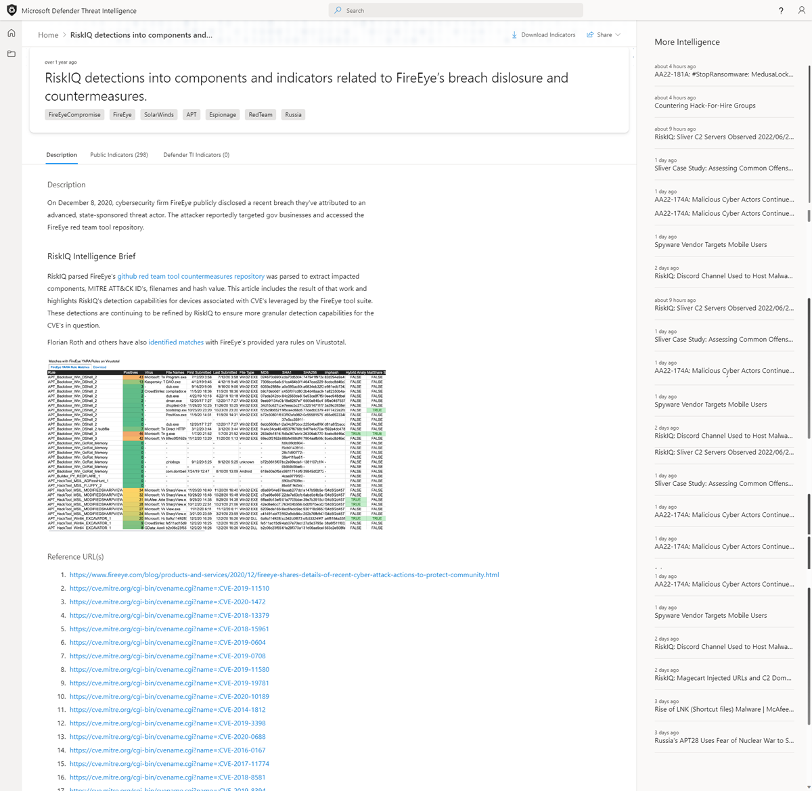
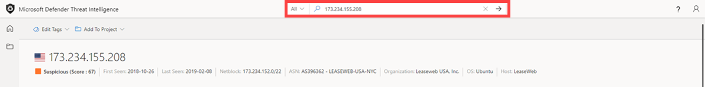
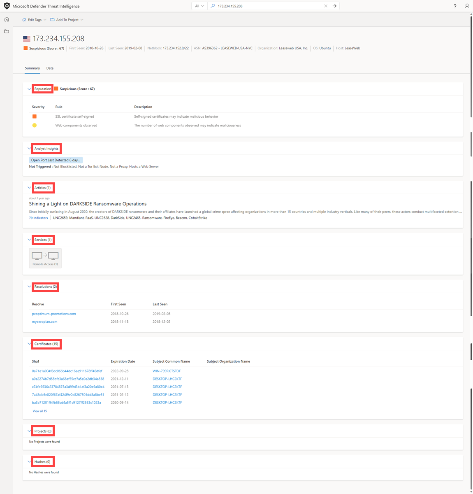
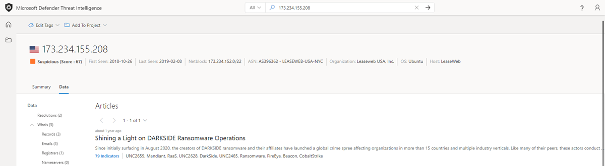
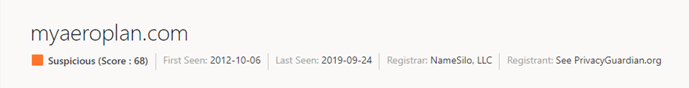

--- 
title: 'Tutorial: Gathering vulnerability intelligence'
description: 'In this tutorial, practice gathering vulnerability intelligence associated with the Darkside threat actor group using Microsoft Defender Threat Intelligence (Defender TI).'
author: alexroland24
ms.author: aroland
ms.service: threat-intelligence 
ms.topic: tutorial
ms.date: 08/04/2022
ms.custom: template-tutorial
---

# Tutorial: Gathering vulnerability intelligence

## In this tutorial, you will learn how to:

- Learn about Microsoft Defender Threat Intelligence (Defender TI)’s Threat Intelligence Home Page features
- Perform several types of indicator searches to gather vulnerability intelligence

## Prerequisites

- An Azure Active Directory or personal Microsoft account. [Login or create an account](https://signup.microsoft.com/)
- A Microsoft Defender Threat Intelligence (Defender TI) Premium license.

    > [!NOTE]
    > Users without a Defender TI Premium license will still be able to log into the Defender Threat Intelligence Portal and access our free Defender TI offering.

## Disclaimer

Microsoft Defender Threat Intelligence (Defender TI) may include live, real-time observations and threat indicators, including malicious infrastructure and adversary-threat tooling. Any IP and domain searches within our Defender TI platform are safe to search.
Microsoft will share online resources (e.g., IP addresses, domain names) that should be considered real threats posing a clear and present danger.
We ask that users use their best judgment and minimize unnecessary risk while interacting with malicious systems when performing the tutorial below. Please note that Microsoft has worked to minimize risk by defanging malicious IP addresses, hosts, and domains.

## Before You Begin

As the disclaimer states above, suspicious, and malicious indicators have been defanged for your safety. Please remove any brackets from IPs, domains, and hosts when searching in Defender TI. Do not search these indicators directly in your browser.

## Open Defender TI’s Threat Intelligence Home Page

- Access the [Defender Threat Intelligence Portal](https://ti.defender.microsoft.com/).
- Complete Microsoft authentication to access portal.

## Learn about Defender TI’s Threat Intelligence Home Page features

1. Review the Search bar options by selecting the search bar and clicking on the All drop-down option.

    

2. Review the featured articles and articles within the Threat Intelligence Home Page.

    

## Perform several types of indicator searches to gather vulnerability intelligence

1. Search ‘CVE-2020-1472' and review the associated vulnerability article, ‘CVE-2020-1472' and article, ‘RiskIQ detections into components and indicators related to FireEye’s breach disclosure and countermeasures’.

    

2. Review the ‘RiskIQ detections into components and indicators related to FireEye’s breach disclosure and countermeasures’ article’s Public indicators.

    

3. Search ‘173.234.155[.]208’ IP address in the Threat Intelligence Search bar.

      

4. Review the Summary tab results that return: reputation, analyst insights, articles, services, resolutions, certificates, projects, and hashes.

      

5. Navigate to the Data tab and review the data and intelligence data sets: resolutions, Whois, certificates, trackers, components, cookies, services, dns, and articles.

    

    

6. Navigate back to the Resolutions data blade and pivot on ‘myaeroplan[.]com’.

    

7. Navigate to the Data tab and review the resolutions, Whois, certificates, subdomains, trackers, components, hashes, cookies, DNS, and reverse DNS data sets.

    

8. Take note of the following artifacts from steps 5 and 7:

    |&nbsp;|&nbsp;|
    | --- | --- |
    | Whois Address | 1928 E. Highland Ave. Ste F104 PMB# 255 |
    | Whois City | phoenix |
    | Whois State | az |
    | Whois Postal Code | 85016 |
    | Whois Country | United States |
    | Whois Phone | 13478717726 |
    | Whois Nameserver | ns0.1984[.]is |
    | Whois Nameserver | ns1.1984[.]is |
    | Whois Nameserver | ns2.1984[.]is |
    | Whois Nameserver | ns1.1984hosting[.]com |
    | Whois Nameserver | ns2.1984hosting[.]com |
    | Certificate Sha1 | [ead5b033ed4fd342261f389f0930aa7de1fba33d](https://ti.defender.microsoft.com/search/certificates?query=ead5b033ed4fd342261f389f0930aa7de1fba33d&field=sha1) |
    | Certificate Serial Number | 236976486488328334603103229327145294996 |
    | Certificate Issuer Common Name | COMODO RSA Domain Validation Secure Server CA |
    | Certificate Subject Common Name | myaeroplan[.]com |
    | Certificate Subject Alternative Name | [myaeroplan[.]com](https://ti.defender.microsoft.com/search/trackers/hosts?query=www.aeroplan.com&field=MarkOfTheWebSourceHost) |
    | Certificate Subject Alternative Name | www.myaeroplan[.]com |
    | Tracker type | MarkOfTheWebSourceHost |
    | Tracker value | [www.aeroplan.com](https://ti.defender.microsoft.com/search/trackers/hosts?field=MarkOfTheWebSourceHost&query=www.aeroplan.com) |
    | Component Name + Version | [Apache (v2.4.29)](https://ti.defender.microsoft.com/search/components/hosts?category=Server&query=Apache&version=2.4.29) |
    | Cookie Name | [PHPSESSID](https://ti.defender.microsoft.com/search/cookies/hosts?query=PHPSESSID&field=name) |
    | Cookie Domain | [myaeroplan[.]com](https://ti.defender.microsoft.com/search/cookies/hosts?query=myaeroplan.com&field=domain) |
    | Threat Articles | [Points Guys: Aeroplan Frequent Flyer Program Credential Harvesting Campaign](https://ti.defender.microsoft.com/articles/99527909)|

9. Perform the respective artifact searches from step 8. Note: You’ll want to reference the search options you learned from the Learn about Defender TI’s Threat Intelligence Home Page features section.

## Clean up resources

There are no resources to clean up in this section.
