--- 
title: 'What is Microsoft Defender Threat Intelligence (Defender TI)? - Backup'
description: 'In this overview article, learn about the main features that come with Microsoft Defender Threat Intelligence (Defender TI). - Backup'
author: alexroland24
ms.author: aroland
manager: dolmont
ms.service: threat-intelligence 
ms.topic: overview
ms.date: 08/02/2022
ms.custom: template-overview
---

# What is Microsoft Defender Threat Intelligence (Defender TI)? - Backup

Microsoft Defender Threat Intelligence (Defender TI) is a platform that streamlines triage, incident response, threat hunting, vulnerability management, and cyber threat intelligence analyst workflows when conducting threat infrastructure analysis and gathering threat intelligence. Analysts spend a significant amount of time on data discovery, collection, and parsing, instead of focusing on what actually helps their organization defend themselves--deriving insights about the actors through analysis and correlation.?

Often, analysts must go to multiple repositories to obtain the critical data sets they need to assess a suspicious domain, host, or IP address. DNS data, WHOIS information, malware, and SSL certificates provide important context to indicators of compromise (IOCs), but these repositories are widely distributed and don’t always share a common data structure, making it difficult to ensure analysts have all relevant data needed to make a proper and timely assessment of suspicious infrastructure.

Interacting with these data sets can be cumbersome and pivoting between these repositories is time-consuming, draining the resources of security operations groups that constantly need to re-prioritize their response efforts.

Cyber Threat Intelligence Analysts struggle with balancing a breadth of threat intelligence ingestion with the analysis of which threat intelligence poses the biggest threats to their organization and/or industry.

In the same breadth, Vulnerability Intelligence Analysts battle correlating their asset inventory with CVE information to prioritize the investigation and remediation of the most critical vulnerabilities associated with their organization.

Microsoft’s goal is to re-imagine the analyst workflow by developing a platform, Defender TI, that aggregates and enriches critical data sources and displays data in an innovative, easy to use interface to correlate when indicators are linked to articles and vulnerabilities, infrastructure chain together indicators of compromise (IOCs), and collaborate on investigations with fellow Defender TI licensed users within their tenant. With security organizations actioning an ever-increasing amount of intelligence and alerts within their environment, having a Threat Analysis & Intelligence Platform that allows for accurate and timely assessments of alerting is important.

Below is a screenshot of Defender TI’s Threat Intelligence Home Page. Analysts can quickly scan new featured articles as well as begin their intelligence gathering, triage, incident response, and hunting efforts by performing a keyword, artifact or CVE-ID search.

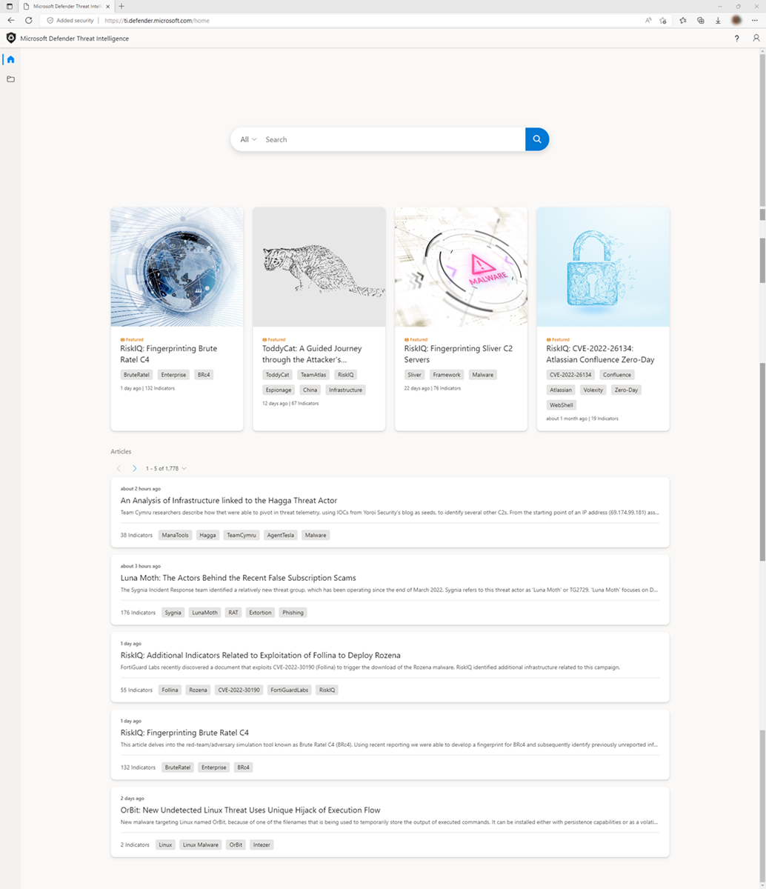

## Defender TI articles
Articles are narratives by Microsoft that provide insight into threat actors, tooling, attacks, and vulnerabilities. Defender TI featured and articles are not blog posts about threat intelligence; while they summarize different threats, they also link to actionable content and key indicators of compromise to help users take action. By including this technical information in the threat summaries, we enable users to continually track threat actors, tooling, attacks, and vulnerabilities as they change.

## Featured articles

The featured article section of the Defender TI Threat Intelligence Home Page (right below the search bar) shows you the featured Microsoft content:

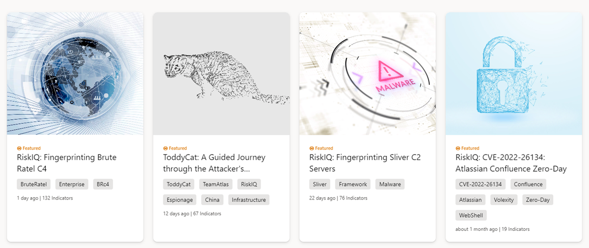

Clicking the article takes you to the underlying article content. The article synopsis gives the user a quick understanding of the article. The Indicators call-out shows how many Public and Defender TI indicators are associated with the article.

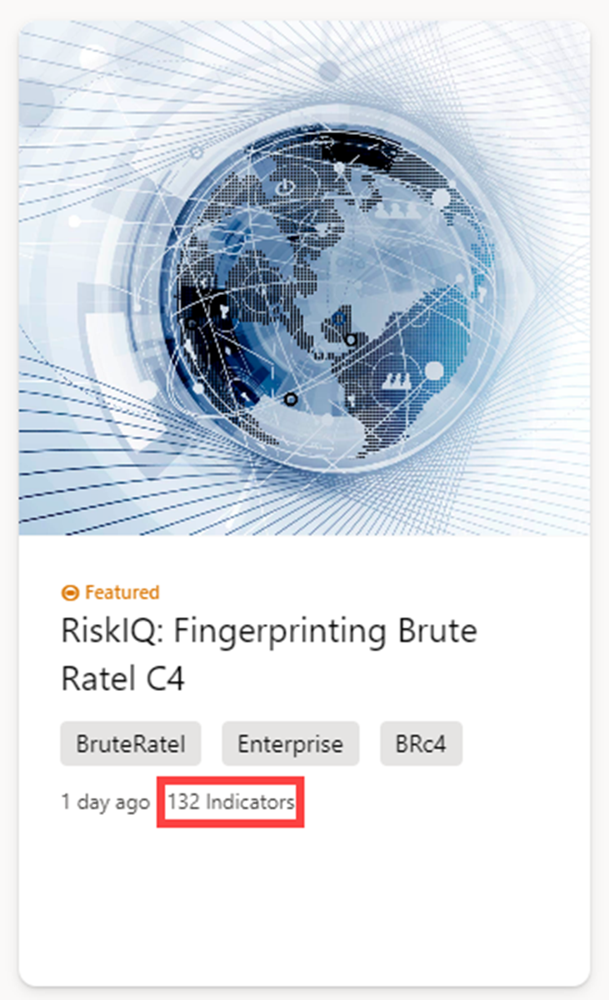

## Articles

All articles (including featured articles) are listed under the Microsoft Defender TI Threat Intelligence Home Page articles section, ordered by their creation date (descending):

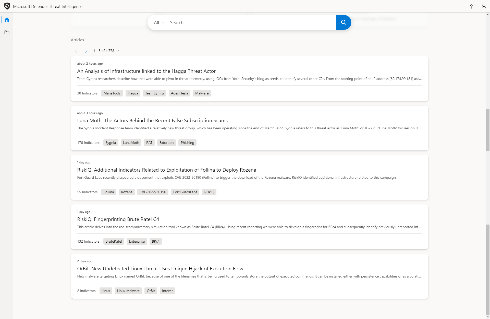

## Article descriptions

The description section of the article detail screen contains information about the attack or attacker profiled. The content can range from very short (in the case of OSINT bulletins) or quite long (for long-form reporting – especially when Microsoft has augmented the report with content). The longer descriptions may contain images, links to the underlying content, links to searches within Defender TI, attacker code snippets, and firewall rules to block the attack:

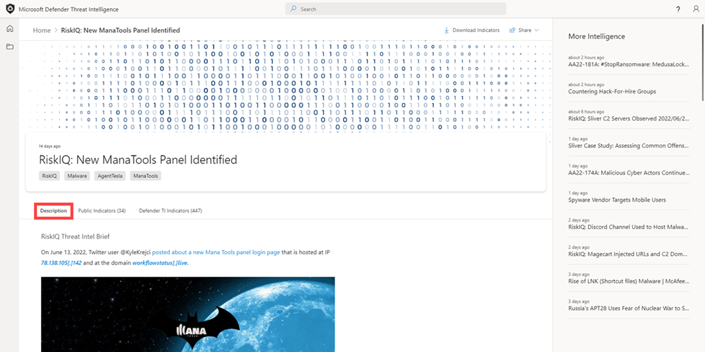

## Public indicators

The public indicators section of the screen shows the previously published indicators related to the article. The links in the public indicators take one to the underlying Defender TI data or relevant external sources (e.g., VirusTotal for hashes).

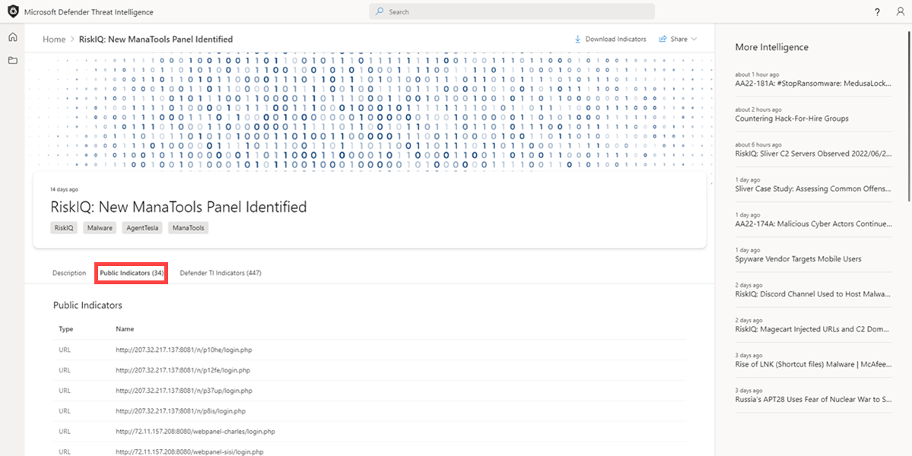

## Defender TI indicators

The Defender TI indicators section covers the indicators that Defender TI’s research team has found and added to the articles.

These links also pivot into the relevant Defender TI data or the corresponding external source.

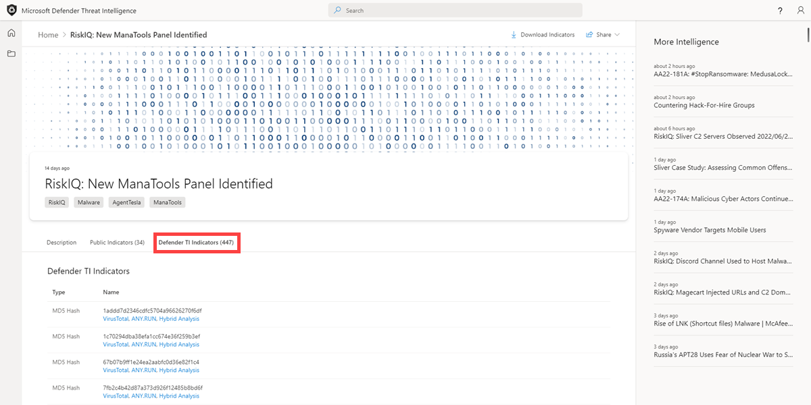

## Vulnerability articles

Defender TI offers CVE-ID searches to help users identify critical information about the CVE. CVE-ID searches result in Vulnerability Articles.

Vulnerability Articles provide key context behind CVEs of interest. Each article contains a description of the CVE, a list of affected components, tailored mitigation procedures and strategies, related intelligence articles, references in Deep & Dark Web chatter, and other key observations. These articles provide deeper context and actionable insights behind each CVE, enabling users to more quickly understand these vulnerabilities and quickly mitigate them.

Vulnerability Articles also include a Defender TI Priority Score and severity indicator. The Defender TI Priority Score is a unique algorithm which reflects the priority of a CVE based on the CVSS score, exploits, chatter, and linkage to malware. Furthermore, the Defender TI Priority Score evaluates the recency of these components so users can understand which CVEs should be remediated first.

## Reputation scoring

Defender TI provides proprietary reputation scores for any Host, Domain, or IP Address. Whether validating the reputation of a known or unknown entity, this score helps users quickly understand any detected ties to malicious or suspicious infrastructure. The platform provides quick information about the activity of these entities, such as First and Last Seen timestamps, ASN, country/region, associated infrastructure, and a list of rules that impact the reputation score when applicable.

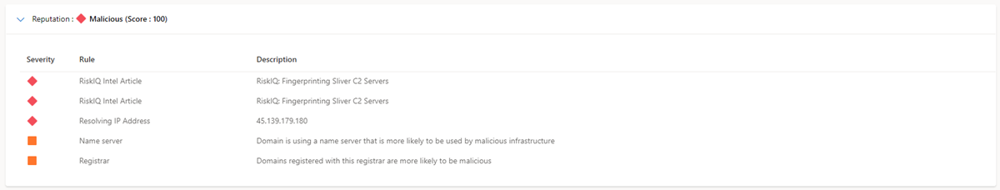

IP reputation data is important to understanding the trustworthiness of your own attack surface and is also useful when assessing unknown hosts, domains or IP addresses that appear in investigations. These scores will uncover any prior malicious or suspicious activity that impacted the entity, or other known indicators of compromise that should be considered.

For more information, see [Reputation scoring](reputation-scoring.md).

## Analyst insights

Analyst insights distill Microsoft’s vast data set into a handful of observations that simplify the investigation and make it more approachable to analysts of all levels.

Insights are meant to be small facts or observations about a domain or IP address and provide Defender TI users with the ability to make an assessment about the artifact queried and improve a user's ability to determine if an indicator being investigated is malicious, suspicious, or benign.

For more information, see [Analyst insights](analyst-insights.md).

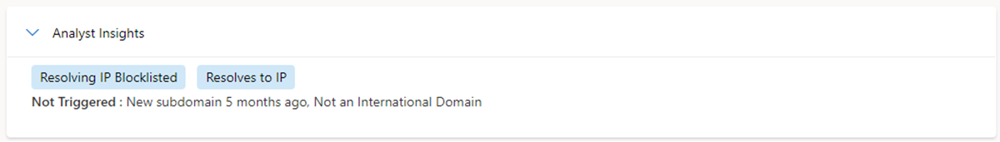

## Data sets
Microsoft centralizes numerous data sets into a single platform, Defender TI, making it easier for Microsoft’s community and customers to conduct infrastructure analysis. Microsoft’s primary focus is to provide as much data as possible about Internet infrastructure to support a variety of security use cases.

Microsoft collects, analyzes, and indexes internet data to assist users in detecting and responding to threats, prioritizing incidents, and proactively identifying adversaries’ infrastructure associated with actor groups targeting their organization. Microsoft collects internet data via its’ PDNS sensor network, global proxy network of virtual users, port scans, and leverages third-party sources for malware and added Domain Name System (DNS) data.

This internet data is categorized into two distinct groups: traditional and advanced. Traditional data sets include Resolutions, WHOIS, SSL Certificates, Subdomains, Hashes, DNS, Reverse DNS, and Services. Advanced data sets include Trackers, Components, Host Pairs, and Cookies. Trackers, Components, Host Pairs, and Cookies data sets are collected from observing the Document Object Model (DOM) of web pages crawled. Additionally, Components and Trackers are also observed from detection rules that are triggered based on the banner responses from port scans or SSL Certificate details. Many of these data sets have various methods to sort, filter, and download data, making it easier to access information that may be associated with a specific artifact type or time in history.

For more information, see:

- [Sorting, filtering, and downloading data](sorting-filtering-and-downloading-data.md)
- [Data sets](data-sets.md)

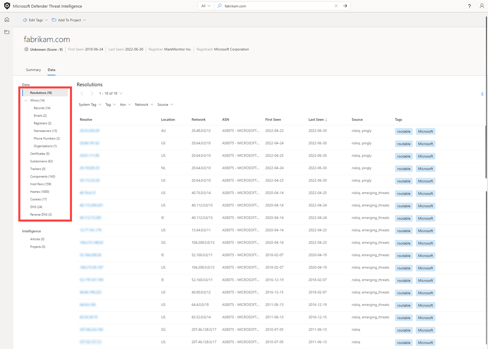

## Tags

Defender TI tags are used to provide quick insight about an artifact, whether derived by the system or generated by other users. Tags aid analysts in connecting the dots between current incidents and investigations and their historical context for improved analysis.

The Defender TI platform offers two types of tags: system tags and custom tags.

For more information, see [Using tags](using-tags.md).

## Projects

Microsoft’s Defender TI platform allows users to develop multiple project types for organizing indicators of interest and indicators of compromise from an investigation. Projects contain a listing of all associated artifacts and a detailed history that retains the names, descriptions, and collaborators.

When a user searches an IP address, domain, or host in Defender TI, if that indicator is listed within a project the user has access to, the user can see a link to the project from the Projects sections in the Summary tab as well as Data tab. From here, the user can navigate to the details of the project for more context about the indicator before reviewing the other data sets for more information. This helps analysts to avoid reinventing the wheel of an investigation one of their Defender TI tenant users may have already started or add onto that investigation by adding new artifacts (indicators of compromise) related to that project (if they have been added as a collaborator to the project).

For more information, see [Using projects](using-projects.md).

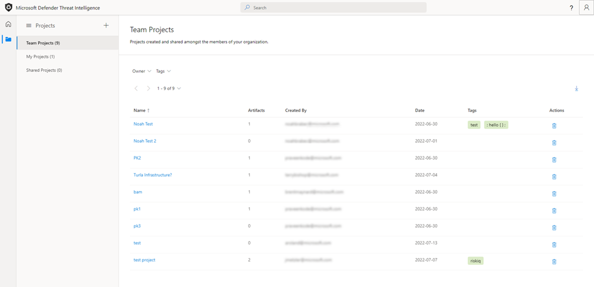

## Data residency, availability, and privacy

Microsoft Defender Threat Intelligence contains both global data and customer-specific data. The underlying internet data is global Microsoft data; labels applied by customers are considered customer data. All customer data is stored in the region of the customer’s choosing.

For security purposes, Microsoft collects users' IP addresses when they log in. This data is stored for up to 30 days but may be stored longer if needed to investigate potential fraudulent or malicious use of the product.

In the case of a region down scenario, customers should see no downtime as Defender TI uses technologies that replicate data to a backup regions.

Defender TI processes customer data. By default, customer data is replicated to the paired region.

## Next steps

For more information, see:

- [Quickstart: Learn how to access Microsoft Defender Threat Intelligence and make customizations in your portal](learn-how-to-access-microsoft-defender-threat-intelligence-and-make-customizations-in-your-portal.md)
- [Data sets](data-sets.md)
- [Searching and pivoting](searching-and-pivoting.md)
- [Sorting, filtering, and downloading data](sorting-filtering-and-downloading-data.md)
- [Infrastructure chaining](infrastructure-chaining.md)
- [Reputation scoring](reputation-scoring.md)
- [Analyst insights](analyst-insights.md)
- [Using projects](using-projects.md)
- [Using tags](using-tags.md)
