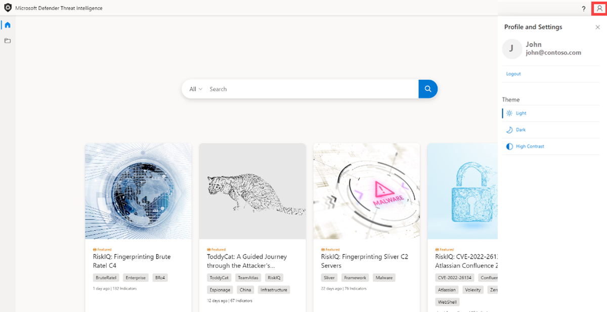
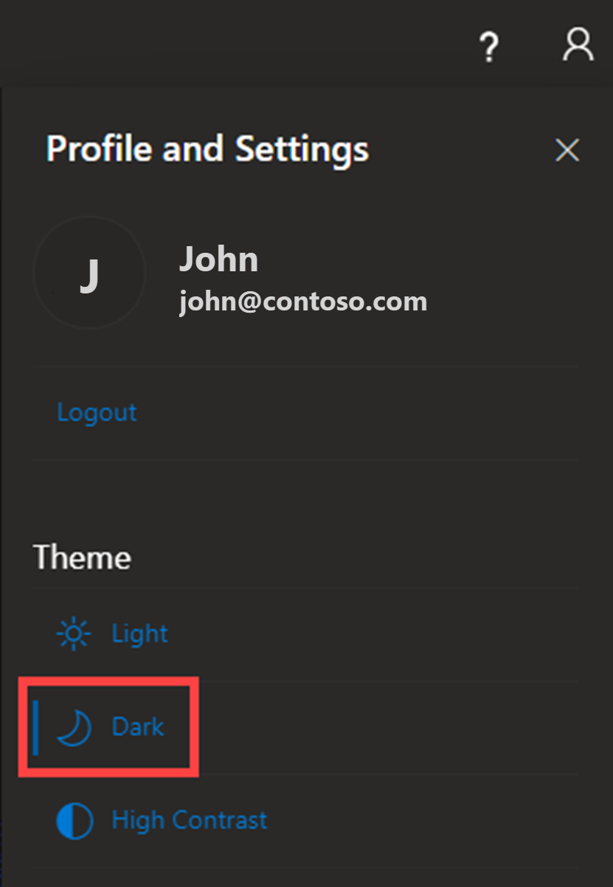
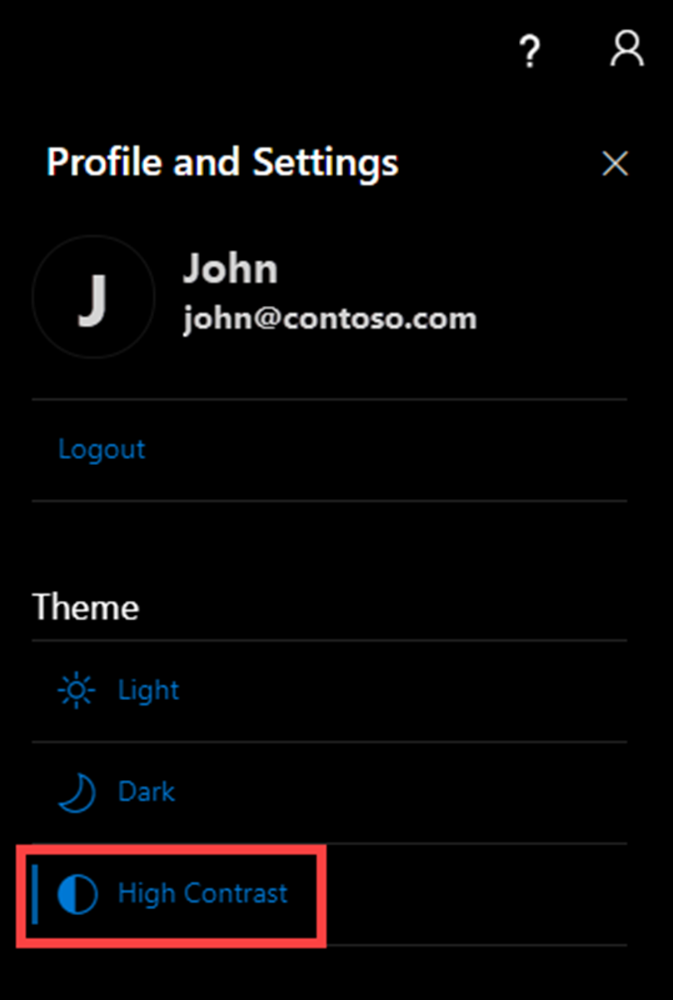
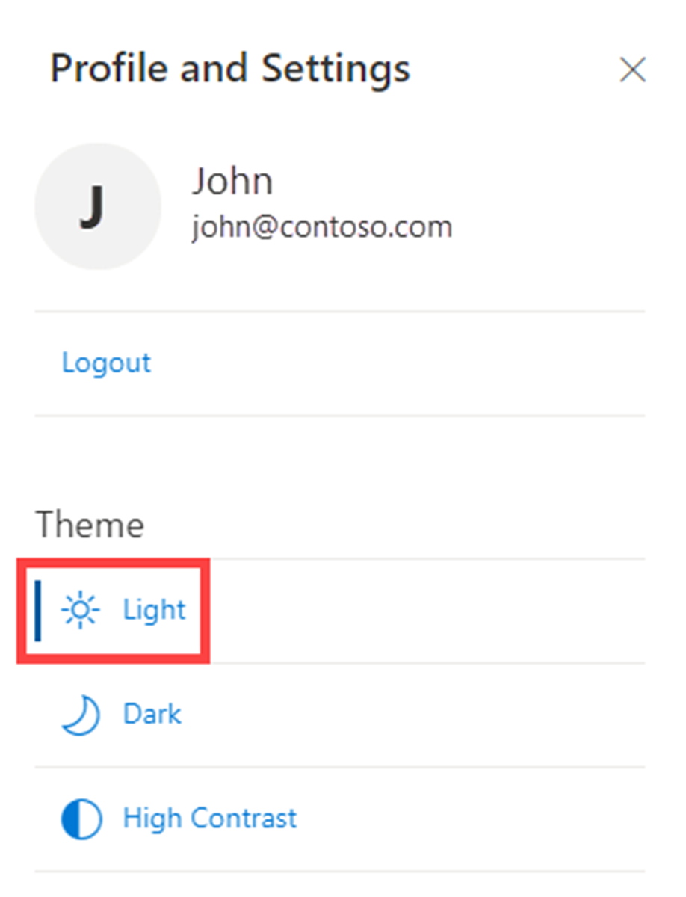
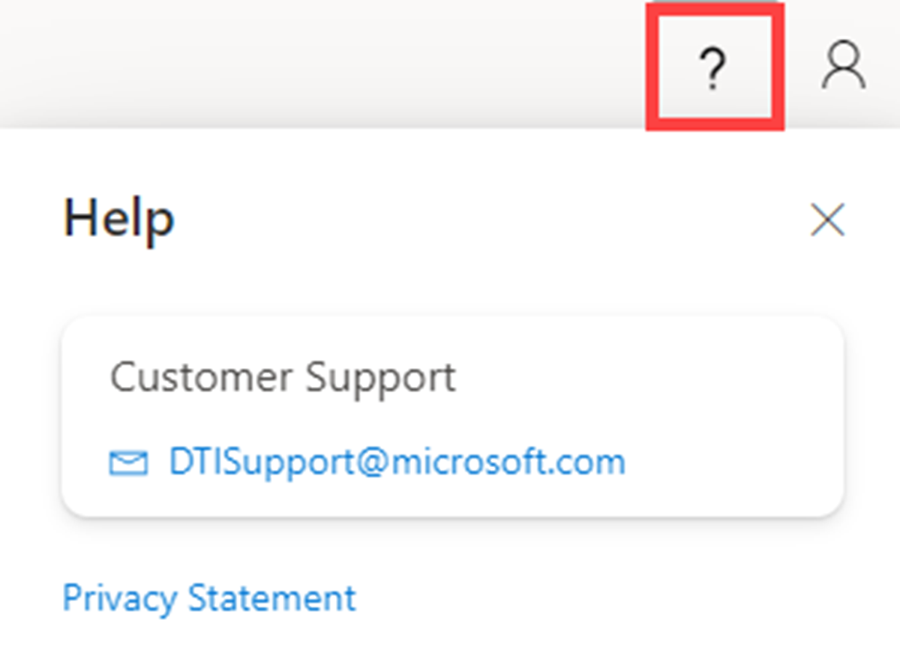
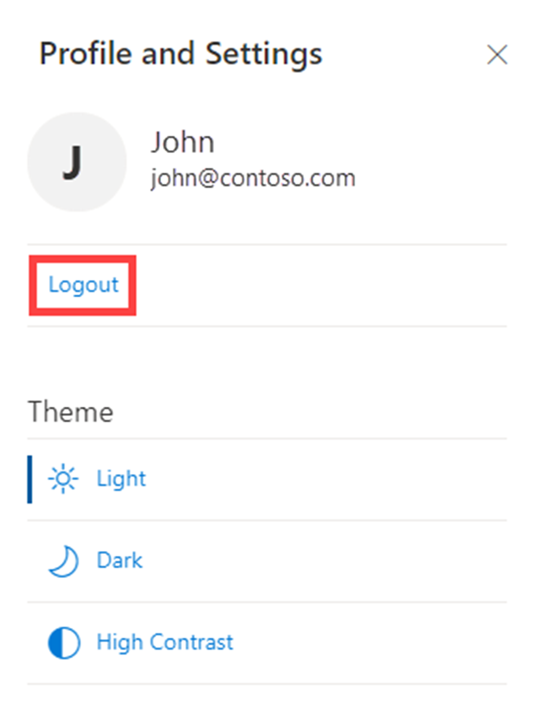

--- 
title: 'Quickstart: Accessing the Microsoft Defender Threat Intelligence (Defender TI) Portal'
description: 'In this quickstart, learn how to configure your profile and preferences and access Defender TI’s help resources using Microsoft Defender Threat Intelligence (Defender TI).'
author: alexroland24
ms.author: aroland
manager: dolmont
ms.service: threat-intelligence 
ms.topic: quickstart
ms.date: 08/02/2022
ms.custom: template-quickstart
---

# Quickstart: Learn how to access Microsoft Defender Threat Intelligence and make customizations in your portal

Understanding how to adjust your theme in Microsoft Defender Threat Intelligence (Defender TI)’s Portal will make it easier on your eyes when using our platform. Additionally, this guide will walk you through how to enable sources for enrichment, so you can see more results when performing searches in our platform. You will also learn how to successfully login and logout of Defender TI.

## Prerequisites

- An Azure Active Directory or personal Microsoft account. [Login or create an account](https://signup.microsoft.com/)
- A Microsoft Defender Threat Intelligence (Defender TI) Premium license.

    > [!NOTE]
    > Users without a Defender TI Premium license will still be able to log into the Defender Threat Intelligence Portal and access our free Defender TI offering.

## Open Defender TI’s Threat Intelligence Home Page

- Access the [Defender Threat Intelligence Portal](https://ti.defender.microsoft.com/).
- Complete Microsoft authentication to access portal.

## Access Defender TI’s ‘Profile and Preferences’ to adjust your theme

1. Click on the ‘Profile and Preferences’ icon in the upper right-hand corner of the Defender Threat Intelligence Portal.

    

2. Select ‘Dark’ theme. Notice how ‘Light’ is your default theme.

    

3. Repeat step 1 and select ‘High Contrast’ theme.

    

4. Repeat step 1 and select ‘Light’ theme.

    

## Access Defender TI’s ‘Help’ icon to learn about your Defender TI Microsoft Support resources

1. Click on the ‘Help’ icon in the upper right-hand corner to the left of the ‘Profile and Preferences’ icon.

    

2. Review your Defender TI Microsoft Support resources.

      - Here you will find Defender TI’s Support email address as well as a link to our Privacy Statement.

## Access Defender TI’s ‘Profile and Preferences’ to logout of the Defender Threat Intelligence Portal

1. Click on the ‘Profile and Preferences’ icon in the upper right-hand corner of the Defender Threat Intelligence Portal.

2. Select ‘Logout’.

    

## Clean up resources
There are no resources to clean up in this section.

## Next steps

For more information, see:

[‘What is Microsoft Defender Threat Intelligence (Defender TI)?’](index.md)
