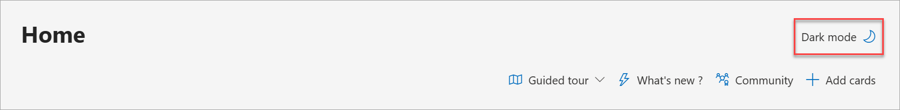

--- 
title: 'Quickstart: Accessing Microsoft Defender Threat Intelligence (Defender TI)'
description: In this quickstart, learn how to access Microsoft Defender Threat Intelligence (Defender TI) in the Microsoft Defender portal, as well as configure your profile and preferences and access help resources in the Defender portal.
author: alexroland24
ms.author: aroland
manager: dolmont
ms.service: threat-intelligence 
ms.topic: quickstart
ms.date: 04/19/2024
ms.custom: template-quickstart
ms.collection: essentials-get-started
---

# Quickstart: Learn how to access Microsoft Defender Threat Intelligence and make customizations

>[!IMPORTANT] 
> On June 30, 2024, The Microsoft Defender Threat Intelligence (Defender TI) standalone portal (https://ti.defender.microsoft.com) will be retired and will no longer be accessible. Customers can continue using Defender TI in the [Microsoft Defender portal](https://aka.ms/mdti-intel-explorer) or with [Microsoft Copilot for Security](security-copilot-and-defender-threat-intelligence.md). [Learn more](https://aka.ms/mdti-standaloneportal)

This guide walks you through how to access Microsoft Threat Intelligence (Defender TI) from the Microsoft Defender portal, adjust the portal’s theme to make it easier on your eyes when using it, and find sources for enrichment so you can see more results when gathering threat intelligence. 

   :::image type="content" source="/defender/threat-intelligence/media/quickstart-intel-explorer.png" alt-text="Screenshot of the Microsoft Defender Threat Intelligence Intel explorer in the Microsoft Defender portal." lightbox="/defender/threat-intelligence/media/quickstart-intel-explorer":::

## Prerequisites

- A Microsoft Entra ID or personal Microsoft account. [Sign in or create an account](https://signup.microsoft.com/)
- A Defender TI premium license.

    > [!NOTE]
    > Users without a Defender TI premium license can still access our free Defender TI offering.

## Open Defender TI in the Microsoft Defender portal

1. Access the [Defender portal](https://security.microsoft.com/) and complete the Microsoft authentication process. [Learn more about the Defender portal](/microsoft-365/security/defender/microsoft-365-defender-portal)
2. Navigate to **Threat intelligence**. You can access Defender TI in the following pages:
   - Intel profiles
   - Intel explorer
   - Intel projects

    :::image type="content" source="/defender/threat-intelligence/media/quickstart-navigation.png" alt-text="Screenshot of the Microsoft Defender portal with the Threat intelligence navigation  links highlighted." lightbox="/defender/threat-intelligence/media/quickstart-navigation.png":::
## Adjust the Defender portal’s display theme to dark or light mode

By default, the Defender portal’s display theme is set to light mode. To switch to dark mode, on the Defender portal, navigate to **Home** then select **Dark mode** on the upper right-right corner of the home page.
      

To switch back to light mode, select **Light mode** in the same upper-right hand corner of the home page.

## Get help and learn about Defender TI support resources

Select the **Help** icon in the upper right-hand corner of the Defender portal. The side panel displays a search bar where you can type your problem or support question.

:::image type="content" source="/defender/threat-intelligence/media/quickstart-help.png" alt-text="Screenshot of the Microsoft Defender portal with the Help side panel open and highlighted." lightbox="/defender/threat-intelligence/media/quickstart-help.png":::

You can also review Microsoft’s [licensing resources](https://www.microsoft.com/licensing/docs) and [privacy statement](https://privacy.microsoft.com/privacystatement) by selecting **Legal** and **Privacy & Cookies**, respectively, at the lower right hand of the **Help** side panel.

## Sign out of the Defender portal

1. Select the **My account** icon in the upper right-hand corner of the Defender portal.
2.	Select **Sign out**.

## Clean up resources
There are no resources to clean up in this section.

### See also

- [What is Microsoft Defender Threat Intelligence (Defender TI)?](index.md)
