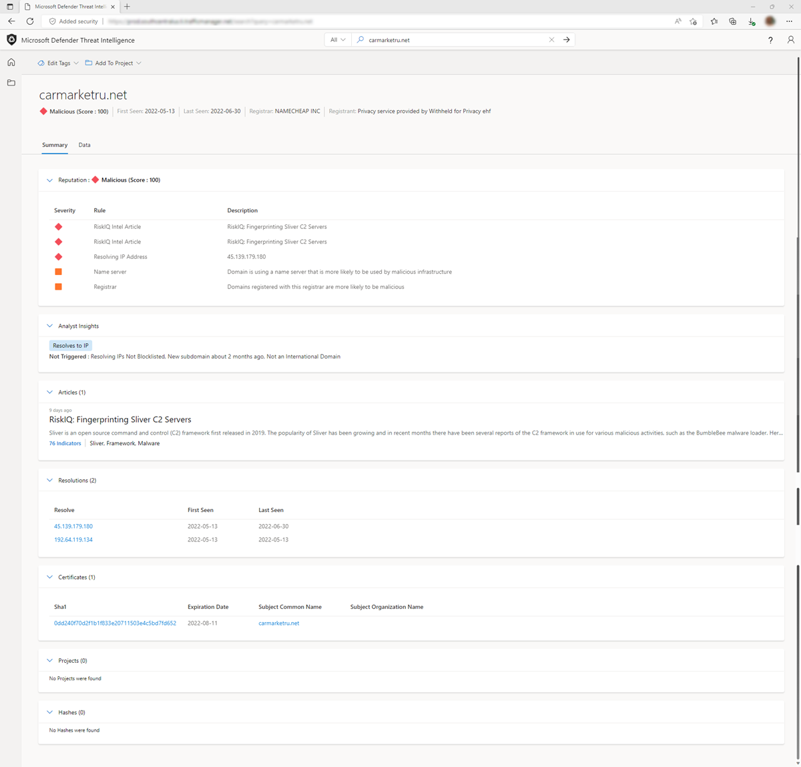

--- 
title: 'Microsoft Defender Threat Intelligence (Defender TI) Reputation Scoring'
description: 'In this overview article, learn about the Microsoft Defender Threat Intelligence (Defender TI)’s reputation scoring feature.'
author: alexroland24
ms.author: aroland
manager: dolmont
ms.service: threat-intelligence
ms.topic: overview
ms.date: 08/02/2022
ms.custom: template-overview
---

# Reputation scoring

Microsoft Defender Threat Intelligence (Defender TI) provides proprietary reputation scores for any Host, Domain, or IP Address. Whether validating the reputation of a known or unknown entity, this score helps users quickly understand any detected ties to malicious or suspicious infrastructure. The platform provides quick information about the activity of these entities (e.g. First and Last Seen timestamps, ASN, associated infrastructure) and a list of rules that impact the reputation score when applicable.

Reputation data is important to understanding the trustworthiness of your own attack surface and is also useful when assessing unknown hosts, domains or IP addresses that appear in investigations. These scores will uncover any prior malicious or suspicious activity that impacted the entity, or other known indicators of compromise that should be considered.

## Understanding reputation scores

Reputation Scores are determined by a series of algorithms designed to quickly quantify the risk associated with an entity. We develop Reputation Scores based on our proprietary data by leveraging our crawling infrastructure, as well as IP information collected from external sources.

## Detection methods
Reputation Scores are determined by a series of factors, including known associations to blocklisted entities and a series of machine learning rules used to assess risk.

## Scoring brackets
Reputation Scores are displayed as a numerical score with a range from 0 to 100. An entity with a score of “0” has no known associations to suspicious activity or known indicators of compromise; a score of “100” indicates that the entity is malicious. Hosts, Domains, and IP Addresses are grouped into the following categories depending on their numerical score:

|     Score             |     Category              |     Description                                                                                                                                                                          |
|-----------------------|---------------------------|------------------------------------------------------------------------------------------------------------------------------------------------------------------------------------------|
|     75+               |     Malicious             |     The   entity has confirmed associations to known malicious infrastructure that   appears on our blocklist and matches machine learning rules that detect   suspicious activity.      |
|     50   – 74         |     Suspicious            |     The   entity is likely associated to suspicious infrastructure based on matches to   three or more machine learning rules.                                                           |
|     25   – 49         |     Neutral               |     The   entity matches at least two machine learning rules.                                                                                                                            |
|     0   – 24          |     Unknown   (Green)     |     If   the score is “Unknown” and green, the entity has returned at least one   matched rule.                                                                                          |
|     0   – 24          |     Unknown   (Grey)      |     If   the score is “Unknown” and grey, the entity has not returned any rule   matches.                                                                                                |  

## Detection rules

Reputation scores are based on many factors that an analyst may reference to determine the relative quality of a domain or address. These factors are reflected in the machine learning rules that comprise the reputation scores. For example, “.xyz” or “.cc” top-level domains (TLDs) are generally more suspicious than ".com” or “.org” TLDs. An ASN (Autonomous System Number) hosted by a low-cost or free hosting provider is more likely to be associated with malicious activity, as would a self-signed SSL certificate. This reputation model was developed by looking at relative occurrences of these features among both malicious and benign indicators to score the overall reputation of an entity.

Please refer to the list below for examples of rules used to determine the suspiciousness of a host, domain, or IP address. Please note that this list is not comprehensive and is constantly changing; our detection logic and consequent capabilities are dynamic as they reflect the evolving threat landscape. For this reason, we do not publish a comprehensive list of the machine learning rules used to assess an entity’s reputation.

See the example reputation scoring rules below:

|     Rule   Name                    |     Description                                                                                        |
|------------------------------------|--------------------------------------------------------------------------------------------------------|
|     SSL-Certificate Self-Signed    |     Self-signed certificates may indicate   malicious behavior                                         |
|     Tagged as Malicious            |     Tagged as malicious by a member within your   organization                                         |
|     Web components observed        |     The number of web components observed may   indicate maliciousness                                 |
|     Name server                    |     Domain is using a name server that is more   likely to be used by malicious infrastructure         |
|     Registrar                      |     Domains registered with this registrar are   more likely to be malicious                           |
|     Registrant email provider      |     Domain is registered with an email provider   that is more likely to register malicious domains    |

It is important to remember that these factors must be assessed holistically to make an accurate assessment on the reputation of an entity. The specific combination of indicators, rather than any individual indicator, can predict whether an entity is likely to be malicious or suspicious.

## Severity

When creating rules for the machine learning detection system, a severity rating is applied to it. Each rule is assigned “High”, “Medium” or “Low” severity based on the level of risk associated with the rule.

## Use cases

### Incident triage, response and threat hunting
Defender TI’s reputation score, classification, rules, and description of rules can be used to quickly assess if an IP address or domain indicator is good, suspicious, or malicious. Other times, we may not have observed enough infrastructure associated with an IP address or domain to infer if the indicator is good or bad. If an indicator has an unknown or neutral classification, users are encouraged to perform a deeper investigation by reviewing our data sets to infer if the indicator is good or bad. If an indicator’s reputation includes an article association, users are encouraged to review those listed article(s) to learn more about how the indicator is linked to a potential threat actor’s campaign, what industries or nations they may be targeting, associated TTPs, and identify other related indicators of compromise to broaden the scope of the incident’s response and hunting efforts.

### Intelligence gathering

Any associated articles can be shared with the analyst’s cyber threat intelligence team, so they have a clearer understanding of who may be targeting their organization.

## Next steps
For more information, see [Analyst insights](analyst-insights.md).
