--- 
title: 'Searching &amp; pivoting with Microsoft Defender Threat Intelligence (Defender TI)'
description: 'Learn how to search and pivot across internet data sets, threat articles, vulnerability articles, and projects using Microsoft Defender Threat Intelligence (Defender TI).'
author: alexroland24
ms.author: aroland
manager: dolmont
ms.service: threat-intelligence 
ms.topic: how-to 
ms.date: 08/02/2022
ms.custom: template-how-to 
---

# Searching and pivoting

Microsoft Defender Threat Intelligence (Defender TI) offers a robust and flexible search engine to streamline the investigation process. The platform is designed to allow users to pivot across a wide variety of indicators from different data sources, making it easier than ever to discover relationships between disparate infrastructure. This article will help users understand how to conduct a search and pivot across different data sets to discover relationships between different artifacts.

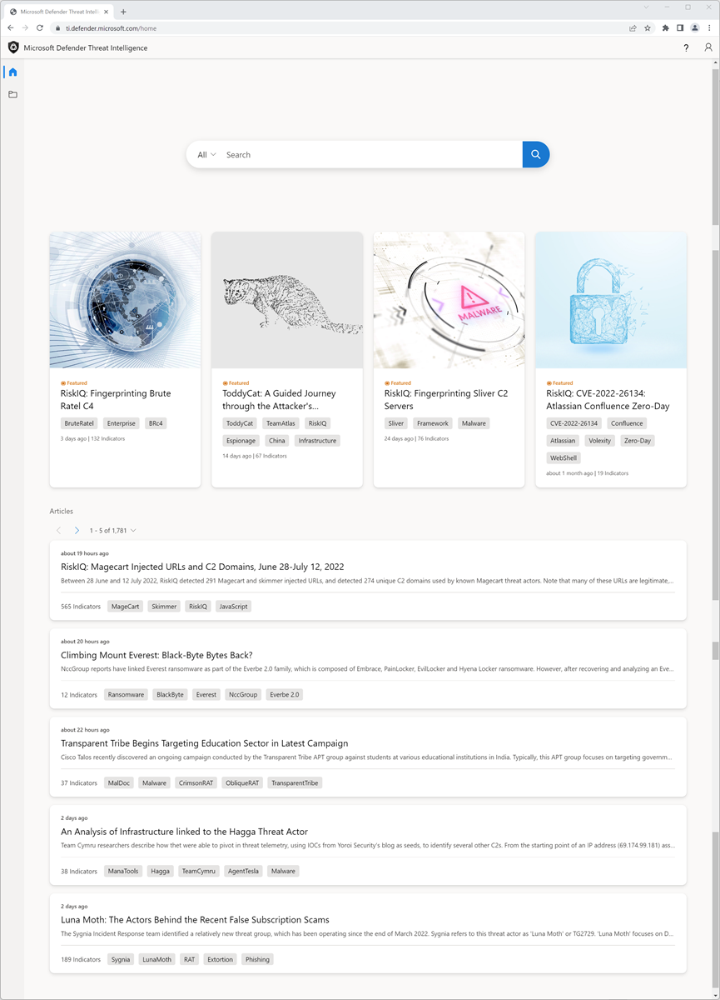

## Prerequisites

- An Azure Active Directory or personal Microsoft account. [Login or create an account](https://signup.microsoft.com/)
- A Microsoft Defender Threat Intelligence (Defender TI) Premium license.
    > [!Note]
    > Users without a Defender TI Premium license will still be able to log into the Defender Threat Intelligence Portal and access our free Defender TI offering.

## Open Defender TI’s Threat Intelligence Home Page

1. Access the [Defender Threat Intelligence Portal](https://ti.defender.microsoft.com/).
2. Complete Microsoft authentication to access portal.

## Performing threat intelligence searches and pivots

Defender TI’s Threat Intelligence search is both simple and powerful, designed to surface immediate key insights while also allowing users to directly interact with the datasets that comprise these insights. The search bar supports a wide variety of different inputs; users can search for specific artifacts as well as Article or Project names.

### Search artifact types
1. **IP address:** Search ‘195.161.141[.]65’ in the Threat Intelligence Search bar. This action results in an IP Address search.

    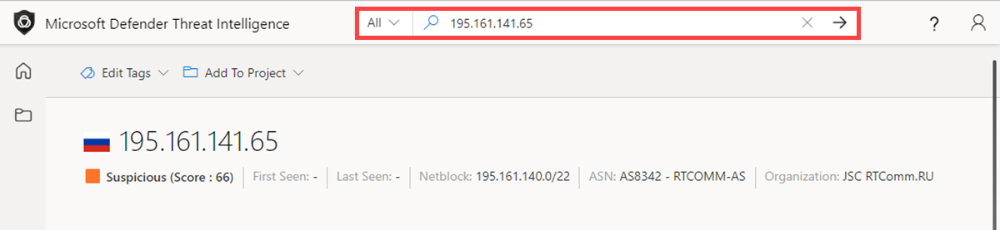

2. **Domain:** Search `fabrikam.com` in the Threat Intelligence Search bar. This action results in a Domain search.

    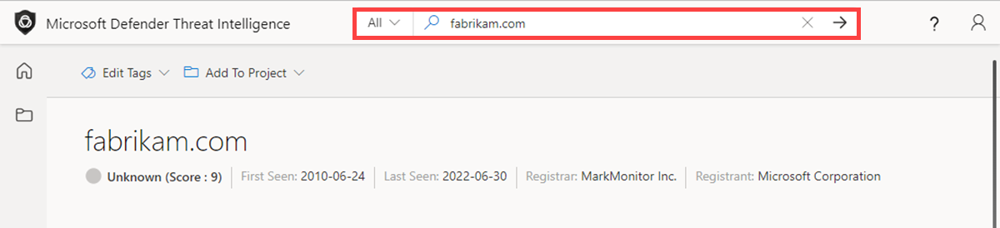

3. **Host:** Search `canary.fabrikam.com` in the Threat Intelligence Search bar. This action results in a Host search.

    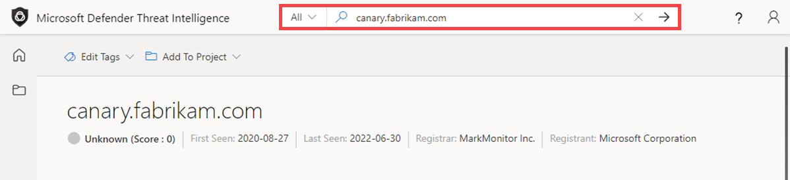

4. **Keyword:** Search ‘apt29’ in the Threat Intelligence Search bar. This action results in a Keyword search. Keyword searches cover any type of keyword, which may include a term, email address, etc. Keyword searches result in associations with articles, projects, as well as data sets.

    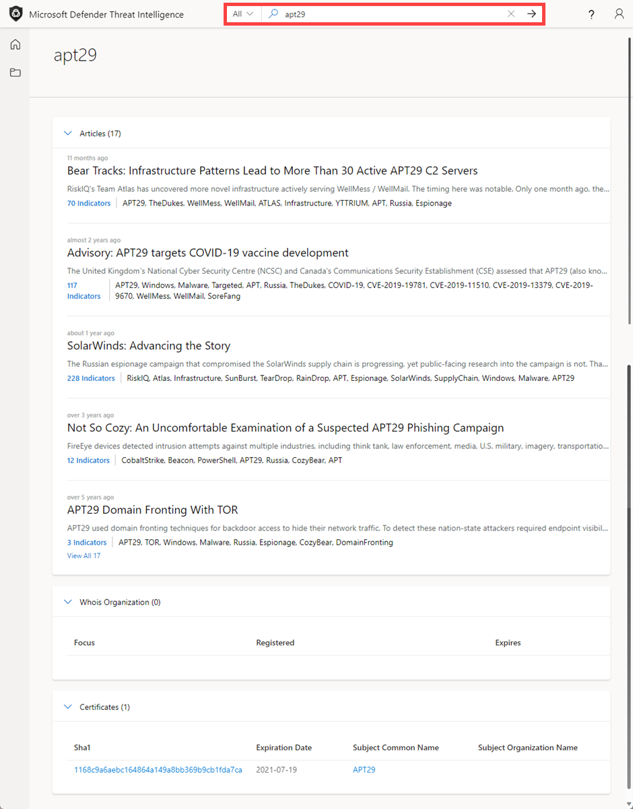

5. **CVE-ID:** Search ‘CVE-2021-40444’ in the Threat Intelligence Search bar. This action results in a CVE-ID Keyword search.

6. **Article:** Search ‘Commodity Skimming & Magecart Trends in First Quarter of 2022’ in the Threat Intelligence Search bar. This action results in an Article search.

    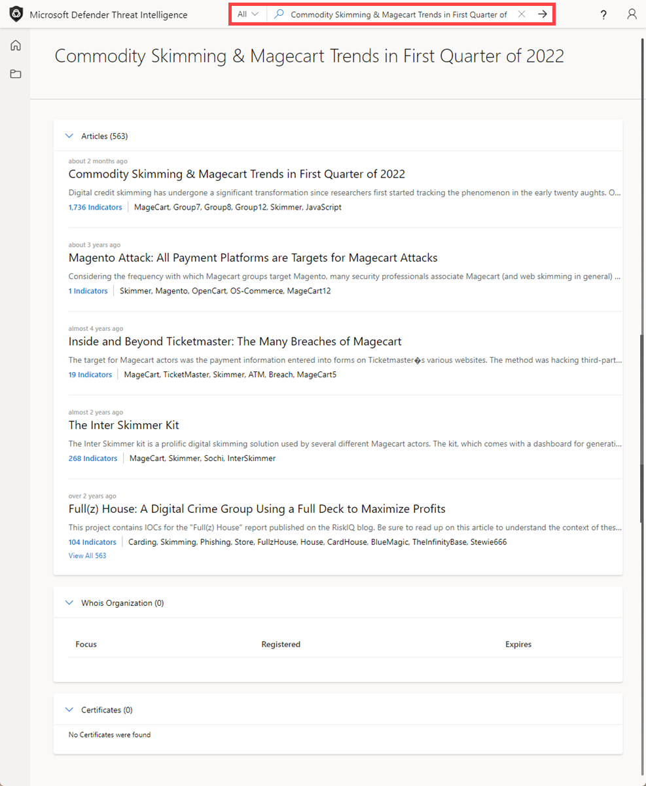

7. **Tag:** Select ‘Tag’ from the Threat Intelligence Search drop-down and type in ‘magecart’ in the Threat Intelligence Search bar. Press Enter or select the right-hand arrow to perform the search. This action results in a Tag search.

    > [!NOTE]
    > This does not return articles that share that tag value.

    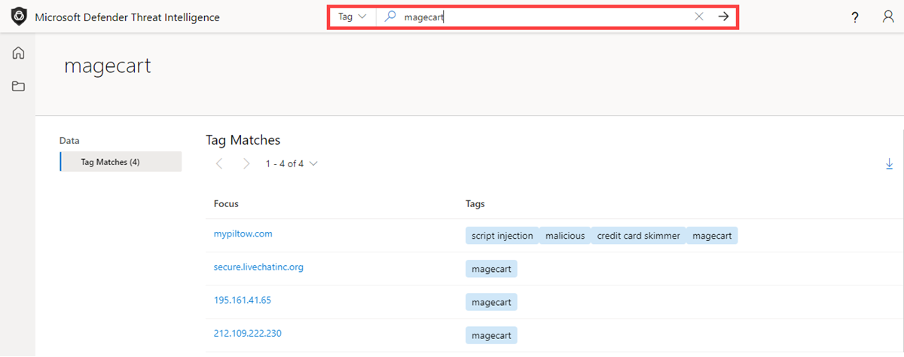

8. **Component:** Select ‘Component’ from the Threat Intelligence Search drop-down and type in ‘cobalt strike’ in the Threat Intelligence Search bar. Press Enter or select the right-hand arrow to perform the search. This action results in a Component search.

    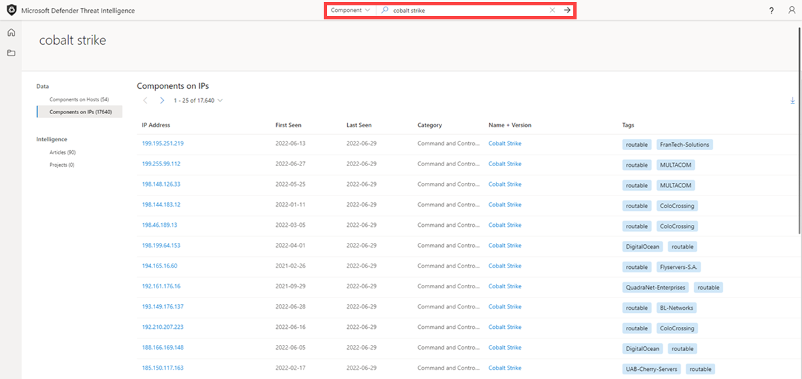

9. **Tracker:** Select ‘Trackers’ from the Threat Intelligence Search drop-down and type in ‘07d14d16d21d21d00042d41d00041d47e4e0ae17960b2a5b4fd6107fbb0926’ in the Threat Intelligence Search bar. Press Enter or select the right-hand arrow to perform the search. This action results in a Tracker search. Note: In this example, this was a JarmHash Tracker type.

    > [!NOTE]
    > In this example, this was a JarmHash Tracker type.

    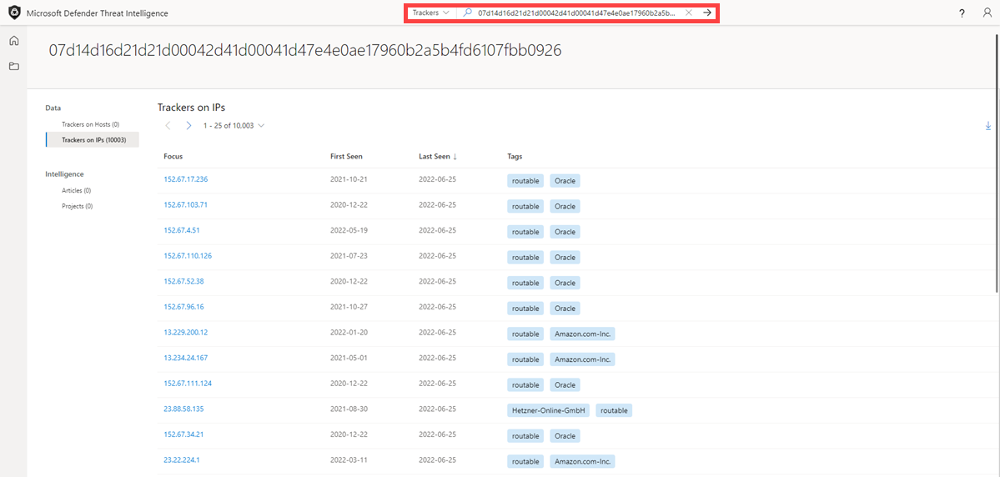

10. **WHOIS Email:** Select ‘WHOIS’ > ‘Email’ from the Threat Intelligence Search drop-down and type in domains@microsoft.com in the Threat Intelligence Search bar. Press Enter or select the right-hand arrow to perform the search. This action results in a WHOIS Email search.

    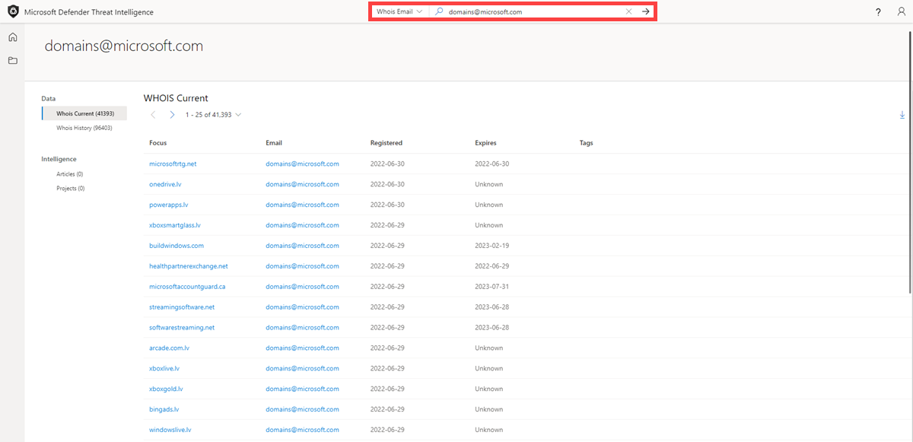

11. **WHOIS Name:** Select ‘WHOIS’ > ‘Name’ from the Threat Intelligence Search drop-down and type in ‘MSN Hostmaster’ in the Threat Intelligence Search bar. Press Enter or select the right-hand arrow to perform the search. This action results in a WHOIS Name search.

    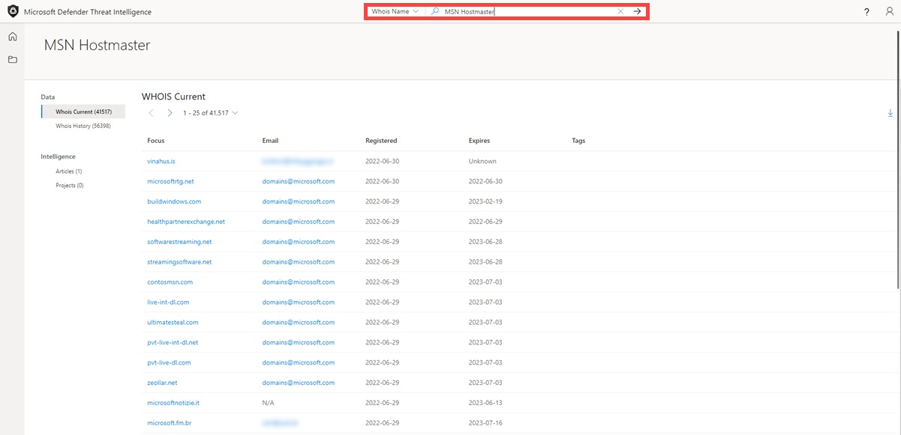

12. **WHOIS Organization:** Select ‘WHOIS’ > ‘Organization’ from the Threat Intelligence Search drop-down and type in ‘Microsoft Corporation’ in the Threat Intelligence Search bar. Press Enter or select the right-hand arrow to perform the search. This action results in a WHOIS Organization search.

    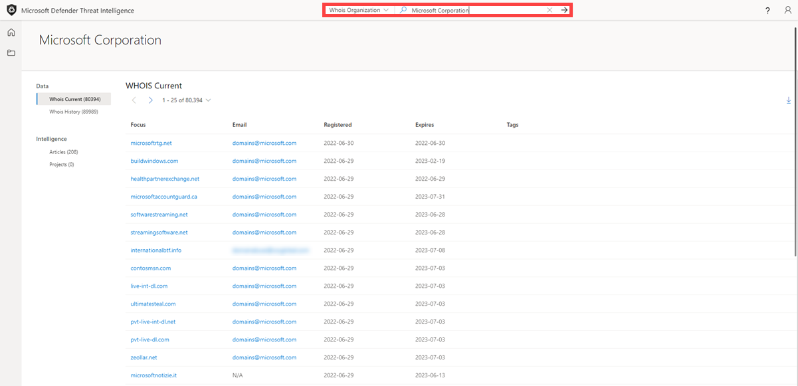

13. **WHOIS Address:** Select ‘WHOIS’ > ‘Address’ from the Threat Intelligence Search drop-down and type in ‘One Microsoft Way’ in the Threat Intelligence Search bar. Press Enter or select the right-hand arrow to perform the search. This action results in a WHOIS Address search.

    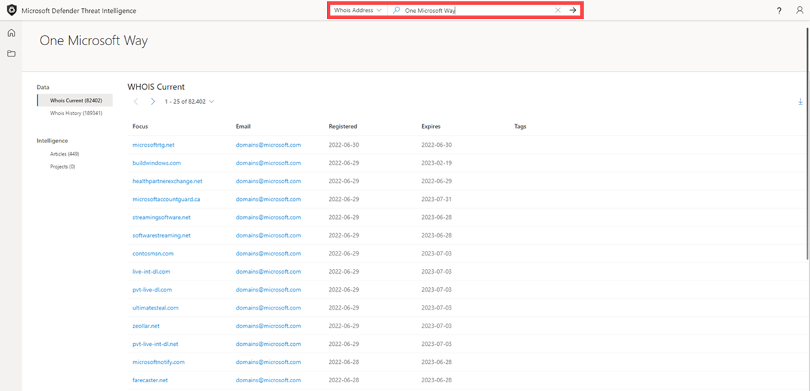

14. **WHOIS City:** Select ‘WHOIS’ > ‘City’ from the Threat Intelligence Search drop-down and type in ‘Redmond’ in the Threat Intelligence Search bar. Press Enter or select the right-hand arrow to perform the search. This action results in a WHOIS City search.

    

15. **WHOIS State:** Select ‘WHOIS’ > ‘State’ from the Threat Intelligence Search drop-down and type in ‘WA’ in the Threat Intelligence Search bar. Press Enter or select the right-hand arrow to perform the search. This action results in a WHOIS State search.

    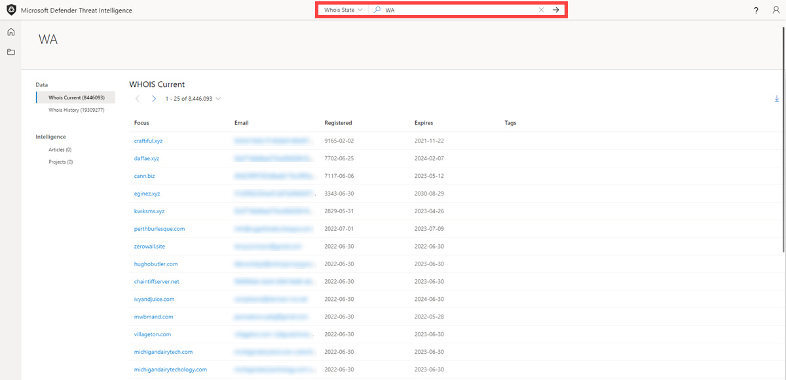

16. **WHOIS Postal Code:** Select ‘WHOIS’ > ‘Postal Code’ from the Threat Intelligence Search drop-down and type in ‘98052’ in the Threat Intelligence Search bar. Press Enter or select the right-hand arrow to perform the search. This action results in a WHOIS Postal Code search.

    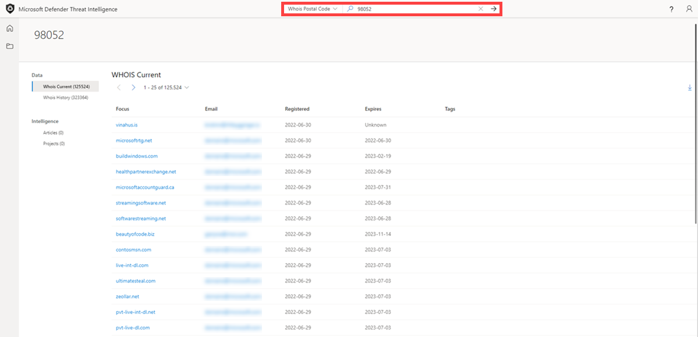

17. **WHOIS Country:** Select ‘WHOIS’ > ‘Country’ from the Threat Intelligence Search drop-down and type in ‘US’ in the Threat Intelligence Search bar. Press Enter or select the right-hand arrow to perform the search. This action results in a WHOIS Country/region search.

    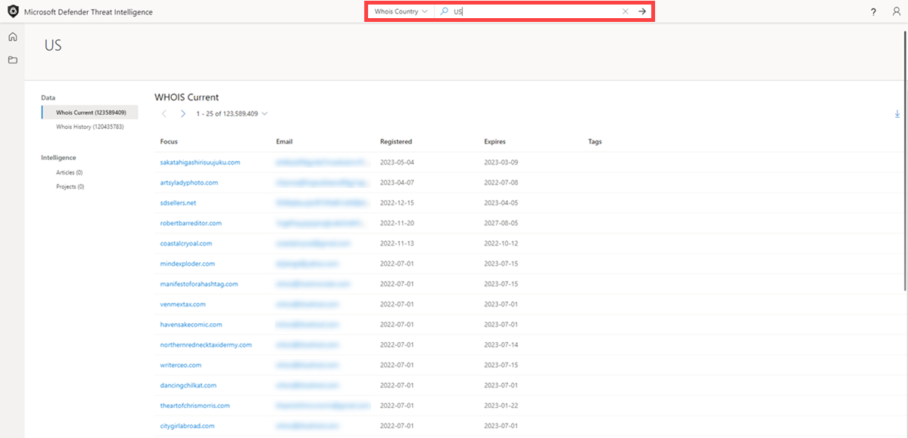

18. **WHOIS Phone:** Select ‘WHOIS’ > ‘Phone’ from the Threat Intelligence Search drop-down and type in ‘+1.4258828080’ in the Threat Intelligence Search bar. Press Enter or select the right-hand arrow to perform the search. This action results in a WHOIS Phone search.

    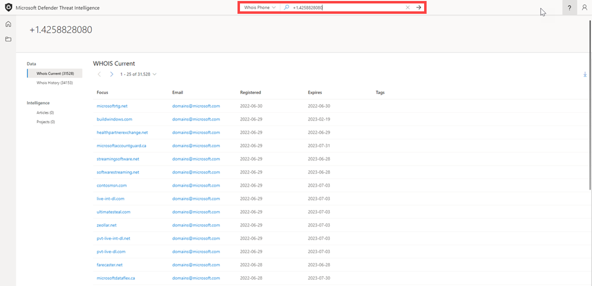

19. **WHOIS Nameserver:** Select ‘WHOIS’ > ‘Nameserver’ from the Threat Intelligence Search drop-down and type in `ns1-03.azure-dns.com` in the Threat Intelligence Search bar. Press Enter or select the right-hand arrow to perform the search. This action results in a WHOIS Nameserver search.

    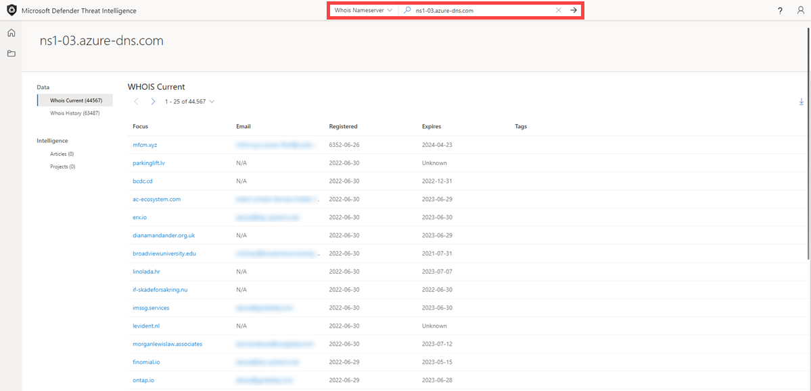

20. **Certificate SHA-1:** Select ‘Certificate’ > ‘SHA-1’ from the Threat Intelligence Search drop-down and type in ‘35cd04a03ef86664623581cbd56e45ed07729678’ in the Threat Intelligence Search bar. Press Enter or select the right-hand arrow to perform the search. This action results in a Certificate SHA-1 search.

    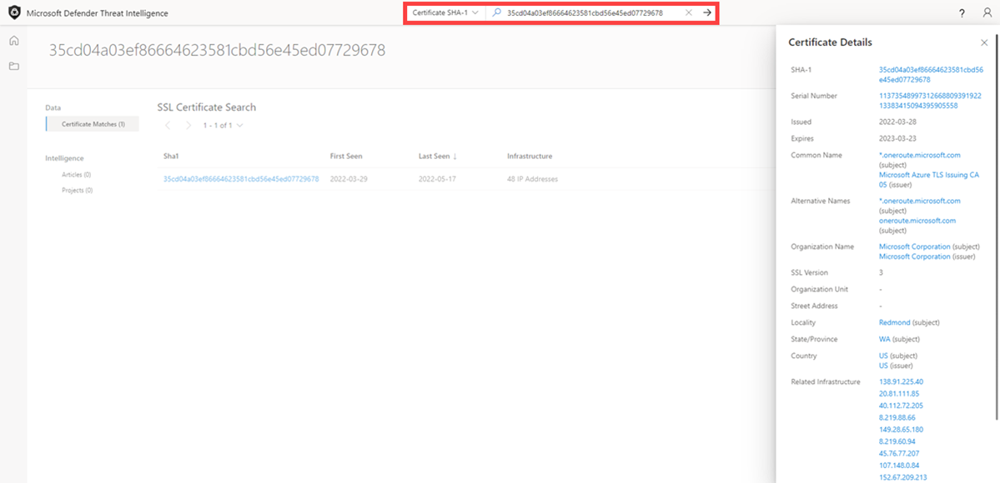

21. **Certificate Serial Number:** Select ‘Certificate’ > ‘Serial Number’ from the Threat Intelligence Search drop-down and type in ‘1137354899731266880939192213383415094395905558’ in the Threat Intelligence Search bar. Press Enter or select the right-hand arrow to perform the search. This action results in a Certificate Serial Number search.

    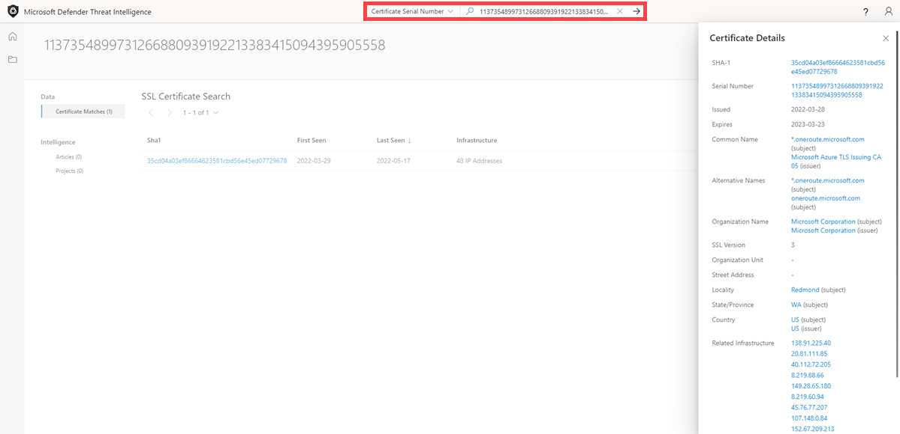

22. **Certificate Issuer Common Name:** Select ‘Certificate’ > ‘Issuer Common Name’ from the Threat Intelligence Search drop-down and type in ‘Microsoft Azure TLS Issuing CA 05’ in the Threat Intelligence Search bar. Press Enter or select the right-hand arrow to perform the search. This action results in a Certificate Issuer Common Name search.

    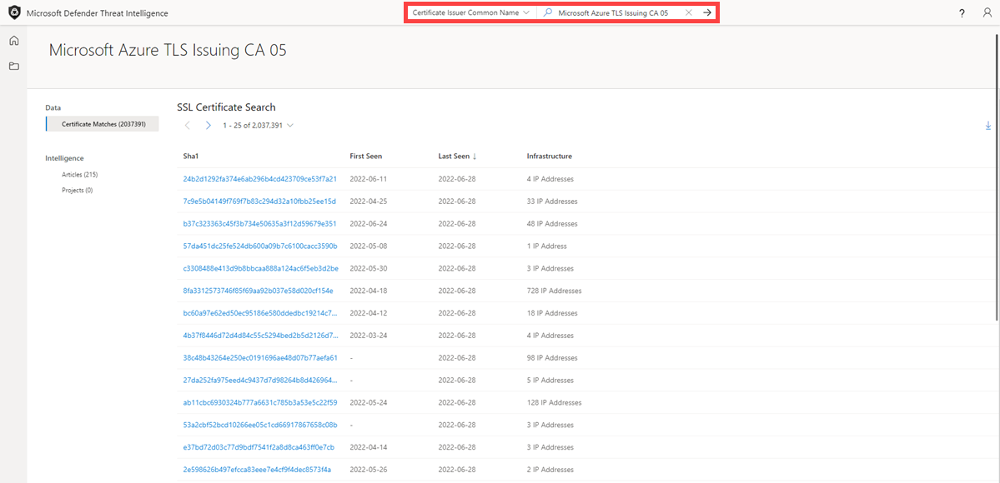

23. **Certificate Issuer Alternative Name:** Select ‘Certificate’ > ‘Issuer Alternative Name’ from the Threat Intelligence Search drop-down and type in a certificate issuer alternative name in the Threat Intelligence Search bar. Press Enter or select the right-hand arrow to perform the search. This action results in a Certificate Issuer Alternative Name search.

24. **Certificate Subject Common Name:** Select ‘Certificate’ > ‘Subject Common Name’ from the Threat Intelligence Search drop-down and type in `*.oneroute.microsoft.com` in the Threat Intelligence Search bar. Press Enter or select the right-hand arrow to perform the search. This action results in a Certificate Subject Common Name search.

    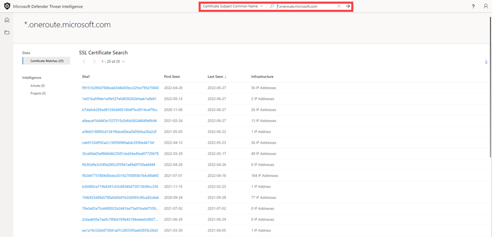

25. **Certificate Subject Alternative Name:** Select ‘Certificate’ > ‘Subject Alternative Name’ from the Threat Intelligence Search drop-down and type in `oneroute.microsoft.com` in the Threat Intelligence Search bar. Press Enter or select the right-hand arrow to perform the search. This action results in a Certificate Subject Alternative Name search.

    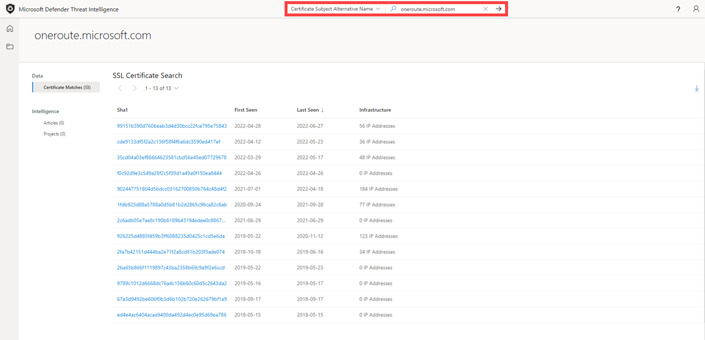

26. **Cookie Name:** Select ‘Cookie’ > ‘Name’ from the Threat Intelligence Search drop-down and type in ‘ARRAffinity’ in the Threat Intelligence Search bar. Press Enter or select the right-hand arrow to perform the search. This action results in a Cookie Name search.

    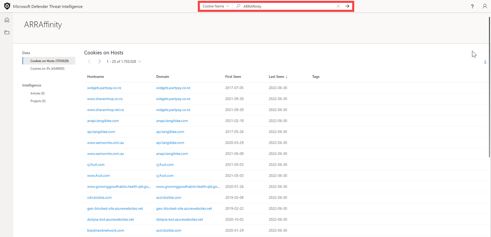

27. **Cookie Domain:** Select ‘Cookie’ > ‘Domain’ from the Threat Intelligence Search drop-down and type in `portal.fabrikam.com` in the Threat Intelligence Search bar. Press Enter or select the right-hand arrow to perform the search. This action results in a Cookie Domain search.

    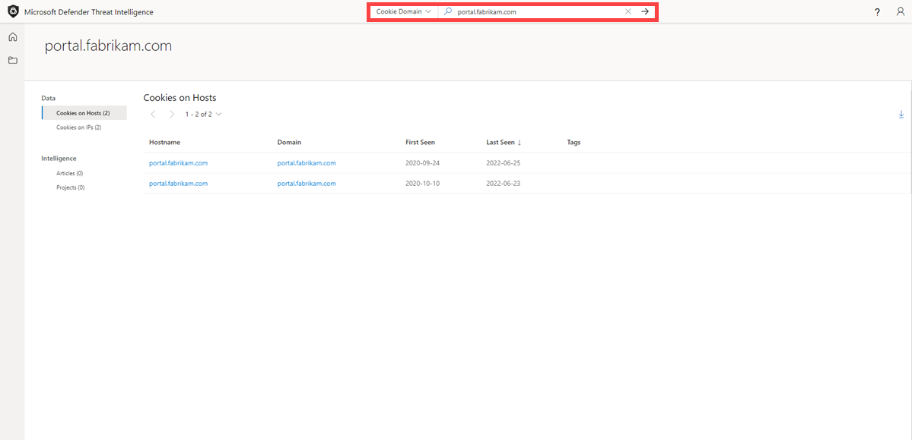

28. **Pivots:** For any of the searches performed in the steps above, there are artifacts with hyperlinks that you can pivot off to discover further enriched results associated with those indicators. Feel free to experiment with this on your own.

## Search results

### Key insights

At the top of the page, the platform provides some basic information about the artifact. This information can include the following, depending on the artifact type:  

- **Country:** the flag next to the IP Address indicates the country/region of origin for the artifact, which can help determine its reputability or security posture. This IP Address is hosted on infrastructure within the United States.
- **Reputation:** in this example, the IP Address is tagged with “Malicious” which indicates that the platform has detected connections between this artifact and known advisory infrastructure. Artifacts can also be tagged “Suspicious”, “Neutral” or “Unknown”.
- **First Seen:** this timestamp indicates when the artifact was first observed by the platform’s detection system. Understanding the lifespan of an artifact can help determine its reputability.
- **Last Seen:** this timestamp indicates when the artifact was last observed by the platform’s detection system. This helps determine whether the artifact is still actively used.
- **IP Block:** the IP block that includes the queried IP address artifact.
- **Registrar:** the registrar associated to the WHOIS record for the queried domain artifact.
- **Registrant:** the name of the registrant within the WHOIS data for an artifact.
- **ASN:** the ASN associated with the artifact.
- **OS:** the operating system associated with the artifact.
- **Host:** the hosting provider for the artifact. Some hosting providers are more reputable than others, so this value can help indicate the validity of an artifact.

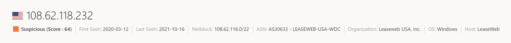

This section also shows any tags applied to the artifact or any projects that include it. Users can also add a tag or add the artifact to a project.

## Summary tab

### Overview

The results of a Threat Intelligence search are grouped into two tabs: “Summary” and “Data.” The Summary tab provides key insights about an artifact that the platform has derived from our expansive datasets. This section is designed to surface key findings that can help kickstart an investigation.

### Reputation

Defender TI provides proprietary reputation scores for any Host, Domain, or IP Address. Whether validating the reputation of a known or unknown entity, this score helps users quickly understand any detected ties to malicious or suspicious infrastructure. Reputation Scores are displayed as a numerical score with a range from 0 to 100. An entity with a score of “0” has no known associations to suspicious activity or known indicators of compromise; a score of “100” indicates that the entity is malicious. 
The platform provides a list of rules with a description and severity rating. In the example below, we see four “high severity” rules that are applicable to this domain.

For more information, see [Reputation scoring](reputation-scoring.md).

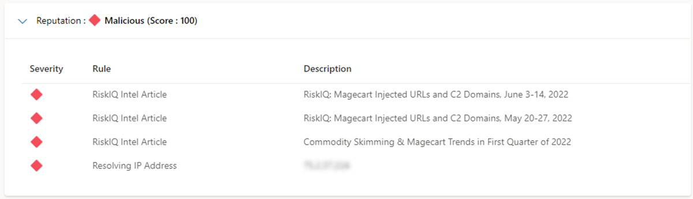

### Analyst insights

The Analyst Insights section provides quick insights about the artifact that may help determine the next step in an investigation. This section will list any insights that apply to the artifact and those that do not apply for additional visibility. In the below example, we can quickly determine that the IP Address is routable, hosts a web server, and had an open port within the past five days. Furthermore, the system displays rules that were not triggered, which can be equally helpful when kickstarting an investigation.

For more information, see [Analyst insights](analyst-insights.md).

### Articles

The Articles section displays any articles that may provide insight on how to best investigate and ultimately disarm the impacted artifact. These articles are written by researchers who study the behavior of known threat actors and their infrastructure, surfacing key findings that can help others mitigate risk to their organization. In this example, the searched IP Address has been identified as an IOC that relates to the findings within the article.

For more information, see [What is Microsoft Defender Threat Intelligence (Defender TI)?](index.md)

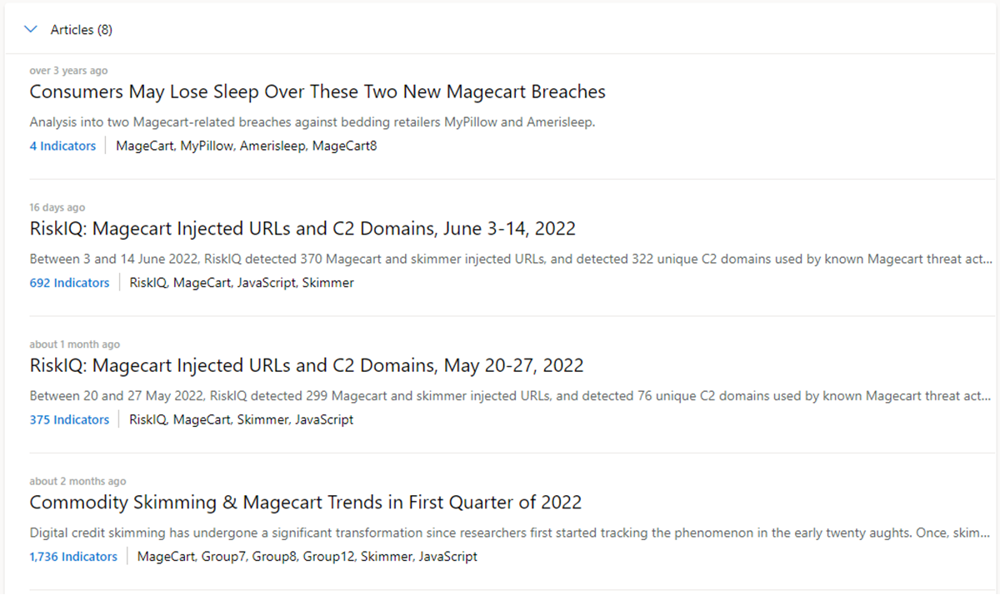

### Services

This section lists any detected services running on the IP address artifact. This is helpful when trying to understand the intended use of the entity. When investigating malicious infrastructure, this information can help determine the capabilities of an artifact, enabling users to proactively defend their organization based on this information

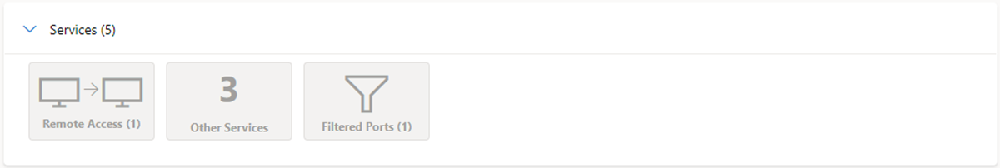

### Resolutions

Resolutions are individual DNS records captured using passive sensors distributed throughout the world. These values reveal a history of how a Domain or IP address changes infrastructure over time. They can be used to discover additional infrastructure and measure risk based on levels of connection. For each resolution, we provide “first seen” and “last seen” timestamps to showcase the lifecycle of the resolutions.

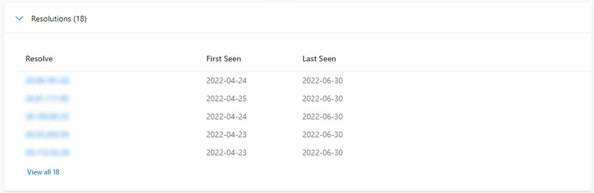

### Certificates

Beyond securing your data, SSL Certificates are a fantastic way for users to connect disparate network infrastructure. SSL certificates can make connections that passive DNS or WHOIS data may miss. This means more ways of correlating potential malicious infrastructure and identifying potential operational security failures of actors. For each SSL certificate, we provide the certificate name, expiration date, subject common name, and subject organization name.

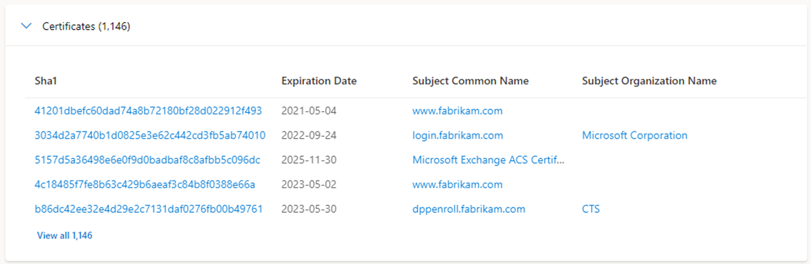

### Projects

The Defender TI platform allows users to create projects for organizing indicators of interest or compromise from an investigation. Projects are also created to monitor connecting artifacts for improved visibility. Projects contain a listing of all associated artifacts and a detailed history that retains the names, descriptions, collaborators, and monitoring profiles.

When a user searches an IP address, domain, or host, if that indicator is listed within a project the user has access to, the user can select the Projects tab and navigate to the details of the project for more context about the indicator before reviewing the other data sets for more information.

For more information, see [Using projects](using-projects.md).

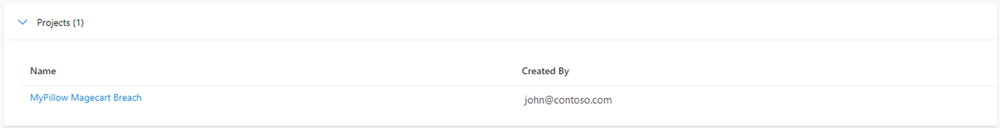

## Data tab

### Overview

The Data tab helps users deep-dive into the tangible connections observed by the Defender TI platform. While the Summary tab surfaces key findings to provide immediate context about an artifact, the Data tab enables analysts to study these connections much more granularly. Users can click on any returned value to pivot across any related metadata.

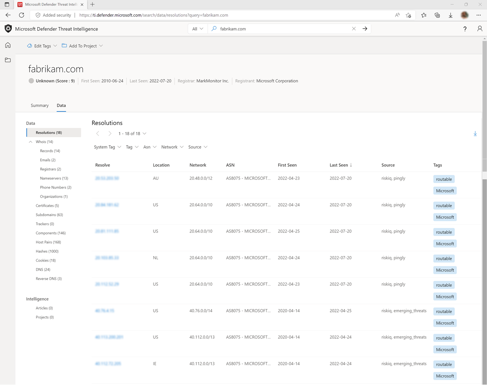

### Data types

The following datasets are available in Defender TI:

- Resolutions
- WHOIS
- Certificates
- Trackers
- Subdomains
- Components
- Host Pairs
- Cookies
- Services
- DNS
- Reverse DNS

These separate datasets will appear in separate tabs after submitting a search. The results are clickable, enabling a user to quickly pivot across related infrastructure to unveil insights that may have been missed with traditional investigative methods.

### Resolutions

Passive DNS is a system of record that stores DNS resolution data for a given location, record, and timeframe. This historical resolution data set allows users to view which domains resolved to an IP address and vice versa. This data set allows for time-based correlation based on domain or IP overlap.

PDNS may enable the identification of previously unknown or newly stood-up threat actor infrastructure. Proactive addition of indicators to blocklists can cut off communication paths before campaigns take place. Users will find A record resolution data within the Resolutions data set tab and will find more types of DNS records in the DNS data set tab.

Our PDNS resolution data includes the following:
- **Resolve:** the name of the resolving entity (either an IP Address or Domain)
- **Location:** the location the IP address is hosted in.
- **Network:** the netblock or subnet associated with the IP address.
- **ASN:** the autonomous system number and organization name
- **First Seen:** a timestamp that displays the date that we first observed this resolution.
- **Last Seen:** a timestamp that displays the date that we last observed this resolution.
- **Source:** the source that enabled the detection of the relationship.
- **Tags:** any tags applied to this artifact in the Defender TI system.

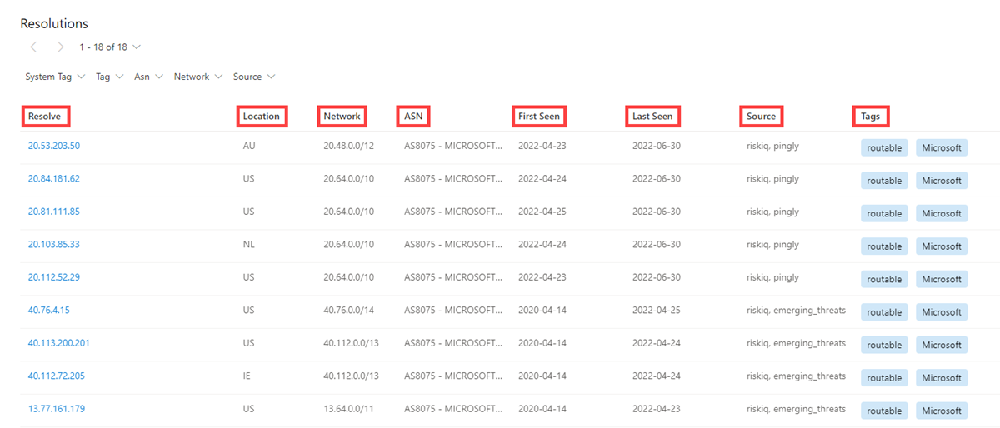

### WHOIS

WHOIS is a protocol that lets anyone query information about the ownership of a domain, IP address, or subnet. One of the most common functions for WHOIS in threat infrastructure research is to identify or connect disparate entities based on unique data shared within WHOIS records.

Each WHOIS record has several different sections, all of which could include different information. Commonly found sections include “registrar”, “registrant”, “administrator”, and “technical” with each potentially corresponding to a different contact for the record. A lot of the time this data is duplicated across sections, but in some cases, there may be slight discrepancies, especially if an actor made a mistake. When viewing WHOIS information within Defender TI, you will see a condensed record that de-duplicates any data and notates which part of the record it came from.

Users can also view historic WHOIS records to understand how the registration data has changed over time.

Our WHOIS data includes the following:

- **Record Updated:** a timestamp that indicates the day a WHOIS record was last updated.
- **Last Scanned:** the date that the Defender TI system last scanned the record.
- **Expiration:** the expiration date of the registration, if available.
- **Created:** the age of the current WHOIS record.
- **WHOIS Server:** the server is set up by an ICANN accredited registrar to acquire up-to-date information about domains that are registered within it.
- **Registrar:** the registrar service used to register the artifact.
- **Domain Status:** the current status of the domain. An ”active" domain is live on the internet.
- **Email:** any email addresses found in the WHOIS record, and the type of contact each one is associated with (e.g. admin, tech).
- **Name:** the name of any contacts within the record, and the type of contact each is associated with.
- **Organization:** the name of any organizations within the record, and the type of contact each is associated with.
- **Street:** any street addresses associated to the record, and the type of contact it is associated with.
- **City:** any city listed in an address associated to the record, and the type of contact it is associated with.
- **State:** any states listed in an address associated to the record, and the type of contact it is associated with.
- **Postal Code:** any postal codes listed in an address associated with the record, and the type of contact it is associated with.
- **Country:** any countries/regions listed in an address associated to the record, and the type of contact it is associated with.
- **Phone:** any phone numbers listed in the record, and the type of contact it is associated with.
- **Name Servers:** any name servers associated with the registered entity.

### Certificates

Beyond securing your data, SSL Certificates are a fantastic way for users to connect disparate network infrastructure. Modern scanning techniques allow us to perform data requests against every node on the Internet in a matter of hours, meaning we can easily associate a certificate to an IP address hosting it on a regular basis.

Much like a WHOIS record, SSL certificates require information to be supplied by the user to generate the final product. Aside from the domain, the SSL certificate is being created for (unless self-signed), any of the additional information can be made up by the user. Where our users see the most value from SSL certificates is not necessarily the unique data someone may use when generating the certificate, but where it's hosted.

What makes SSL certificates more valuable is that they can make connections that passive DNS or WHOIS data may miss. This means more ways of correlating potential malicious infrastructure and identifying potential operational security failures of actors. Microsoft has collected over 30 million certificates from 2013 until the present day and provides users with the tools to make correlations on certificate content and history.

Our certificate data includes the following:

- **Sha1:** The SHA1 algorithm hash for an SSL Cert asset.
- **First Seen:** a timestamp that displays the date that we first observed this certificate on an artifact.
- **Last Seen:** a timestamp that displays the date that we last observed this certificate on an artifact.
- **Infrastructure:** any related infrastructure associated with the certificate.

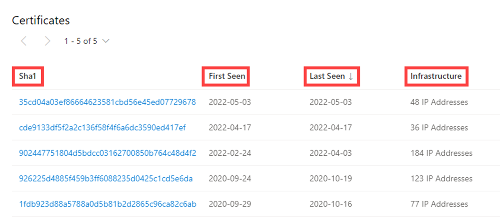

When a user clicks on a Sha1 hash, the user will be able to see details about the certificate in the right-hand pane, which includes:

- **Serial Number:** The serial number associated with an SSL certificate.
- **Issued:** The date when a certificate was issued.
- **Expires:** The date when a certificate will expire.
- **Subject Common Name:** The Subject Common Name for any associated SSL Certs.
- **Issuer Common Name:** The Issuer Common Name for any associated SSL Certs.
- **Subject Alternative Name(s):** Any alternative common names for the SSL Cert.
- **Issuer Alternative Name(s):** Any additional names of the issuer.
- **Subject Organization Name:** The organization linked to the SSL certificate registration.
- **Issuer Organization Name:** The name of the organization that orchestrated the issue of a certificate.
- **SSL Version:** The version of SSL that the certificate was registered with.
- **Subject Organization Unit:** Optional metadata that indicates the department within an organization that is responsible for the certificate.
- **Issuer Organization Unit:** Additional information about the organization issuing the certificate.
- **Subject Street Address:** The street address where the organization is located.
- **Issuer Street Address:** The street address where the issuer organization is located.
- **Subject Locality:** The city where the organization is located.
- **Issuer Locality:** The city where the issuer organization is located.
- **Subject State/Province:** The state or province where the organization is located.
- **Issuer State/Province:** The state or province where the issuer organization is located.
- **Subject Country:** The country/region where the organization is located.
- **Issuer Country:** The country/region where the issuer organization is located.
- **Related Infrastructure:** any related infrastructure associated with the certificate.

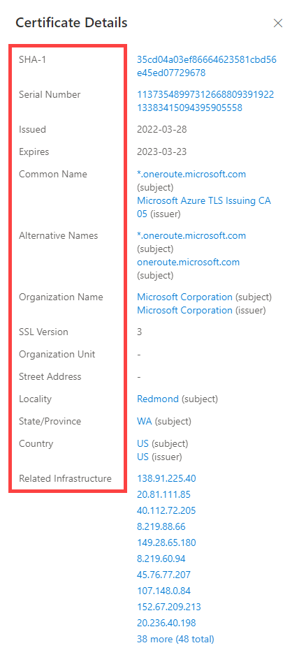

### Subdomains

A subdomain is an internet domain, which is part of a primary domain. Subdomains are also referred to as "hosts". As an example, `learn.microsoft.com` is a subdomain of `microsoft.com`. For every subdomain, there could be a new set of IP addresses to which the domain resolves to and this can be a great data source for finding related infrastructure.

Our subdomain data includes the following:

- **Hostname:** the subdomain associated with the domain that was searched.
- **Tags:** any tags applied to this artifact in the Defender TI system.

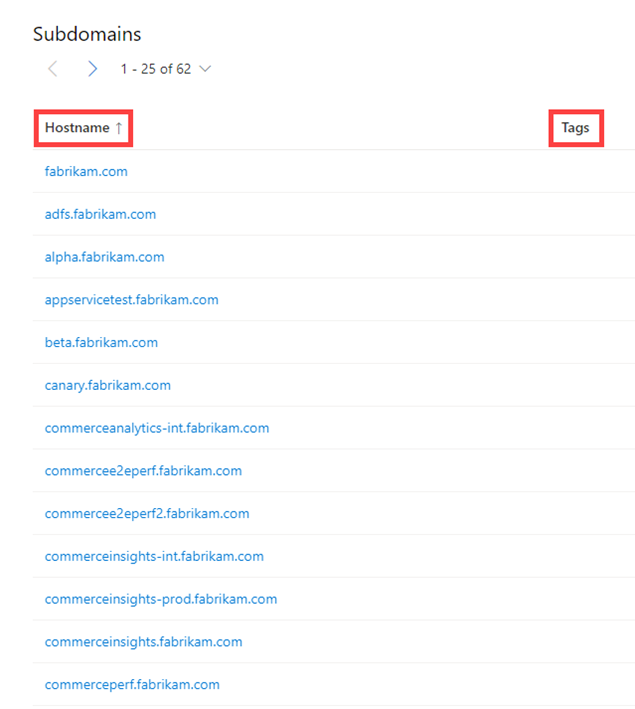

### Trackers

Trackers are unique codes or values found within web pages and often used to track user interaction. These codes can be used to correlate a disparate group of websites to a central entity. Often, actors will copy the source code of a victim’s website they are looking to impersonate for a phishing campaign. Seldomly will actors take the time to remove these IDs that allow users to identify these fraudulent sites using our Trackers data sets.

Microsoft’s Tracker data set includes IDs from providers like Google, Yandex, Mixpanel, New Relic, Clicky, and is continuing to grow on a regular basis.

Our tracker data includes the following:

- **Hostname:** the hostname that hosts the infrastructure where the tracker was detected.
- **First Seen:** a timestamp that displays the date that we first observed this tracker on the artifact.
- **Last Seen:** a timestamp that displays the date that we last observed this tracker on the artifact.
- **Type:** the type of tracker that was detected (e.g. GoogleAnalyticsID, JarmHash).
- **Value:** the identification value for the tracker.
- **Tags:** any tags applied to this artifact in the Defender TI system.

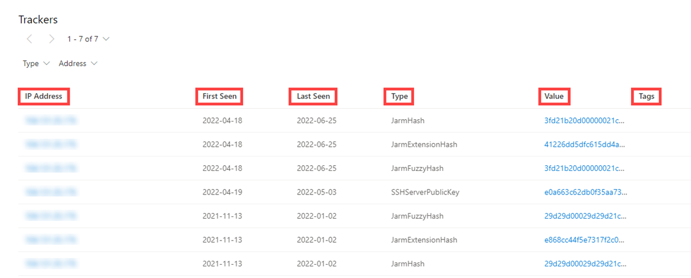

### Components

Web components are details describing a web page or server infrastructure gleaned from Microsoft performing a web crawl or scan. These components allow a user to understand the makeup of a webpage or the technology and services driving a specific piece of infrastructure.

Pivoting on unique components can find actors' infrastructure or other sites that are compromised. Users can also understand if a website might be vulnerable to a specific attack or compromise based on the technologies that it is running.

Our component data includes the following:

- **Hostname:** the hostname that hosts the infrastructure where the component was detected.
- **First Seen:** a timestamp of the date that we first observed this component on the artifact.
- **Last Seen:** a timestamp of the date that we last observed this component on the artifact.
- **Category:** the type of component that was detected (e.g. Operating System, Framework, Remote Access, Server).
- **Name + Version:** the component name and the version running on the artifact (e.g. Microsoft IIS (v8.5).
- **Tags:** any tags applied to this artifact in the Defender TI system.

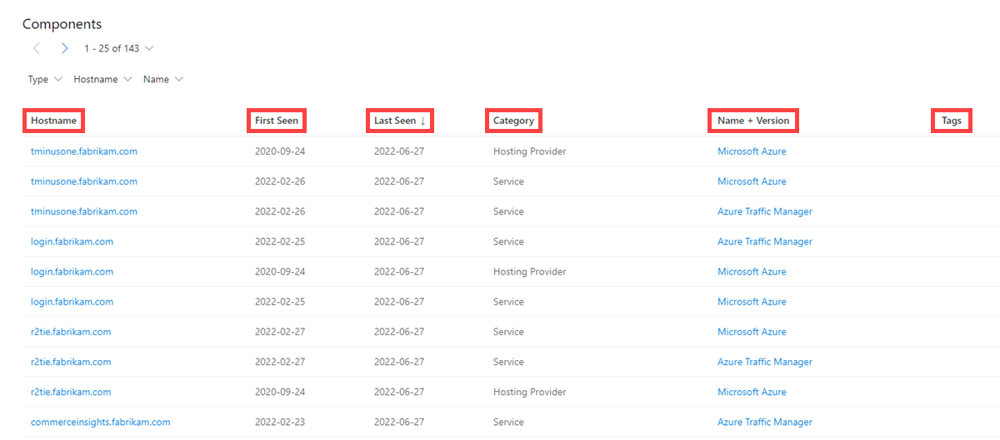

### Host pairs

Host pairs are two pieces of infrastructure (a parent and a child) that share a connection observed from a Microsoft’s virtual user’s web crawl. The connection could range from a top-level redirect (HTTP 302) to something more complex like an iframe or script source reference.

Our host pair data includes the following:

- **Parent Hostname:** the hostname that redirects or otherwise connects to any child hostnames.
- **Child Hostname:** the hostname that connects to the parent hostname. This value is the result of a redirect or other more complex connection.
- **First Seen:** the date that we first observed this host pair relationship on the artifact.
- **Last Seen:** the date that we last observed this host pair relationship on the artifact.
- **Cause:** the type of connection between the parent and child hostname. Potential causes include redirects, img.src, css.import or script.src connections.
- **Tags:** any tags applied to this artifact in the Defender TI system.

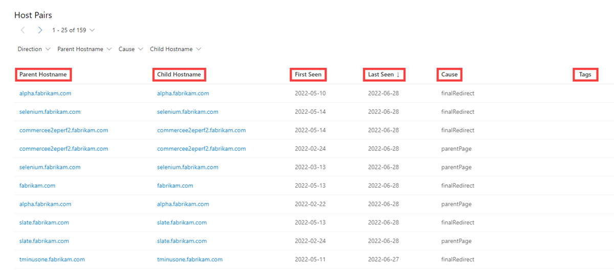

### Cookies

Cookies are small pieces of data sent from a server to a client as the user browses the internet. These values sometimes contain a state for the application or little bits of tracking data. We highlight and index cookie names observed when crawling a website and allow users to dig into everywhere the system has observed specific cookie names across its crawling and data collection.

Our cookie data includes the following:

- **Hostname:** the host infrastructure that is associated with the cookie.
- **First Seen:** a timestamp of the date that we first observed this cookie on the artifact.
- **Last Seen:** a timestamp of the date that we last observed this cookie on the artifact.
- **Name:** the name of the cookie (e.g. JSESSIONID, SEARCH_NAMESITE).
- **Domain:** the domain associated with the cookie.
- **Tags:** any tags applied to this artifact in the Defender TI system.

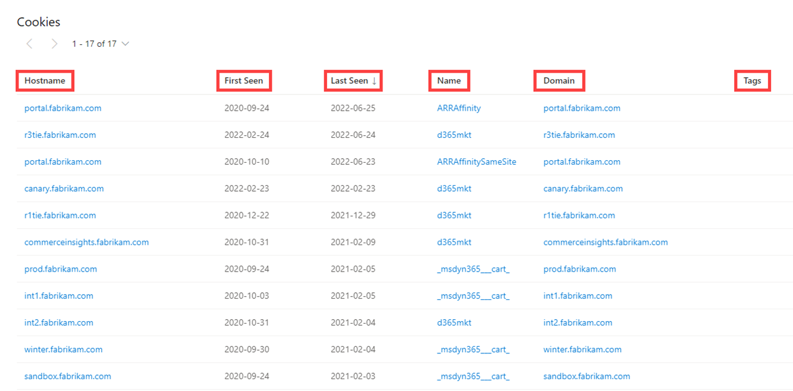

### Services
Service names and port numbers are used to distinguish between different services that run over transport protocols such as TCP, UDP, DCCP, and SCTP. Port numbers can suggest what type of application is running on a particular port. But applications or services can be changed to use a different port to obfuscate or hide the service or application on an IP address. Knowing the port and header/banner information can identify the true application/service and the combination of ports being used. Defender TI surfaces 14 days of history within the Services tab, displaying the last banner response associated with a port observed.

Our Services data includes the following:

- Open ports observed
- Port numbers
- Components
- Number of times the service was observed
- When the port was last scanned
- Protocol connection
- Status of the port
   - Open
   - Filtered
   - Closed
- Banner response

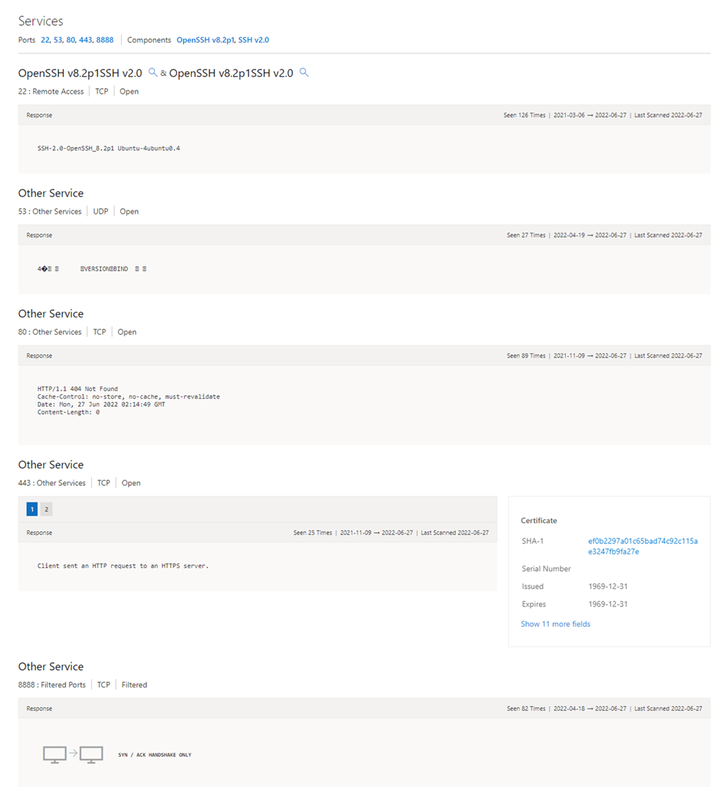

### DNS

Microsoft has been collecting DNS records over the years, providing users insight into mail exchange (MX) records, nameserver (NS) records, text (TXT) records, start of authority (SOA) records, canonical name (CNAME) records, and pointer (PTR) records. Reviewing DNS records can be helpful to identify shared infrastructure used by actors across the domains they own. For example, actor groups tend to use the same nameservers to segment their infrastructure or the same mail exchange servers to administer their command and control. 

Our DNS data includes the following:

- **Value:** the value of the DNS record.
- **First Seen:** a timestamp of the date that we first observed this record on the artifact.
- **Last Seen:** a timestamp of the date that we last observed this record on the artifact.
- **Type:** the type of infrastructure associated with the record. Potential options include Mail Servers (MX), text files (TXT), name servers (NS), CNAMES, and Start of Authority (SOA) records.
- **Tags:** any tags applied to this artifact in the Defender TI system.

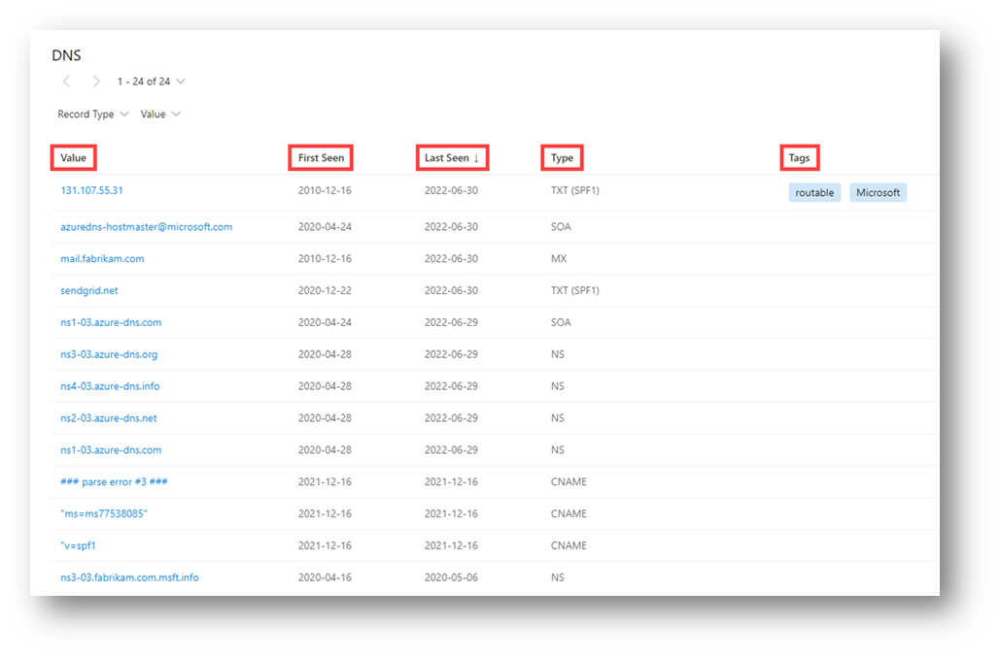

### Reverse DNS

While a forward DNS lookup queries the IP address of a certain hostname, a reverse DNS lookup queries a specific hostname of an IP address. This dataset will show comparable results as the DNS dataset. Reviewing DNS records can be helpful to identify shared infrastructure used by actors across the domains they own. For example, actor groups tend to use the same nameservers to segment their infrastructure or the same mail exchange servers to administer their command and control.

Our reverse DNS data includes the following:

- **Value:** the value of the Reverse DNS record.
- **First Seen:** a timestamp of the date that we first observed this record on the artifact.
- **Last Seen:** a timestamp of the date that we last observed this record on the artifact.
- **Type:** the type of infrastructure associated with the record. Potential options include Mail Servers (MX), text files (TXT), name servers (NS), CNAMES, and Start of Authority (SOA) records.
- **Tags:** any tags applied to this artifact in the Defender TI system.

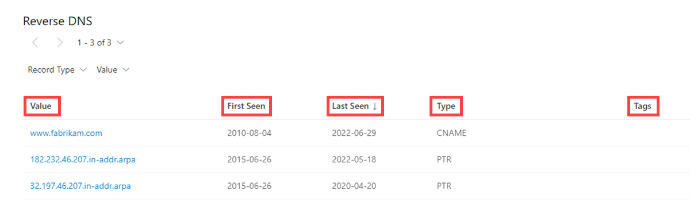

### Intelligence

The intelligence section highlights any curated insights in the Defender TI platform, whether derived from our Research Team via Articles or your own team via Projects. The Intelligence section helps users understand key additional context behind a queried artifact; analysts can learn from the investigation efforts of the larger security community to jumpstart their own.

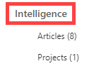

### Articles

The Articles section displays any articles that may provide insight on how to best investigate and ultimately disarm the impacted artifact. These articles are written by researchers who study the behavior of known threat actors and their infrastructure, surfacing key findings that can help others mitigate risk to their organization. In this example, the searched IP Address has been identified as an IOC that relates to the findings within the article.

For more information, see [What is Microsoft Defender Threat Intelligence (Defender TI)?](index.md)

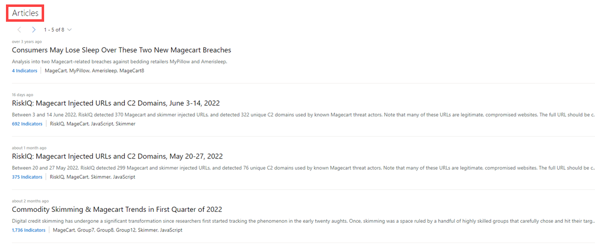

### Projects

One of the primary byproducts from infrastructure analysis is almost always a set of indicators that tie back to a threat actor or group of actors. These indicators serve as a way of identifying threat actors when they initiate an attack campaign. Developing insight into adversary’s tactics, techniques, and procedures (TTPs) of how the threat actors operate. Projects provide a method to identify adversaries by their TTPs and to track how the adversary’s infrastructure is changing over time.

When a user searches an IP address, domain, or host in Defender TI, if that indicator is listed within a project the user has access to, the user can select the Projects blade within the Intelligence section and navigate to the details of the project for more context about the indicator before reviewing the other data sets for more information.

Visiting a project's details shows a listing of all associated artifacts and a detailed history that retains all the context described above. Users within the same organization no longer need to spend time communicating back and forth. Threat actor profiles can be built within Defender TI and serve as a "living" set of indicators. As new information is discovered or found, it can be added to that project.

The Defender TI platform allows users to develop multiple project types for organizing indicators of interest and indicators of compromise from an investigation.

For more information, see [Using projects](using-projects.md).

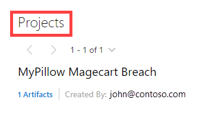

## Next steps

For more information, see:

- [Sorting, filtering, and downloading data](sorting-filtering-and-downloading-data.md)
- [Data sets](data-sets.md)
- [Reputation scoring](reputation-scoring.md)
- [Analyst insights](analyst-insights.md)
- [What is Microsoft Defender Threat Intelligence (Defender TI)?](index.md)
- [Using projects](using-projects.md)
