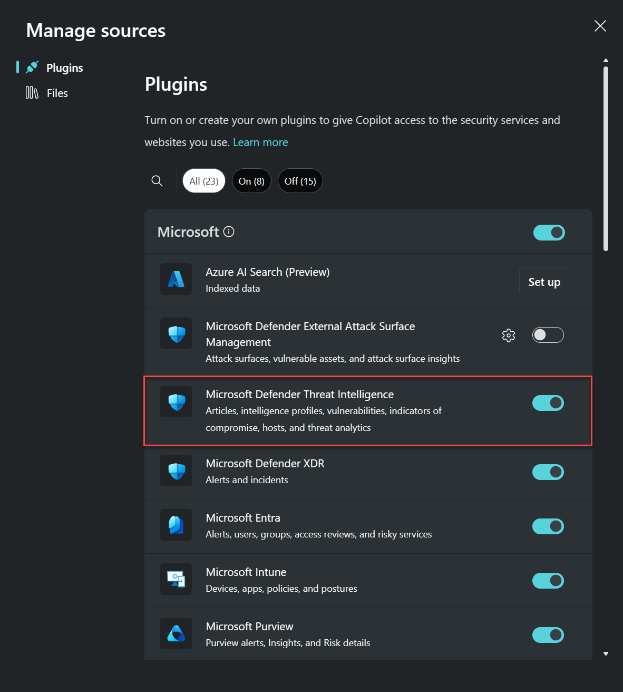

# Microsoft Copilot for Security and Microsoft Defender Threat Intelligence

Microsoft Copilot for Security is a cloud-based AI platform that provides natural language copilot experience. It can help support security professionals in different scenarios, like incident response, threat hunting, and intelligence gathering. For more information about what it can do, read [What is Microsoft Copilot for Security?](/security-copilot/microsoft-security-copilot).

**Copilot for Security integrates with Microsoft Defender Threat Intelligence**

Copilot for Security delivers information about threat actors, indicators of compromise (IOCs), and tools, as well as contextual threat intelligence from Microsoft Defender Threat Intelligence (Defender TI). You can use the prompts and promptbooks to investigate incidents, enrich your hunting flows with threat intelligence information, or gain more knowledge about your organization's or the global threat landscape. 

This article introduces you to Copilot and includes sample prompts that can help Defender TI users.

## Know before you begin
- You can experience the integration of Copilot for Security with Defender TI through the [dedicated site](#using-copilot-for-security-standalone-site-to-get-threat-intelligence) (also known as the **standalone** experience) or through the [Microsoft Defender portal](#using-microsoft-copilot-in-defender-to-get-threat-intelligence) (**embedded** experience). [Learn more about Microsoft Copilot for Security experiences](/security-copilot/experiences-security-copilot)
- Be clear and specific with your prompts. You might get better results if you include specific threat actor names or IOCs in your prompts. It might also help if you add **threat intelligence** to your prompt, like:
  - Show me threat intelligence data for Aqua Blizzard.
  - Summarize threat intelligence data for "malicious.com."
- Be specific when referencing an incident (for example, "incident ID 15324").
- Experiment with different prompts and variations to see what works best for your use case. Chat AI models vary, so iterate and refine your prompts based on the results you receive.
- Copilot for Security saves your prompt sessions. To see the previous sessions, from the Copilot [Home menu](/security-copilot/navigating-security-copilot#home-menu), go to **My sessions**.
    
    

    > [!NOTE]
    > For a walkthrough on Copilot, including the pin and share feature, read [Navigate Microsoft Copilot for Security](/security-copilot/navigating-security-copilot).

[Learn more about creating effective prompts](/security-copilot/prompting-tips)

## Using Copilot for Security standalone site to get threat intelligence

1.	Go to [Microsoft Copilot for Security](https://go.microsoft.com/fwlink/?linkid=2247989) and sign in with your credentials.
2.	Make sure that the Defender TI plugin is turned on. In the prompt bar, select the **Sources** icon then choose **Plugins**. 
   
      

    In the **Manage plugins** pop-up window that appears, confirm that the **Microsoft Defender Threat Intelligence** toggle is turned on, then close the window.

    

    > [!NOTE]
    > Some roles can turn the toggle on or off for plugins like Defender TI. For more information, read [Manage plugins in Microsoft Copilot for Security](/security-copilot/manage-plugins).

3. Enter your prompt in the prompt bar.

### Built-in system features

Copilot for Security has built-in system features that can get data from the different plugins that are turned on.

To view the list of built-in system capabilities for Defender TI:

1.	In the prompt bar, select the **Prompts** icon.
2.	Select **See all system capabilities**. The *Microsoft Defender Threat Intelligence* section lists all the available capabilities for Defender TI that you can use.

Copilot also has the following promptbooks that also deliver information from Defender TI:
- **Vulnerability impact assessment** - Generates a report summarizing the intelligence for a known vulnerability, including steps on how to address it.
- **Threat actor profile** - Generates a report profiling a known threat actor, including suggestions to defend against their common tools and tactics.

To view these promptbooks, in the prompt bar, select the **Prompts** icon then select **Promptbooks**. 

### Sample prompts for Defender TI

You can use many prompts to get information from Defender TI. This section lists some ideas and examples.

#### General information about threat intelligence trends

Get threat intelligence from threat articles and threat actors.

**Sample prompts** :

- Summarize the recent threat intelligence.
- Show me the latest threat articles.
- Get threat articles related to ransomware in the last six months.

#### IP address and host contextual information in relation to threat intelligence

Get information on datasets associated with IP addresses and hosts, such as ports, reputation scores, components, certificates, cookies, services, and host pairs.

**Sample prompts**:

- Show me the reputation of the host _\<host name\>_.
- Get resolutions for IP address _\<IP address\>_.

#### Threat actor mapping and infrastructure
Get information on threat actors and the tactics, techniques, and procedures (TTPs), sponsored states, industries, and IOCs associated with them.

**Sample prompts**:

- Tell me more about Silk Typhoon.
- Share the IOCs associated with Silk Typhoon.
- Share the TTPs associated with Silk Typhoon.
- Share threat actors associated with Russia.

#### Vulnerability data by CVE 

Get contextual information and threat intelligence on Common Vulnerabilities and Exposures (CVEs).

**Sample prompts**:

- Share the technologies that are susceptible to the vulnerability CVE-2021-44228.
- Summarize the vulnerability CVE-2021-44228.
- Show me the latest CVEs.
- Show me threat actors associated with CVE-2021-44228.
- Show me the threat articles associated with CVE-2021-44228.

### Provide feedback

Your feedback on the Defender TI integration with Copilot for Security helps with development. To provide feedback, in Copilot, select any of the following buttons at the bottom of each completed prompt:
- **Looks right** - Select this button if the results are accurate, based on your assessment. 
- **Needs improvement** - Select this button if any detail in the results is incorrect or incomplete, based on your assessment. 
- **Inappropriate** - Select this button if the results contain questionable, ambiguous, or potentially harmful information.

For each feedback button, you can provide more information in the next dialog box that appears. Whenever possible, and when the result is **Needs improvement**, write a few words explaining what can be done to improve the outcome. If you entered prompts specific to Defender TI and the results aren't related, then include that information.

## Using Microsoft Copilot in Defender to get threat intelligence

Copilot for Security customers gain for each of their authenticated Copilot users access to Defender TI within the Microsoft Defender portal. To ensure that you have access to Copilot, see the [Copilot for Security purchase and licensing information](/security-copilot/faq-security-copilot). 

Once you have access to Copilot for Security, the key features discussed in the next section become accessible in the following *Threat intelligence* sections of the Defender portal: 
- Threat analytics
- Intel profiles
- Intel explorer
- Intel projects

### Key features
Copilot in Defender brings Copilot for Security’s capability to look up threat intelligence into the portal, letting security teams understand, prioritize, and take action on threat intelligence information immediately.

You can ask about a threat actor, attack campaign, or any other threat intelligence that you want to know more about, and Copilot generates responses based on threat analytics reports, intel profiles and articles, and other Defender TI content. You can also select any of the available built-in prompts that let you do the following actions:
-	[Summarize](using-copilot-threat-intelligence-defender-xdr.md#summarize-the-latest-threats-related-to-your-organization) the latest threats related to your organization
-	[Prioritize](using-copilot-threat-intelligence-defender-xdr.md#prioritize-which-threats-to-focus-on) which threats to focus on based on your environment's highest exposure level to these threats
-	[Ask](using-copilot-threat-intelligence-defender-xdr.md#ask-about-the-threat-actors-targeting-the-communications-infrastructure) about the threat actors targeting the communications infrastructure

[Learn more about using Copilot in Defender for threat intelligence](using-copilot-threat-intelligence-defender-xdr.md)

## Data processing and privacy

When you interact with Copilot for Security to get Defender TI data, Copilot pulls that data from Defender TI. The prompts, the data retrieved, and the output shown in the prompt results are processed and stored within the Copilot service. [Learn more about privacy and data security in Microsoft Copilot for Security](/security-copilot/privacy-data-security)

### See also
- [What is Microsoft Copilot for Security?](/security-copilot/microsoft-security-copilot)
- [Privacy and data security in Microsoft Copilot for Security](/security-copilot/privacy-data-security)
- [Using Microsoft Copilot in Defender for threat intelligence](using-copilot-threat-intelligence-defender-xdr.md)
