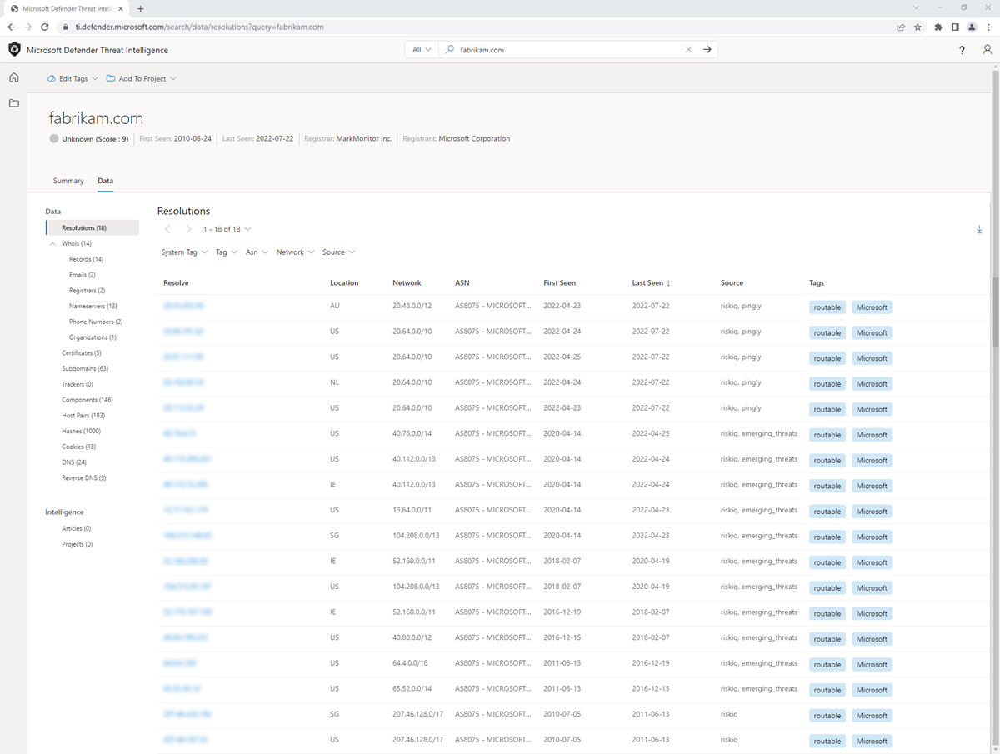
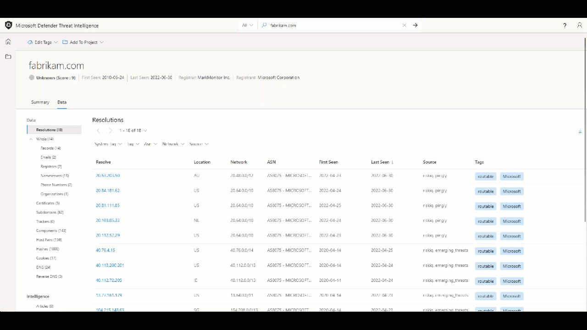
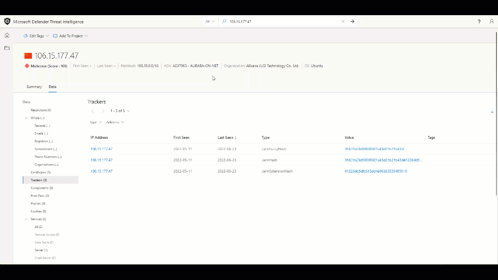
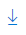

--- 
title: 'Sorting, filtering, and downloading data using Microsoft Defender Threat Intelligence (Defender TI)'
description: 'Learn how to sort, filter and download data using Microsoft Defender Threat Intelligence (Defender TI).'
author: alexroland24
ms.author: aroland
manager: dolmont
ms.service: threat-intelligence 
ms.topic: how-to 
ms.date: 08/02/2022
ms.custom: template-how-to 
---

# Sorting, filtering, and downloading data

The Microsoft Defender Threat Intelligence (Defender TI) platform enables analysts to access our vast collection of crawling data in an indexed and pivot table format.  These data sets can be very large, returning expansive amounts of historic and recent data. Thus, allowing analysts to appropriately sort and filter the data provides the ability easily to surface the connections of interest.

In this how-to article, you’ll learn how to sort and filter data for the following data sets:

- Resolutions
- WHOIS
- Certificates
- Subdomains
- Trackers
- Components
- Host Pairs
- Cookies
- Services
- DNS
- Reverse DNS

For more information, see [Data sets](data-sets.md).

In this how-to article, you’ll also learn how to download indicators/artifacts from the following features:

- Projects
- Articles
- Data Sets

## Prerequisites

- An Azure Active Directory or personal Microsoft account. [Login or create an account](https://signup.microsoft.com/)
- A Microsoft Defender Threat Intelligence (Defender TI) Premium license.
    > [!NOTE]
    > Users without a Defender TI Premium license will still be able to log into the Defender Threat Intelligence Portal and access our free Defender TI offering.

## Open Defender TI’s Threat Intelligence Home Page

1. Access the [Defender Threat Intelligence Portal](https://ti.defender.microsoft.com/).
2. Complete Microsoft authentication to access portal.

## Sorting data

The sorting function on the Data tab enables users to quickly sort our datasets by the column values. By default, most results are sorted by “Last Seen” (descending) so that the most recently observed results appear at the top of the list; this surfaces the most recent data to immediately provide insight on the current infrastructure of an artifact. Currently, all data sets are sortable by the following “First Seen” and “Last Seen” values:

- Last Seen Descending (Default)
- Last Seen Ascending
- First Seen Ascending
- First Seen Descending

Data can be sorted across each data set blade within the Data tab for each IP, domain, or host entity that is searched or pivoted on.

1. Search a domain, IP address, or host in the Defender TI Threat Intelligence search bar and navigate to the Data tab.
2. Apply sorting preferences to the First Seen and Last Seen columns within the Resolutions Data blade.

## Filtering data

Data filtering allows analysts to access a select group of data based on a particular metadata value. For instance, an analyst can select to only view IP resolutions discovered from a select source, or components of a particular type (e.g. servers, frameworks). This enables users to narrow the query results to items of particular interest. Since the Threat Intelligence platform provides specific metadata that coincides with particular data types, the filter options will be different for each data set.

## Resolution filters

The following filters apply to resolution data:

- **System Tag**: these tags are created by the Threat Intelligence system based on insights discovered by our research team.
- **Tag**: tags that have been applied by Threat Intelligence users.
- **ASN**: results that relate to a designated Autonomous System Number (ASN).
- **Network**: results that relate to designated network.
- **Source**: the data source that produced the result (e.g. riskiq, emerging_threats).

1. Search a domain, IP address, or host in the Defender TI Threat Intelligence search bar and navigate to the Data tab.
2. Apply filters to each of the types of filter options noted above within the Resolutions Data blade.

## Tracker filters

The following filters apply to tracker data:

- **Type**: the identified tracker type for each artifact (e.g. JarmFuzzyHash, GoogleAnalyticsID).
- **Address**: the IP address that directly observed the tracker or has a resolving host that observed the tracker. (Appears when searching an IP address)
- **Hostname**: the host that observed this tracker value. (Appears when searching a domain or host)

1. Search a domain, IP address, or host in the Defender TI Threat Intelligence search bar and navigate to the Data tab.
2. Navigate to the Trackers Data blade.
3. Apply filters to each of the types of filter options noted above within the Trackers Data blade.

## Component filters

The following filters apply to component data:

- **Ipaddressraw:** the IP address that coincides with the returned hostname.
- **Type:** the designated component type (e.g. remote access, operating system).
- **Name:** the name of the detected component (e.g. Cobalt Strike, PHP).

1. Search a domain, IP address, or host in the Defender TI Threat Intelligence search bar and navigate to the Data tab.
2. Navigate to the Components Data blade.
3. Apply filters to each of the types of filter options noted above within the Components Data blade.

## Host pair filters

The following filters apply to host pair data:

- **Direction:** the direction of the observed connection. This indicates whether the parent redirects to the child or vice versa.
- **Parent Hostname:** the hostname of the parent artifact.
- **Cause:** the detected cause of the host parent / child relationship (e.g. redirect, iframe.src).
- **Child Hostname:** the hostname of the child artifact.

1. Search a domain, IP address, or host in the Defender TI Threat Intelligence search bar and navigate to the Data tab.
2. Navigate to the Host Pairs Data blade.
3. Apply filters to each of the types of filter options noted above within the Host Pairs Data blade.

## DNS & Reverse DNS filters

The following filters apply to DNS and Reverse DNS data:

- **Record Type:** the type of record detected in the DNS record (e.g. NS, CNAME).
- **Value:** the designated value of the record (e.g. nameserver.host.com).

1. Search a domain, IP address, or host in the Defender TI Threat Intelligence search bar and navigate to the Data tab.
2. Navigate to the DNS and later, Reverse DNS Data blades.
3. Apply filters to each of the types of filter options noted above within the DNS and Reverse DNS Data blades.

## Downloading data

In Defender TI, there are various sections that a user can download data as a csv export.   Users need to look out for the download icon to export data as a csv.

Data can be downloaded within the following sections:

- Most Data Set blades
- Project
- Threat Intelligence Article

The following headers are exported as a result of downloading Resolutions, DNS, and reverse DNS data:

| &nbsp;                     | &nbsp;                     |
|----------------------------|----------------------------|
| **Resolve**                | A record associated with the domain searched (resolving IP Address) or domain that has resolved to an IP address when an IP address is searched |
| **Location**               | Country/region the IP address is hosted in |
| **Network**                | Netblock or subnet |
| **autonomousSystemNumber** | Autonomous System Number |
| **firstSeen**              | Date / Time when Microsoft first observed the resolution (format: mm/dd/yyyy hh:mm) |
| **lastSeen**               | Date / Time when Microsoft last observed the resolution (format: mm/dd/yyyy hh:mm) |
| **Source**                 | Source that observed this resolution |
| **Tags**                   | Custom or system tags associated with the artifact |

The following headers are exported as a result of downloading Subdomains data:

| &nbsp;                     | &nbsp;                     |
|----------------------------|----------------------------|
| **hostname**               | Subdomain of the domain searched |
| **tags**                   | Custom or system tags associated with the artifact |

The following headers are exported as a result of downloading Trackers data:

| &nbsp;                     | &nbsp;                     |
|----------------------------|----------------------------|
| **hostname**               | Hostname that observed or is currently observing the tracker |
| **firstSeen**              | Date / Time when Microsoft first observed the hostname was using the tracker (format: mm/dd/yyyy hh:mm) |
| **lastSeen**               | Date / Time when Microsoft first observed the hostname was using the tracker (format: mm/dd/yyyy hh:mm) |
| **attributeType**          | Type of tracker |
| **attributeValue**         | Tracker value |
| **Tags**                   | Custom or system tags associated with the artifact |

The following headers are exported as a result of downloading Components data:

| &nbsp;                     | &nbsp;                     |
|----------------------------|----------------------------|
| **hostname**               | Hostname that observed or is currently observing the component |
| **firstSeen**              | Date / Time when Microsoft first observed the hostname was using the tracker (format: mm/dd/yyyy hh:mm |
| **lastSeen**               | Date / Time when Microsoft last observed the hostname was using the component (format: mm/dd/yyyy hh:mm |
| **category**               | Type of component |
| **name**                   | Name of the component |
| **version**                | Version of the component |
| **Tags**                   | Custom or system tags associated with the artifact |

The following headers are exported as a result of downloading Host Pairs data:

| &nbsp;                     | &nbsp;                     |
|----------------------------|----------------------------|
| **parentHostname**         | The hostname that is reaching out to the child hostname |
| **childHostname**          | The hostname that is feeding assets they host to the parent hostname. |
| **firstSeen**              | Date / Time when Microsoft first observed the relationship between the parent and child hostname (format: mm/dd/yyyy hh:mm) |
| **lastSeen**               | Date / Time when Microsoft last observed the relationship between the parent and child hostname (format: mm/dd/yyyy hh:mm) |
| **attributeCause**         | The cause of the relationship between the parent and child hostname |
| **Tags**                   | Custom or system tags associated with the artifact |

The following headers are exported as a result of downloading Cookies data:

| &nbsp;                     | &nbsp;                     |
|----------------------------|----------------------------|
| **hostname**               | Hostname that observed the Cookie name |
| **firstSeen**              | When the Cookie name was first observed to the hostname originating from the Cookie Domain (format: mm/dd/yyyy hh:mm) |
| **lastSeen**               | Date / time when the Cookie name was last observed to the hostname originating from the Cookie Domain (format: mm/dd/yyyy hh:mm) |
| **cookieName**             | Name of the cookie |
| **cookieDomain**           | The domain name’s server the cookie name originated from |
| **Tags**                   | Custom or system tags associated with the artifact |

The following headers are exported as a result of downloading projects lists for my, team, and shared projects:

| &nbsp;                     | &nbsp;                     |
|----------------------------|----------------------------|
| **name**                   | Name of project |
| **artifacts (count)**      | Count of artifacts within the project |
| **created by (user)**      | User who created the project |
| **created on**             | When the project was created |
| **tags**                   | Custom or system tags associated with the artifact |
| **collaborators**          | Who has been added as collaborator(s) to the project. This is only visible for projects that have been downloaded from the My Projects and Shared Projects pages. |

The following headers are exported as a result of downloading project details (artifacts) from a project:

| &nbsp;                     | &nbsp;                     |
|----------------------------|----------------------------|
| **artifact**               | Artifact value (e.g. IP address, domain, host, WHOIS value, certificate SHA-1, etc.) |
| **type**                   | Type of artifact (e.g. IP, domain, host, WHOIS Organization, WHOIS Phone, Certificate SHA-1, etc.) |
| **created**                | Date / Time when the artifact was added to the project (format: mm/dd/yyyy hh:mm) |
| **creator**                | Email address of user who added the artifact |
| **context**                | How the artifact was added to the project |
| **tags**                   | Custom or system tags associated with the artifact |
| **collaborators**          | Who has been added as collaborator(s) to the project. This is only visible for projects that have been downloaded from the My Projects and Shared Projects pages. |

The following headers are exported as a result of downloading threat intelligence public or riskiq indicators:

| &nbsp;                     | &nbsp;                     |
|----------------------------|----------------------------|
| **type**                | Type of indicator (e.g. ip, certificate, domain, _sha256) |
| **value**               | Value of the indicator (e.g. IP address, domain, hostname) |
| **source**              | Source of indicator (RiskIQ or OSINT) |

## Next steps

For more information, see [Data sets](data-sets.md).
