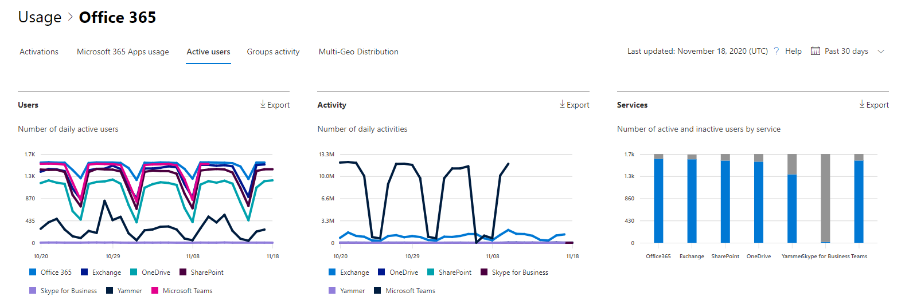

# Assess the Microsoft 365 Active Users report

The Microsoft 365 Reports dashboard shows you the activity overview across the products in your organization. It enables you to drill in to individual product level reports to give you more granular insight about the activities within each product. Check out [the Reports overview topic](activity-reports.md).
  
For example, you can use the **Active Users** report to find out how many product licenses are being used by individuals in your organization, and drill down for information about which users are using what products. This report can help administrators identify underutilized products or users that might need additional training or information.

## How to get to the Active Users report

1. In the admin center, go to the **Reports** \> <a href="https://go.microsoft.com/fwlink/p/?linkid=2074756" target="_blank">Usage</a> page. 
2. From the dashboard homepage, click on the **View more** button on the Active users - Microsoft 365 Services card.

## Interpret the Active Users report

You can view active users in the Office 365 report by choosing the **Active users** tab. 

The **Active Users** report can be viewed for trends over the last 7 days, 30 days, 90 days, or 180 days. However, if you view a particular day in the report, the table will show data for up to 28 days from the current date (not the date the report was generated). The data in each report usually covers up to the last 24 to 48 hours.

The **Users** chart shows you daily active users in the reporting period separated by product.

The **Activity** chart shows you daily activity count in the reporting period separated by product.

The **Services** chart shows you count of users by activity type and Service.

On the Users chart, the x axis shows the selected reporting time period and the y axis displays the daily active users separated and color coded by license type.
On the Activity chart, the x axis shows the selected reporting time period and the y axis displays the daily activity count separated and color coded by license type.
On the Services activity chart, the X axis displays the individual services your users are enabled for in the given time period and the Y axis is the Count of users by activity status, color coded by activity status.

You can filter the series you see on the chart by selecting an item in the legend. Changing this selection doesn't change the info in the grid table.

You can also export the report data into an Excel .csv file, by selecting the Export link. This exports data of all users and enables you to do simple sorting and filtering for further analysis. 

You can change what information is displayed in the grid table with column controls.

If your subscription is operated by 21Vianet, then you will not see Viva Engage.

If your organization's policies prevents you from viewing reports where user information is identifiable, you can change the privacy setting for all these reports. Check out the **How do I hide user level details?** section in [Activity Reports in the Microsoft 365 admin center](activity-reports.md).  
