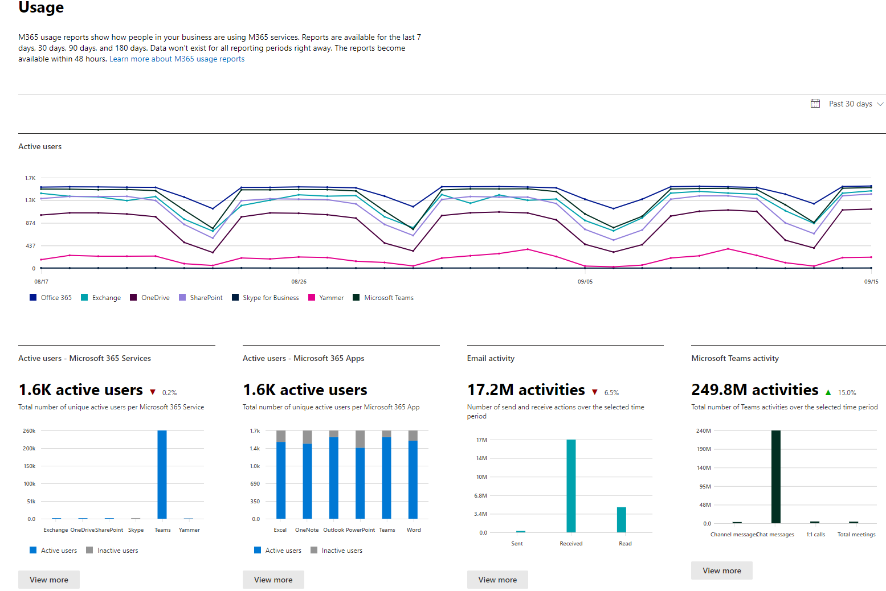

# Microsoft 365 Reports in the admin center

You can easily see how people in your business are using Microsoft 365 services. For example, you can identify who is using a service a lot and reaching quotas, or who may not need an Microsoft 365 license at all.
  
Reports are available for the last 7 days, 30 days, 90 days, and 180 days. Data won't exist for all reporting periods right away. The reports become available within 48 hours.
  
Watch this video for on overview: on how you can use the reports:
  
> [!VIDEO https://www.microsoft.com/videoplayer/embed/fb726f8e-aead-43b2-ba0f-53ba5b886bf7?autoplay=false]
  
## How to get to the Reports dashboard

::: moniker range="o365-worldwide"

1. In the admin center, go to the **Reports** \> <a href="https://go.microsoft.com/fwlink/p/?linkid=2074756" target="_blank">Usage</a> page.

::: moniker-end

::: moniker range="o365-germany"

1. In the <a href="https://go.microsoft.com/fwlink/p/?linkid=848041" target="_blank">admin center</a>, go to the **Reports** \> **Usage** page.

::: moniker-end

::: moniker range="o365-21vianet"

1. In the <a href="https://go.microsoft.com/fwlink/p/?linkid=850627" target="_blank">admin center</a>, go to the **Reports** \> **Usage** page.

::: moniker-end

2. Click on the **View more** button from the at-a-glance activity card for a service (such as email or OneDrive) to see the report detail page. In there different reports for the service are provided in tabs.   

## Who can see reports

People who have the following permissions:
  
- Global admins: We recommend that only a few people in your company have this role. It reduces the risk to your business.
    
- Exchange admins
    
- SharePoint admins
    
- Skype for Business admins

- Global reader
    
- Reports reader

- Teams Service Administrator

- Teams Communications Administrator
    
To learn more, see [About admin roles](../add-users/about-admin-roles.md) and [Assign admin roles](../add-users/assign-admin-roles.md).
  
## Which activity reports are available in the admin center

Depending on your subscription, here are the available reports.

- [Microsoft browser usage](browser-usage-report.md) 
  
- [Email activity](email-activity-ww.md)

- [Email activity for US Government](email-activity.md)
    
- [Mailbox usage](mailbox-usage.md)
    
- [Office activations](microsoft-office-activations-ww.md)

- [Office activations for US Government](microsoft-office-activations.md)

- [Active Users](active-users-ww.md)

- [Active Users for US Government](active-users.md)
  
- [Email apps usage](email-apps-usage-ww.md)

- [Email apps usage for US Government](email-apps-usage.md)

- [Forms activity](forms-activity-ww.md)

- [Forms activity for US Government](forms-activity.md)

- [Dynamics 365 Customer Voice activity](forms-pro-activity-ww.md)
  
- [Dynamics 365 Customer Voice activity for US Government](forms-pro-activity.md)

- [Microsoft 365 groups](office-365-groups-ww.md)

- [Microsoft 365 groups for US Government](office-365-groups.md)
  
- [OneDrive for Business user activity](onedrive-for-business-activity-ww.md)

- [OneDrive for Business user activity for US Government](onedrive-for-business-activity.md)

- [OneDrive for Business usage](onedrive-for-business-usage-ww.md)

- [OneDrive for Business usage for US Government](onedrive-for-business-usage.md)

- [Microsoft 365 Apps usage](microsoft365-apps-usage-ww.md)
  
- [SharePoint site usage](sharepoint-site-usage-ww.md)

- [SharePoint site usage for US Government](sharepoint-site-usage.md)
  
- [SharePoint activity](sharepoint-activity-ww.md)

- [SharePoint activity for US Government](sharepoint-activity.md)
  
- [Skype for Business Online activity](/SkypeForBusiness/skype-for-business-online-reporting/activity-report)
  
- [Skype for Business Online conference organized activity](/SkypeForBusiness/skype-for-business-online-reporting/conference-organizer-activity-report)
  
- [Skype for Business Online conference participant activity](/SkypeForBusiness/skype-for-business-online-reporting/conference-participant-activity-report)
  
- [Skype for Business Online peer-to-peer activity](/SkypeForBusiness/skype-for-business-online-reporting/peer-to-peer-activity-report)

- [Yammer activity](yammer-activity-report-ww.md)

- [Yammer activity for US Government](yammer-activity-report.md)

- [Yammer device usage](yammer-device-usage-report-ww.md)

- [Yammer device usage for US Government](yammer-device-usage-report.md)

- [Yammer groups activity report](yammer-groups-activity-report-ww.md)

- [Yammer groups activity report for US Government](yammer-groups-activity-report.md)

- [Microsoft Teams user activity](microsoft-teams-user-activity-preview.md)

- [Microsoft Teams user activity for US Government](microsoft-teams-user-activity.md)

- [Microsoft Teams device usage](microsoft-teams-device-usage-preview.md)

- [Microsoft Teams device usage for US Government](microsoft-teams-device-usage.md)

## How to view licensing information

- To see how many licenses you have assigned and unassigned, in the admin center, go to the **Billing** \> <a href="https://go.microsoft.com/fwlink/p/?linkid=842264" target="_blank">Licenses</a> page.
    
- To see who is licensed, unlicensed, or guest, in the admin center, go to the **Users** \> <a href="https://go.microsoft.com/fwlink/p/?linkid=834822" target="_blank">Active users</a> page. 
  
## How to view usage information for a specific user

Use the service reports to research how much a specific user is using the service. For example, to find out how much mailbox storage a specific user has consumed, open the Mailbox usage report, and sort the users by name. If you have thousands of users, export the report to Excel so you filter through the list quickly.
  
You can't generate a report where you enter a user's account and then get a list of which services they are using and how much.

There are circumstances where new users show up as **unknown**. This is usually due to occasional delays in creating user profiles.  
  
## Hide user details in the reports

If you want to hide user level information when you're generating your reports, you can quickly make that change in the admin center.
  
1. In the admin center, go to the **Settings** \> <a href="https://go.microsoft.com/fwlink/p/?linkid=2053743" target="_blank">Services &amp; add-ins</a> page.

2. Select **Reports**. 
  
3. In the **Reports** pane, select the options you want, and then save your changes.
  
Your user list will look like this:
  

  
It'll take a few minutes for these changes to take effect on the reports in the reports dashboard. This setting also applies to the reports API.
  
## What happens to usage data when a user account is closed?

Whenever you close a user's account, Microsoft will delete that user's usage data within 30 days. That user will still be included in the Activity chart totals (see number 1) for the periods she was active in, but will not appear in the User Details table (see number 2).
  
However, when you select a particular day (see number 3), up to 28 days from the current date, the report show the user's usage for that day in the User Details table (see number 2).
  
## Related articles

[Reports in the Security &amp; Compliance Center](../../compliance/reports-in-security-and-compliance.md)
