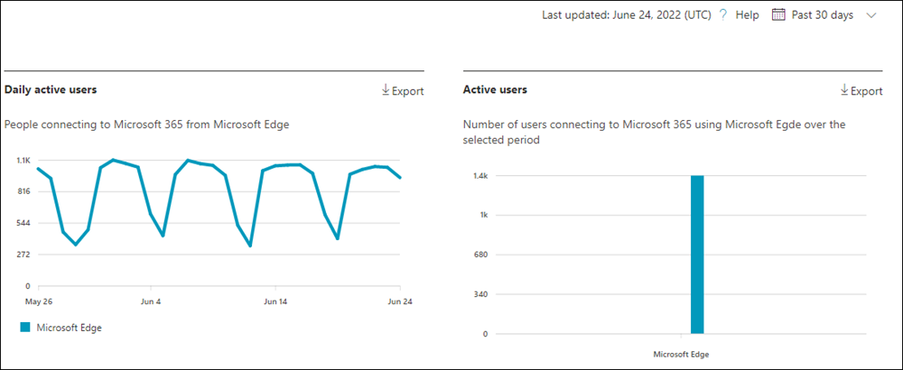

# Microsoft 365 Reports in the admin center - Microsoft browser usage

The Microsoft 365 **Reports** dashboard shows you an activity overview across the products in your organization. It enables you to drill into individual product level reports to give you more granular insight about the activities within each product. Check out [the Reports overview topic](activity-reports.md). In the Microsoft browser usage report, you can gain insights on Internet Explorer, Microsoft Edge Legacy, and new Microsoft Edge usage. Usage reporting is based on Microsoft 365 online services accessed via a Microsoft browser.

 > [!NOTE]
 > You must be a global administrator, global reader or reports reader in Microsoft 365 or an Exchange, SharePoint, or Skype for Business administrator to see reports.

## How to get to the Microsoft browser usage report

1. In the admin center, go to the **Reports** \> <a href="https://go.microsoft.com/fwlink/p/?linkid=2074756" target="_blank">Usage</a> page. 
2. From the dashboard homepage, click on the **View more** button on the Microsoft browser usage card.

## Interpret the Microsoft browser usage report

|Item|Description|
 |:-----|:-----|
 |1.   |The **Microsoft browser usage** report can be viewed for trends over the last 7 days, 30 days, 90 days, or 180 days.    |
 |2.   |The data in each report usually covers up to the last seven days.   |
 |3.   |The **Daily active users** chart shows you the daily user count for Microsoft Edge, Microsoft Edge Legacy and Internet Explorer when used to access to Microsoft 365 services.   |
 |4. |The **Active Users** chart shows you the total number of users using Microsoft Edge, Microsoft Edge Legacy and Internet Explorer when used to access to Microsoft 365 services over the selected time period. |
 |5. |The table shows you a breakdown of data at the per-user level. You can add or remove columns from the table.   **Username** is the email address of the user who connected to Microsoft 365 services using Microsoft browsers.  **Used Microsoft Edge** shows a tick mark if the user used Microsoft Edge to connect to Microsoft 365 services.  **Used Microsoft Edge Legacy** shows a tick mark if the user used Microsoft Edge Legacy to connect to Microsoft 365 services.  **Used Internet Explorer** shows a tick mark if the user used Internet Explorer to connect to Microsoft 365 services. |
 |6. |Select the **Choose columns** icon to add or remove columns from the report.|
 |7. |You can also export the report data into an Excel .csv file by selecting the **Export** link. This exports data for all users and enables you to do simple aggregation, sorting, and filtering for further analysis. If you have less than 100 users, you can sort and filter within the table in the report itself. If you have more than 100 users, in order to filter and sort, you will need to export the data.|
