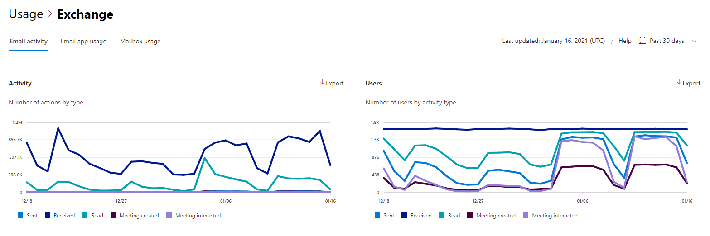
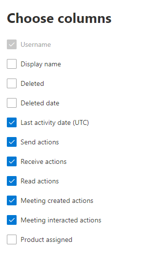

# Microsoft 365 Reports in the admin center - Email activity

The Microsoft 365 Reports dashboard shows you the activity overview across the products in your organization. It enables you to drill in to individual product level reports to give you more granular insight about the activities within each product. Check out [the Reports overview topic](activity-reports.md).
  
For example, you can get a high level view of email traffic within your organization from the Reports page, and then you can drill into the Email activity widget to understand the trends and per user level details of the email activity within your organization.

## How to get to the email activity report

1. In the admin center, go to the **Reports** \> <a href="https://go.microsoft.com/fwlink/p/?linkid=2074756" target="_blank">Usage</a> page.
2. Select **View More** under **Email activity**. 
3. From the **Email activity** drop-down list, select **Exchange** \> **Email activity**.
  
## Interpret the email activity report

You can get a view into your user's email activity by looking at the **Activity** and **Users** charts. 
  

The **Email activity** report can be viewed for trends over the last 7 days, 30 days, 90 days, or 180 days. However, if you select a particular day in the report, the table will show data for up to 28 days from the current date (not the date the report was generated). The data in each report usually covers up to the last 24 to 48 hours.

The **Activity** chart enables you to understand the trend of the amount of email activity going on in your organization. You can understand the split of email send, email read, email received, meeting created, or meeting interacted activities. 

The **User** chart enables you to understand the trend of the number of unique users who are generating the email activities. You can look at the trend of users performing email sending, email reading, email receiving, meeting creating, or meeting interacting activities. 

On the Activity chart, the Y axis is the count of activity of the type email sent, email received, email read, meeting created, and meeting interacted. 

On the Users activity chart, the Y axis is the user's performing activity of the type email sent, email received, email read, meeting created, or meeting interacted. 

The X axis on both charts is the selected date range for this specific report. 

You can filter the series you see on the chart by selecting an item in the legend.

 The table shows you a breakdown of the email activities at the per-user level. This shows all users that have an Exchange product assigned to them and their email activities.

  
|Item|Description|
|:-----|:-----|
|Username  |The email address of the user. |
|Display name |The full name of the user. |
|Deleted |Refers to the user whose current state is deleted, but was active during some part of the reporting period of the report. |
|Deleted date |The date the user was deleted. |
|Last activity date  | The last time the user performed a read or send email activity. |
|Send actions |The number of times an email send action was recorded for the user.  |
|Receive actions  |The number of times an email received action was recorded for the user. |
|Read actions |The number of times an email read action was recorded for the user. |
|Meeting created actions  |The number of times a meeting request send action was recorded for the user. |
|Meeting interacted actions |The number of times a meeting request accept, tentative, decline, or cancel action was recorded for the user. |
|Product assigned  |The products that are assigned to this user.  |

If your organization's policies prevents you from viewing reports where user information is identifiable, you can change the privacy setting for all these reports. Check out the **How do I hide user level details?** section in the [Activity Reports in the Microsoft 365 admin center](activity-reports.md).

Select **Choose columns** to add or remove columns from the report.  

You can also export the report data into an Excel .csv file, by selecting the **Export** link. This exports data of all users and enables you to do simple sorting and filtering for further analysis. 
   
> [!NOTE]
> The Email activity report is only available for mailboxes that are associated with users who have licenses.
