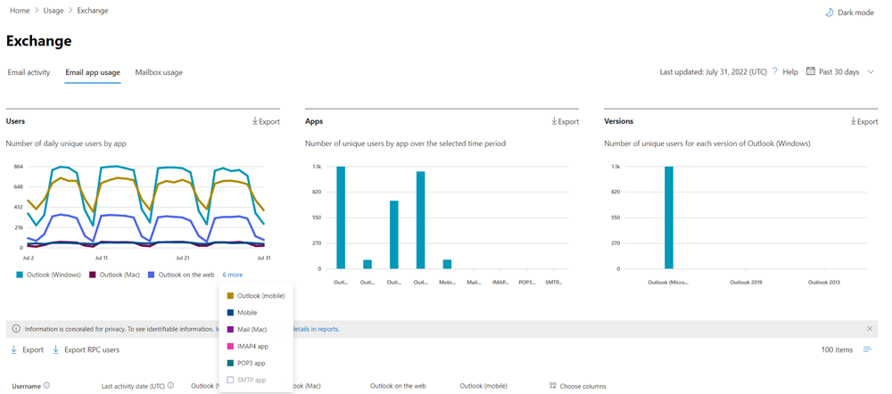

title: "Microsoft 365 Reports in the admin center - Email apps usage"
ms.author: kwekua
author: kwekua
manager: scotv
audience: Admin
ms.topic: article
ms.service: o365-administration
localization_priority: Normal
ms.collection: 
- M365-subscription-management 
- Adm_O365
- Adm_NonTOC
ms.custom: AdminSurgePortfolio
search.appverid:
- BCS160
- MET150
- MOE150
- GEA150
ms.assetid: c2ce12a2-934f-4dd4-ba65-49b02be4703d
description: "Learn how to get Email apps usage report to know about email apps connecting to Exchange Online and the Outlook version users are using."
---

# Microsoft 365 Reports in the admin center - Email apps usage

The Microsoft 365 **Reports** dashboard shows you the activity overview across the products in your organization. It enables you to drill in to individual product level reports to give you more granular insight about the activities within each product. Check out [the Reports overview topic](activity-reports.md). In the email apps usage report, you can see how many email apps are connecting to Exchange Online. You can also see the version information of Outlook apps that users are using, which will allow you to follow up with those who are using unsupported versions to install supported versions of Outlook.
  
> [!NOTE]
> You must be a global administrator, global reader or reports reader in Microsoft 365 or an Exchange, SharePoint, Teams Service, Teams Communications, or Skype for Business administrator to see reports.  
 
## How to get to the email apps report

1. In the admin center, go to the **Reports** \> <a href="https://go.microsoft.com/fwlink/p/?linkid=2074756" target="_blank">Usage</a> page.
2. Select **View More** under **Email activity**. 
3. From the **Email activity** drop-down list, select **Exchange** \> **Email apps usage**.
  
## Interpret the email apps report

You can get a view into email apps activity by looking at the **Users** and **Clients** charts. 
  

  
|Item|Description|
|:-----|:-----|
|1.    |The **Email apps usage** report can be viewed for trends over the last 7 days, 30 days, 90 days, or 180 days. However, if you select a particular day in the report, the table (7) will show data for up to 28 days from the current date (not the date the report was generated).    |
|2.    |The data in each report usually covers up to the last 24 to 48 hours.    |
|3.    |The **Users** view shows you the number of unique users that connected to Exchange Online using any email app.    |
|4.    |The **Apps** view shows you the number of unique users by app over the selected time period.    |
|5.    |The **Versions** view shows you the number of unique users for each version of Outlook in Windows.    |
|6.    | On the **Users** chart, the Y axis is the total count of unique users that connected to an app on any day of the reporting period.     On the **Users** chart, the X axis is number of unique users that used the app for that reporting period.     On the **Apps** chart, the Y axis is the total count of unique users who used a specific app during the reporting period.     On the **Apps** chart, the X axis is the list of apps in your organization.     On the **Versions** chart, the Y axis is the total count of unique users using a specific version of Outlook desktop. If the report can't resolve the version number of Outlook, the quantity will show as **Undetermined**.     On the **Versions** chart, the X axis is the list of apps in your organization.    |
|7.    |You can filter the series you see on the chart by selecting an item in the legend.    |
|8.    | You might not see all the items in the list below in the columns until you add them.  **Username** is the name of the email app's owner.    **Last activity date** is the latest date the user read or sent an email message.    **Mac mail**, **Mac Outlook** and **Outlook**, **Outlook mobile** and **Outlook on the web** are examples of email apps you may have in your organization.     If your organization's policies prevents you from viewing reports where user information is identifiable, you can change the privacy setting for all these reports. Check out the **How do I hide user level details?** section in the [Activity Reports in the Microsoft 365 admin center](activity-reports.md).    |
|9.    |Select **Choose columns** to add or remove columns from the report.    |
|10.    |You can also export the report data into an Excel .csv file, by selecting the **Export** link. This exports data of all users and enables you to do simple sorting and filtering for further analysis. If you have less than 2000 users, you can sort and filter within the table in the report itself. If you have more than 2000 users, in order to filter and sort, you will need to export the data.    |
|||
   
