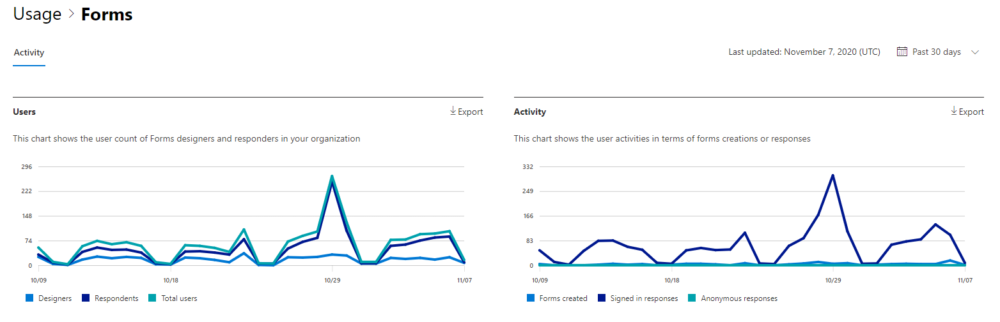
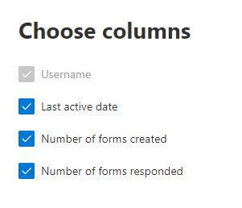

# Microsoft 365 Reports in the admin center - Forms activity

The Microsoft 365 Reports dashboard shows you the activity overview across the products in your organization. It lets you drill in to individual product level reports to give you more granular insight about the activities within each product. Check out [the Reports overview topic](activity-reports.md).
  
For example, you can understand the activity of every user licensed to use Microsoft Forms by looking at their interaction with forms. It also helps you to understand the level of collaboration going on by looking at the number of forms created and forms the user responded to.
  
## How to get to the Forms activity report

1. In the admin center, go to the **Reports**, then select **Usage**. 
2. From the dashboard homepage, click on the **View more** button on the Forms card.
  
## Interpret the Forms activity report

You can view the activities in the Forms report by choosing the **Activity** tab.

Select **Choose columns** to add or remove columns from the report. 

You can also export the report data into an Excel .csv file by selecting the **Export** link. This exports data of all users and enables you to do simple sorting and filtering for further analysis. 

The **Forms activity** report can be viewed for trends over the last 7 days, 30 days, 90 days, or 180 days. However, if you select a particular day in the report, the table will show data for up to 28 days from the current date (not the date the report was generated).
  
|Item|Description|
|:-----|:-----|
|Metric|Definition|
|Username   |The email address of the user who performed the activity on Microsoft Forms.   |
|Last activity date (UTC)   |The latest date a form activity was performed by the user for the selected date range. To see activity that occurred on a specific date, select the date directly in the chart.  This will filter the table to display file activity data only for users who performed the activity on that specific day.   |
|Number of forms created   |The number of forms that the user created.    |
|Number of forms responded  |The number of forms that the user has submitted responses to.|
