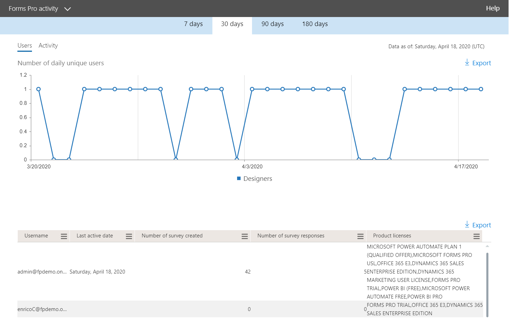

# Microsoft 365 Reports in the admin center - Forms Pro activity

The Microsoft 365 **Reports** dashboard shows you the activity overview across the products in your organization. It enables you to drill in to individual product level reports to give you more granular insight about the activities within each product. Check out [the Reports overview topic](activity-reports.md).
  
For example, you can understand the activity of every user licensed to use Microsoft Forms Pro by looking at their interactions with Forms Pro. It also helps you to understand the level of collaboration going on by looking at the number of Pro Surveys created and Pro Surveys to which the users responded to. 
  
> [!NOTE]
> You must be a global administrator, global reader or reports reader in Microsoft 365 or an Exchange, SharePoint, Teams Service, Teams Communications, or Skype for Business administrator to see reports. 

## How to get to the Forms Pro activity report

1. In the admin center, go to the **Reports** \> <a href="https://go.microsoft.com/fwlink/p/?linkid=2074756" target="_blank">Usage</a> page.

    
2. From the **Select a report** drop-down, select **Forms Pro** \> **activity**.

## Interpret the forms activity report

You can get a view into your user's Forms Pro activity by looking at the **Activity** and **Users** charts. 

|Item|Description|
|:-----|:-----|
|1.    |The **Forms Pro** activity report can be viewed for trends over the last 7 days, 30 days, 90 days, or 180 days. However, if you select a particular day in the report, the table (7) will show data for up to 28 days from the current date (not the date the report was generated).     |
|2.    |The data in each report is usually as recent as the last 48 hours.    |
|3.    |The **Users** view helps you to understand the trend in the number of active Forms Pro users. A user is considered active if they have executed an activity around a Pro Survey (create, edit, view, etc.) within the specific time period.    |
|4.    |The **Activity** view helps you to understand the trend in the number of active users. A user is considered active if they have executed a file activity (save, sync, modify, or share) or visited a page within the specific time period.  NOTE: An activity can occur multiple times for a single survey, but will count only as one active Survey. For example, you can create a Pro Survey and continue to edit the same Survey multiple times over a specified time period, it will count only as one single Survey.  |
|5. |On the **Users** chart, the Y axis is the number of unique users. X axis is the date that the unique users are active on. The legends are:  **Designers** means the user has created or edited a Forms Pro Survey.  On the **Activity** chart, the Y axis is the count of Forms Pro responses per survey. X axis is the date that the Survey or Response activity occurred. The legends are:  **Surveys created** is the count of unique Forms Pro surveys that the users have created **Responses** is the count of anonymous or non-anonymous responses that the users who received the survey have submitted. |
|6. |You can filter the series you see on the chart by selecting an item in the legend. For example, on the Users chart, select designers, responders, or total users to see only the info related to each one. Changing this selection doesn't change the info in the grid table below it.|
|7. |The table shows you a breakdown of the activities at the per-user level. The legends are:  **Username** is the email address of the user who performed the activity on Microsoft Forms. **Last activity date (UTC)** is the latest date a form activity was performed by the user for the selected date range. To see activity that occurred on a specific date, select the date directly in the chart. This will filter the table to display file activity data only for users who performed the activity on that specific day.  **Number of surveys created** is the number of surveys that the user created.  **Number of survey responses** is the number of responses from responders to whom the survey was distributed to.|
|8. |Select the **Manage columns** icon to add or remove columns from the report.|
|9. |You can also export the report data into an Excel .csv file by selecting the **Export** link. This exports data for all users and enables you to do simple aggregation, sorting and filtering for further analysis. If you have less than 100 users, you can sort and filter within the table in the report itself. If you have more than 100 users, in order to filter and sort, you will need to export the data.|