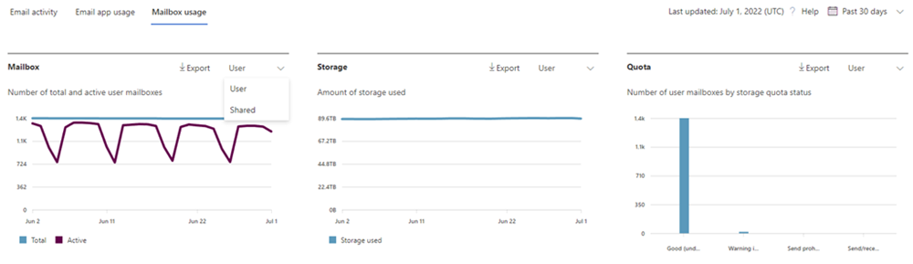
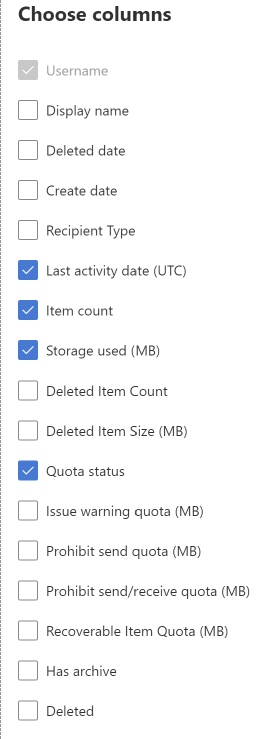

# Microsoft 365 Reports in the admin center - Mailbox usage

The **Mailbox usage report** provides information about users with a user mailbox and the level of activity by each based on the email send, read, create appointment, send meeting, accept meeting, decline meeting and cancel meeting activity. It also provides information about how much storage has been consumed by each user mailbox, and how many of them are approaching storage quotas. 
  
> [!NOTE]
> You must be a global administrator, global reader or reports reader in Microsoft 365 or an Exchange, SharePoint, Teams Service, Teams Communications, or Skype for Business administrator to see reports. 
 
## How to get to the mailbox usage report

1. In the admin center, go to the **Reports** \> <a href="https://go.microsoft.com/fwlink/p/?linkid=2074756" target="_blank">Usage</a> page.
2. Select **View More** under **Email activity**. 
3. From the **Email activity** drop-down list, select **Exchange** \> **Mailbox usage**.

## Interpret the mailbox usage report

You can get a view into your organization's **Mailbox usage** by looking at the **Mailbox**, **Storage** and **Quota** charts. 
  

|Item|Description|
|:-----|:-----|
|1.    |The **Mailbox usage** report can be viewed for trends over the last 7 days, 30 days, 90 days, or 180 days. However, if you select a particular day in the report, the table will show data for up to 28 days from the current date (not the date the report was generated).    |
|2.    |The data in each report usually covers up to the last 24 to 48 hours.    |
|3.    |The Mailbox chart shows you the total number of user mailbox in your organization, and the total number that are active on any given day of the reporting period. A user mailbox is considered active if it had an email send, read, create appointment, send meeting, accept meeting, decline meeting and cancel meeting activity.    |
|4.    |The **Storage** chart shows you amount of storage used in your organization. Storage Chart doesn't include archive mailboxes. For more information about auto-expanding archiving, see [Overview of unlimited archiving in Microsoft 365](../../compliance/unlimited-archiving.md).  |
|5.    | The **Quota** chart shows you the number of user mailboxes in each quota category. There are four quota categories:     Good - number of users whose storage used is below the issue warning quota.     Warning - number of users whose storage used is at or above issue warning, but below prohibit send quota     Can't send - number of users whose storage used is at or above the prohibit send quota, but below prohibit send/receive quota     Can't send/receive - number of users whose storage used is at or above prohibit send/receive quota    |
|6.    | On the **Mailbox** chart, the Y axis is the count of user mailboxes.     On the **Storage** chart, the Y axis is the amount of storage being used by user mailboxes in your organization.     On the **Quota** chart, the Y axis is the number of user mailboxes in each storage quota.     The X axis on the Mailbox and Storage charts is the selected date range for this specific report.     The X axis on the Quota charts is the quota category.    |
|7.    |You can filter charts you see by selecting an item in the legend.    |
|8.    | The table shows you a breakdown of mailbox usage at the per-user level. You can add additional columns to the table.    **User name** is the email address of the user.    **Display Name** is the full name if the user.    **Deleted** refers to the mailbox whose current state is deleted, but was active during some part of the reporting period of the report.    **Deleted date** is the date the mailbox was deleted.    **Create date** is the date the mailbox was created.    **Last activity date** refers to the date the mailbox had an email send or read activity.    **Item count** refers to the total number of items in the mailbox.    **Storage used (MB)** refers to the total storage used.    **Deleted Item Count** refers to the total number of deleted items in the mailbox.   **Deleted Item Size (MB)** refers to the total size of all deleted items in the mailbox.   **Issue warning quota (MB)** refers to the storage limit when the mailbox owner will receive a warning that it's about to hit the storage quota.    **Prohibit send quota (MB)** refers to the storage limit when the mailbox can no longer send emails.    **Prohibit send receive quota (MB)** refers to the storage limit when the mailbox can no longer send or receive emails.     If your organization's policies prevents you from viewing reports where user information is identifiable, you can change the privacy setting for all these reports. Check out the **Hide user details in the reports** section in the [Activity Reports in the Microsoft 365 admin center](activity-reports.md).    |
|9.    |Select **Choose columns** to add or remove columns from the report.    |
|10.    |You can also export the report data into an Excel .csv file, by selecting the **Export** link.    |
|||
