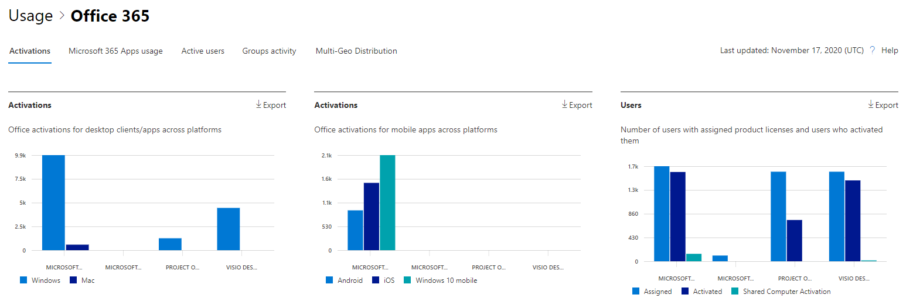
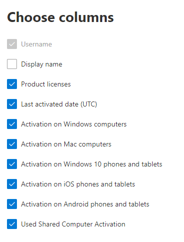

# Microsoft 365 Reports in the admin center - Microsoft Office activations

The Microsoft 365 Reports dashboard shows you the activity overview across the products in your organization. It enables you to drill in to individual product level reports to give you more granular insight about the activities within each product. Check out [the Reports overview topic](activity-reports.md).
  
The Office Activation report gives you a view of which users have activated their Office subscription on at least one device. It provides a breakdown of the Microsoft 365 Apps for enterprise, Project, and Visio Pro for Office 365 subscription activations, as well as the breakdown of activations across desktop and devices. This report could be useful in helping you identify users that might need additional help and support to activate their Office subscription.
  
## How to get to the Office activations report

1. In the admin center, go to the **Reports** \> <a href="https://go.microsoft.com/fwlink/p/?linkid=2074756" target="_blank">Usage</a> page. 
2. From the dashboard homepage, click on the **View more** button on the Office activations card.
  
## Interpret the Office activations report
  
You can view the activations in the Office 365 report by choosing the **Activations** tab. 

Select **Choose columns** to add or remove columns from the report.  

You can also export the report data into an Excel .csv file by selecting the **Export** link. This exports data of all users and enables you to do simple sorting and filtering for further analysis. 

|Item|Description|
|:-----|:-----|
|**Metric**|**Definition**|
|Username    |The email address of the user.    |
|Display name    |The full name of the user.    |
|Product licenses    |The products that are assigned to this user.    |
|Last activated date(UTC)    |The date the user activated Microsoft 365 on a desktop or a device.    |
|Activation on Windows computers    |The number of Windows desktops a user activated Microsoft 365 on.    |
|Activation on Mac computers   |The number of Mac desktops a user activated Microsoft 365 on.|
|Activation on Windows 10 phones and tablets    |The number of Windows 10 mobile devices a user activated Microsoft 365 on.    |
|Activation on iOS phones and tablets    |The number of iOS devices a user activated Microsoft 365 on.|
|Activation on Android phones and tablets    |The number of Android devices a user activated Microsoft 365 on.    |
|Used Shared Computer Activation |This is true if the user used Microsoft 365 through shared computer activation.|
|||
   
