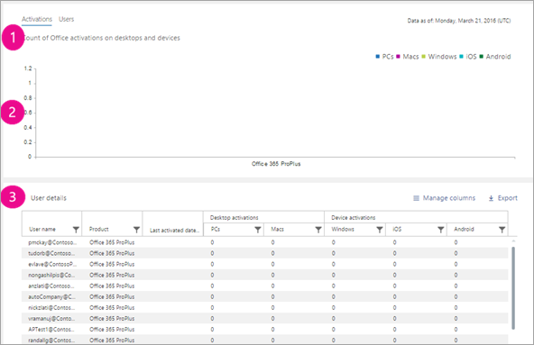
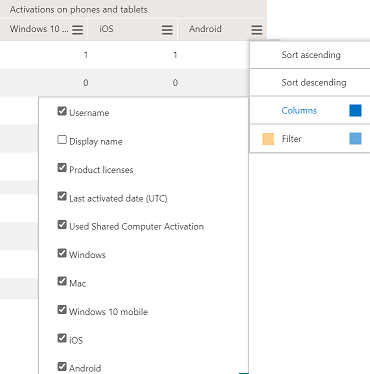

# Microsoft 365 Reports in the admin center - Microsoft Office activations

The Microsoft 365 **Reports** dashboard shows you the activity overview across the products in your organization. It enables you to drill in to individual product level reports to give you more granular insight about the activities within each product. Check out [the Reports overview topic](activity-reports.md).
  
The Office Activation report gives you a view of which users have activated their Office subscription on at least one device. It provides a breakdown of the Microsoft 365 Apps for enterprise, Project, and Visio Pro for Office 365 subscription activations, as well as the breakdown of activations across desktop and devices. This report could be useful in helping you identify users that might need additional help and support to activate their Office subscription.
  
> [!NOTE]
> You must be a global administrator, global reader or reports reader in Microsoft 365 or an Exchange, SharePoint, Teams Service, Teams Communications, or Skype for Business administrator to see reports.  
  
## How to get to the Office activations report

1. In the admin center, go to the **Reports** \> <a href="https://go.microsoft.com/fwlink/p/?linkid=2074756" target="_blank">Usage</a> page.

    
2. From the **Select a report** drop-down, select **Office 365** \> **Activations**. 
  
## Interpret the Office activations report

You can get a view into your organization's Office activations by looking at the **Activations** and **Users** charts. 
  

  
|Item|Description|
|:-----|:-----|
|1    |The Office Activations report presents the current state of the office license activations data [as of the date of the report presented on the top right of the chart].    |
|2    |The data in each report usually covers up to the last 24 to 48 hours.    |
|3    |The **Activations** chart shows you the count of Office activations on desktops and devices.    |
|4    |The **Users** chart shows you the count of users that are enabled, and users that have activated the Office subscription on desktop or devices..    |
|5    | On the **Activations** chart, the Y axis is the count of Office activations.     On the **Users** chart, the Y axis is the user's performing activity of activating Office.     The X axis on both charts is the selected date range for this specific report.    |
|6    |You can filter charts you see by selecting an item in the legend. For example, on the **Activations** chart, select **Windows OS**, **Mac OS**, **Windows 10 mobile**, **iOS** or **Android** to see only the info related to each one. Changing this selection doesn't change the info in the grid table.       |
|7    | The table shows you a breakdown of Office activations at the user level. This is the list of all user's with the Office product assigned to them. You can add the additional columns to the table.      **Username** is the email address of the user.    **Display name** is the full name of the user.    **Product licenses** is the products that are assigned to this user.    **Last activated date** refers to the date the user activated Office on a desktop or a device.    **Used Shared Computer Activation** is true if the user used Office through shared computer activation.   **Windows** refers to the number of Windows desktops a user activated Office on.    **Mac** refers to the number of Mac desktops a user activated Office on.    **Windows 10 mobile** refers to the number of Windows 10 mobile devices a user activated Office on.    **iOS** refers to the number of iOS devices a user activated Office on.    **Android** refers to the number of Android devices a user activated Office on.     If your organization's policies prevents you from viewing reports where user information is identifiable, you can change the privacy setting for all these reports. Check out the **Hide user details in the reports** section in the [Activity Reports in the Microsoft 365 admin center](activity-reports.md).    |
|||
   

