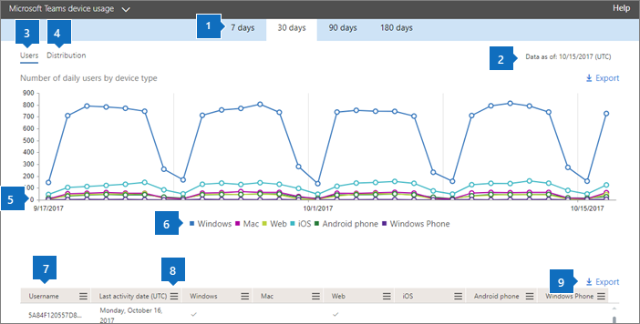
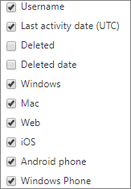

# Microsoft 365 Reports in the admin center - Microsoft Teams device usage

The Microsoft 365 **Reports** dashboard shows you the activity overview across the products in your organization. It enables you to drill in to individual product level reports to give you more granular insight about the activities within each product. Check out [the Reports overview topic](activity-reports.md). In the Microsoft Teams app usage report, you can gain insights into the Microsoft Teams apps that are used in your organization.
  
> [!NOTE]
> You must be a global administrator, global reader or reports reader in Microsoft 365 or an Exchange, SharePoint, Teams Service, Teams Communications, or Skype for Business administrator to see reports.  
 
## How to get to the Microsoft Teams app usage report

1. In the admin center, go to the **Reports** \> <a href="https://go.microsoft.com/fwlink/p/?linkid=2074756" target="_blank">Usage</a> page.

    
2. From the **Select a report** drop-down, select  **Microsoft Teams** \> **Device usage**.
  
## Interpret the Microsoft Teams app usage report

You can get a view into Microsoft Teams app usage by looking at the **Users** and **Distribution** charts. 
  

  
|Item|Description|
|:-----|:-----|
|1.    |The **Microsoft Teams device usage** report can be viewed for trends over the last 7 days, 30 days, 90 days, or 180 days. However, if you select a particular day in the report, the table (7) will show data for up to 28 days from the current date (not the date the report was generated).    |
|2.    |The data in each report usually covers up to the last 24 to 48 hours.    |
|3.    |The **Users** view shows you the number of daily unique users by app.    |
|4.    |The **Distribution** view shows you the number of unique users by app over the selected time period.    |
|5.    | On the **Users** chart, the Y axis is the number of users per app.     On the **Distribution** chart, the Y axis is the number of users using the specified app.     The X axis on the charts is the selected date range for the specific report.    |
|6.    |You can filter the series you see on the chart by selecting an item in the legend. For example, on the **Users** chart, select **Windows**, **Mac**, **Calls**, **Web**, **Android phone**, or **Windows phone** to see only the info related to each one. Changing this selection doesn't change the info in the grid table.    |
|7.    | The list of groups shown is determined by the set of all groups that existed (weren't deleted) across the widest (180-day) reporting time frame. The activity count will vary according to the date selection.    NOTE: You might not see all the items in the list below in the columns until you add them.  **Username** is the email address of the user. You can display the actual email address or make this field anonymous.    **Last Activity Date (UTC)** refers to the last date that the user participated in a Microsoft Teams activity in an app.    **Deleted** indicates if the team is deleted. If the team is deleted, but had activity in the reporting period, it will show up in the grid with deleted set to true.    **Deleted date** is the date that the team was deleted.    **Windows** is checked if the user was active in the Windows app during the specified time period.    **Mac** is checked if the user was active in a Mac app during the specified time period.    **Web** is checked if the user was active in a web app during the specified time period.    **iOS** is checked if the user was active in an iOS app during the specified time period.    **Android phone** is checked if the user was active in an Android phone app during the specified time period.    **Windows phone** is checked if the user was active in a Windows Phone app during the specified time period.     If your organization's policies prevents you from viewing reports where user information is identifiable, you can change the privacy setting for all these reports. Check out the **How do I hide user level details?** section in the [Activity Reports in the Microsoft 365 admin center](activity-reports.md).    |
|8.    |Select **Columns** to add or remove columns from the report.    |
|9.    |You can also export the report data into an Excel .csv file, by selecting the **Export** link. This exports data of all users and enables you to do simple sorting and filtering for further analysis. If you have less than 2000 users, you can sort and filter within the table in the report itself. If you have more than 2000 users, in order to filter and sort, you will need to export the data.    |
|||
   
  

