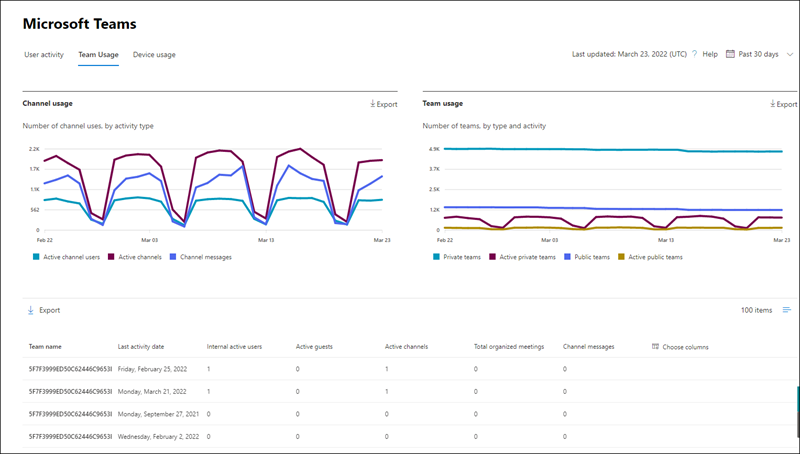
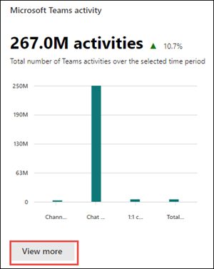
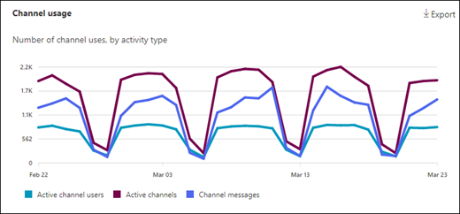
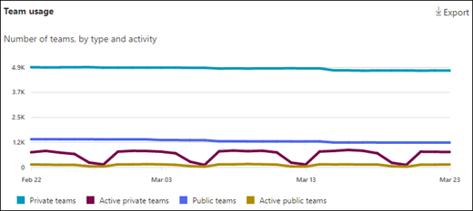
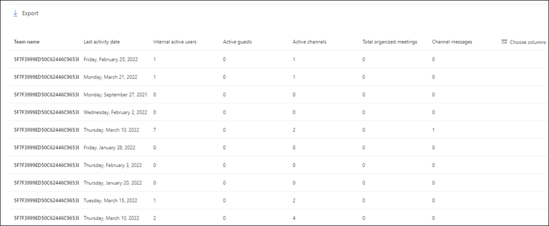
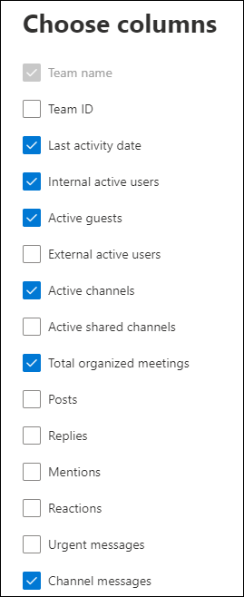

# Microsoft 365 Reports in the admin center - Microsoft Teams usage activity

The Microsoft 365 Reports dashboard shows you the activity overview across the products in your organization. It enables you to drill in to individual product level reports to give you more granular insight about the activities within each product. Check out [the Reports overview topic](activity-reports.md).

The brand-new **Teams usage report** gives you an overview of the usage activity in Teams, including the number of active users, channels and messages so you can quickly see how many users across your organization are using Teams to communicate and collaborate.  It also includes other Teams specific activities, such as the number of active guests, meetings, and messages.

## How to get to the Microsoft Teams usage activity report

1. In the admin center, go to the **Reports**, then select **Usage**.
2. From the dashboard homepage, click on the **View more** button on the **Microsoft Teams activity** card.

    

3. On the **Microsoft Teams** reports page, select the **Teams Usage** tab.

## Interpret the Microsoft Teams usage activity report

You can view the user activity in the Teams report by choosing the **Teams Usage** tab. This will display the following charts:

- **Channel usage**: Tracks the number of channel uses, by activity type, over time.

  

- **Team usage**: Tracks the number of teams, by type and activity, over time.

  

Additionally, the chart includes usage details for individual teams, such as last activity date, active users, active channels, and other data.

In the table, select **Choose columns** to add or remove columns from the report.

You can also export the report data into an Excel .csv file by selecting the **Export** link. This exports data of all users and enables you to do simple sorting and filtering for further analysis.  The exported format for **audio time**, **video time**, and **screen share time** follows ISO8601 duration format.

The **Microsoft Teams usage activity** report can be viewed for trends over the last 7 days, 30 days, 90 days, or 180 days. However, if you select a particular day in the report, the table will show data for up to 28 days from the current date (not the date the report was generated).

To ensure data quality, we perform daily data validation checks for the past three days and will be filling any gaps detected. You may notice differences in historical data during the process.

> [!Important]
> Data for a given day will show up within 48 hours. For example, data for January 10th should show up in the report by January 12th.

### Channel usage metrics

The Channel usage chart shows data on the following metrics.

|Item|Description|
|:-----|:-----|
|**Metric**|**Definition**|
|Active channel users|This is the total of internal active users, active guests, and external active users.     **Internal active users** - Users that have at least one panel action in the specified time period. This excludes guests.     **Active guests** - Guests that have at least one panel action in the specified time period. A guest is a person from outside your organization who accesses shared resources by signing in to a guest account in my directory.    **External active user** - External participants that have at least one panel action in the specified time period. An external participant is a person from outside your organization who is participating in a resource – such as a shared channel – using their own identity and not a guest account in your directory.|
|Active channels|Valid channels in active teams that have at least one active user in the specified time period. This includes public, private, or shared channels.|
|Channel messages|The number of unique messages that the user posted in a private chat during the specified time period.|

> [!NOTE]
> Panel action refers to any action taken by the user in the panel within Microsoft Teams.

### Team usage metrics

The Teams usage chart shows data on the following metrics.

|Item|Description|
|:-----|:-----|
|**Metric**|**Definition**|
|Private teams|A private team that is either active or inactive.|
|Public teams|A public team that is either active or inactive.|
|Active private teams|A team that is private and active.|
|Active public teams|A team that is public and active.|

### Teams details

Data for following metrics are available for individual teams.

|Item|Description|
|:-----|:-----|
|**Metric**|**Definition**|
|Team ID|Team identifier|
|Internal active users|Users that have at least one panel action in the specified time period including guests.     Internal users and guests that reside in the same tenant. Internal users exclude guests.|
|Active guests|Guests that have at least one panel action in the specified time period.     A guest is defined as persons from outside your organization who accesses shared resources by signing in to a guest account in my directory.|
|External active users|External participants that have at least one panel action in the specified time period.   An external participant is defined as a person from outside your organization who is participating in a resource – such as a shared channel – using their own identity and not a guest account in your directory.|
|Active channels|Valid channels in active teams that have at least one active user in the specified time period. This includes public, private, or shared channels.|
|Active shared channels|Valid shared channels in active teams that have at least one active user in the specified time.    A shared channel is defined as a Teams channel that can be shared with people outside the team. These people can be inside your organization or from other Microsoft Entra organizations.|
|Total organized meetings|The sum of one-time scheduled, recurring, ad hoc and unclassified meetings a user organized during the specified time period.|
|Posts|Count of all the post messages in channels in the specified time period.|
|Replies|Count of all the reply messages in channels in the specified time period.|
|Mentions|Count of all mentions made in the specified time period.|
|Reactions|Number of reactions an active user made in the specified time period.|
|Urgent messages|Count of urgent messages in the specified time period.|
|Channel messages|The number of unique messages that the user posted in a team chat during the specified time period.|
|Last activity date|The latest date that any member of the team has committed an action.|

> [!NOTE]
> Metric counts include Teams client built-in features, but don't include changes to chat and channel through service integration, such as Teams app posts or replies and emails in the channel.

## Make the user-specific data anonymous

To make the data in Teams user activity report anonymous, you have to be a global administrator. This will hide identifiable information (using MD5 hashes) such as display name, email, and Microsoft Entra Object ID in report and their export.

1. In Microsoft 365 admin center, go to the **Settings** > **Org Settings**, and under **Services** tab, choose **Reports**.

2. Select **Reports**, and then choose to **Display anonymous identifiers**. This setting gets applied both to the usage reports in Microsoft 365 admin center and Teams admin center.

3. Select **Save changes**.

## See also

[Microsoft Teams device usage report](../activity-reports/microsoft-teams-device-usage-preview.md)

[Microsoft Teams user activity report](../activity-reports/microsoft-teams-user-activity-preview.md)
