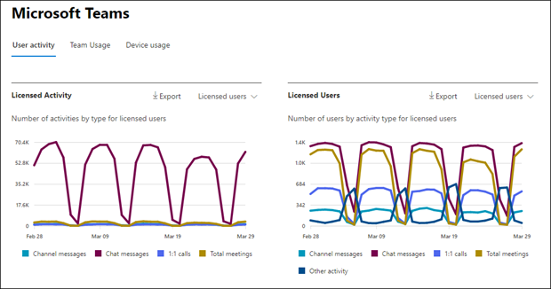
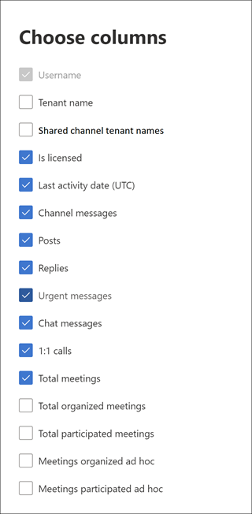

# Microsoft 365 Reports in the admin center - Microsoft Teams user activity

The Microsoft 365 Reports dashboard shows you the activity overview across the products in your organization. It enables you to drill in to individual product level reports to give you more granular insight about the activities within each product. Check out [the Reports overview topic](activity-reports.md). In the Microsoft Teams user activity report, you can gain insights into the Microsoft Teams activity in your organization.
 
## How to get to the Microsoft Teams user activity report

1. In the admin center, go to the **Reports**, then select **Usage**.

2. From the dashboard homepage, click on the **View more** button on the Microsoft Teams activity card.

## Interpret the Microsoft Teams user activity report

You can view the user activity in the Teams report by choosing the **User activity** tab.  

Select **Choose columns** to add or remove columns from the report.  

You can also export the report data into an Excel .csv file by selecting the **Export** link. This exports data of all users and enables you to do simple sorting and filtering for further analysis. The exported format for **audio time**, **video time**, and **screen share time** follows ISO8601 duration format.

The **Microsoft Teams user activity** report can be viewed for trends over the last 7 days, 30 days, 90 days, or 180 days. However, if you select a particular day in the report, the table will show data for up to 28 days from the current date (not the date the report was generated).

To ensure data quality, we perform daily data validation checks for the past three days and will be filling any gaps detected. You may notice differences in historical data during the process.

|Item|Description|
|:-----|:-----|
|**Metric**|**Definition**|
|User name    |The email address of the user. You can display the actual email address or make this field anonymous.     |
|Tenant name    |The name of an internal or external tenant where a user belongs.       If a user belongs to an external tenant, corresponding data metrics (for example, post messages, reply messages,  etc.) are calculated based on their interactions in shared channels of the admin’s tenant. Interactions done by the user in their own tenant (outside of shared channels of the given tenant) are not considered for the admin usage report of given tenant.  |
|Is external     |Indicates if the user is an external user or not.     |
|Shared channel tenant names     |The names of internal or external tenants of shared channels where the user participated.     |
|Channel messages     |The number of unique messages that the user posted in a team chat during the specified time period. This includes original posts and replies.     |
|Posts     |The number of post messages in all channels during the specified time period. A post is the original message in a teams chat.  |
|Replies     |The number of replied messages in all channels during the specified time period.   |
|Urgent messages      |The number of urgent messages during the specified time period.   |
|Chat messages     |The number of unique messages that the user posted in a private chat during the specified time period.    |
|Total meetings     |The number of online meetings that the user participated in during the specified time period.    |
|1:1 calls     | The number of 1:1 calls that the user participated in during the specified time period.    |
|Last activity date (UTC)    |The last date that the user participated in a Microsoft Teams activity.  |
|Meetings participated ad hoc     | The number of ad hoc meetings a user participated in during the specified time period.    |
|Meetings organized ad hoc   |The number of ad hoc meetings a user organized during the specified time period.  |
|Total organized meetings    |The sum of one-time scheduled, Recurring, ad hoc and unclassified meetings a user organized during the specified time period.    |
|Total participated meetings    |The sum of the one-time scheduled, recurring, ad hoc and unclassified meetings a user participated in during the specified time period.    |
|Meetings organized scheduled one-time    |The number of one-time scheduled meetings a user organized during the specified time period.    |
|Meetings organized scheduled recurring    |The number of recurring meetings a user organized during the specified time period.    |
|Meetings participated scheduled one-time    |The number of the one-time scheduled meetings a user participated in during the specified time period.    |
|Meetings participated scheduled recurring    |The number of the recurring meetings a user participated in during the specified time period.    |
|Is licensed    |Selected if the user is licensed to use Teams.  |
|Other activity   |The User is active but has performed other activities than exposed action types offered in the report (sending or replying to channel messages and chat messages, scheduling or participating in 1:1 calls and meetings). Examples actions are when a user changes the Teams status or the Teams status message or opens a Channel Message post but does not reply.   |

## Make the user-specific data anonymous

To make the data in Teams user activity report anonymous, you have to be a global administrator. This will hide identifiable information (using MD5 hashes) such as display name, email, and Azure Active Directory Object ID in report and their export.

1. In Microsoft 365 admin center, go to the **Settings** > **Org Settings**, and under **Services** tab, choose **Reports**.

2. Select **Reports**, and then choose to **Display anonymous identifiers**. This setting gets applied both to the usage reports in Microsoft 365 admin center and Teams admin center.

3. Select **Save changes**.

## Related content

[Microsoft Teams device usage report](../activity-reports/microsoft-teams-device-usage-preview.md)

[Microsoft Teams usage activity report](../activity-reports/microsoft-teams-usage-activity.md) 
