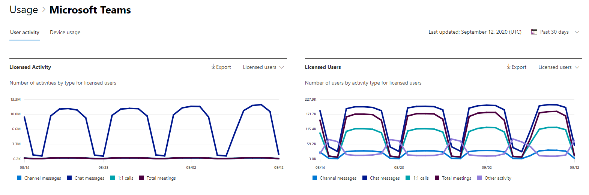
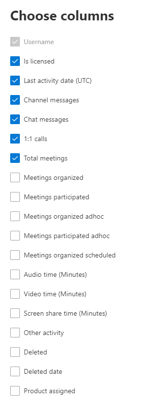

# Microsoft 365 Reports in the admin center - Microsoft Teams user activity

The Microsoft 365 **Reports** dashboard shows you the activity overview across the products in your organization. It enables you to drill in to individual product level reports to give you more granular insight about the activities within each product. Check out [the Reports overview topic](activity-reports.md). In the Microsoft Teams user activity report, you can gain insights into the Microsoft Teams activity in your organization.
  
> [!NOTE]
> You must be a global administrator, global reader or reports reader in Microsoft 365 or an Exchange, SharePoint, Teams Service, Teams Communications, or Skype for Business administrator to see reports.  
 
## How to get to the Microsoft Teams user activity report

1. In the admin center, go to the **Reports** \> <a href="https://go.microsoft.com/fwlink/p/?linkid=2074756" target="_blank">Usage</a> page.
2. From the dashboard homepage, click on the **View more** button on the Microsoft Teams activity card.

## Interpret the Microsoft Teams user activity report

You can view the user activity in the Teams report by choosing the **User activity** tab.  

Select **Choose columns** to add or remove columns from the report.    

You can also export the report data into an Excel .csv file by selecting the **Export** link. This exports data of all users and enables you to do simple sorting and filtering for further analysis. If you have less than 2000 users, you can sort and filter within the table in the report itself. If you have more than 2000 users, in order to filter and sort, you will need to export the data. The exported format for **audio time**, **video time** and **screen share time** follows ISO8601 duration format.

|Item|Description|
|:-----|:-----|
|**Metric**|**Definition**|
|User name    |The email address of the user. You can display the actual email address or make this field anonymous.     |
|Channel messages     |The number of unique messages that the user posted in a team chat during the specified time period.    |
|Chat messages     |The number of unique messages that the user posted in a private chat during the specified time period.    |
|Total meetings     |The number of online meetings that the user participated in during the specified time period.    |
|1:1 calls     | The number of 1:1 calls that the user participated in during the specified time period.    |
|Last activity date (UTC)    |The last date that the user participated in a Microsoft Teams activity.  |
|Meetings participated adhoc     | The number of meetings not scheduled on the calendar that the user participated in during the specified time period.    |
|Meetings organized adhoc   |The number of meetings not scheduled on the calendar that the user organized during the specified time period.  |
|Meetings organized scheduled    |The number of scheduled meetings  a user organized during the specified time period.    |
|Is licensed |Selected if the user is licensed to use Teams.|
|Other activity|The User is active but has performed other activities than exposed action types offered in the report (sending or replying to channel messages and chat messages, scheduling or participating in 1:1 calls and meetings). Examples actions are when a user changes the Teams status or the Teams status message or opens a Channel Message post but does not reply. |
|||