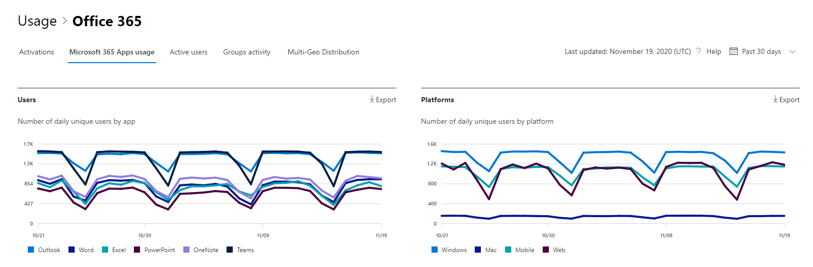

# Microsoft 365 Reports in the admin center - Microsoft 365 Apps usage

The Microsoft 365 **Reports** dashboard shows you the activity overview across the products in your organization. It enables you to drill in to individual product level reports to give you more granular insight about the activities within each product. Check out [the Reports overview topic](activity-reports.md).

 For example, you can understand the activity of each user licensed to use Microsoft 365 Apps apps by looking at their activity across the apps and how they are utilized across platforms.

 > [!NOTE]
 > You must be a global administrator, global reader or reports reader in Microsoft 365 or an Exchange, SharePoint, or Skype for Business administrator to see reports. Shared computer activations are not included in this report.

## How to get to the Microsoft 365 Apps usage report

1. In the admin center, go to the **Reports** \> <a href="https://go.microsoft.com/fwlink/p/?linkid=2074756" target="_blank">Usage</a> page. 
2. From the dashboard homepage, click on the **View more** button on the Active users - Microsoft 365 Apps card.

## Interpret the Microsoft 365 Apps usage report

You can get a view into your user's Microsoft 365 Apps activity by looking at the **Users** and **Platform** charts.

> [!div class="mx-imgBorder"]
> 

|Item|Description|
 |:-----|:-----|
 |1.   |The **Microsoft 365 Apps usage** report can be viewed for trends over the last 7 days, 30 days, 90 days, or 180 days. However, if you select a particular day in the report, the table (7) will show data for up to 28 days from the current date (not the date the report was generated).   |
 |2.   |The data in each report usually covers up to the last two days. Every six day, we will refresh the report with minor updates to ensure data quality.   |
 |3.   |The **Users** view shows the trend in the number of active users for each app – Outlook, Word, Excel, PowerPoint, OneNote, and Teams. "Active users" are any who perform any intentional actions within these apps.   |
 |4.   |The **Platforms** view shows the trend of active users across all apps for each platform – Windows, Mac, Web, and Mobile.   |
 |5. |On the **Users** chart, the Y-axis is the number of unique active users for the respective app. On the **Platforms** chart, the Y-axis is the number of unique users for the respective platform. The X-axis on both charts is the date on which an app was used on a given platform. |
 6. |You can filter the series you see on the chart by selecting an item in the legend. For example, on the **Users** chart, select Outlook, Word, Excel, PowerPoint, OneDrive, or Teams to see only the info related to each one. Changing this selection doesn't change the info in the grid table below it.|
 |7. |The table shows you a breakdown of data at the per-user level. You can add or remove columns from the table.   **Username** is the email address of the user who performed the activity on Microsoft Apps.  **Last activation date (UTC)** is the latest date on which the user activated their Microsoft 365 Apps subscription.  **Last activity date (UTC)** is the latest date an intentional activity was performed by the user. To see activity that occurred on a specific date, select the date directly in the chart.  The other columns identify if the user was active on that platform for that app (within Microsoft 365 Apps) in the period selected. |
 |8. |Select the **Choose columns** icon to add or remove columns from the report.|
 |9. |You can also export the report data into an Excel .csv file by selecting the **Export** link. This exports data for all users and enables you to do simple aggregation, sorting, and filtering for further analysis. If you have less than 100 users, you can sort and filter within the table in the report itself. If you have more than 100 users, in order to filter and sort, you will need to export the data.|
