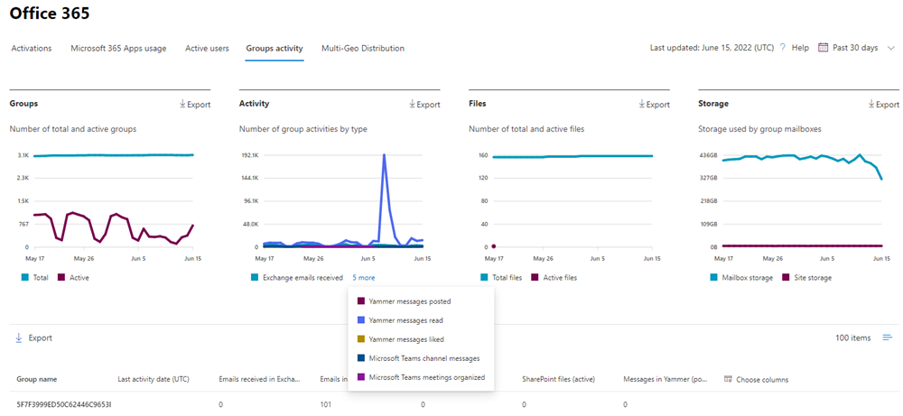
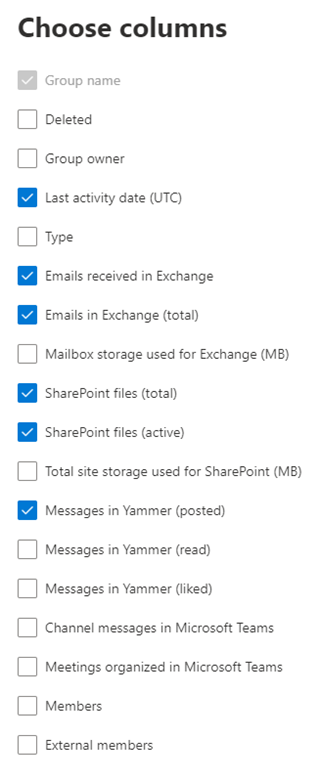

# Microsoft 365 Reports in the admin center - Microsoft 365 groups

The Microsoft 365 **Reports** dashboard shows you the activity overview across the products in your organization. It enables you to drill in to individual product level reports to give you more granular insight about the activities within each product. Check out [the Reports overview topic](activity-reports.md). In the Microsoft 365 groups report, you can gain insights into the activity of groups in your organization and see how many groups are being created and used.
  
> [!NOTE]
> You must be a global administrator, global reader or reports reader in Microsoft 365 or an Exchange, SharePoint, Teams Service, Teams Communications, or Skype for Business administrator to see reports.  
  
## How to get to the groups report

1. In the admin center, go to the **Reports** \> <a href="https://go.microsoft.com/fwlink/p/?linkid=2074756" target="_blank">Usage</a> page. 
2. From the dashboard homepage, click on the **View more** button on the Active users - Microsoft 365 Apps or the Active users - Microsoft 365 Services card to get to the Office 365 report page.
  
## Interpret the groups report

You can view the activations in the Office 365 report by choosing the **Groups activity** tab. 

Select **Choose columns** to add or remove columns from the report.    

You can also export the report data into an Excel .csv file by selecting the **Export** link. This exports data of all users and enables you to do simple sorting and filtering for further analysis. If you have less than 2000 users, you can sort and filter within the table in the report itself. If you have more than 2000 users, in order to filter and sort, you will need to export the data. 

|Item|Description|
|:-----|:-----|
|**Metric**|**Definition**|
|Group name    |The name of the group.    |
|Deleted    |The number of deleted groups. If the group is deleted, but had activity in the reporting period it will show up in the grid with this flag set to true.    |
|Group owner    |The name of the group owner.    |
|Last activity date (UTC)    |The latest date a message was received by the group. - This is the latest date an activity happened in an email conversation, Yammer, or the Site.    |
|Type    |The type of group. This can be private or public group.    |
|Emails received in Exchange    |The number of messages received by the group.|
|Emails in Exchange (total)    |The total number of items in the group's mailbox.    |
|Mailbox storage used for Exchange (MB)    |The storage used by the group's mailbox.  |
|SharePoint files (total)    |The number of files stored in SharePoint group sites.    |
|SharePoint files (active)    |The number of files in the SharePoint group site that were acted on (viewed or modified, synched , shared internally or externally) during the reporting period.    |
|Total site storage used for SharePoint (MB)    |The amount of storage in MB used during the reporting period.    |
|Messages in Yammer (posted)    |The number of messages posted in the Yammer group over the reporting period.    |
|Messages in Yammer (read)    |The number of conversations read in the Yammer group over the reporting period.    |
|Messages in Yammer (liked)    |The number of messages liked in the Yammer group over the reporting period.    |
|Members    |The number of members in the group.    |
|External members |The number of external users in the group.|
|||

## Related content

[Microsoft 365 Reports in the admin center](activity-reports.md) (article)\
[Reports in the Security & Compliance Center](../../compliance/reports-in-security-and-compliance.md) (article)\
[Microsoft 365 Reports in the admin center - Active Users](../../admin/activity-reports/active-users-ww.md) (article)

