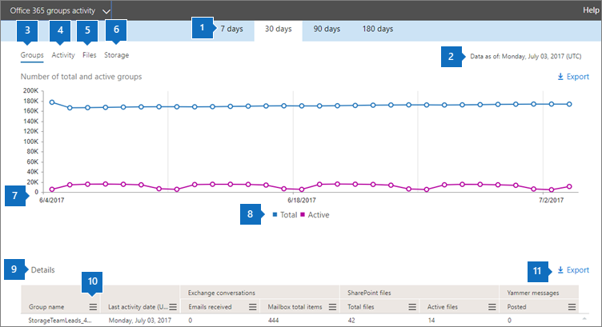
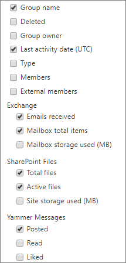

# Microsoft 365 Reports in the admin center - Microsoft 365 groups

The Microsoft 365 **Reports** dashboard shows you the activity overview across the products in your organization. It enables you to drill in to individual product level reports to give you more granular insight about the activities within each product. Check out [the Reports overview topic](activity-reports.md). In the Microsoft 365 groups report, you can gain insights into the activity of groups in your organization and see how many groups are being created and used.
  
> [!NOTE]
> You must be a global administrator, global reader or reports reader in Microsoft 365 or an Exchange, SharePoint, Teams Service, Teams Communications, or Skype for Business administrator to see reports.  
  
## How to get to the groups report

1. In the admin center, go to the **Reports** \> <a href="https://go.microsoft.com/fwlink/p/?linkid=2074756" target="_blank">Usage</a> page.

2. From the options, select **View more** under **Active users - Microsoft 365 Services**.
3. From the **Select a report** drop-down, select **Office 365** \> **Groups activity**.
  
## Interpret the groups report

You can get a view into groups activity by looking at the **Groups**, **Activity**, **Files**, and **Storage** charts. 
  

  
|Item|Description|
|:-----|:-----|
|1.    |The **Microsoft 365 groups** report can be viewed for trends over the last 7 days, 30 days, 90 days, or 180 days. However, if you select a particular day in the report, the table (7) will show data for up to 28 days from the current date (not the date the report was generated).    |
|2.    |The data in each report usually covers up to the last 24 to 48 hours.    |
|3.    |The **Groups** view shows a total number of groups that existed on any given day, and active groups on that day based on Email Conversations, Yammer Posts and SharePoint file activities and SharePoint pages viewed.    |
|4.    |The **Activity** view shows you the number of group activities across group workloads. You can view the Exchange emails received by the group mailboxes across all groups, on any day during the reporting period. You can also see messages posted, read, and liked across the Yammer groups associated with a group.   |
|5.    |The **Files** view shows you the number of total and active files across all group sites associated with a group.    |
|6.    |The **Storage** view shows you the total storage used across all group mailboxes and group sites.    |
|7.    | On the **Groups** chart, Y-axis is the number of groups (which can be seen as total vs active).     On the **Activity** chart, Y-axis is the number of times an activity was performed in groups.     On the **Files** chart, the Y axis is the number of either total or active files.     On the **Storage** chart, the Y axis is total storage used by the group mailbox or site.     The X axis on all three charts is the selected date range for the specific report.    |
|8.    |You can filter the series you see on the chart by selecting an item in the legend. For example, on the **Groups** chart, select **Total** or **Active**  to see only the info related to each one. Changing this selection doesn't change the info in the grid table.    |
|9.    | The list of groups shown is determined by the set of all groups that existed (weren't deleted) across the widest (180-day) reporting time frame. The activity count (email conversations, Yammer posts and SharePoint file activities) will vary according to the date selection.    NOTE: You might not see all the items in the list below in the columns until you add them. **Group name** is the name of the group.    **Deleted** is the number of deleted groups. If the group is deleted, but had activity in the reporting period it will show up in the grid with this flag set to true.    **Group owner** is the name of the group owner.    **Last activity date** is the latest date a message was received by the group. - This is the latest date an activity happened in an email conversation, Yammer, or the Site.    **Type** is the type of group. This can be private or public group.    **Members** is the number of members in the group.    **External members** is the number of external users in the group.    **Exchange**   **Emails received** is the number of messages received by the group.    **Mailbox total items** is the total number of items in the group's mailbox.    **Mailbox storage used** is the storage used by the group's mailbox.    **SharePoint Files**   **Total files** is the number of files stored in SharePoint group sites.    **Active files** is the number of files in the SharePoint group site that were acted on (viewed or modified, synched , shared internally or externally) during the reporting period    **Site storage used (MB)** is the amount of storage in MB used during the reporting period.    **Yammer Messages**   **Posted** is the number of messages posted in the Yammer group over the reporting period.    **Read** is the number of conversations read in the Yammer group over the reporting period.    **Liked** is the number of messages liked in the Yammer group over the reporting period.     If your organization's policies prevents you from viewing reports where user information is identifiable, you can change the privacy setting for all these reports. Check out the **How do I hide user level details?** section in the [Activity Reports in the Microsoft 365 admin center](activity-reports.md).    |
|10,    |Select or tap **More Actions** button  next to a column heading to add or remove columns from the report.    |
|11,    |You can also export the report data into an Excel .csv file by selecting the **Export** link. This exports data of all users and enables you to do simple sorting and filtering for further analysis. If you have less than 2000 users, you can sort and filter within the table in the report itself. If you have more than 2000 users, in order to filter and sort, you will need to export the data.    |
|||
   
