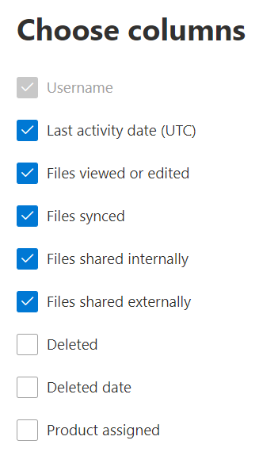

# Microsoft 365 Reports in the admin center - OneDrive for Business activity

The Microsoft 365 **Reports** dashboard shows you the activity overview across the products in your organization. It lets you drill in to individual product level reports to give you more granular insight about the activities within each product. Check out [the Reports overview topic](activity-reports.md).
  
For example, you can understand the activity of every user licensed to use OneDrive by looking at their interaction with files on OneDrive. It also helps you to understand the level of collaboration going on by looking at the number of files shared.
  
> [!NOTE]
> You must be a global administrator, global reader or reports reader in Microsoft 365 or an Exchange, SharePoint, Teams Service, Teams Communications, or Skype for Business administrator to see reports.  
 
## How do I get to the OneDrive Activity report?

1. In the admin center, go to the **Reports** \> <a href="https://go.microsoft.com/fwlink/p/?linkid=2074756" target="_blank">Usage</a> page. 
2. From the dashboard homepage, click on the **View more** button on the OneDrive card.
  
## Interpret the OneDrive for Business activity report

You can view the activities in the OneDrive report by choosing the **Activity** tab. 

Select **Choose columns** to add or remove columns from the report.    

You can also export the report data into an Excel .csv file by selecting the **Export** link. This exports data of all users and enables you to do simple sorting and filtering for further analysis. If you have less than 2000 users, you can sort and filter within the table in the report itself. If you have more than 2000 users, in order to filter and sort, you will need to export the data. 
  
|Item|Description|
|:-----|:-----|
|**Metric**|**Definition**|
|Username    |The user name of the owner of the OneDrive account.    |
|Last activity date (UTC)    |The latest date a file activity was performed on the OneDrive account for the selected date range. . To see activity that occurred on a specific date, select the date directly in the chart.    |
|Files viewed or edited    |The number of files that the user uploaded, downloaded, modified, or viewed.     |
|Files synced    |The number of files that have been synced from a user's local device to the OneDrive account.   |
|Files shared internally    | The number of files that have been shared with users within the organization, or with users within groups (that might include external users).    |
|Files shared externally    |The number of files that have been shared with users outside of the organization.  |
|Deleted    | This indicates that the user's license was removed.    NOTE: Activity for a deleted user will still display in a report as long as he or she was licensed at some time during the selected time period. The **Deleted** column helps you to note that the user may no longer be active, but contributed to the data in the report.    |
|Deleted date    |The date on which the user's license was removed.  |
|Product assigned    |The Microsoft 365 products that are licensed to the user.|
|||