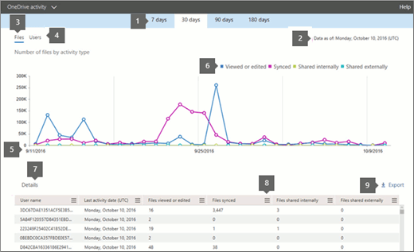

# Microsoft 365 Reports in the admin center - OneDrive for Business activity

The Microsoft 365 **Reports** dashboard shows you the activity overview across the products in your organization. It lets you drill in to individual product level reports to give you more granular insight about the activities within each product. Check out [the Reports overview topic](activity-reports.md).
  
For example, you can understand the activity of every user licensed to use OneDrive by looking at their interaction with files on OneDrive. It also helps you to understand the level of collaboration going on by looking at the number of files shared.
  
> [!NOTE]
> Some functionality is introduced gradually. This means that you may not yet see this feature or it may look different than what is described in the help articles. But don't worry - it's coming soon! 
  
If you want to understand the amount of activity happening against each OneDrive account and the storage utilization, you can view the [OneDrive usage report](onedrive-for-business-usage.md).
  
> [!NOTE]
> You must be a global administrator, global reader or reports reader in Microsoft 365 or an Exchange, SharePoint, Teams Service, Teams Communications, or Skype for Business administrator to see reports.  
 
## How do I get to the OneDrive Activity report?

1. In the admin center, go to the **Reports** \> <a href="https://go.microsoft.com/fwlink/p/?linkid=2074756" target="_blank">Usage</a> page.

    
2. From the **Select a report** drop-down, select **OneDrive** \> **Activity**.
  
## Interpret the OneDrive for Business activity report

You can get a view into OneDrive for Business activity by looking at the **Files** and **Users** views. 
  

  
|Item|Description|
|:-----|:-----|
|1.    |The **OneDrive for Business activity** report can be viewed for trends over the last 7 days, 30 days, 90 days, or 180 days. However, if you select a particular day in the report, the table (7) will show data for up to 28 days from the current date (not the date the report was generated).    |
|2.    |The data in each report usually covers up to the last 24 to 48 hours.  |
|3.    |The **Files** view helps you to understand the unique number of licensed users that performed file interactions against any OneDrive account.    |
|4.    |The **Users** view helps you to understand the trend in the number of active OneDrive users. A user is considered active if he or she has executed a file activity (save, sync, modify, or share) within the specified time period.    NOTE: A file activity can occur multiple times for a single file, but will only count as one active file. For example, you can save and sync the same file multiple times over a specified time period, but it will only count as one single active file and one single synced file in the data.           |
|5.    | On the **Files** chart, the Y axis is the number of unique files that any user either saved, synced, modified, or shared.     On the **Users** chart, the Y axis is the number of unique users that performed file interactions (save, sync, modify, or share) on any OneDrive account.     The X axis on all charts is the selected date range for this specific report.    |
|6.    |You can filter the series you see on the chart by selecting an item in the legend. For example, on the **Files** chart, select **Viewed or edited** or **Synced** to see only the information related to each one. Changing this selection doesn't change the information in the grid table.    |
|7.    | The table shows you a breakdown of data at the per-user level. You can add or remove columns from the table.      **Username** is the user name of the owner of the OneDrive account.    **Last activity date (UTC)** is the latest date a file activity was performed on the OneDrive account for the selected date range. To see activity that occurred on a specific date, select the date directly in the chart.         This will filter the table to display file activity data only for users who performed the activity on that specific day.    **Files viewed or edited** is the number of files that the user uploaded, downloaded, modified, or viewed.    **Files synced** is the number of files that have been synced from a user's local device to the OneDrive account.    **Files shared internally** is the number of files that have been shared with users within the organization, or with users within groups (that might include external users).    **Files shared externally** is the number of files that have been shared with users outside of the organization.    **Deleted** indicates that the user's license was removed.    NOTE: Activity for a deleted user will still display in a report as long as he or she was licensed at some time during the selected time period. The **Deleted** column helps you to note that the user may no longer be active, but contributed to the data in the report. **Deleted date** is the date on which the user's license was removed.    **Product assigned** are the Microsoft 365 products that are licensed to the user.     If your organization's policies prevent you from viewing reports where user information is identifiable, you can change the privacy setting for all these reports. Check out the **How do I hide user level details?** section in the [Activity Reports in the Microsoft 365 admin center](activity-reports.md).    |
|8.    |Select the **Manage columns** icon  to add or remove columns from the report.    |
|9.    |You can also export the report data into an Excel .csv file, by selecting the **Export** link. This exports data of all users and enables you to do simple sorting and filtering for further analysis. If you have less than 2000 users, you can sort and filter within the table in the report itself. If you have more than 2000 users, in order to filter and sort, you will need to export the data.    |
|||
   

