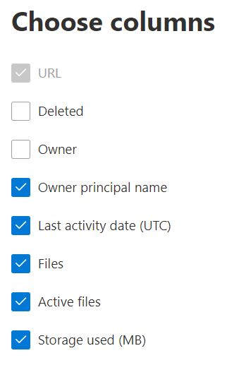

# Microsoft 365 Reports in the admin center - OneDrive for Business usage

The Microsoft 365 Reports dashboard shows you the activity overview across the products in your organization. It enables you to drill in to individual product level reports to give you more granular insight about the activities within each product. Check out [the Reports overview topic](activity-reports.md).
  
For example, the OneDrive card on the dashboard gives you a high-level view of the value you are getting from OneDrive for Business in terms of the total number of files and storage used across your organization. You can then drill into it to understand the trends of active OneDrive accounts, how many files are users interacting with as well as the storage used. It also gives you details for each user's OneDrive.

## How do I get to the OneDrive usage report?

1. In the admin center, go to the **Reports**, and then select **Usage**. 
2. From the dashboard homepage, click on the **View more** button on the OneDrive card.
  
## Interpret the OneDrive usage report

You can view the usage in the OneDrive report by choosing the **Usage** tab.

Select **Choose columns** to add or remove columns from the report.  

You can also export the report data into an Excel .csv file by selecting the **Export** link. This exports data of all users and enables you to do simple sorting and filtering for further analysis. 

The **OneDrive for Business usage** report can be viewed for trends over the last 7 days, 30 days, 90 days, or 180 days. However, if you select a particular day in the report, the table will show data for up to 28 days from the current date (not the date the report was generated).
  
|Item|Description|
|:-----|:-----|
|**Metric**|**Definition**|
|URL    |The web address for the user's OneDrive.   |
|Deleted    |The deletion status of the OneDrive. It takes at least 7 days for accounts to be marked as deleted.    |
|Owner    |The username of the primary administrator of the OneDrive.     |
|Owner principal name    |The email address of the owner of the OneDrive.   |
|Last activity date (UTC)    | The latest date a file activity was performed in the OneDrive. If the OneDrive has had no file activity, the value will be blank.    |
|Files    |The number of files in the OneDrive.  |
|Active files    | The number of active files within the time period.  NOTE: If files were removed during the specified time period for the report, the number of active files shown in the report may be larger than the current number of files in the OneDrive. >  Deleted users will continue to appear in reports for 180 days.    |
|Storage used (MB)    |The amount of storage the OneDrive uses in MB. |
|||
   
> [!NOTE]
> The report only includes users who have a valid OneDrive for Business license.
