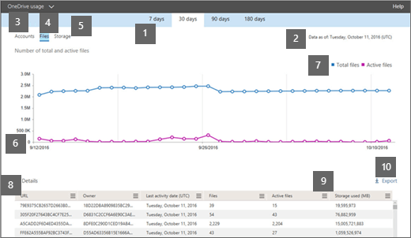
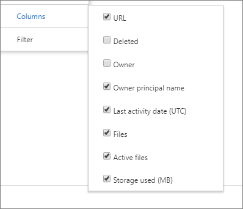

# Microsoft 365 Reports in the admin center - OneDrive for Business usage

The Microsoft 365 **Reports** dashboard shows you the activity overview across the products in your organization. It enables you to drill in to individual product level reports to give you more granular insight about the activities within each product. Check out [the Reports overview topic](activity-reports.md).
  
For example, the OneDrive card on the dashboard gives you a high-level view of the value you are getting from OneDrive for Business in terms of the total number of files and storage used across your organization. You can then drill into it to understand the trends of active OneDrive accounts, how many files are users interacting with as well as the storage used. It also gives you details for each user's OneDrive.
  
> [!NOTE]
> You must be a global administrator, global reader or reports reader in Microsoft 365 or an Exchange, SharePoint, Teams Service, Teams Communications, or Skype for Business administrator to see reports.  
 
## How do I get to the OneDrive Usage Report?

1. In the admin center, go to **Reports** \> <a href="https://go.microsoft.com/fwlink/p/?linkid=2074756" target="_blank">Usage</a>.

    
2. From the **Select a report** drop-down, select **OneDrive** \> **Usage**. 
  
## Interpret the OneDrive usage report

You can get a view into OneDrive for Business usage by looking at the **Accounts**, **Files**, and **Storage** views. 
  

  
|Item|Description|
|:-----|:-----|
|1.    |The **OneDrive usage** report shows trends over the last 7 days, 30 days, 90 days, or 180 days. However, if you select a particular day in the report, the table (7) will show data for up to 28 days from the current date (not the date the report was generated).    |
|2.    |The data in each report usually covers up to the last 24 to 48 hours.  |
|3.    |The **Accounts** view shows the trend in the number of total and active OneDrive accounts. "Active accounts" are any in which users view, modify, upload, download, share, or sync files.    |
|4.    |The **Files** view shows the number of total and active files. A file is considered active if it has been saved, synced, modified, or shared within a specific time period.    NOTE: A file activity can occur multiple times for a single file, but will count only as one active file. For example, you can save and sync the same file multiple times over a specified time period, but it will count only as one single active file and one single synced file in the data.           |
|5.    |The **Storage** view shows the trend in the amount of OneDrive storage you're using. If you want to check the storage limits, see [Check if a user has the default storage limit or a specific limit](https://docs.microsoft.com/onedrive/set-default-storage-space#check-if-a-user-has-the-default-storage-limit-or-a-specific-limit).    NOTE: The size includes any versions and metadata associated with the files.           |
|6.    | On the **Accounts** chart, the Y axis is the number of OneDrive accounts.     On the **Files** chart, the Y axis is the number of files stored in OneDrive.     On the **Storage** chart, the Y axis is the amount of OneDrive storage used.     The X axis on all charts is the selected date range for this specific report.    |
|7.    |You can filter the series you see on the chart by selecting an item in the legend. For example, on the **Files** chart, select **Total files** or **Active files**. On the **Accounts** chart, select **Total accounts** or **Active accounts**. Or on the **Storage** chart, select **Storage used**. Changing your selection doesn't change the information in the table.    |
|8.    | The table shows you a breakdown of data for each user's OneDrive. To appear in the table, a user needs to have been assigned a product license that includes OneDrive, and they need to have SharePoint Online turned on. The user also needed to either sign in to the OneDrive sync client, or browse to their OneDrive using a web browser.     If the OneDrive has had file activity, it will have the latest date that the file activity was performed. The rows in the table are sorted by **Last activity date** so the OneDrive with the most recent file activity appears at the top of the list.     You can add or remove columns from the table.        **URL** is the web address for the user's OneDrive.    **Deleted** is the deletion status of the OneDrive. It takes at least 7 days for accounts to be marked as deleted.    **Owner** is the username of the primary administrator of the OneDrive.    **Owner principal name** is the email address of the owner of the OneDrive.    **Last activity date (UTC)** is the latest date a file activity was performed in the OneDrive. If the OneDrive has had no file activity, the value will be blank.    **Files** is the number of files in the OneDrive.    **Active files** is the number of active files within the time period.  NOTE: If files were removed during the specified time period for the report, the number of active files shown in the report may be larger than the current number of files in the OneDrive. Deleted users will continue to appear in reports for 180 days. **Storage used (MB)** is the amount of storage the OneDrive uses in MB.    If your organization's policies prevent you from viewing reports where user information is identifiable, you can change the privacy setting for all these reports. Check out the **How do I hide user level details?** section in the [Activity Reports in the Microsoft 365 admin center](activity-reports.md).    |
|9.    |Select the **Manage columns** icon  to add or remove columns from the report.    |
|10.    |You can also export the report data into an Excel .csv file, by selecting the **Export** link. This exports the date for each OneDrive and allows you to do simple sorting and filtering for further analysis. If you have less than 2000 OneDrive accounts, you can sort and filter within the table in the report itself. If you have more than 2000 OneDrive accounts, you need to export the data to filter and sort.    NOTE: When the data is exported to an Excel file, the date the content report was generated is reflected in the file in the **Data as of** column.    |
|||
   
