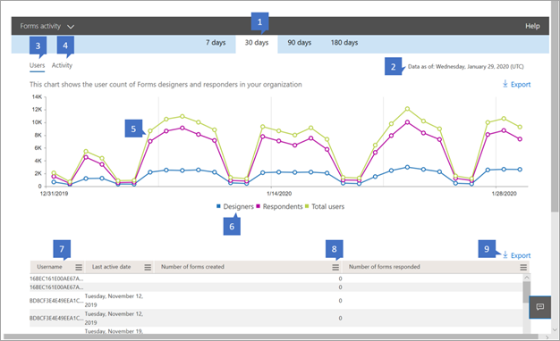

# Microsoft 365 Reports in the admin center - ProPlus client usage

The Microsoft 365 **Reports** dashboard shows you the activity overview across the products in your organization. It enables you to drill in to individual product level reports to give you more granular insight about the activities within each product. Check out [the Reports overview topic](activity-reports.md).
  
For example, you can understand the activity of each user licensed to user ProPlus clients by looking at their activity across the apps and how they are utilized across platforms.  
  
> [!NOTE]
> You must be a global administrator, global reader or reports reader in Microsoft 365 or an Exchange, SharePoint, or Skype for Business administrator to see reports. 

## How to get to the ProPlus usage report

1. In the admin center, go to the **Reports** \> <a href="https://go.microsoft.com/fwlink/p/?linkid=2074756" target="_blank">Usage</a> page.

    
2. From the **Select a report** drop-down, select **Office 365** \> **ProPlus usage** .

## Interpret the ProPlus usage report

You can get a view into your user's email activity by looking at the **Activity** and **Users** charts. 

|||
|:-----|:-----|
|1.    |The **ProPlus usage** report can be viewed for trends over the last 7 days, 30 days, 90 days, or 180 days. However, if you select a particular day in the report, the table (7) will show data for up to 28 days from the current date (not the date the report was generated).    |
|2.    |The data in each report usually covers up to the last 24 to 48 hours.    |
|3.    |The **Users** view shows the number of ProPlus users per app.    |
|4.    |The **Platforms** The Distribution view shows you the number of unique users by platform over the selected time period.   |
|5. |On the **Users** chart, the Y axis is the number of unique users. X axis is the date that the unique users are active on. On the **Platforms** chart the Y axis ia the number of unique users, X axis is the date on which an app was used on a given platform. |
|6. |You can filter the series you see on the chart by selecting an item in the legend. For example, on the Users chart, select designers, responders, or total users to see only the info related to each one. Changing this selection doesn't change the info in the grid table below it.|
|7. |The table shows you a breakdown of the activities at the per-user level.The legends are:  **Username** is the email address of the user who performed the activity on Microsoft Forms. **Last activity date (UTC)** is the latest date a ProPlus app activity was performed by the user for the selected date range. To see activity that occurred on a specific date, select the date directly in the chart.  This will filter the table to display file activity data only for users who performed the activity on that specific day.  **Activity on platforms** is the count of ProPlus activity on a specific platfrom.|
|8. |Select the **Manage columns** icon to add or remove columns from the report.|
|9. |You can also export the report data into an Excel .csv file by selecting the **Export** link. This exports data for all users and enables you to do simple aggregation, sorting and filtering for further analysis. If you have less than 100 users, you can sort and filter within the table in the report itself. If you have more than 100 users, in order to filter and sort, you will need to export the data.|