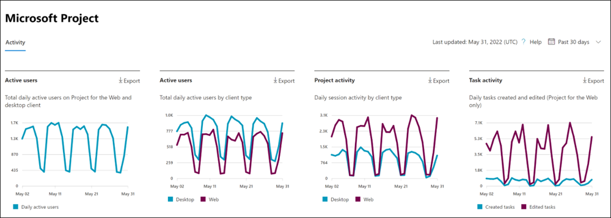
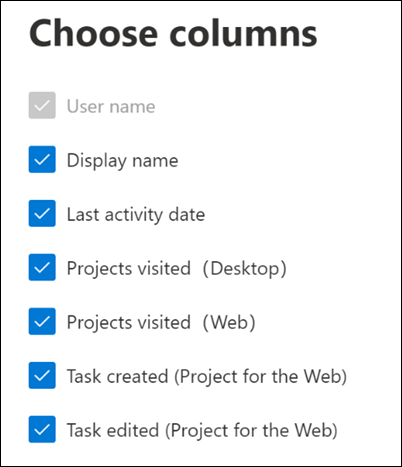

# Microsoft 365 Reports in the admin center - Project activity

The Microsoft 365 Reports dashboard shows you the activity overview across the products in your organization. It enables you to drill in to individual product level reports to give you more granular insight about the activities within each product. Check out [the Reports overview topic](activity-reports.md).

In the **Project activity report**, you can understand the activity of every user licensed to use Microsoft Project by looking at their interaction with Project. It also helps you to understand the level of collaboration going on by looking at the number of projects visited and tasks created or edited.

## How to get to the Project activity report

1. In the admin center, go to the **Reports** \> <a href="https://go.microsoft.com/fwlink/p/?linkid=2074756" target="_blank">Usage</a> page.
2. From the dashboard homepage, select **Project** in the left navigation.

## Interpret the Project activity report

You can use this report to see the activity and usage of Project in your environment. You will see four summary charts in this report:   

- **Active users** - Shows you the daily active users on each day over time. Currently, this includes only Project for the Web and Project Online desktop client.
- **Active users (by client)** -  Shows you the daily active users on each day over time, broken out by client (Project for the Web vs. Project Online desktop client).
- **Project Activity** - Shows you the number of daily sessions of Project over time, for each client (Project for the Web and Project Online desktop client).
- **Task activity** - Shows you the daily number of tasks created or edited over time in Project for the Web

The report also has a table that shows activity for each project user in your environment.

Select **Choose columns** to add or remove columns from the table.

You can also export the report data into an Excel .csv file by selecting the **Export** link. This exports data of all users and enables you to do simple sorting and filtering for further analysis.

The **Project activity** report can be viewed for trends over the last 7 days, 30 days, 90 days, or 180 days. If you select a particular day in the report, the per user data table will be updated accordingly to display users' usage on that day. However, this feature only works for the most recent 28 days.

### Privacy settings impact on the dashboard

If users or admins have their privacy settings set to **Neither**, we do not have accurate metrics for the **Project activity** chart for the Project Online desktop client. The numbers shown will be undercounted. For more information on privacy settings, see [Use policy settings to manage privacy controls for Microsoft 365 Apps for enterprise](/deployoffice/privacy/manage-privacy-controls).

## User activity table

The following are definitions for each metric in the user activity table.

|Item|Description|
|:-----|:-----|
|User name|The user's principal name.|
|Display name|The full name of the user.|
|Last activity date|The latest date the user in that row had activity in Project, including any of the activities in the summary reports.|
|Projects visited (Desktop)|The number of projects opened by the user in the Project Online desktop client during the time range selected in the top right of the page.|
|Projects visited (Web)| The number of projects visited by the user in Project for the Web during the time range selected in the top right of the page.|
|Tasks created (Web)|The number of tasks created by the user in Project for the Web during the time range selected in the top right of the page.|
|Tasks edited (Web)|The number of tasks edited by the user in Project for the Web during the time range selected in the top right of the page.|
|Other|This value is true if the user has performed an activity in Project Online desktop client or in Project for the Web (that is not covered by the other columns) in the time range selected in the top right of the page. If the user has not, this value is false.|
