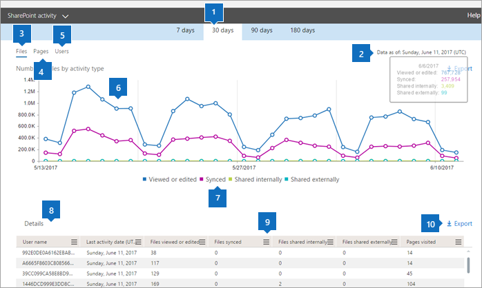

# Microsoft 365 Reports in the admin center - SharePoint activity

As an Microsoft 365 admin, the **Reports** dashboard shows you the activity overview across various products in your organization. It enables you to drill in to get more granular insight about the activities specific to each product. Check out the [activity reports in the Microsoft 365 admin center](activity-reports.md).
  
For example, you can understand the activity of every user licensed to use SharePoint by looking at their interaction with files. It also helps you to understand the level of collaboration going on by looking at the number of files shared.
  
> [!NOTE]
> Some functionality is introduced gradually. This means that you may not yet see this feature or it may look different than what is described in the help articles. But don't worry - if you don't see it yet, it's coming soon! 
  
If you want to understand the amount of activity happening against each SharePoint site and the storage utilization, view the [SharePoint site usage report](sharepoint-site-usage.md).
  
> [!NOTE]
> You must be a global administrator, global reader or reports reader in Microsoft 365 or an Exchange, SharePoint, Teams Service, Teams Communications, or Skype for Business administrator to see reports.  
 
## How do I get to the to the SharePoint activity report?

1. In the admin center, go to the **Reports** \> <a href="https://go.microsoft.com/fwlink/p/?linkid=2074756" target="_blank">Usage</a> page.

    
2. From the **Select a report** drop-down, select **SharePoint** \> **Activity**.
  
## Interpreting the SharePoint activity report

You can get a view into SharePoint activity by looking at the **Files** and **Users** views.  
  
|Item|Description|
|:-----|:-----|
|1.    |The **SharePoint activity report** can be viewed for trends over the last 7 days, 30 days, 90 days, or 180 days. However, if you select a particular day in the report, the table (7) will show data for up to 28 days from the current date (not the date the report was generated).    |
|2.    |The data in each report usually covers up to the last 24 to 48 hours.    |
|3.    |The **Files** view helps you understand the unique numbers of licensed users that perform file interactions with files stored on SharePoint sites.    |
|4.    |The **Pages** view shows you the number of unique pages visited by users.    |
|5.    |The **Users** view helps you to understand the trend in the number of active users. A user is considered active if he or she has executed a file activity (save, sync, modify, or share) or visited a page within the specific time period.    NOTE: A file activity can occur multiple times for a single file, but will count only as one active file. For example, you can save and sync the same file multiple times over a specified time period, but it will count only as one single active file and one single synced file in the data           |
|6.    | On the **Files** chart, the Y axis is the count of unique files that a user either saved, synced, modified, or shared.     On the **Users** chart, the Y axis is the number of unique users that either performed a file interaction (save, sync, modify, or share) on a site.     On the **Pages** chart, the X axis is the count of unique pages the users visited.     The X axis on all charts is the selected date range for this specific report.    |
|7.    |You can filter the series you see on the chart by selecting an item in the legend. For example, on the **Files** chart, select **Viewed or edited**, **Synced**, **Shared internally**, or **Shared externally** to see only the info related to each one. Changing this selection doesn't change the info in the grid table.    |
|8.    | The table shows you a breakdown of the activities at the per-site level.       **Username** is the email address of the user who performed the activity on the SharePoint Site.    **Last activity date (UTC)** is the latest date a file activity was performed or a page was visited for the selected date range. To see activity that occurred on a specific date, select the date directly in the chart.       This will filter the table to display file activity data only for users who performed the activity on that specific day.     **Files viewed or edited** is the number of files that the user uploaded, downloaded, modified, or viewed.     **Files synced** is the number of files that have been synced from a user's local device to the SharePoint site.     **Files shared internally** is the count of files that have been shared with users within the organization, or with users within groups (that might include external users).     **Files shared externally** is the number of files that have been shared with users outside of the organization.     **Pages visited** are the visits to unique pages by the user.     **Deleted** indicates that the user's license was removed.     **NOTE:** Activity for a deleted user will still display in the report as long as he or she was licensed at some time during the selected time period. The Deleted column helps you to note that the user may no longer be active, but contributed to the data in the report.    **Deleted date** is the date on which the user's license was removed.     **Product assigned** is the Microsoft 365 products that are licensed to the user.    |
|9.    |Select the **Manage columns** icon  to add or remove columns from the report.    |
|10.    |You can also export the report data into an Excel .csv file by selecting the **Export** link. This exports data for all users and enables you to do simple sorting and filtering for further analysis. If you have less than 2000 users, you can sort and filter within the table in the report itself. If you have more than 2000 users, in order to filter and sort, you will need to export the data.    |
|||
   

