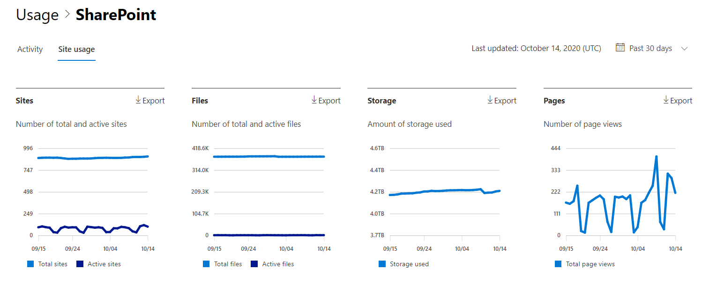

# Microsoft 365 Reports in the admin center - SharePoint site usage

As a Microsoft 365 admin, the **Reports** dashboard shows you the activity overview across various products in your organization. It enables you to drill in to get more granular insight about the activities specific to each product. For example, you can get a high level view of the value you are getting from SharePoint in terms of the total number of files that users store in SharePoint sites, how many files are actively being used, and the storage consumed across all these sites. Then, you can drill into the SharePoint site usage report to understand the trends and per site level details for all sites. 
  
> [!NOTE]
> You must be a global administrator, global reader or reports reader in Microsoft 365 or an Exchange, SharePoint, Teams Service, Teams Communications, or Skype for Business administrator to see reports.
Microsoft 365 Reports in the admin center is not supported for GCC High and DoD tenants.
 
## How to get to the SharePoint site usage report

1. In the admin center, go to the **Reports** \> <a href="https://go.microsoft.com/fwlink/p/?linkid=2074756" target="_blank">Usage</a> page. 
2. From the dashboard homepage, click on the **View more** button on the SharePoint card.
  
## Interpret the SharePoint site usage report

You can view the site usage in the SharePoint report by choosing the **Site usage** tab. 

Select **Choose columns** to add or remove columns from the report.    

You can also export the report data into an Excel .csv file by selecting the **Export** link. This exports data of all users and enables you to do simple sorting and filtering for further analysis. If you have less than 2000 users, you can sort and filter within the table in the report itself. If you have more than 2000 users, in order to filter and sort, you will need to export the data. 
  
|Item|Description|
|:-----|:-----|
|**Metric**|**Definition**|
|Site URL    |The full URL of the site.   |
|Deleted    |The deletion status of the site. It takes at least 7 days for sites to be marked as deleted.    |
|Site owner    |The username of the primary owner of the site.     |
|Site owner principal name    |The email address of the owner of the site.   |
|Last activity date (UTC)    | The date of the last time file activity was detected or a page was viewed on the site.    |
|Site sensitivity label id    | The sensitivity label on the site.    |
|External sharing    | The external sharable settings on the site.    |
|Unmanaged device policy    | The site access policy for unmanaged devices.    |
|Geo location    | The Geo location of the site.    |
|Files    |The number of files on the site.  |
|Active files    | The number of active files on the site.  NOTE: If files were removed during the specified time period for the report, the number of active files shown in the report may be larger than the current number of files on the site.    |
|Storage used (MB)    |The amount of storage currently being used on the site.   |
|Storage allocated (MB)    |The maximum amount of storage allocated for the site.   |
|Page views    |The number of times pages were viewed on the site.   |
|Pages visited    |The number of unique pages that were visited on the site.   |
|Anonymous link count    |The number of times documents or folders are shared using "Anyone with the link" on the site.   |
|Company link count    |The number of times documents or folders are shared using "People in org with the link" on the site.   |
|Secure link for guest count    |The number of times documents or folders are shared using "specific people" on the site.   |
|Secure link for member count    |The number of times documents or folders are shared using "specific people" on the site.   |
|Root Web Template    |The template used for creating the site.    NOTE: If you want to filter the data by different site types, then export the data and use the Root Web Template column. |
|||