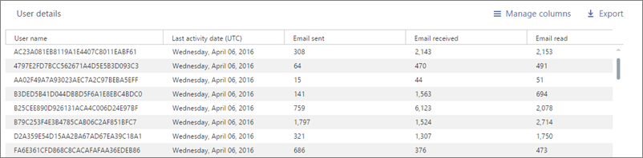

# Microsoft 365 Reports in the admin center - SharePoint site usage

As a Microsoft 365 admin, the Reports dashboard shows you the activity overview across various products in your organization. It enables you to drill in to get more granular insight about the activities specific to each product. For example, you can get a high-level view of the value you are getting from SharePoint in terms of the total number of files that users store in SharePoint sites, how many files are actively being used, and the storage consumed across all these sites. Then, you can drill into the SharePoint site usage report to understand the trends and per site level details for all sites.

## How to get to the SharePoint site usage report

1. In the admin center, go to the **Reports** \> <a href="https://go.microsoft.com/fwlink/p/?linkid=2074756" target="_blank">Usage</a> page. 
2. From the dashboard homepage, click on the **View more** button on the SharePoint card.

## Show user details in the reports

Reports provide information about your organization’s usage data. By default, reports display information with identifiable names for users, groups, and sites. Starting September 1, 2021, we are hiding user information by default for all reports as part of our ongoing commitment to help companies support their local privacy laws.
  
Your user list will look like this:
  

  
Global administrators can revert this change for their tenant and show identifiable user information if their organization's privacy practices allow it. It can be achieved in the Microsoft 365 admin center by following these steps:
  
1. In the admin center, go to the **Settings** \> **Org Settings** \> **Services** page.

2. Select **Reports**. 
  
3. Uncheck the statement **In all reports, display de-identified names for users, groups, and sites**, and then save your changes. 
  
## Interpret the SharePoint site usage report

You can view the site usage in the SharePoint report by choosing the **Site usage** tab.

:::image type="content" alt-text="Microsoft 365 reports - Microsoft SharePoint site usage report." source="../../media/d1cb6200-e81c-460b-9d05-53f4bd7cf5ee.png" lightbox="../../media/d1cb6200-e81c-460b-9d05-53f4bd7cf5ee.png":::

Select **Choose columns** to add or remove columns from the report.

:::image type="content" alt-text="SharePoint site usage report - choose columns." source="../../media/71ac3195-c494-40c1-9346-a858125ef6df.png":::

You can also export the report data into an Excel .csv file by selecting the **Export** link. This exports data of all users and enables you to do simple sorting and filtering for further analysis. 

The **SharePoint site usage** report can be viewed for trends over the last 7 days, 30 days, 90 days, or 180 days. However, if you select a particular day in the report, the table will show data for up to 28 days from the current date (not the date the report was generated).
  
|Metric|Description|
|:-----|:-----|
|Site URL  |The full URL of the site. |
|Deleted  |The deletion status of the site. It takes at least 7 days for sites to be marked as deleted.  |
|Site owner  |The username of the primary owner of the site.   |
|Site owner principal name  |The email address of the owner of the site. |
|Last activity date (UTC)  | The date of the last time file activity was detected or a page was viewed on the site.  |
|Site sensitivity label ID  | The sensitivity label on the site.  |
|External sharing  | The value of the external sharing setting for the site. This value does not reflect changes to the effective setting made by site sensitivity labels. If you use sensitivity labels, use the [data access governance reports](/sharepoint/data-access-governance-reports) to get the correct values.|
|Unmanaged device policy  | The site access policy for unmanaged devices.  |
|Geo location  | The Geo location of the site.  |
|Files  |The number of files on the site. |
|Active files  | The number of active files on the site. A file is considered active if it has been saved, synced, modified, or shared within the specified time period.  NOTE: If files were removed during the specified time period for the report, the number of active files shown in the report may be larger than the current number of files on the site.  |
|Storage used (MB)  |The amount of storage currently being used on the site.  |
|Storage allocated (MB)  |The maximum amount of storage allocated for the site.  |
|Page views  |The number of times pages were viewed on the site.  |
|Pages visited  |The number of unique pages that were visited on the site.  |
|Anonymous link count  |The number of times documents or folders are shared using "Anyone with the link" on the site.  |
|Company link count  |The number of times documents or folders are shared using "People in org with the link" on the site.  |
|Secure link for guest count  |The number of times documents or folders are shared using "specific people" on the site.  |
|Secure link for member count  |The number of times documents or folders are shared using "specific people" on the site.  |
|Root Web Template  |The template used for creating the site.    NOTE: If you want to filter the data by different site types, then export the data and use the Root Web Template column. |

Note that you may see differences between the sites listed above and those listed on the [Active sites page](https://go.microsoft.com/fwlink/?linkid=2185220) in the [SharePoint admin center](https://go.microsoft.com/fwlink/?linkid=2185219), from Sites > Active sites because the certain site templates and URLs are not included as Active Sites. See [Manage sites in the SharePoint admin center](/sharepoint/manage-sites-in-new-admin-center) for more information. 
 
