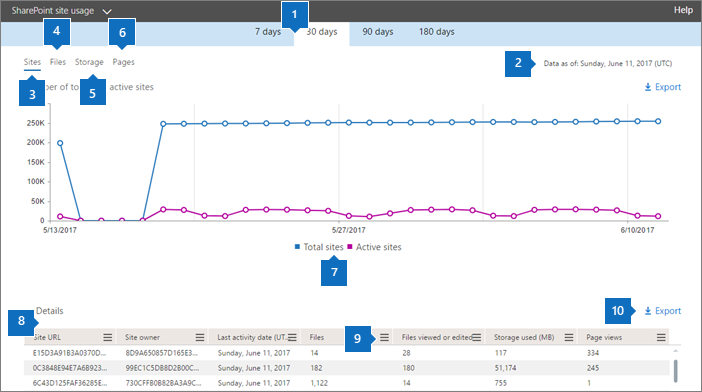
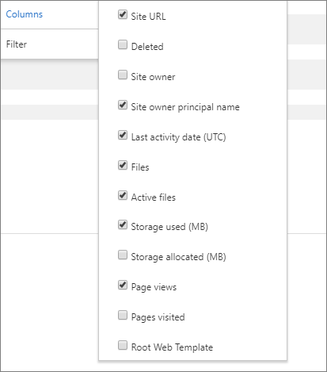

# Microsoft 365 Reports in the admin center - SharePoint site usage

As a Microsoft 365 admin, the **Reports** dashboard shows you the activity overview across various products in your organization. It enables you to drill in to get more granular insight about the activities specific to each product. For example, you can get a high level view of the value you are getting from SharePoint in terms of the total number of files that users store in SharePoint sites, how many files are actively being used, and the storage consumed across all these sites. Then, you can drill into the SharePoint site usage report to understand the trends and per site level details for all sites. 
  
> [!NOTE]
> You must be a global administrator, global reader or reports reader in Microsoft 365 or an Exchange, SharePoint, Teams Service, Teams Communications, or Skype for Business administrator to see reports.
Microsoft 365 Reports in the admin center is not supported for GCC High and DoD tenants.
 
## How to get to the SharePoint site usage report

1. In the admin center, go to **Reports** \> <a href="https://go.microsoft.com/fwlink/p/?linkid=2074756" target="_blank">Usage</a>.

    
2. From the **Select a report** drop-down, select **SharePoint** \> **Site usage**.
  
## Interpreting the SharePoint site usage report

  
|Item|Description|
|:-----|:-----|
|1.    |The **SharePoint Site usage** report can be viewed for trends over the last 7 days, 30 days, 90 days, or 180 days. However, if you select a particular day in the report, the table (7) will show data for up to 28 days from the current date (not the date the report was generated).    |
|2.    |The data in each report usually covers up to the last 24 to 48 hours.   |
|3.    |The **Sites** chart shows the number of total and active sites, including any site in which users had viewed, modified, uploaded, downloaded, shared, or synced a file or viewed a page within the reporting period.    |
|4.    |The **Files** chart shows the total number of files across all sites and the number of active files. The number of total files includes both user files and system files. A file is considered active if it has been saved, synced, modified or shared within the specific time period.|
|5.    |The **Storage** chart shows the trend of storage allocated and consumed during the reporting period.    |
|6.    |The **Pages** chart shows the number of pages viewed across all sites.    |
|7.    |You can filter charts you see by selecting an item in the legend. For example, on the **Files** chart, select **Files** or **Active Files**. On the **Sites** chart, you can select **Total sites** or **Active sites**. On the **Storage** chart, you can select **Storage allocated** or **Storage consumed.** Changing this selection doesn't change the information in the grid table.    |
|8.    | The table shows you a breakdown of the activities at the per-site level.                 **Site URL** is the full URL of the site.    **Deleted** is the deletion status of the site. It takes at least 7 days for sites to be marked as deleted.    **Site owner** is the username of the primary owner of the site.   **Site owner principal name** is the email address of the owner of the site.    **Last activity date (UTC)** refers to the date of the last time file activity was detected or a page was viewed on the site.    **Files** is the number of files on the site.    **Active files** is the number of active files on the site.  NOTE: If files were removed during the specified time period for the report, the number of active files shown in the report may be larger than the current number of files on the site. **Storage used (MB)** is the amount of storage currently being used on the site.    **Storage allocated (MB)** is the maximum amount of storage allocated for the site.    **Page views** is the number of times pages were viewed on the site.    **Pages visited** is the number of unique pages that were visited on the site.    **Root Web Template** is the template used for creating the site.    NOTE: If you want to filter the data by different site types, then export the data and use the Root Web Template column.  If your organization's policies prevent you from viewing reports where user information is identifiable, you can change the privacy setting for all these reports. Check out the **How do I hide user level details?** section in the [Activity Reports in the Microsoft 365 admin center](activity-reports.md).    |
|9.    |Select **Manage columns**   to add or remove columns from the report.    |
|10.    |You can also export the report data into an Excel .csv file, by selecting the **Export**  link. This exports data for all sites and enables you to do simple sorting and filtering for further analysis. If you have less than 2000 sites, you can sort and filter within the table in the report itself. If you have more than 2000 sites, in order to filter and sort, you will need to export the data.    NOTE: When the data is exported to an Excel file, note that the date the content report was generated is reflected in the file in the **Data as of** column.          |
|||
