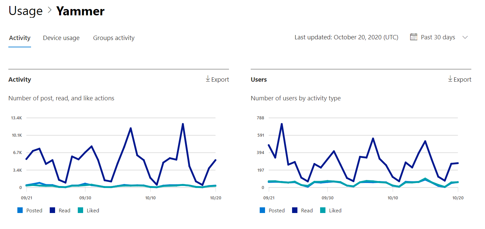
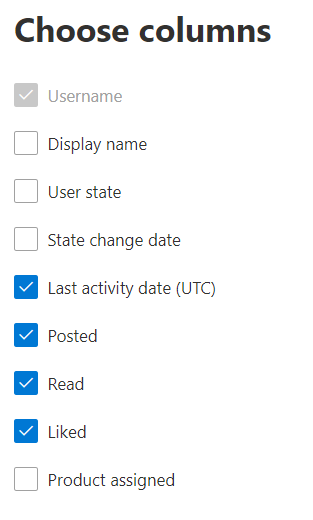

# Microsoft 365 Reports in the admin center - Viva Engage activity report

As Microsoft 365 admin, the Reports dashboard shows you data on the usage of the products within your organization. Check out [activity reports in the admin center](activity-reports.md). With the **Viva Engage Activity report**, you can understand the level of engagement of your organization with Viva Engage by looking at the number of unique users using Viva Engage to post, like or read a message and the amount of activity generated across the organization.
 
## How do I get to the Viva Engage activity report?

1. In the admin center, go to the **Reports**, and then select **Usage**. 
2. From the dashboard homepage, click on the **View more** button on the Viva Engage card.

  
## Interpret the Viva Engage activity report

You can view the activities in the Viva Engage report by choosing the **Activity** tab.

Select **Choose columns** to add or remove columns from the report.  

You can also export the report data into an Excel .csv file by selecting the **Export** link. This exports data of all users and enables you to do simple sorting and filtering for further analysis. 

The **Viva Engage activity** report can be viewed for trends over the last 7 days, 30 days, 90 days, or 180 days. However, if you select a particular day in the report, the table will show data for up to 28 days from the current date (not the date the report was generated).
  
|Item|Description|
|:-----|:-----|
|**Metric**|**Definition**|
|Username    |The email address of the user. You can display the actual email address or make this field anonymous. This grid shows users who logged into Viva Engage using the Microsoft 365 account or who logged into the network using single sign-on.   |
|Display name    |The full name of the user. You can display the actual email address or make this field anonymous.    |
|User state    |One of three values: Activated, Deleted, or Suspended. These reports show data for active, suspended, and deleted users. They do not reflect pending users, because pending users cannot post, read, or like a message.    |
|State change date (UTC)    |The date on which the user's state was changed in Viva Engage.    |
|Last activity date (UTC)    | The last date that the user posted, read, or liked a message.    |
|Posted    |The number of messages the user posted during the time period you specified.  |
|Read    |The number of conversations that the user read during the time period you specified.    |
|Liked    |The number of messages that the user liked during the time period you specified.   |
|Product assigned    |The products that are assigned to this user.|
|||
