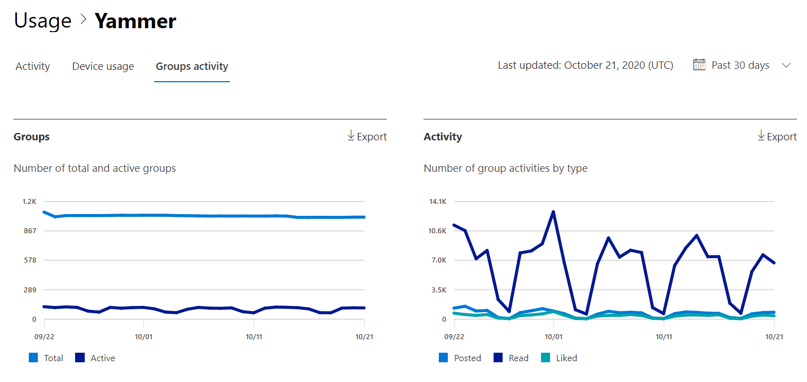
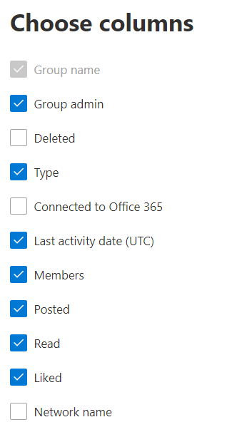

# Microsoft 365 Reports in the admin center - Viva Engage groups activity report

The Microsoft 365 Reports dashboard shows you the activity overview across the products in your organization. It enables you to drill in to individual product level reports to give you more granular insight about the activities within each product. Check out [the Reports overview topic](activity-reports.md). In the Viva Engage groups activity report, you can gain insights into the activity of Viva Engage groups in your organization and see how many Viva Engage groups are being created and used.
 
## How do I get to the Viva Engage groups activity report?

1. In the admin center, go to the **Reports**, then select **Usage**. 
2. From the dashboard homepage, click on the **View more** button on the Viva Engage card.
  
## Interpret the Viva Engage groups activity report

You can view the groups activities in the Viva Engage report by choosing the **Groups activity** tab.

Select **Choose columns** to add or remove columns from the report.  

You can also export the report data into an Excel .csv file by selecting the **Export** link. This exports data of all users and enables you to do simple sorting and filtering for further analysis. 

The **Viva Engage groups activity** report can be viewed for trends over the last 7 days, 30 days, 90 days, or 180 days. However, if you select a particular day in the report, the table will show data for up to 28 days from the current date (not the date the report was generated).
  
|Item|Description|
|:-----|:-----|
|**Metric**|**Definition**|
|Group name  |The name of the group. |
|Group admin  |The name of the group administrator, or owner.  |
|Deleted  |The number of deleted Viva Engage groups. If the group is deleted, but had activity in the reporting period it will show up in the grid with this flag set to true.  |
|Type |The type of group, public or private. |
|Connected to Office 365  |Indicates whether the Viva Engage group is also a Microsoft 365 group. |
|Last activity date (UTC)  | The latest date a message was read, posted or liked by the group.  |
|Members  | The number of members in the group.  |
|Posted |The number of messages posted in the Viva Engage group over the reporting period. |
|Read   |The number of conversations read in the Viva Engage group over the reporting period.   |
|Liked  |The number of messages liked in the Viva Engage group over the reporting period. |
|Network name   |The full name of the network that the group belongs to. |
