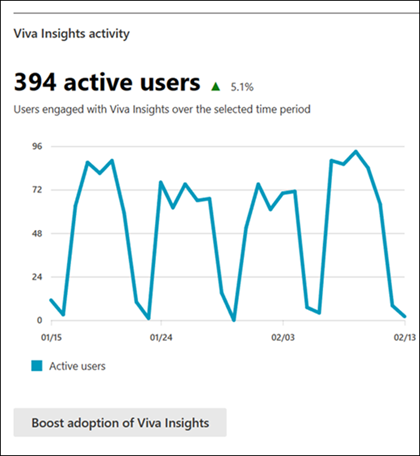

# Microsoft 365 Reports in the admin center - Viva Insights activity

As a Microsoft 365 admin, the Reports dashboard shows you the activity overview across various products in your organization. It enables you to drill in to get more granular insight about the activities specific to each product. Check out the activity reports in the Microsoft 365 admin center. 

For example, you can understand the adoption of Viva Insights by looking at the active users. Additionally, you can find a deployment guide to further boost adoption in your organization.

## How do I get to the to the Viva Insights activity report?

1. In the admin center, go to the **Reports**, and then select **Usage**. 
2. Find **Viva Insights activity**.

## Interpret the Microsoft 365 Apps usage report 

You can get a view into your user's Viva Insights activity by looking at the **Active users chart**. The Viva Insights active user chart can be viewed for trends over the last 7 days, 30 days, 90 days, or 180 days.  

**Active users** are users that have engaged with at least one Viva Insights feature that day. This includes dwelling for more than 20 seconds on any Viva Insight email, clicking or taking an action on any Insights surfacing, or visiting the Viva Insights app in Teams, Outlook add-in, or web dashboards. 

## View the Viva Insights deployment guide
You can click **Boost adoption of Viva Insights** to view the [Viva Insights Deployment guide](/viva/insights/personal/setup/deployment-guide).
