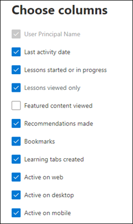
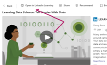

# Microsoft 365 Reports in the admin center - Viva Learning activity

As an Microsoft 365 admin, the Reports dashboard shows you the activity overview across various products in your organization. It enables you to drill in to get more granular insight about the activities specific to each product. Check out the activity reports in the Microsoft 365 admin center. 

For example, you can understand the activity of every user licensed to use Viva Learning by looking at their interaction. It also helps you to understand the type of features being used within the Learning App.

## How do I get to the to the Viva Learning activity report?  

1. In the admin center, go to the **Reports** > **Usage** page. 
2. From the dashboard homepage, select the **View more** button on the Viva Learning card. 

## Interpret the Microsoft 365 Apps usage report

You can get a view into your user's Viva Learning activity by looking at the **Active users** and **User activities** charts.

> 

Select **Choose columns** to add or remove columns from the report. 

> 

You can also export the report data into an Excel .csv file by selecting the Export link. This exports data of all users and lets you to do simple sorting and filtering for further analysis. If you have less than 2000 users, you can sort and filter within the table in the report itself. If you have more than 2000 users, in order to filter and sort, you will need to export the data. 

|Metric|Definition|
 |:-----|:-----|
 |Active Users    |A user is considered active if they use functionalities within Viva Learning, such as opening Home tab/My learning tab, Recommending content, or Searching content.    |
 |Consumed Lessons    |Count of the number of times a user has hit Play.    |
 |Viewed Lessons    |Count of the users opening a Lesson’s details page.    |
 |Viewed Featured Content    |Count of the number of users opening a Lesson that has been featured in Viva Learning.   |
 |Recommendation Made  |Count of the number of recommendations made by users in the organization.  |
 Bookmarks  |Count of the number of Lessons bookmarked by users. |
 |Learning Tabs created  |Count of the number of Learning Tabs created by users in TEAMS Chats or TEAMS Channels. 
|
 
