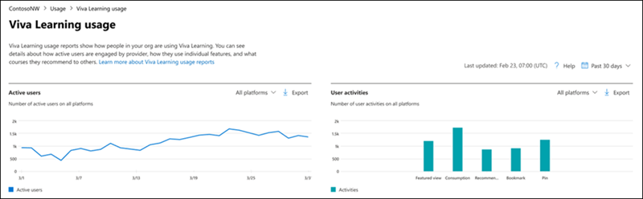

# Microsoft 365 Reports in the admin center - Viva Learning activity

As an Microsoft 365 admin, the Reports dashboard shows you the activity overview across various products in your organization. It enables you to drill in to get more granular insight about the activities specific to each product. Check out the activity reports in the Microsoft 365 admin center. 

For example, you can understand the activity of your licensed Viva Learning users by looking at their interactions. It also helps you to understand the type of features being used within the Learning App.

## How do I get to the to the Viva Learning activity report?  

1. In the admin center, go to the **Reports** > **Usage** page. 
2. From the dashboard homepage, select the **View more** button on the Viva Learning card. 

## Interpret the Microsoft 365 Apps usage report

You can get a view into your user's Viva Learning activity by looking at the **Active users** and **User activities** charts.

- Active users – Shows you the number of active users over time. For example, you can use it to find the number of active users in your organization on a specific day over the past 30 days.
- User activities – Shows you the number of user activities, such as viewed featured content, learning tabs pinned, viewed learning objects, consumed learning objects, recommendations made, and bookmarks.
 
