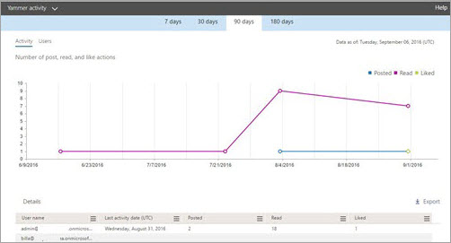
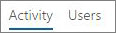
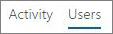

# Microsoft 365 Reports in the admin center - Yammer activity report

As Microsoft 365 admin, the **Reports** dashboard shows you data on the usage of the products within your organization. Check out [activity reports in the admin center](activity-reports.md). With the **Yammer Activity report**, you can understand the level of engagement of your organization with Yammer by looking at the number of unique users using Yammer to post, like or read a message and the amount of activity generated across the organization. 
  
> [!NOTE]
> You must be a global administrator, global reader or reports reader in Microsoft 365 or an Exchange, SharePoint, Teams Service, Teams Communications, or Skype for Business administrator to see reports. 
 
## How to get to the Yammer activity report

1. In the admin center, go to the **Reports** \> <a href="https://go.microsoft.com/fwlink/p/?linkid=2074756" target="_blank">Usage</a> page.

    
2. From the **Select a report** drop-down, select **Yammer** \> **Activity**.
  
## Interpret the Yammer activity report

You can get a view into your user's Yammer activity by looking at the Activity and Users charts.
  

  
The activity report contains the following information.
  
- Use the day tabs to view the **Yammer activity** report trends over the last 7 days, 30 days, 90 days, or 180 days. However, if you select a particular day in the report, the table will show data for up to 28 days from the current date (not the date the report was generated). 
    
- Each report has a date for when the report was generated. The reports usually reflect a 24 to 48 hour latency from time of activity.
    
- You can view the **Activity** chart to understand the trend of the amount of Yammer activity going on in your organization. You can understand the split of messages posted, read, or liked. 
    
    
  
  - On the **Activity** chart, the Y axis is the count of activity of the messages posted, read, or liked. 
    
- You can view the **User** chart to understand the trend of the amount of unique users who are generating the Yammer activities. You can look at the trend of users posting, reading, or liking Yammer messages. 
    
    
  
  - On the **Users** activity chart, the Y axis is the user posting, reading, or liking Yammer messages. 
    
  - The X axis on both charts is the selected date range for this specific report.
    
- You can filter the series you see on the chart by selecting an item in the legend. For example, on the **Activity** chart, select **Posted**, **Read**, or **Liked** to see only the info related to each one. 
    
    
  
    Changing this selection doesn't change the info in the grid table.
    
- The table under the graph shows you a breakdown of the Yammer activities at the per-user level.
    
    You can use the menu to filter and sort the data.
    
    
  
    You can also add and remove columns. The available columns are:
    
  - **Username** is the email address of the user. You can display the actual email address or make this field anonymous. 
    
    This grid shows users who logged into Yammer using the Microsoft 365 account or who logged into the network using single sign-on.
    
  - **Display name** is the full name of the user. You can display the actual email address or make this field anonymous. 
    
  - **User state** is one of three values: Activated, Deleted, or Suspended. 
    
    These reports show data for active, suspended, and deleted users. They do not reflect pending users, because pending users cannot post, read, or like a message.
    
  - **State change date (UTC)** is the date on which the user's state was changed in Yammer. 
    
  - **Last activity date (UTC)** refers to the last date that the user posted, read, or liked a message. 
    
  - **Posted** is the number of messages the user posted during the time period you specified. 
    
  - **Read** is the number of conversations that the user read during the time period you specified. 
    
  - **Liked** is the number of messages that the user liked during the time period you specified. 
    
  - **Product assigned** is the products that are assigned to this user. 
    
    If your organization's policies prevents you from viewing reports where user information is identifiable, you can change the privacy setting for all these reports. Check out the **How do I hide user level details?** section in [Activity reports in the Microsoft 365 admin center](activity-reports.md).
    
- You can also export the report data into an Excel .csv file, by selecting the **Export** link. This exports data of all users and enables you to do simple sorting and filtering for further analysis. If you have less than 2000 users, you can sort and filter within the table in the report itself. If you have more than 2000 users, in order to filter and sort, you will need to export the data. 
    
## What data is in these reports?

- **All clients** These reports aggregate data across all clients, including using Yammer in a browser or on an iOS or Android app. 
    
- **No external network data** External network data is not included in these reports. 
    
- **Activated networks** These reports show data for the Yammer network that is part of your Microsoft 365 subscription. The chart aggregates usage of all users who logged into the Yammer network, irrespective of whether they used Microsoft 365 or Yammer to log in. 
    

